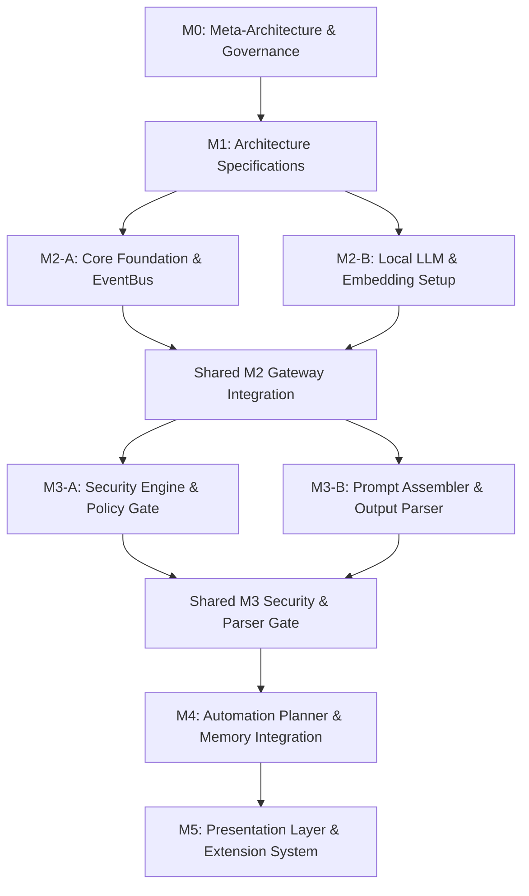

# 08 Roadmap (Parallel Implementation Roadmap)

> Document ID: DOC-ULTRON-L0-ROADMAP
> Document Name: 08 Roadmap (Parallel Implementation Roadmap)
> Version: 1.0.0
> Status: Frozen
> Owner: Ultron.Vision
> Architecture Version: 1.0.0
> Abstraction Level: L0 Vision & Process Roadmap
> Parent Document: DOC-ULTRON-L0-MILESTONES
> Child Documents: DOC-ULTRON-L0-DASHBOARD
> Dependencies: A2A-ADP v1.0, AKM v1.0, ARM v1.0, ADS v1.0, AVR v1.0
> Last Updated: 2026-07-27

---

# Purpose

This document specifies the complete parallel engineering roadmap for Project Ultron.

It transforms approved architectural specifications into a deterministic execution plan, organizing development into milestones (M0 through M5) with explicit task separation between the **Architecture Lead** and **AI Engineer** to maximize parallel velocity and eliminate integration conflicts.

---

# Scope

### Included in Scope
- Comprehensive 6-milestone execution breakdown (M0 through M5).
- Every milestone documented across all 13 mandatory attributes: Objective, Scope, Required Documentation, Required Architecture, Prerequisites, Modules, Components, Deliverables, Dependencies, Risks, Testing Strategy, Review Checklist, and Exit Criteria.
- Explicit developer task separation (Architecture Lead vs. AI Engineer vs. Shared Tasks).
- Milestone Dependency Graph and estimated execution sequence.

### Excluded from Scope
- Individual developer salary compensation or commercial marketing calendars.

---

# Engineering Question

**How is the implementation roadmap structured across parallel milestones to minimize blocking between the Architecture Lead and AI Engineer while ensuring 100% contract compliance?**

---

# Context

This document occupies abstraction level **L0 Vision & Process Roadmap** within `00-Overview/`.

It derives from `07 Milestones.md` and provides the parallel execution plan driving `09 Dashboard.md` and source code implementation in `backend/`.

```
07 Milestones.md (L0 Development Milestones)
↓
08 Roadmap.md (Parallel Implementation Roadmap - This Document)
↓
09 Dashboard.md (Master Vault Index & Dashboard)
```

---

# Architecture

### 1. Milestone Dependency Graph



---

# Parallel Implementation Milestones

---

## Milestone 0 (M0): Meta-Architecture & Governance Protocols
- **Objective**: Formalize architectural governance protocols, directory layout, and AI-to-AI collaboration contracts.
- **Scope**: Definition of meta-specifications (`A2A-ADP`, `AKM`, `ADS`, `AVR`, `ARM`, `ACP`, `AVM`, `AQL`, `Documentation Rules`).
- **Required Documentation**: Meta-specifications in `00 - Meta/AI Collaboration/`.
- **Required Architecture**: Meta-Architecture Protocol Stack v1.0.
- **Prerequisites**: None.
- **Modules**: Meta Subsystem (`00 - Meta/AI Collaboration/`).
- **Components**: `A2A-ADP Compiler`, `AKM Ontology`, `ADS Schema Validator`.
- **Deliverables**: 10 protocol specification markdown documents + `Complete Protocol.md`.
- **Dependencies**: None.
- **Risks**: Protocol ambiguity causing downstream documentation drift. (Mitigated by AVR validation rules).
- **Task Separation**:
  - **Architecture Lead Tasks**: Author core protocol specifications and ontology metadata schemas.
  - **AI Engineer Tasks**: Review AI interaction boundaries and delegation rules.
  - **Shared Tasks**: Validate protocol consistency and aggregate `Complete Protocol.md`.
- **Testing Strategy**: 100% verification of meta-specification schema layout.
- **Review Checklist**:
  - [x] All 10 protocol files exist in `00 - Meta/AI Collaboration/`.
  - [x] Delegation and compilation pipelines verified.
- **Exit Criteria**: 100% pass on meta-specification compilation and protocol vault freezing.

---

## Milestone 1 (M1): Architecture Specifications
- **Objective**: Compile comprehensive, ADS-compliant architectural documentation across all repository subdirectories.
- **Scope**: L0 Vision docs, L1 System Overview, L2 Component Architecture, L3 Execution Lifecycles, L4 Folder Structure, L6 API/Interface Contracts, L6 Data Models, and L0 Guides.
- **Required Documentation**: All files in `00-Overview/`, `01-Architecture/`, `07-Documentation/`.
- **Required Architecture**: `00 System Overview.md` through `13 Sequence Diagrams.md`.
- **Prerequisites**: M0 Governance Protocols frozen.
- **Modules**: All 9 primary modules (`Core`, `System`, `Interface`, `Intelligence`, `Automation`, `Security`, `Knowledge`, `Development`, `Extensions`).
- **Components**: Document Vault Specifications.
- **Deliverables**: 26 populated, ADS-compliant architectural specifications and onboarding guides.
- **Dependencies**: M0.
- **Risks**: Unclear module boundaries leading to circular dependencies. (Mitigated by `02 Component Architecture.md`).
- **Task Separation**:
  - **Architecture Lead Tasks**: Author System Overview, Layered Architecture, Security Architecture, Interface Contracts, Deployment Architecture, Developer Guide, Development Agreement.
  - **AI Engineer Tasks**: Author AI Pipeline Spec, AI Engineer Onboarding Guide, Knowledge Subsystem contracts.
  - **Shared Tasks**: Verify cross-document references and single-ownership matrix (`06 Team Responsibilities.md`).
- **Testing Strategy**: 100% AVR validation check pass across all markdown files.
- **Review Checklist**:
  - [x] All 11 Overview files populated.
  - [x] All 15 Architecture files populated.
  - [x] Developer and AI Engineer onboarding guides created.
- **Exit Criteria**: 100% documentation completion without orphan files or schema errors.

---

## Milestone 2 (M2): Core Foundation & Local AI Runtime Setup
- **Objective**: Establish Python application root (`backend/`), configuration manager, event bus, host Linux command handler, and local LLM/embedding inference connection.
- **Scope**: Core daemon bootstrap (`main.py`), `ConfigManager`, `EventBus`, `ProcessSupervisor`, `AIRuntime` client, local vector store setup.
- **Required Documentation**: `08 Runtime Architecture.md`, `09 Folder Structure.md`, `10 API Contracts.md`.
- **Required Architecture**: L2 Runtime & L6 Interface Contracts.
- **Prerequisites**: M1 Architecture specifications frozen.
- **Modules**: `Core`, `System`, `Foundation`, `Intelligence` (Runtime), `Knowledge` (Embeddings).
- **Components**: `ConfigManager`, `EventBus`, `ProcessSupervisor`, `AIRuntime`, `VectorStore`.
- **Deliverables**: Executable daemon bootstrap (`main.py`), functional event bus, host process executor, local LLM/embedding inference client.
- **Dependencies**: M1.
- **Risks**: Local Ollama daemon connection timeouts or missing GPU/NPU drivers. (Mitigated by fallback CPU mock execution).
- **Task Separation**:
  - **Architecture Lead Tasks**: Implement `backend/main.py` entry daemon, `ConfigManager`, `EventBus`, and `ProcessSupervisor`.
  - **AI Engineer Tasks**: Implement `AIRuntime` Ollama client, sentence-transformers embedding loader, and Chroma vector store client.
  - **Shared Tasks**: Define and test shared Pydantic models in `backend/foundation/models/` (`RequestContext`, `LLMCompletionResult`).
- **Testing Strategy**: `> 90%` unit test coverage for `ConfigManager`, `EventBus`, and `AIRuntime` HTTP mock.
- **Review Checklist**:
  - [ ] `python backend/main.py` initializes without errors.
  - [ ] EventBus successfully publishes and receives events asynchronously.
  - [ ] AIRuntime successfully pings local Ollama endpoint (`127.0.0.1:11434`).
- **Exit Criteria**: Core daemon runs and successfully executes a mock ping to local LLM inference.

---

## Milestone 3 (M3): Security Engine & AI Reasoning Pipeline
- **Objective**: Implement mandatory `SecurityEngine` gatekeeping, parameter sanitization, Tool Registry, prompt assembly, and structured JSON output parsing.
- **Scope**: `SecurityEngine`, `PolicyEvaluator`, path sanitization, `ToolRegistry`, `PromptAssembler`, `OutputParser`, RAG context retriever.
- **Required Documentation**: `05 Tool Execution Flow.md`, `06 AI Pipeline.md`, `07 Security Architecture.md`, `10 API Contracts.md`.
- **Required Architecture**: L2 Security & L3 AI Pipeline Specs.
- **Prerequisites**: M2 completed.
- **Modules**: `Security`, `Development`, `Intelligence`, `Knowledge`.
- **Components**: `SecurityEngine`, `PolicyEvaluator`, `PayloadSanitizer`, `ToolRegistry`, `PromptAssembler`, `OutputParser`, `ContextRetriever`.
- **Deliverables**: Functional `SecurityEngine`, `ToolRegistry`, `PromptAssembler`, `OutputParser`, and RAG retriever.
- **Dependencies**: M2.
- **Risks**: LLM output failing JSON schema validation. (Mitigated by robust `OutputParser` JSON repair utilities).
- **Task Separation**:
  - **Architecture Lead Tasks**: Implement `SecurityEngine`, `PolicyEvaluator`, path sanitizers, `ToolRegistry`, and `AuditLogger`.
  - **AI Engineer Tasks**: Implement `PromptAssembler`, `OutputParser` (JSON repair logic), and `ContextRetriever`.
  - **Shared Tasks**: Integrate `SecurityEngine` check gate directly between `OutputParser` plan proposals and execution dispatchers.
- **Testing Strategy**: 100% security policy test pass (0 un-sanitized commands allowed); `< 2%` prompt parsing failure rate.
- **Review Checklist**:
  - [ ] SecurityEngine blocks path traversal attempts (`../../etc/passwd`).
  - [ ] OutputParser cleanly converts raw LLM completion string into typed `ExecutionPlan`.
- **Exit Criteria**: AI prompt constructs valid plan; SecurityEngine evaluates plan without policy leaks.

---

## Milestone 4 (M4): Automation Planner & Working Memory Integration
- **Objective**: Wire multi-step workflow `Planner`, tool execution dispatcher, interactive privilege escalation, and session working memory into a cohesive reasoning loop.
- **Scope**: `Planner`, `Dispatcher`, `ExecutionGraphBuilder`, interactive human approval prompts, `MemoryEngine`.
- **Required Documentation**: `03 Request Lifecycle.md`, `04 Data Flow.md`, `05 Tool Execution Flow.md`, `13 Sequence Diagrams.md`.
- **Required Architecture**: L3 Request Lifecycle & Execution Flow Specs.
- **Prerequisites**: M3 completed.
- **Modules**: `Automation`, `Knowledge`, `System`, `Security`.
- **Components**: `Planner`, `Dispatcher`, `ExecutionGraphBuilder`, `MemoryEngine`.
- **Deliverables**: Fully integrated `Planner` capable of formulating and executing multi-step Linux engineering workflows.
- **Dependencies**: M3.
- **Risks**: Infinite loop execution during tool retry attempts. (Mitigated by hard max-step limits in `Planner`).
- **Task Separation**:
  - **Architecture Lead Tasks**: Implement `Planner` execution graph builder, step dispatcher, and interactive user approval prompts.
  - **AI Engineer Tasks**: Implement `MemoryEngine` sliding context window, prompt few-shot tuning, and RAG precision optimization.
  - **Shared Tasks**: Perform end-to-end integration testing of complex multi-tool requests.
- **Testing Strategy**: End-to-end execution of multi-step natural language engineering prompts.
- **Review Checklist**:
  - [ ] Multi-step prompt ("search repository and summarize file") formulates multi-tool plan.
  - [ ] User escalation prompt pauses execution until human confirmation is received.
- **Exit Criteria**: Successful end-to-end execution of multi-step engineering tasks.

---

## Milestone 5 (M5): Presentation Layer & Plugin Extension System
- **Objective**: Deliver command-line interface (CLI), Web presentation gateway, and third-party plugin extension loader.
- **Scope**: CLI wrapper executable (`ultron`), REST / WebSocket Gateway, `PluginLoader`, systemd package installer.
- **Required Documentation**: `00 System Overview.md`, `09 Folder Structure.md`, `12 Deployment Architecture.md`, `Developer Guide.md`.
- **Required Architecture**: L1 System Overview & L5 Deployment Specs.
- **Prerequisites**: M4 completed.
- **Modules**: `Interface`, `Extensions`, `Enterprise`.
- **Components**: `Gateway`, `PayloadNormalizer`, `ResponseFormatter`, `PluginLoader`.
- **Deliverables**: Functional `ultron` CLI, Web API Gateway, Plugin SDK, and systemd installer.
- **Dependencies**: M4.
- **Risks**: Plugin loading introducing security sandbox breaches. (Mitigated by mandatory plugin privilege scope declarations).
- **Task Separation**:
  - **Architecture Lead Tasks**: Build CLI executable wrapper (`ultron`), Web API Gateway, `PluginLoader`, and systemd service package (`ultron.service`).
  - **AI Engineer Tasks**: Implement plugin prompt extension hooks and prompt benchmark developer utilities.
  - **Shared Tasks**: Package systemd service unit (`ultron.service`) and verify system startup.
- **Testing Strategy**: 100% test pass across CLI commands, Web API endpoints, and plugin load hooks.
- **Review Checklist**:
  - [ ] `ultron run "prompt"` executes successfully from terminal.
  - [ ] Third-party plugin loads dynamically without modifying core source tree.
- **Exit Criteria**: Complete, production-ready Project Ultron v1.0 release.

---

# Estimated Implementation Sequence

| Milestone Phase | Estimated Duration | Target Track | Primary Focus |
| :--- | :--- | :--- | :--- |
| **M0: Meta-Architecture** | `Completed` | Shared | Protocol specification vault & compiler rules |
| **M1: Architecture Specs**| `Completed` | Shared | Populate 26 ADS-compliant architectural documents |
| **M2: Core Foundation** | `2 Weeks` | Parallel Tracks | Python daemon (`main.py`), EventBus, local LLM/Vector store |
| **M3: Security & AI Pipeline**| `3 Weeks` | Parallel Tracks | SecurityEngine policy gate, ToolRegistry, PromptAssembler, OutputParser |
| **M4: Automation & Memory** | `3 Weeks` | Parallel Tracks | Planner execution graph builder, sliding context memory, tool execution |
| **M5: Interface & Plugins** | `2 Weeks` | Parallel Tracks | `ultron` CLI executable, Web Gateway, PluginLoader, systemd package |

---

# Responsibilities

### Primary Responsibilities
- Maintain parallel milestone execution schedules to prevent developer blocking.
- Enforce strict completion criteria before advancing across milestone gates.
- Preserve 100% alignment between implementation code and architecture specifications.

### Secondary Responsibilities
- Provide progress tracking metrics for open-source maintainers.
- Guide task prioritization during sprint planning.

### Out of Scope
- Managing commercial product marketing schedules.
- Writing third-party plugin code.

---

# Relationships

### Parent Of
- `DOC-ULTRON-L0-DASHBOARD` (`09 Dashboard.md`).

### Child Of
- `DOC-ULTRON-L0-MILESTONES` (`07 Milestones.md`).

### References
- `AKM v1.0` (Architecture Knowledge Model Ontology).
- `AVM v1.0` (Architecture Version Model).

---

# Dependencies

| Target | Type | Direction | Reason | Criticality |
| :--- | :--- | :--- | :--- | :--- |
| `07 Milestones.md` | Parent Document | Incoming | Provides high-level milestone gate definitions | Mandatory |
| `ARM v1.0` | Reference Model | Incoming | Establishes layer execution rules | Mandatory |
| `A2A-ADP v1.0` | Protocol | Operational | Enforces delegation and compilation rules | Mandatory |

---

# Constraints

- **Non-Blocking Architecture**: Architecture Lead tasks (security, system exec) and AI Engineer tasks (prompts, RAG) MUST run in parallel using shared Pydantic data contracts.
- **Gate Integrity**: Downstream milestones CANNOT commence until upstream milestone completion criteria pass review.
- **Security Priority**: SecurityEngine validation (M3) MUST precede autonomous multi-step execution (M4).

---

# References

- `10 - Flagship Projects/Ultron/00-Overview/07 Milestones.md` (Development Milestones)
- `10 - Flagship Projects/Ultron/00-Overview/06 Team Responsibilities.md` (Team Ownership)
- `00 - Meta/AI Collaboration/ADS.md` (Architecture Document Schema)

---

# Future Scope

- Definition of Post-M5 enterprise multi-node cluster deployment roadmaps.
- Integration of automated CI/CD benchmark harnesses for milestone progress validation.
