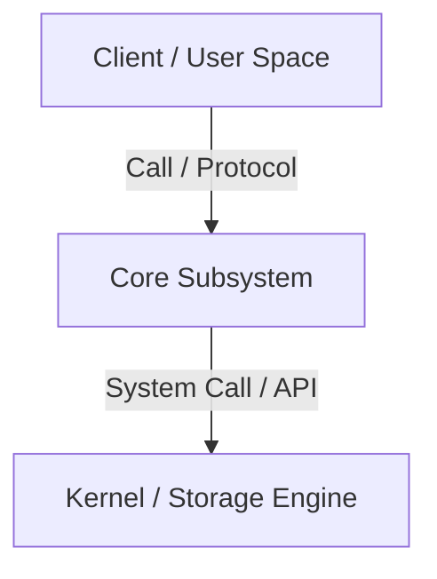
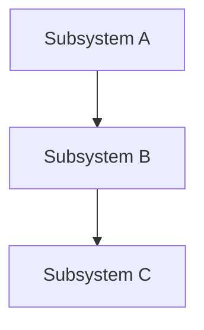
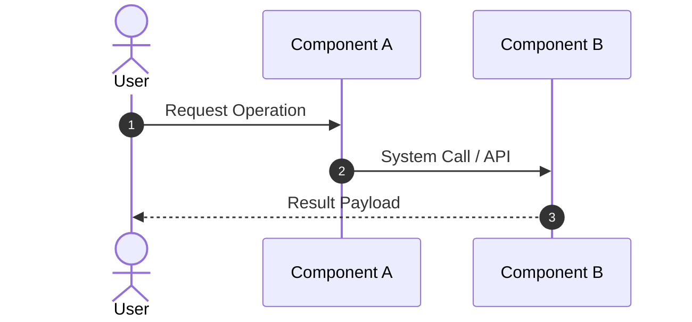

# {{Module Name}}

> **Module ID:** {{P-XX}}  
> **Category:** {{Category Name}}  
> **Difficulty:** {{Beginner / Intermediate / Advanced}}  
> **Estimated Time:** {{X Hours}}  
> **Prerequisites:** {{Prerequisite Modules / Skills}}  
> **Related Topics:** {{Related Modules / Technologies}}  
> **Framework Standard:** Cyber Act Universal Engineering Framework (v2 Standard)

---

# Part I — Understanding

## Overview

### Definition
* **Definition:** {{Formal technical definition}}
* **One-Line Summary:** {{Concise executive line summary}}

### Purpose & Problem Statement
* **Purpose:** {{Primary technical purpose}}
* **Problem it Solves:** {{Specific problem eliminated by this technology}}
* **Why it Exists:** {{Engineering rationale for existence}}

### History & Evolution
* **Origins & Evolution:** {{Historical origin and major version milestones}}

### Mental Model & Analogy
* **Real-World Analogy:** {{Real-world analogy}}
* **Mental Model:** {{Technical mental model describing system operation}}

> [!NOTE]
> {{Foundational technical note or key concept}}

---

## Terminology

### Key Terms & Definitions

#### **{{Term 1}}**
* **Definition:** {{Detailed definition of Term 1}}
* **Context / Scope:** {{Subsystem or scope}}
* **Key Properties:** {{Key characteristic or behavior}}

#### **{{Term 2}}**
* **Definition:** {{Detailed definition of Term 2}}
* **Context / Scope:** {{Subsystem or scope}}
* **Key Properties:** {{Key characteristic or behavior}}

---

## Big Picture

### Domain & Ecosystem Placement
* **Domain:** {{Technology Domain}}
* **Parent Topic:** {{Parent Subject Area}}
* **Child Topics:** {{Subtopics / Component Subjects}}
* **Prerequisites:** {{Required Prior Modules}}
* **Topics Enabled:** {{Advanced Topics Enabled by this Knowledge}}

### Architectural Placement
* **Technology Ecosystem:** {{Related Tools / Frameworks}}
* **Architecture Placement:** {{Layer in System Architecture}}
* **Stack Placement:** {{Layer in Technology Stack}}

### System Ecosystem Map


---

# Part II — Internal Engineering

## Architecture

### Core Subsystems & Components
* **Components:** {{List of internal components}}
* **Services & Processes:** {{Background daemons, services, or kernel threads}}

### Memory & Data Structures
* **Data Structures:** {{Key memory and disk data structures}}
* **Storage Formats:** {{File formats, on-disk block layouts, or network frame formats}}

### Component Architecture Map


---

## Mechanism

### Core Execution Workflow
1. {{Step 1 in execution workflow}}
2. {{Step 2 in execution workflow}}
3. {{Step 3 in execution workflow}}

### Execution Sequence Map


### Failure & Error Flow
* **{{Failure Condition}}:** {{What occurs during failure and how the system responds}}

---

## Relationships

### Upstream & Downstream Dependencies
* **Depends On:** {{Prerequisite system drivers / hardware}}
* **Used By:** {{Dependent applications / higher-level abstractions}}
* **Communicates With:** {{Network peers / external services}}

### Resource Lifecycle
* **Creates / Uses:** {{Resources created or managed}}
* **Execution Ordering:** {{Prerequisite execution sequence}}

---

## Runtime Environment

### Execution & System Context
* **Execution Environment:** {{User Space / Kernel Space / Hardware}}
* **Location:** {{Host OS / Virtual Machine / Container / Cloud}}
* **Space:** {{User Space vs Kernel Space}}
* **Execution Unit:** {{Process / Thread / SoftIRQ / Event Loop}}
* **Storage Unit:** {{Memory Pages / Disk Blocks / Sockets}}
* **Deployment Model:** {{Bare Metal / Hypervisor VM / Container}}
* **Lifetime:** {{Transient / Persistent Service}}

---

# Part III — Operations

## Installation

### Setup Procedures
```bash
# Installation commands
sudo apt update && sudo apt install -y {{package_name}}
```

---

## Configuration

### System & Service Configuration
* **Configuration Files:** `/etc/{{config_file}}.conf`
* **Environment Variables:** `{{ENV_VAR_NAME}}`

---

## Interfaces

### Commands

#### `{{command_1}}`
* **Purpose:** {{Purpose of command}}
* **Syntax:** `{{command_1}} [options] [arguments]`
* **Parameters:**
  * `-flag`: {{Description of flag}}
* **Input / Output:** {{Input source}} ➔ {{Output result}}
* **Example Usage:**
  ```bash
  {{command_1}} -flag argument
  ```

---

### APIs & Libraries
* **SDKs & Libraries:** {{Library name and scope}}
* **APIs:** {{API endpoints or system call functions}}

### Data Formats & Protocols
* **File Formats:** {{ELF / JSON / EVTX / PCAP}}
* **Protocols & RFCs:** {{RFC XXXX Protocol Standard}}

---

# Part IV — Observation

## Monitoring

### Telemetry & Inspection Tools
* **Inspection Tools:** {{Monitoring tools like top, htop, tcpdump, ProcMon}}
* **Log Sources:** `/var/log/{{syslog}}` or Event Viewer `{{LogName}}`

---

## Debugging

### Step-by-Step Debugging Workflow
1. **Step 1:** {{Initial inspection command}}
2. **Step 2:** {{Trace/debug command execution}}
3. **Step 3:** {{Verification and fix confirmation}}

> [!TIP]
> {{Operational debugging tip}}

---

# Part V — Security

## Security

### Threat Model & Attack Surface
* **Threat Model:** {{Threat vectors and adversary objectives}}
* **Attack Surface:** {{Exposed ports, APIs, file permissions, or SUID binaries}}

### Attack Vectors & Vulnerabilities
* **{{Attack Vector 1}}:** {{Mechanism of attack}}

### Detection & Telemetry
* **Detection Opportunities:** {{Log events or telemetry signals created during attack}}
* **MITRE ATT&CK Mapping:** {{TXXXX.XXX (Technique Name)}}

### Hardening & Security Best Practices
* {{Hardening rule 1}}
* {{Hardening rule 2}}

- [ ] {{Security auditing checklist item 1}}
- [ ] {{Security auditing checklist item 2}}

> [!CAUTION]
> {{Critical security warning or risk}}

---

# Part VI — Engineering

## Engineering Analysis

### Design Rationale & Philosophy
* {{Architectural design trade-offs and rationale}}

### Technology Comparison Matrix
| Attribute | {{Technology A}} | {{Technology B}} |
| :--- | :--- | :--- |
| **Architecture** | {{Value A1}} | {{Value B1}} |
| **Performance** | {{Value A2}} | {{Value B2}} |

---

# Part VII — Practical

## Basic Lab
```bash
# Basic setup and execution lab
{{command_1}}
```

## Observation Lab
```bash
# Telemetry observation lab
{{command_2}}
```

## Internal Lab
```bash
# Deep internal inspection lab
{{command_3}}
```

## Security Lab
```bash
# Security audit and mitigation lab
{{command_4}}
```

---

# Part VIII — Reference

## Quick Reference & Cheat Sheet
* `{{command_1}}` | `{{command_2}}` | `{{command_3}}`
* Key Paths: `/etc/{{config_dir}}`, `/var/log/{{log_dir}}`

---

# Part IX — Professional

## Interview Questions

### Fundamental & Architecture Questions
* **Question 1:** *{{Architectural question text?}}*
  > [!NOTE]
  > {{Engineering-grade answer text.}}

### Security & Troubleshooting Questions
* **Question 2:** *{{Security or scenario question text?}}*
  > [!IMPORTANT]
  > {{Engineering-grade security answer text.}}

---

## Revision

### Executive Summary & Revision
* **Key Takeaways:** {{2–3 sentence executive summary}}
* **One-Minute Revision:** {{Chronological pipeline sequence}}

---

## Master Completion Checklist

### Understanding
- [ ] Can define it
- [ ] Can explain why it exists
- [ ] Understand terminology
- [ ] Know where it fits

### Internal Engineering
- [ ] Can explain architecture
- [ ] Can explain workflow
- [ ] Can draw diagrams
- [ ] Understand lifecycle

### Operations
- [ ] Can install/configure
- [ ] Can use CLI commands
- [ ] Understand APIs/protocols

### Observation
- [ ] Can monitor telemetry
- [ ] Can debug failures
- [ ] Know log sources

### Security
- [ ] Know attack vectors
- [ ] Know mitigations
- [ ] Know detection telemetry

### Engineering
- [ ] Can compare alternatives
- [ ] Understand trade-offs
- [ ] Know performance limits

### Practical
- [ ] Completed basic lab
- [ ] Completed observation lab
- [ ] Completed security lab

### Professional
- [ ] Can answer interview questions
- [ ] Can explain to an engineer
- [ ] Can implement independently
