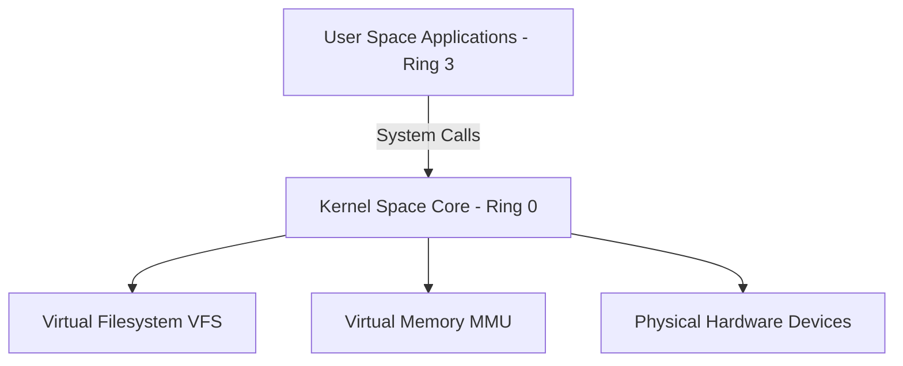
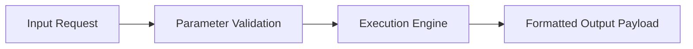
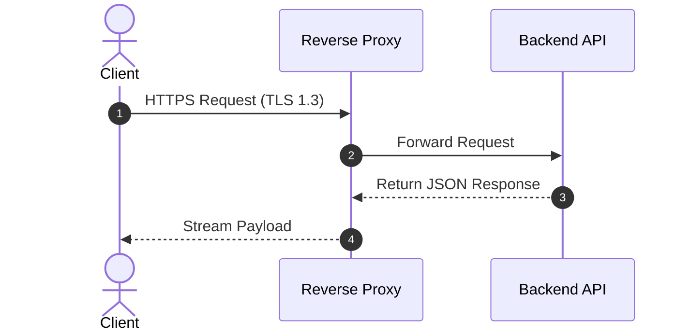
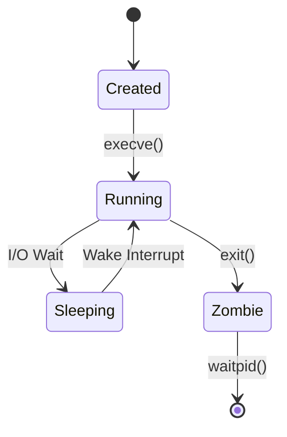
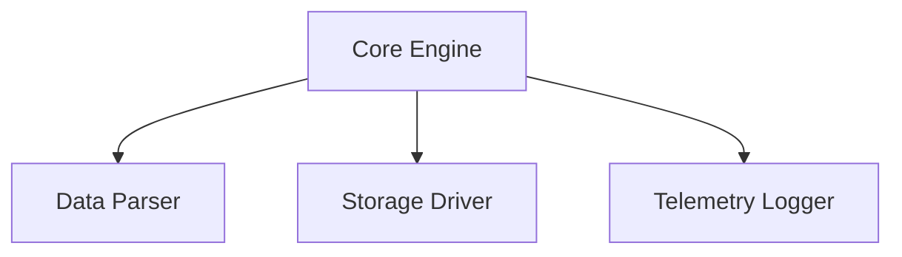
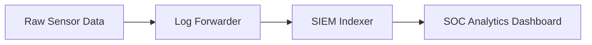
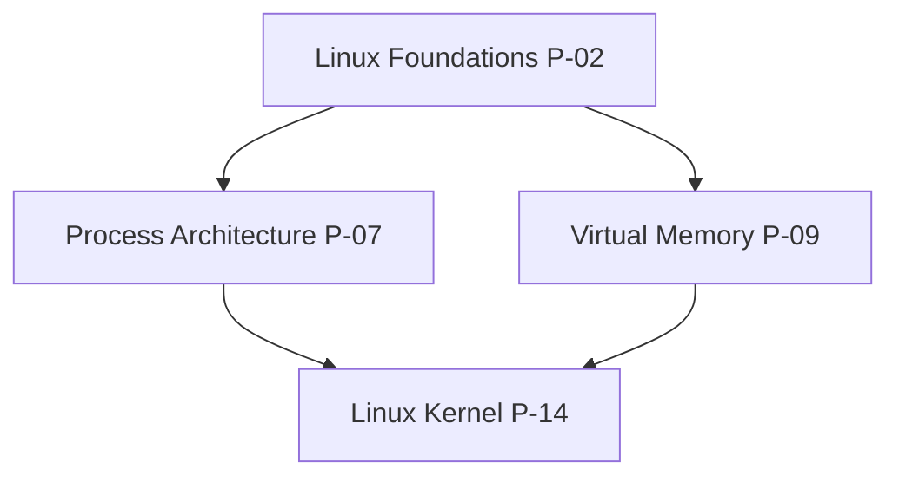
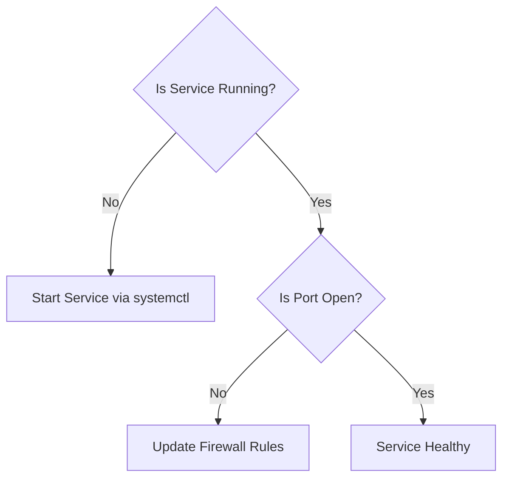
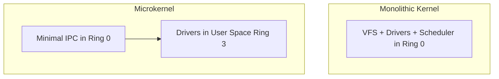

# Diagram Standards

> **Specification:** Cyber Act Mermaid Visual Diagram Standard  
> **Version:** 2.0  
> **Status:** Active Standard

---

## Architecture Diagram
Used to represent system components, OS kernel layers, and technology stack boundaries.



---

## Workflow Diagram
Used to illustrate operational sequences and step-by-step processing logic.



---

## Sequence Diagram
Used to illustrate time-ordered interactions between system components, network protocols, or security actors.



---

## State Machine
Used to map lifecycle states and state transition triggers.



---

## Component Diagram
Used to decompose internal subsystems and modules.



---

## Data Flow Diagram
Used to trace data transformation pipelines from input to storage.



---

## Knowledge Graph
Used to map conceptual topic hierarchies and skill dependencies.



---

## Timeline
Used to represent historical evolution or chronological event logs.

```text
1991: Linux Kernel v0.01 ──► 2003: Linux Kernel v2.6 (NPTL) ──► Modern: Linux Kernel v6.x (eBPF)
```

---

## Decision Tree
Used to model troubleshooting workflows and technology selection.



---

## Comparison Diagram
Used to contrast competing architectural paradigms.


