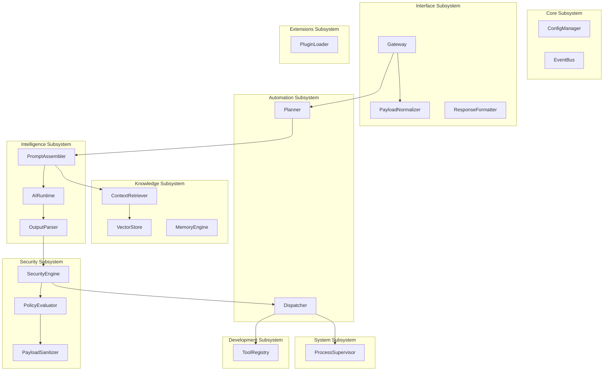

# 02 Component Architecture (Component Specifications)

> Document ID: DOC-ULTRON-L2-COMPONENT-SPECIFICATIONS
> Document Name: 02 Component Architecture (Component Specifications)
> Version: 1.0.0
> Status: Frozen
> Owner: Ultron.ArchitectureLead
> Architecture Version: 1.0.0
> Abstraction Level: L2 Component Architecture
> Parent Document: DOC-ULTRON-L1-OVERALL-ARCHITECTURE
> Child Documents: DOC-ULTRON-L3-REQUEST-LIFECYCLE
> Dependencies: A2A-ADP v1.0, AKM v1.0, ARM v1.0, ADS v1.0, AVR v1.0
> Last Updated: 2026-07-27

---

# Purpose

This document specifies the concrete **Component Specifications** for Project Ultron.

It decomposes all nine primary modules into architecture-grade component definitions, providing exhaustive specifications across 17 engineering attributes to enable non-blocking parallel implementation by multiple developers without code ambiguity.

---

# Scope

### Included in Scope
- Comprehensive component decomposition across all 9 primary modules (`Core`, `System`, `Interface`, `Intelligence`, `Automation`, `Security`, `Knowledge`, `Development`, `Extensions`).
- Exhaustive 17-attribute specification for every component: Component Name, Parent Module, Purpose, Responsibilities, Public Interfaces, Internal State, Dependencies, Dependents, Lifecycle, Initialization Order, Shutdown Order, Configuration, Error Handling, Logging Requirements, Security Considerations, Future Extensions, and Owner.
- Systemic component dependency graph and canonical mapping tables.

### Excluded from Scope
- Source code class implementations or language-specific syntax.
- Physical network hardware wiring or operating system kernel drivers.

---

# Engineering Question

**How are system modules decomposed into concrete engineering components, and what are their internal states, public interfaces, lifecycles, and security specifications?**

---

# Context

This document occupies abstraction level **L2 Component Architecture** in the Ultron architecture hierarchy.

It derives from `01 Overall Architecture.md` and provides the structural component specification driving `03 Request Lifecycle.md` and `09 Folder Structure.md`.

```
01 Overall Architecture.md (L1 Layered Architecture)
↓
02 Component Architecture.md (Component Specifications - This Document)
↓
03 Request Lifecycle.md (L3 Request Lifecycle Specification)
```

---

# Architecture

### Systemic Component Dependency Graph



---

# Component Specifications

---

## 1. Core Subsystem Components

### Component: `ConfigManager`
- **Component Name**: `ConfigManager`
- **Parent Module**: `Core`
- **Purpose**: Loads, parses, and validates `.env` and `config.yaml` runtime settings into immutable configuration state.
- **Responsibilities**:
  - Read environment variables and local YAML configuration files.
  - Enforce type validation and default value fallback.
  - Expose read-only configuration getters to all system components.
- **Public Interfaces**: `IConfigManager` (`get_string(key)`, `get_int(key)`, `get_bool(key)`).
- **Internal State**: Immutable dictionary of parsed key-value pairs.
- **Dependencies**: Host Filesystem (`.env`, `config.yaml`).
- **Dependents**: `SystemInitializer`, all subsystems.
- **Lifecycle**: Instantiated during daemon bootstrap; remains immutable throughout process lifetime.
- **Initialization Order**: `01` (First component initialized).
- **Shutdown Order**: `09` (Final component destroyed).
- **Configuration**: Path to `.env` file (`ULTRON_CONFIG_PATH`).
- **Error Handling**: Raises `ConfigFileNotFoundError` or `InvalidConfigValueError` on startup failure.
- **Logging Requirements**: Logs loaded configuration keys and sources (masks sensitive values).
- **Security Considerations**: Redacts secrets (API keys, passwords) from memory dumps and log outputs.
- **Future Extensions**: Hot-reloading non-critical configuration parameters via file watcher signals.
- **Owner**: `Ultron.ArchitectureLead`

---

### Component: `EventBus`
- **Component Name**: `EventBus`
- **Parent Module**: `Core`
- **Purpose**: Asynchronous publish/subscribe event router facilitating decoupled event messaging across subsystems.
- **Responsibilities**:
  - Maintain topic subscriber registry.
  - Route published event payloads asynchronously using non-blocking queues.
  - Enforce event handler isolation to prevent queue starvation.
- **Public Interfaces**: `IEventBus` (`publish(event_name, payload)`, `subscribe(event_name, handler_callback)`).
- **Internal State**: Dictionary mapping event topic strings to sets of async handler callbacks; active `asyncio.Queue`.
- **Dependencies**: `ConfigManager`.
- **Dependents**: `Planner`, `SecurityEngine`, `Gateway`, `AuditLogger`.
- **Lifecycle**: Active for daemon lifetime; spawned during startup; drained during shutdown.
- **Initialization Order**: `02`.
- **Shutdown Order**: `08`.
- **Configuration**: `EVENT_BUS_MAX_QUEUE_SIZE` (default: 10,000).
- **Error Handling**: Traps unhandled handler exceptions to prevent event loop termination.
- **Logging Requirements**: Logs event publish rates, listener counts, and delivery error traces.
- **Security Considerations**: Ensures event payloads do not leak raw credentials across module boundaries.
- **Future Extensions**: Distributed cross-node event broadcasting via Redis pub/sub.
- **Owner**: `Ultron.ArchitectureLead`

---

## 2. Security Subsystem Components

### Component: `SecurityEngine`
- **Component Name**: `SecurityEngine`
- **Parent Module**: `Security`
- **Purpose**: Non-bypassable policy evaluation and privilege gating for proposed tool call executions.
- **Responsibilities**:
  - Receive `ExecutionPlan` tool call proposals.
  - Invoke `PolicyEvaluator` and `PayloadSanitizer` parameter checks.
  - Emit `APPROVED` or `REJECTED` security evaluation verdicts.
- **Public Interfaces**: `ISecurityEngine` (`evaluate_tool_proposal(proposed_tool_call, context)`).
- **Internal State**: Loaded policy ruleset; audit event counters.
- **Dependencies**: `PolicyEvaluator`, `PayloadSanitizer`, `EventBus`.
- **Dependents**: `Dispatcher` (`Automation`).
- **Lifecycle**: Active daemon background security service.
- **Initialization Order**: `03`.
- **Shutdown Order**: `07`.
- **Configuration**: `SECURITY_POLICY_MODE` (`STRICT`/`PERMISSIVE`), `ALLOW_ELEVATED_SUDO`.
- **Error Handling**: Defaults to `REJECTED` status on any policy evaluation exception (Fail-Closed).
- **Logging Requirements**: Logs all approved and rejected tool call proposals to `AuditLogger`.
- **Security Considerations**: Non-bypassable gate; mandatory pre-execution check for all host calls.
- **Future Extensions**: Dynamic signed security policy reloading without daemon restart.
- **Owner**: `Ultron.ArchitectureLead`

---

### Component: `PayloadSanitizer`
- **Component Name**: `PayloadSanitizer`
- **Parent Module**: `Security`
- **Purpose**: Strips path traversal sequences (`../`), shell injection characters, and null bytes from parameters.
- **Responsibilities**:
  - Canonicalize file paths (`os.path.realpath`).
  - Escapes shell special characters (`;&|<>`).
  - Strip null byte injections from string parameters.
- **Public Interfaces**: `IPayloadSanitizer` (`sanitize_path(raw_path)`, `sanitize_shell_arg(raw_arg)`).
- **Internal State**: Stateless transformation ruleset.
- **Dependencies**: None.
- **Dependents**: `SecurityEngine`.
- **Lifecycle**: Stateless utility component.
- **Initialization Order**: `03`.
- **Shutdown Order**: `07`.
- **Configuration**: `ALLOWED_PROJECT_ROOT_DIRECTORIES`.
- **Error Handling**: Raises `InvalidPathError` if path resolves outside authorized root directory.
- **Logging Requirements**: Logs path sanitization violations with high severity security alert.
- **Security Considerations**: Prevents directory traversal attacks and shell command injection.
- **Future Extensions**: Regex pattern updates for emerging injection vector detection.
- **Owner**: `Ultron.ArchitectureLead`

---

## 3. Intelligence Subsystem Components

### Component: `AIRuntime`
- **Component Name**: `AIRuntime`
- **Parent Module**: `Intelligence`
- **Purpose**: Manages HTTP connection pools and request dispatching to local LLM inference daemons (Ollama / llama.cpp).
- **Responsibilities**:
  - Maintain HTTP client connection pool to `127.0.0.1:11434`.
  - Format completion payload requests.
  - Handle stream response parsing and retry backoff.
- **Public Interfaces**: `IAIRuntime` (`generate_completion(prompt, hyperparameters)`).
- **Internal State**: Active HTTP client session (`httpx.AsyncClient`); active request counter.
- **Dependencies**: `ConfigManager`, Local Ollama Daemon.
- **Dependents**: `Planner` (`Automation`).
- **Lifecycle**: Instantiated at startup; active connection pool across daemon session.
- **Initialization Order**: `04`.
- **Shutdown Order**: `06`.
- **Configuration**: `LLM_INFERENCE_ENDPOINT`, `LLM_MODEL_NAME`, `LLM_TIMEOUT_SECONDS`.
- **Error Handling**: Raises `AIRuntimeUnavailableError` or `LLMTimeoutError` on connection loss.
- **Logging Requirements**: Logs request token counts, completion latency, and model names.
- **Security Considerations**: Enforces strict local IP binding (`127.0.0.1`) to prevent cloud leakage.
- **Future Extensions**: Streaming token callbacks for real-time UI response rendering.
- **Owner**: `Ultron.AIEngineer`

---

### Component: `PromptAssembler`
- **Component Name**: `PromptAssembler`
- **Parent Module**: `Intelligence`
- **Purpose**: Assembles system persona guidelines, `ToolRegistry` schemas, RAG context, and session memory into raw prompts.
- **Responsibilities**:
  - Load prompt template files from `backend/intelligence/prompts/`.
  - Inject tool schemas and RAG search result chunks into system context.
  - Format output instructions demanding strict JSON `ExecutionPlan` response.
- **Public Interfaces**: `IPromptAssembler` (`assemble_prompt(context, rag_chunks, tool_schemas)`).
- **Internal State**: Cached prompt templates.
- **Dependencies**: `ContextRetriever` (`Knowledge`), `ToolRegistry` (`Development`).
- **Dependents**: `AIRuntime`.
- **Lifecycle**: Per-reasoning-turn execution context builder.
- **Initialization Order**: `04`.
- **Shutdown Order**: `06`.
- **Configuration**: `SYSTEM_PROMPT_TEMPLATE_PATH`, `MAX_CONTEXT_TOKENS`.
- **Error Handling**: Traps template rendering errors and falls back to base system persona.
- **Logging Requirements**: Logs assembled prompt token size and template version.
- **Security Considerations**: Filters user inputs to mitigate system prompt override injections.
- **Future Extensions**: Dynamic few-shot example selection based on task semantic domain.
- **Owner**: `Ultron.AIEngineer`

---

### Component: `OutputParser`
- **Component Name**: `OutputParser`
- **Parent Module**: `Intelligence`
- **Purpose**: Parses raw LLM text completions into typed Pydantic `ExecutionPlan` structures with automated JSON repair.
- **Responsibilities**:
  - Extract JSON blocks from Markdown code fences in raw completion text.
  - Perform JSON structural repair (balance braces, fix trailing commas).
  - Deserialize JSON into Pydantic `ExecutionPlan` model.
- **Public Interfaces**: `IOutputParser` (`parse_execution_plan(raw_completion_text)`).
- **Internal State**: Stateless parsing regex rules.
- **Dependencies**: None.
- **Dependents**: `Planner` (`Automation`), `SecurityEngine`.
- **Lifecycle**: Stateless parsing utility.
- **Initialization Order**: `04`.
- **Shutdown Order**: `06`.
- **Configuration**: `MAX_JSON_REPAIR_ATTEMPTS`.
- **Error Handling**: Raises `OutputParsingError` if completion text cannot be deserialized into valid schema.
- **Logging Requirements**: Logs JSON repair attempts and parsing failure rates.
- **Security Considerations**: Sanitizes input string before JSON parsing to prevent code evaluation leaks.
- **Future Extensions**: Native GBNF / JSON Schema grammar-guided decoding during LLM sampling.
- **Owner**: `Ultron.AIEngineer`

---

## 4. Knowledge Subsystem Components

### Component: `VectorStore`
- **Component Name**: `VectorStore`
- **Parent Module**: `Knowledge`
- **Purpose**: Manages local vector embedding indexes for codebase files and documentation notes.
- **Responsibilities**:
  - Connect to local vector database (Chroma / SQLite-vss).
  - Index document text chunks with sentence-transformers embeddings.
  - Perform top-$k$ cosine similarity searches.
- **Public Interfaces**: `IVectorStore` (`query_similarity(query_vector, top_k, filters)`).
- **Internal State**: Open database connection pool; embedding index handles.
- **Dependencies**: `ConfigManager`, Local Vector DB.
- **Dependents**: `ContextRetriever`.
- **Lifecycle**: Persistent database connection initialized at daemon startup.
- **Initialization Order**: `04`.
- **Shutdown Order**: `06`.
- **Configuration**: `VECTOR_DB_PATH`, `EMBEDDING_MODEL_NAME`.
- **Error Handling**: Catches vector index corruption errors and initiates automatic re-indexing.
- **Logging Requirements**: Logs query similarity search latency and result count scores.
- **Security Considerations**: Restricts vector queries to authorized workspace file paths.
- **Future Extensions**: Hybrid dense-sparse (BM25 + Vector) retrieval indexing algorithms.
- **Owner**: `Ultron.AIEngineer`

---

## 5. Automation Subsystem Components

### Component: `Planner`
- **Component Name**: `Planner`
- **Parent Module**: `Automation`
- **Purpose**: Orchestrates the multi-step request workflow, reasoning loop, and tool execution feedback.
- **Responsibilities**:
  - Manage request state machine (`INGESTED` $\rightarrow$ `REASONING` $\rightarrow$ `EXECUTING` $\rightarrow$ `COMPLETED`).
  - Dispatch proposals to `PromptAssembler` and `AIRuntime`.
  - Process tool execution feedback and trigger sub-planning loops.
- **Public Interfaces**: `IPlanner` (`execute_request(request_context)`).
- **Internal State**: Active request task state machine handles.
- **Dependencies**: `PromptAssembler`, `AIRuntime`, `OutputParser`, `Dispatcher`.
- **Dependents**: `Gateway` (`Interface`).
- **Lifecycle**: Instantiated per user request.
- **Initialization Order**: `05`.
- **Shutdown Order**: `05`.
- **Configuration**: `MAX_PLANNING_RETRY_STEPS` (default: 10).
- **Error Handling**: Aborts execution graph and returns error response payload on unrecoverable failure.
- **Logging Requirements**: Logs state transitions, step counts, and workflow execution durations.
- **Security Considerations**: Enforces privilege escalation prompts before executing high-risk steps.
- **Future Extensions**: Hierarchical sub-planner DAG decomposition for parallel branch execution.
- **Owner**: `Ultron.ArchitectureLead`

---

### Component: `Dispatcher`
- **Component Name**: `Dispatcher`
- **Parent Module**: `Automation`
- **Purpose**: Submits approved tool call steps to `SecurityEngine` and routes authorized tasks to `ProcessSupervisor`.
- **Responsibilities**:
  - Submit step tool call proposal to `SecurityEngine`.
  - On approval, route tool execution to `ProcessSupervisor` or `ToolRegistry`.
  - Collect stdout/stderr streams into `ToolCallResult`.
- **Public Interfaces**: `IDispatcher` (`dispatch_tool_step(step_proposal, context)`).
- **Internal State**: Active execution step registry.
- **Dependencies**: `SecurityEngine`, `ToolRegistry`, `ProcessSupervisor`.
- **Dependents**: `Planner`.
- **Lifecycle**: Long-lived background task dispatcher.
- **Initialization Order**: `05`.
- **Shutdown Order**: `05`.
- **Configuration**: `DEFAULT_STEP_TIMEOUT_SECONDS` (default: 30s).
- **Error Handling**: Wraps process timeouts or exit code failures into structured `ToolCallResult`.
- **Logging Requirements**: Logs tool step dispatch events, approval decisions, and execution times.
- **Security Considerations**: Re-validates `SecurityEngine` token authorization before process spawning.
- **Future Extensions**: Isolated container execution routing (Docker / Firecracker MicroVMs).
- **Owner**: `Ultron.ArchitectureLead`

---

## 6. System Subsystem Components

### Component: `ProcessSupervisor`
- **Component Name**: `ProcessSupervisor`
- **Parent Module**: `System`
- **Purpose**: Spawns, monitors, enforces timeouts, and captures stdout/stderr streams from host Linux processes.
- **Responsibilities**:
  - Spawn host OS processes via `asyncio.create_subprocess_exec`.
  - Stream stdout and stderr into memory buffers without deadlocking.
  - Enforce subprocess SIGTERM/SIGKILL timeout termination.
- **Public Interfaces**: `IProcessSupervisor` (`execute_process(binary_path, args, timeout)`).
- **Internal State**: Table of active PID subprocess handles.
- **Dependencies**: Host Linux OS Kernel (`subprocess`).
- **Dependents**: `Dispatcher` (`Automation`).
- **Lifecycle**: Active daemon supervisor service.
- **Initialization Order**: `03`.
- **Shutdown Order**: `07`.
- **Configuration**: `SUBPROCESS_HARD_TIMEOUT_SECONDS` (default: 60s).
- **Error Handling**: Catches process spawn errors (`FileNotFoundError`, `PermissionError`) cleanly.
- **Logging Requirements**: Logs spawned process PIDs, binary paths, exit codes, and resource usage.
- **Security Considerations**: Executes binaries using parameter arrays (never shell string evaluation).
- **Future Extensions**: Linux cgroups v2 resource limit enforcement (CPU, Memory caps).
- **Owner**: `Ultron.ArchitectureLead`

---

# Canonical Component Dependency Table

| Module | Component | Interface | Dependencies | Primary Consumers | Init Order |
| :--- | :--- | :--- | :--- | :--- | :--- |
| `Core` | `ConfigManager` | `IConfigManager` | Host OS `.env` | All Subsystems | `01` |
| `Core` | `EventBus` | `IEventBus` | `ConfigManager` | Subsystem Event Handlers | `02` |
| `Security` | `SecurityEngine` | `ISecurityEngine` | `PolicyEvaluator`, `PayloadSanitizer` | `Dispatcher` | `03` |
| `System` | `ProcessSupervisor` | `IProcessSupervisor` | Host Linux Kernel | `Dispatcher` | `03` |
| `Knowledge` | `VectorStore` | `IVectorStore` | Local SQLite/Vector DB | `ContextRetriever` | `04` |
| `Intelligence`| `AIRuntime` | `IAIRuntime` | Local Ollama Daemon | `Planner` | `04` |
| `Intelligence`| `PromptAssembler` | `IPromptAssembler` | `ContextRetriever`, `ToolRegistry` | `AIRuntime` | `04` |
| `Intelligence`| `OutputParser` | `IOutputParser` | None | `ExecutionGraphBuilder` | `04` |
| `Automation` | `Planner` | `IPlanner` | `AIRuntime`, `PromptAssembler` | `Gateway` | `05` |
| `Automation` | `Dispatcher` | `IDispatcher` | `SecurityEngine`, `ProcessSupervisor` | `Planner` | `05` |

---

# Responsibilities

### Primary Responsibilities
- Specify canonical component boundaries, internal states, and 17-attribute engineering specs.
- Enforce strict initialization ordering (`Core` $\rightarrow$ `Security`/`System` $\rightarrow$ `Knowledge`/`Intelligence` $\rightarrow$ `Automation` $\rightarrow$ `Interface`).
- Guarantee zero circular dependencies across component boundaries.

### Secondary Responsibilities
- Provide structural reference for unit test dependency injection.
- Guide static code analysis rules for component decoupling.

### Out of Scope
- Writing Python class definitions or function bodies.
- Configuring host OS memory limits.

---

# Relationships

### Parent Of
- `DOC-ULTRON-L3-REQUEST-LIFECYCLE` (`03 Request Lifecycle.md`).

### Child Of
- `DOC-ULTRON-L1-OVERALL-ARCHITECTURE` (`01 Overall Architecture.md`).

### References
- `AKM v1.0` (Architecture Knowledge Model Ontology).
- `ARM v1.0` (Architecture Reference Model).

---

# Dependencies

| Target | Type | Direction | Reason | Criticality |
| :--- | :--- | :--- | :--- | :--- |
| `01 Overall Architecture.md` | Parent Document | Incoming | Provides layered architecture driving component mapping | Mandatory |
| `ARM v1.0` | Reference Model | Incoming | Establishes component boundary rules | Mandatory |
| `A2A-ADP v1.0` | Protocol | Operational | Enforces delegation and compilation rules | Mandatory |

---

# Constraints

- **Initialization Sequence**: Lower-layer infrastructure components MUST complete initialization before upper-layer consumer components spawn.
- **Shutdown Symmetry**: System shutdown MUST reverse initialization order (`Interface` $\rightarrow$ `Automation` $\rightarrow$ `Intelligence`/`Knowledge` $\rightarrow$ `Security`/`System` $\rightarrow$ `Core`).
- **Contract Boundary**: Components MUST NOT access internal state of sibling components without passing through declared interfaces.

---

# References

- `10 - Flagship Projects/Ultron/01-Architecture/01 Overall Architecture.md` (Overall Architecture)
- `10 - Flagship Projects/Ultron/01-Architecture/10 API Contracts.md` (Interface Contracts)
- `00 - Meta/AI Collaboration/ADS.md` (Architecture Document Schema)

---

# Future Scope

- Integration of automated dependency graph visualization generators.
- Specification of hot-swappable component lifecycle hooks.
