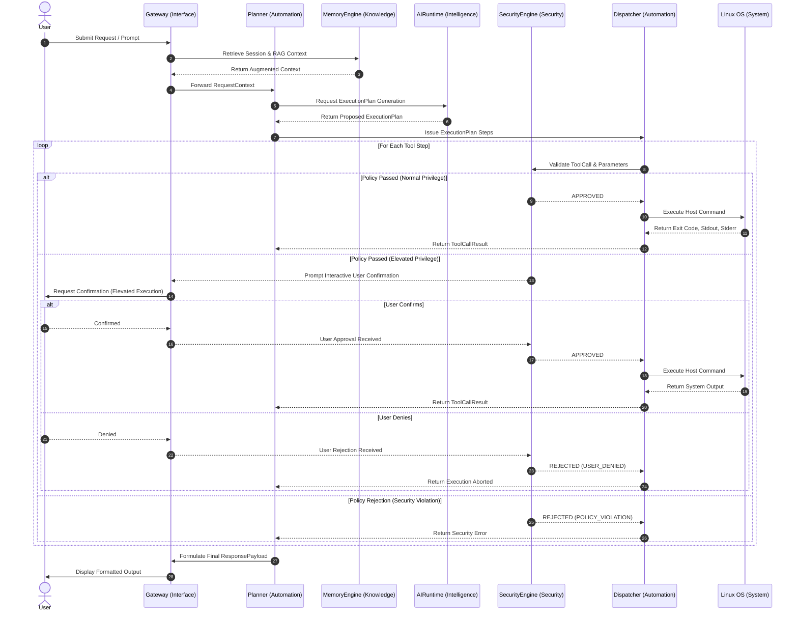

# 13 Sequence Diagrams

> Document ID: DOC-ULTRON-L3-SEQUENCE-DIAGRAMS
> Document Name: 13 Sequence Diagrams
> Version: 1.0.0
> Status: Frozen
> Owner: Ultron.ArchitectureLead
> Architecture Version: 1.0.0
> Abstraction Level: L3 Sequence Diagrams
> Parent Document: DOC-ULTRON-L5-DEPLOYMENT-ARCHITECTURE
> Child Documents: None (Leaf Document)
> Dependencies: A2A-ADP v1.0, AKM v1.0, ARM v1.0, ADS v1.0
> Last Updated: 2026-07-27

---

# Purpose

This document provides formal sequence diagrams illustrating temporal message interactions across Ultron subsystems.

It visualizes the exact call sequences for user request processing, AI reasoning and planning, security policy evaluation, interactive user approval, and host OS tool execution.

---

# Scope

### Included in Scope
- Sequence diagrams for primary system interaction flows.
- Interaction paths for successful tool execution and security policy rejections.
- Temporal message sequencing across Gateway, Planner, SecurityEngine, Dispatcher, and OS binaries.

### Excluded from Scope
- Individual source code method call stack traces.
- Network packet capture diagrams.

---

# Engineering Question

**What are the formal sequence interaction diagrams governing request processing, tool execution, and security gating in Ultron?**

---

# Context

This document occupies abstraction level **L3 Sequence Diagrams** in the Ultron architecture hierarchy.

It derives from `12 Deployment Architecture.md` and serves as the visual interaction reference for the entire `01-Architecture/` vault.

```
12 Deployment Architecture.md (L5 Deployment Architecture)
↓
13 Sequence Diagrams.md (L3 Sequence Diagrams - This Document)
```

---

# Architecture

### 1. End-to-End Request & Tool Execution Flow



---

# Responsibilities

### Primary Responsibilities
- Provide clear, deterministic Mermaid sequence diagrams for system workflows.
- Visualise security gate checks and interactive escalation flows.
- Maintain consistency with `03 Request Lifecycle.md` and `05 Tool Execution Flow.md`.

### Secondary Responsibilities
- Guide integration test workflow assertions.
- Serve as onboarding visual aid for new platform engineers.

### Out of Scope
- Implementing UI animation code.
- Managing database query logs.

---

# Relationships

### Parent Of
- None (Leaf Document).

### Child Of
- `DOC-ULTRON-L5-DEPLOYMENT-ARCHITECTURE` (`12 Deployment Architecture.md`).

### References
- `AKM v1.0` (Architecture Knowledge Model Ontology).
- `ADS v1.0` (Architecture Document Schema).

---

# Dependencies

| Target | Type | Direction | Reason | Criticality |
| :--- | :--- | :--- | :--- | :--- |
| `12 Deployment Architecture.md` | Parent Document | Incoming | Provides deployment context driving interaction flows | Mandatory |
| `ARM v1.0` | Reference Model | Incoming | Establishes layer interaction rules | Mandatory |
| `A2A-ADP v1.0` | Protocol | Operational | Enforces delegation and compilation rules | Mandatory |

---

# Constraints

- **Sequence Fidelity**: Sequence diagrams MUST accurately portray mandatory SecurityEngine gating.
- **Valid Mermaid Syntax**: All sequence diagrams MUST compile cleanly using standard Mermaid sequenceDiagram syntax.
- **Single Question**: This document MUST exclusively answer sequence interaction questions.

---

# References

- `10 - Flagship Projects/Ultron/01-Architecture/03 Request Lifecycle.md` (Request Lifecycle Spec)
- `10 - Flagship Projects/Ultron/01-Architecture/05 Tool Execution Flow.md` (Tool Execution Flow)
- `00 - Meta/AI Collaboration/ADS.md` (Architecture Document Schema)

---

# Future Scope

- Addition of sequence diagrams for enterprise multi-node cluster synchronization.
- Integration of sequence diagrams for dynamic plugin registration flows.
