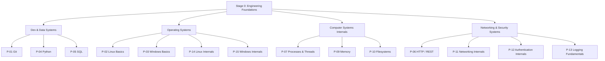

# 🧠 Master Branch Knowledge Index (Stage 0 Foundations)

> **Framework Standard:** Cyber Act Universal Topic Framework (9-Part Modular Standard)  
> **Status:** Active Master Map (100% Stage 0 Coverage)  
> **Vault Path:** `04 - Branch Knowledge/`

---

## 📌 Universal Topic Framework Reference
Every note in `04 - Branch Knowledge` follows the 9-part modular framework defined in [Cyber Act Framework](file:///home/vamshi/Documents/notes/notes1/cyber/01%20-%20Framework/Cyber%20Act%20Framework/):
1. **Part I — Understanding** (Overview, Terminology, Big Picture)
2. **Part II — Internal Engineering** (Architecture, Mechanism, Relationships, Runtime Environment)
3. **Part III — Operations** (Installation, Configuration, Interfaces)
4. **Part IV — Observation** (Monitoring, Debugging)
5. **Part V — Security** (Security)
6. **Part VI — Engineering** (Engineering Analysis)
7. **Part VII — Practical** (Labs)
8. **Part VIII — Reference** (References)
9. **Part IX — Professional** (Interview, Revision, Master Checklist)

---

## 🗺️ Stage 0 Module & Subtopic Vault Map

---

## 📂 Complete Subtopic Directory Mapping

### 1. Development & Data Systems (`Programming/`)

| Module ID | Module Name | Status | Vault Target File | Defined Subtopics |
| :--- | :--- | :---: | :--- | :--- |
| **P-01** | **Git** | `[x]` | `Programming/Git/Git Master Note.md` | Version Control, Repository, Staging Area, Commits, Branches, Merge, Rebase, Remotes, Reflog, **Git Internals (Blobs, Trees, Commits)** |
| **P-04** | **Python** | `[x]` | `Programming/Python/Python Systems Programming.md` | Python Systems Programming, CPython VM, GIL, Sockets, Subprocesses, Struct, Ctypes, Security Libraries |
| **P-05** | **SQL** | `[x]` | `Programming/SQL/Relational Databases & SQL.md` | Relational Databases, SQL DDL/DML, ACID, B-Tree Indexes, Parameterized Queries, SQL Injection Defense |

---

### 2. Operating Systems & Internals (`Linux/` & `Windows/`)

| Module ID | Module Name | Status | Vault Target File | Defined Subtopics |
| :--- | :--- | :---: | :--- | :--- |
| **P-02** | **Linux Basics** | `[x]` | `Linux/Basics/Linux System Foundations.md` | Monolithic Kernel, POSIX, VFS, Root User, CLI Tools (`ls`, `chmod`, `chown`, `ps`), Security Hardening |
| **P-14** | **Linux Internals**| `[x]` | `Linux/Internals/Linux Kernel Architecture & Syscalls.md` | Ring 0 vs Ring 3, Syscall Table, LSM, Namespaces (PID/NET/MNT/USER), cgroups, eBPF |
| **P-03** | **Windows Basics** | `[x]` | `Windows/Basics/Windows System Foundations.md` | Hybrid Kernel, Registry, LSASS, SIDs, Access Tokens, DACLs, Event Viewer, PowerShell |
| **P-15** | **Windows Internals**| `[x]` | `Windows/Internals/Windows Architecture & Security Model.md` | `ntoskrnl.exe`, `ntdll.dll`, SRM, Virtualization-Based Security (VBS), Credential Guard, RunAsPPL |

---

### 3. Core Computer Systems (`Linux/ Processes, Memory, Filesystems`)

| Module ID | Module Name | Status | Vault Target File | Defined Subtopics |
| :--- | :--- | :---: | :--- | :--- |
| **P-07/08**| **Processes & Threads**| `[x]` | `Linux/Processes/Process Architecture & Lifecycle.md` | `task_struct`, `fork()`/`execve()`, Signals (`SIGKILL`), LWPs, IPC (Pipes, Shared Memory, Sockets), Process Hollowing |
| **P-09** | **Virtual Memory** | `[x]` | `Linux/Memory/Virtual Memory & Allocation.md` | MMU, Page Tables, Page Faults, Stack/Heap, `malloc`/`mmap`, Buffer Overflows, ASLR, DEP/NX |
| **P-10** | **Filesystems** | `[x]` | `Linux/Filesystems/Filesystem Internals & VFS.md` | VFS, Inodes, Dentries, Superblock, ext4/XFS, Journaling, Hard vs Soft Links, Mount Options (`noexec`/`nosuid`) |

---

### 4. Networking, Authentication & Telemetry (`Networking/`, `Authentication/`, `Logs/`)

| Module ID | Module Name | Status | Vault Target File | Defined Subtopics |
| :--- | :--- | :---: | :--- | :--- |
| **P-06** | **HTTP / REST** | `[x]` | `Networking/HTTP_REST/HTTP & REST Architecture.md` | Stateless Request/Response, Verbs, Status Codes, CORS, Cookies, TLS 1.3/HTTPS, Security Headers |
| **P-11** | **Networking Internals**| `[x]` | `Networking/Internals/Network Protocol Stack.md` | TCP/IP 4-Layer Model, Encapsulation, TCP 3-Way Handshake, UDP, IP Routing, ARP, `tcpdump`, `ss` |
| **P-12** | **Authentication Internals**| `[x]` | `Authentication/Authentication Internals.md` | AuthN vs AuthZ, Password Hashing (Argon2id/bcrypt), Kerberos (KDC/TGT/ST), JWT Mechanics, TOTP MFA |
| **P-13** | **Logging & Telemetry**| `[x]` | `Logs/Logging Fundamentals & Telemetry.md` | Sysmon, Auditd, EVTX, Structured JSON Logging, SIEM Ingestion, Event IDs (`4624`, `4688`, `1102`), Sigma Rules |
