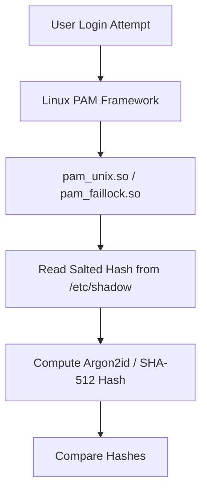
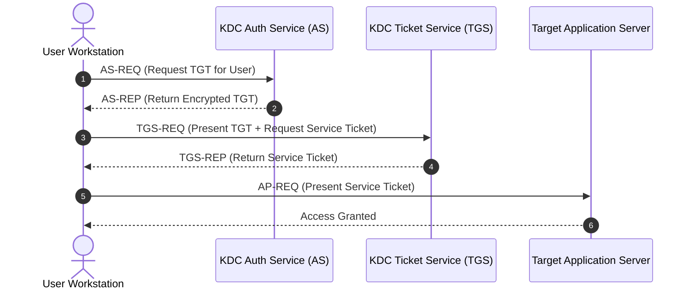

# P-12: Authentication Internals & Identity Protocols

> **Module ID:** P-12  
> **Category:** Identity & Cryptographic Security  
> **Difficulty:** Advanced  
> **Estimated Time:** 10 Hours  
> **Prerequisites:** HTTP & REST Architecture (P-06)  
> **Related Topics:** PAM, Shadow Database, Password Hashing (Argon2id, bcrypt), JWT, OAuth 2.0, OpenID Connect, Kerberos  
> **Framework Standard:** Cyber Act Universal Engineering Framework (v2 Standard)

---

# Part I — Understanding

## Overview

### Definition
* **Definition:** Authentication Internals encompasses the local operating system modules (Linux PAM, `/etc/shadow`), password hashing algorithms (Argon2id, bcrypt, PBKDF2), identity protocols (Kerberos, OAuth 2.0, OpenID Connect), and cryptographic token standards (JSON Web Tokens - JWT) that verify identity assertions across systems.
* **One-Line Summary:** Local OS modules (PAM) and distributed protocols (Kerberos, OAuth 2.0, JWT) cryptographically verifying identity assertions.

### Purpose & Problem Statement
* **Purpose:** Establishes identity assurance, single sign-on (SSO), secure credential storage, role-based access control (RBAC), and session verification across operating systems and web APIs.
* **Problem it Solves:** Eliminates cleartext password storage, password reuse vulnerability propagation, fragmented identity databases, and unauthorized API endpoint access.
* **Why it Exists:** Developed to transition from early unencrypted local password authentication to enterprise distributed federated identity management.

### History & Evolution
* **Origins & Evolution:** Evolved from plaintext `/etc/passwd` to salted `/etc/shadow`, Linux PAM (1995), Active Directory Kerberos (v5 RFC 4120), and web identity standards OAuth 2.0 (RFC 6749) / JWT (RFC 7519).

### Mental Model & Analogy
* **Real-World Analogy:** Airport Security Checkpoint: Presenting a Passport (Credentials) to the TSA Agent (Authentication Module/PAM). The agent validates the passport stamp (Cryptographic Hash) and issues an Airport Security Boarding Pass (JWT/Kerberos TGT) allowing access to terminal gates (APIs).
* **Mental Model:** User supplies credentials ➔ PAM / Auth Server checks against salted cryptographic hash ➔ Issues cryptographically signed assertion token (JWT / Kerberos TGT) ➔ Application validates token signature on subsequent requests.

> [!NOTE]
> Authentication proves **WHO YOU ARE**; Authorization determines **WHAT YOU ARE ALLOWED TO DO**.

---

## Terminology

### Key Terms & Definitions

#### **PAM (Pluggable Authentication Modules)**
* **Definition:** A flexible Linux framework allowing system administrators to configure authentication policies (`/etc/pam.d/`) without modifying underlying application source code.
* **Context / Scope:** Linux OS Authentication Layer.
* **Key Properties:** Uses dynamically loaded modules (`.so`).

#### **Argon2id**
* **Definition:** The winner of the Password Hashing Competition (PHC), providing maximum cryptographic resistance against GPU/ASIC brute-force and side-channel attacks.
* **Context / Scope:** Modern Password Hashing Standard.
* **Key Properties:** Memory-hard and time-hard design parameters.

#### **JWT (JSON Web Token)**
* **Definition:** An RFC 7519 open standard defining a compact URL-safe token structure (`Header.Payload.Signature`) carrying cryptographically signed JSON identity claims.
* **Context / Scope:** Web API & Microservice Authentication.
* **Key Properties:** Stateless session verification; signed via HMAC (HS256) or RSA (RS256).

#### **Kerberos**
* **Definition:** An enterprise network authentication protocol using symmetric key cryptography and a trusted Key Distribution Center (KDC) issuing Ticket Granting Tickets (TGT).
* **Context / Scope:** Enterprise Active Directory Authentication.
* **Key Properties:** Operates over UDP/TCP port 88.

#### **OAuth 2.0 & OpenID Connect (OIDC)**
* **Definition:** **OAuth 2.0** is an authorization framework issuing access tokens; **OpenID Connect (OIDC)** is an identity layer built on top of OAuth 2.0 providing user authentication (`id_token`).
* **Context / Scope:** Federated Web Identity Standard.
* **Key Properties:** Uses Authorization Code Flow with PKCE for secure web/mobile apps.

---

## Big Picture

### Domain & Ecosystem Placement
* **Domain:** Identity & Cryptographic Security
* **Parent Topic:** Security Engineering & Identity
* **Child Topics:** PAM, `/etc/shadow`, Argon2id/bcrypt, JWT, OAuth 2.0, OIDC, Kerberos, MFA (TOTP), Session Hardening
* **Prerequisites:** HTTP & REST Architecture (P-06)
* **Topics Enabled:** Identity Federation, Active Directory Security, Web Security Architecture, Zero Trust Architecture

### Architectural Placement
* **Technology Ecosystem:** Linux PAM, OpenSSL, Argon2, Auth0, Keycloak, Active Directory KDC, JWT (`PyJWT`).
* **Architecture Placement:** Identity & Access Management (IAM) Layer.
* **Stack Placement:** Security Authentication & Session Layer.

### System Ecosystem Map
```mermaid
graph TD
    Client[Client App / User] -->|1. Credentials| AuthServer[Authentication Server / PAM / KDC]
    AuthServer -->|2. Hash Verification| DB[Shadow DB / User Directory]
    AuthServer-->>Client: 3. Return Signed Token (JWT / TGT)
    Client -->|4. Bearer Token Request| ResourceServer[Resource API Server]
    ResourceServer -->|5. Cryptographic Signature Check| VerifyToken[Token Signature Valid?]
```

---

# Part II — Internal Engineering

## Architecture

### Core Subsystems & Components
* **Components:** Linux PAM Libraries (`libpam`), Shadow Database (`/etc/shadow`), Password Hash Engine (Argon2 / bcrypt), Key Distribution Center (KDC), OAuth 2.0 Identity Provider (IdP).
* **Services & Processes:** `sshd`, `krb5kdc`, `faillock`.

### JWT Structural Architecture
* **Header:** Algorithm & Token Type `{"alg": "RS256", "typ": "JWT"}` (Base64URL encoded).
* **Payload:** Identity Claims `{"sub": "12345", "name": "Vamshi", "exp": 1700000000}` (Base64URL encoded).
* **Signature:** Cryptographic Signature `RSASHA256(Base64(Header) + "." + Base64(Payload), PrivateKey)`.

### Component Architecture Map


---

## Mechanism

### Core Execution Workflow (Kerberos Ticket Authentication)
1. Client requests Ticket Granting Ticket (TGT) from KDC Authentication Service (`AS-REQ`).
2. KDC verifies user password hash and returns `AS-REP` containing TGT encrypted with KDC secret key.
3. Client presents TGT to Ticket Granting Service (`TGS-REQ`) requesting Service Ticket (ST) for target server.
4. Client presents Service Ticket (`AP-REQ`) to target server (e.g. MSSQL/SMB) for mutual authentication.

### Execution Sequence Map


---

## Relationships

### Upstream & Downstream Dependencies
* **Depends On:** Cryptographic Hash Engines, OpenSSL, System Clock (NTP for Kerberos / JWT expiration).
* **Used By:** Web Applications, SSH Server Daemons, Active Directory Domains, API Gateways.
* **Communicates With:** Identity Providers over HTTPS / Kerberos UDP 88.

### Resource Lifecycle
* **Creates / Uses:** Issues session cookies, JWT bearer tokens, Kerberos TGT tickets.
* **Execution Ordering:** Authenticate Credentials ➔ Hash Verify ➔ Issue Signed Token ➔ Validate Token on API Requests.

---

## Runtime Environment

### Execution & System Context
* **Execution Environment:** User Space Web Applications & Kernel/User PAM Security Modules.
* **Location:** Identity Provider (IdP) / Local OS Kernel PAM.
* **Space:** User Space & System Identity Store.
* **Storage Unit:** Cryptographic Tokens & Hash Tables.
* **Deployment Model:** Centralized Identity Server / Local OS PAM.
* **Lifetime:** Token expiration duration (`exp` timestamp).

---

# Part III — Operations

## Installation & Setup

### Setup Procedures
```bash
# Ubuntu / Debian - Install PAM & Kerberos Client Tools
sudo apt update && sudo apt install -y libpam-modules krb5-user
```

---

## Interfaces

### Tools & Commands Reference

#### `klist`, `kinit`, `kdestroy`
* **Purpose:** Manages Kerberos ticket cache on client workstations.
* **Examples:**
  ```bash
  kinit user@REALM.LOCAL
  klist
  kdestroy
  ```

---

#### `faillock` & `last`
* **Purpose:** Queries account lockout status and historical user logins.
* **Examples:**
  ```bash
  faillock --user vamshi
  last -n 5
  ```

---

#### Password Hashing in Python (Argon2id)
```python
from argon2 import PasswordHasher

ph = PasswordHasher()
# Hash password
hash_str = ph.hash("SecurePassword123!")
print(f"[+] Argon2id Hash: {hash_str}")

# Verify password
try:
    ph.verify(hash_str, "SecurePassword123!")
    print("[+] Password VALID")
except Exception:
    print("[-] Password INVALID")
```

---

### Identity Protocols Comparison Table
| Protocol | Primary Purpose | Format | Transport |
| :--- | :--- | :--- | :--- |
| **Kerberos** | Enterprise Domain Single Sign-On | Symmetric Cipher Tickets | UDP/TCP Port 88 |
| **OAuth 2.0** | Web / Mobile Authorization | JSON / Bearer Tokens | HTTPS (TCP 443) |
| **OpenID Connect** | Identity Verification layer on OAuth 2.0 | JWT `id_token` | HTTPS (TCP 443) |
| **SAML 2.0** | Legacy Enterprise SSO Federation | XML Assertions | HTTPS (TCP 443) |

---

### APIs & Libraries
* **SDKs & Libraries:** `PyJWT` (Python JWT), `argon2-cffi`, `pam_python`.

### Data Formats & Protocols
* **Formats:** Base64URL Encoded JWTs, Cryptographic Hashes (`$6$` SHA-512, `$argon2id$`).
* **Protocols & RFCs:** RFC 7519 (JWT), RFC 6749 (OAuth 2.0), RFC 4120 (Kerberos v5).

---

# Part IV — Observation

## Monitoring

### Telemetry & Inspection Tools
* **Tools:** `klist`, `faillock`, `last`, `jwt.io`, `/var/log/auth.log`.
* **Log Sources:** `/var/log/auth.log` (Linux), Security Event ID 4624/4625 (Windows).

---

## Debugging

### Step-by-Step Debugging Workflow
1. **Inspect Failed Logins:** Run `faillock --user <username>`.
2. **Decode JWT Tokens:** Inspect JWT claims using `jwt.io` or `PyJWT`.
3. **Check Clock Drift:** Run `chronyc tracking` (Kerberos rejects tickets if clock drift exceeds 5 minutes).

> [!TIP]
> Kerberos authentication fails completely if system clocks between client and Domain Controller drift by more than 5 minutes.

---

# Part V — Security

## Security

### Threat Model & Attack Surface
* **Threat Model:** Credential stuffing, brute-force attacks, JWT algorithm confusion (`alg: "none"`), Pass-the-Hash / Pass-the-Ticket, OAuth redirect URI hijacking.
* **Attack Surface:** Login API forms, JWT verification handlers, `/etc/shadow`.

### Attack Vectors & Vulnerabilities
* **JWT `alg: none` Vulnerability:** Insecure JWT libraries accepting tokens with `"alg": "none"` in the header, skipping signature verification and allowing full administrative identity spoofing.

### Detection & Telemetry
* **Detection Opportunities:** Event ID 4625 (Failed Logon), multiple failed PAM attempts in `/var/log/auth.log`.
* **MITRE ATT&CK Mapping:** T1110 (Brute Force), T1558.003 (Steal or Forge Kerberos Tickets: Kerberoasting).

### Hardening & Security Best Practices
* Store user passwords using **Argon2id** or **bcrypt** with a unique random salt per user.
* Enforce **Explicit JWT Signature Verification** (Reject `alg: "none"` and validate `exp` expiration).
* Protect `/etc/shadow` with strict `600` permissions owned by `root`.

- [ ] Are all passwords hashed using Argon2id or bcrypt with unique salts?
- [ ] Is JWT `alg: "none"` explicitly rejected by backend API handlers?
- [ ] Is MFA (TOTP) enforced for administrative users?

> [!CAUTION]
> Storing un-salted MD5 or SHA1 password hashes allows attackers to crack the entire user password database in seconds using Rainbow Tables or Hashcat.

---

# Part VI — Engineering

## Engineering Analysis

### Design Rationale & Philosophy
* Modern authentication decouples identity verification (IdP) from application resources, issuing signed stateless tokens (JWT) to enable horizontal cloud scaling.

### Technology Comparison Matrix
| Attribute | Local PAM | JWT Bearer Token | Kerberos Ticket |
| :--- | :--- | :--- | :--- |
| **Scope** | Single Linux Host | Web APIs / Microservices | Enterprise Domain |
| **State** | Stateful | Stateless | Stateful KDC |

---

# Part VII — Practical

## Basic Lab
```bash
# Inspect Linux shadow file security permissions
ls -l /etc/shadow
```

## Observation Lab
```bash
# Query recent login audit logs
last -n 5
```

## Internal Lab (Argon2id Python Verification)
```python
from argon2 import PasswordHasher

ph = PasswordHasher()
h = ph.hash("CyberActSecure2026")
print(f"[+] Generated Hash: {h[:30]}...")
assert ph.verify(h, "CyberActSecure2026")
print("[+] Argon2id Verification Success")
```

## Security Lab (JWT Claims Inspection)
```python
import base64
import json

# Sample JWT
jwt_token = "eyJhbGciOiJIUzI1NiIsInR5cCI6IkpXVCJ9.eyJzdWIiOiIxMjM0NTY3ODkwIiwibmFtZSI6IlZhbXNoaSIsImFkbWluIjp0cnVlfQ.signature"

header_b64 = jwt_token.split('.')[0] + "=="
payload_b64 = jwt_token.split('.')[1] + "=="

header = json.loads(base64.urlsafe_b64decode(header_b64))
payload = json.loads(base64.urlsafe_b64decode(payload_b64))

print(f"[+] JWT Header: {header}")
print(f"[+] JWT Payload: {payload}")
```

---

# Part VIII — Reference

## Quick Reference & Cheat Sheet
* `faillock` | `last` | `klist` | `kinit`
* Password Hashing: `Argon2id` > `bcrypt` > `PBKDF2`.
* JWT Parts: `Header.Payload.Signature`.

---

# Part IX — Professional

## Interview Questions

### Fundamental & Architecture Questions
* **Question 1:** *Why is Argon2id preferred over traditional algorithms like SHA-256 or MD5 for password hashing?*
  > [!NOTE]
  > SHA-256 and MD5 are extremely fast cryptographic hashes, allowing GPUs to test billions of hashes per second. Argon2id is a memory-hard and time-hard password hashing function specifically designed to neutralize GPU and ASIC brute-force attacks.

### Security & Troubleshooting Questions
* **Question 2:** *What is the JWT `alg: "none"` vulnerability and how do you defend against it?*
  > [!IMPORTANT]
  > The `alg: "none"` vulnerability occurs when a server accepts unsigned JWTs specifying `"none"` in the header. To mitigate this, backend code must explicitly require expected signing algorithms (e.g. `RS256`) and reject unsigned tokens.

---

## Revision

### Executive Summary & Revision
* **Key Takeaways:** Authentication verifies identity via local PAM modules, password hashing (Argon2id), and federated protocols (Kerberos, OAuth 2.0, JWT).
* **One-Minute Revision:** User Credentials ➔ Argon2id Hash Verify ➔ Issue Signed JWT / TGT Token ➔ Validate Signature on API Endpoint.

---

## Master Completion Checklist

### Understanding
- [x] Can define it
- [x] Can explain why it exists
- [x] Understand terminology
- [x] Know where it fits

### Internal Engineering
- [x] Can explain architecture
- [x] Can explain workflow
- [x] Can draw diagrams
- [x] Understand lifecycle

### Operations
- [x] Can install/configure
- [x] Can use CLI commands
- [x] Understand APIs/protocols

### Observation
- [x] Can monitor telemetry
- [x] Can debug failures
- [x] Know log sources

### Security
- [x] Know attack vectors
- [x] Know mitigations
- [x] Know detection telemetry

### Engineering
- [x] Can compare alternatives
- [x] Understand trade-offs
- [x] Know performance limits

### Practical
- [x] Completed basic lab
- [x] Completed observation lab
- [x] Completed security lab

### Professional
- [x] Can answer interview questions
- [x] Can explain to an engineer
- [x] Can implement independently
