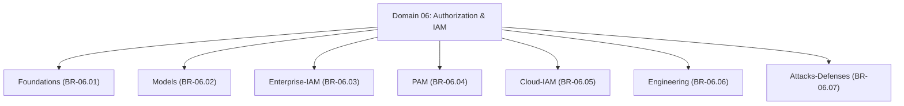

# Master Authorization & IAM Branch Index

## 1. Overview
This directory (`04 - Branch Knowledge/Authorization-IAM/`) houses the complete technical implementation of **Domain 06: Authorization & Identity and Access Management (IAM)**.

The domain is partitioned into **7 core engineering branches** covering authorization foundations, access control models, enterprise IAM, privileged access management (PAM), cloud IAM, policy-as-code engineering (OPA/Rego & Google Zanzibar), and authorization attacks & defenses.

---

## 2. Directory & Module Map

### Module Registry Table

| Branch ID | Module ID | Module Title | File Location | Key Engineering Concepts |
| :--- | :--- | :--- | :--- | :--- |
| `BR-06.01` | **`MOD-06.01.01`** | **Authorization Foundations PEP PDP PIP PAP Architecture** | `Foundations/01 - Authorization Foundations PEP PDP PIP PAP Architecture.md` | Policy Enforcement Point (PEP), Policy Decision Point (PDP), PIP, PAP, Subject-Object-Action triples. |
| `BR-06.02` | **`MOD-06.02.01`** | **Access Control Models DAC MAC RBAC ABAC & ReBAC** | `Models/01 - Access Control Models DAC MAC RBAC ABAC & ReBAC.md` | Discretionary (DAC), Mandatory (MAC / Bell-LaPadula), Role-Based (RBAC), Attribute-Based (ABAC), Relationship-Based (ReBAC). |
| `BR-06.03` | **`MOD-06.03.01`** | **Enterprise IAM Architecture Joiner-Mover-Leaver & Governance** | `Enterprise-IAM/01 - Enterprise IAM Architecture Joiner-Mover-Leaver & Governance.md` | Joiner-Mover-Leaver (JML) lifecycle, SCIM 2.0 provisioning, Access Certification, SoD (Separation of Duties). |
| `BR-06.04` | **`MOD-06.04.01`** | **Privileged Access Management PAM JIT & Credential Vaults** | `PAM/01 - Privileged Access Management PAM JIT & Credential Vaults.md` | PAM Architecture, Just-In-Time (JIT) elevation, Just-Enough-Administration (JEA), HashiCorp Vault, Break-Glass. |
| `BR-06.05` | **`MOD-06.05.01`** | **Cloud IAM Architecture AWS Azure & GCP Policy Evaluation** | `Cloud-IAM/01 - Cloud IAM Architecture AWS Azure & GCP Policy Evaluation.md` | AWS IAM Evaluation Logic (Explicit Deny > Explicit Allow), Azure RBAC, GCP IAM, Cross-Account AssumeRole. |
| `BR-06.06` | **`MOD-06.06.01`** | **Authorization Engineering Open Policy Agent OPA & Google Zanzibar** | `Engineering/01 - Authorization Engineering Open Policy Agent OPA & Google Zanzibar.md` | Policy-as-Code, Open Policy Agent (OPA), Rego query language, Google Zanzibar tuple store & ACL evaluation. |
| `BR-06.07` | **`MOD-06.07.01`** | **Authorization Attacks Privilege Escalation BOLA & Least Privilege** | `Attacks-Defenses/01 - Authorization Attacks Privilege Escalation BOLA & Least Privilege.md` | Vertical/Horizontal Privilege Escalation, Broken Object Level Authorization (BOLA), Forced Browsing, Refactoring. |
