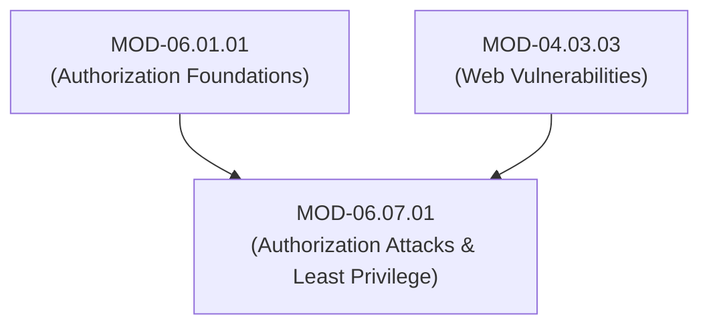
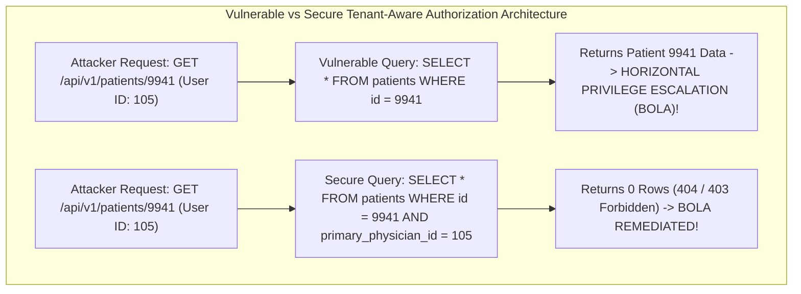

# Authorization Attacks (Vertical/Horizontal Privilege Escalation, BOLA/IDOR & Least-Privilege Refactoring)

## 1. Overview & Purpose
Flaws in authorization enforcement allow authenticated low-privileged users or external adversaries to access restricted data, execute administrative functions, or take over peer user accounts.

This module details Vertical Privilege Escalation, Horizontal Privilege Escalation, Broken Object Level Authorization (BOLA / IDOR), Forced Browsing, Mass Assignment permission tampering, and System-Wide Least-Privilege Refactoring.

---

## 2. Prerequisites & Prerequisites Graph
- **Prerequisites**: `MOD-06.01.01` (Authorization Architecture) & `MOD-04.03.03` (Web Vulnerabilities).



---

## 3. Learning Objectives & Taxonomy Alignment
- **L1 Awareness**: Contrast Vertical Privilege Escalation and Horizontal Privilege Escalation.
- **L2 Understanding**: Detail Broken Object Level Authorization (BOLA) handler mechanics, Forced Browsing vulnerabilities, and Mass Assignment permission overrides.
- **L3 Practical**: Detect BOLA flaws using Burp Suite / Python scripts and refactor vulnerable database queries to enforce tenancy checks.
- **L4 Engineering**: Design zero-BOLA application frameworks enforcing mandatory resource ownership validation at the ORM data access layer.

---

## 4. L1 — Awareness (Overview & Core Terminology)
- **Vertical Privilege Escalation**: A standard user elevates permissions to perform administrative functions (e.g. standard user accessing `/admin/delete_user`).
- **Horizontal Privilege Escalation (BOLA / IDOR)**: A user accesses data belonging to another user at the same privilege level (e.g. User A viewing `/api/invoices?id=8842` belonging to User B).

---

## 5. L2 — Understanding (Core Theory & Mechanics)



### BOLA Root Cause Mechanics:
BOLA occurs when developers rely strictly on authentication gateways (confirming user identity) but omit explicit resource ownership validation inside individual API handlers:
$$\text{Vulnerable Rule}: \text{If Authenticated} \rightarrow \text{Return Object}(id)$$
$$\text{Secure Rule}: \text{If Authenticated AND Object}(id).\text{owner} == \text{CurrentSession}.\text{user\_id} \rightarrow \text{Return Object}(id)$$

---

## 6. L3 — Practical (Commands & Configurations)

### Vulnerable vs Remediated API Endpoint Code in Python:

```python
# VULNERABLE Endpoint Code (Exposes BOLA / IDOR)
@app.route("/api/v1/invoices/<invoice_id>", methods=["GET"])
@login_required # Authentication check alone is NOT ENOUGH!
def get_invoice_vulnerable(invoice_id):
    # DANGEROUS: Fetches invoice directly by ID without checking user ownership!
    invoice = db.query("SELECT * FROM invoices WHERE id = ?", (invoice_id,)).fetchone()
    return jsonify(invoice)

# REMEDIATED Endpoint Code (Mandatory Tenant Ownership Filter)
@app.route("/api/v1/invoices/<invoice_id>", methods=["GET"])
@login_required
def get_invoice_secure(invoice_id):
    current_user_id = g.user.id
    
    # SECURE: Multi-tenant ownership condition bound directly to query!
    invoice = db.query(
        "SELECT * FROM invoices WHERE id = ? AND user_id = ?", 
        (invoice_id, current_user_id)
    ).fetchone()

    if not invoice:
        # Return 404 or 403 to prevent object enumeration
        return jsonify({"error": "Invoice not found or access denied"}), 404

    return jsonify(invoice)
```

---

## 7. L4 — Engineering (Design Trade-offs & System Integration)
- **Framework-Enforced Tenancy vs Manual Developer Handler Checks**: Relying on developers to remember to append `AND user_id = current_user.id` to every database query leads to missed endpoints during rapid feature development. Enterprise frameworks solve this by integrating **Global ORM Scoping Filters** that automatically inject tenant ownership conditions into 100% of generated SQL queries.

---

## 8. Internal Architecture & Data Structures
Multi-Tenant ORM Scoping Architecture (Python SQLAlchemy Middleware):
```python
@event.listens_for(Query, "before_compile", retval=True)
def ensure_tenant_isolation(query):
    # Automatically injects user_id filter into all SELECT queries!
    return query.filter_by(tenant_id=g.tenant_id)
```

---

## 9. Security Implications & Boundary Controls
- **Parameter Pollution / Mass Assignment**: Accepting un-sanitized JSON request bodies in profile updates allows attackers to submit `"role": "admin"`, elevating their privileges vertically.

---

## 10. Attack Vectors & Exploitation Primitives
1. **BOLA / IDOR Parameter Iteration**: Incrementing numerical IDs (`/api/users/1`, `/api/users/2`) to scrape sensitive records.
2. **Forced Browsing to Administrative Endpoints**: Direct navigation to un-linked endpoints (`/admin/dashboard.php`).

---

## 11. Defense & Telemetry Verification
- Enforce **Global ORM Multi-Tenant Scoping Filters** at the database abstraction layer.
- Deploy **UUIDv4 (Cryptographically Random 128-Bit Identifiers)** instead of sequential integers (`1, 2, 3`) for all resource IDs.

---

## 12. Detection & Telemetry Verification

### Telemetry Check for BOLA Enumeration Attacks (Web Application Logs):
```yaml
title: High Volume BOLA / IDOR Resource Enumeration
id: e9102941-8210-41ab-b01b-920191fa6705
logsource:
  category: webserver
  product: nginx
detection:
  selection:
    status: [403, 404]
    uri_path|contains: "/api/v1/invoices/"
  condition: selection | count() by src_ip > 50
level: high
```

---

## 13. Hands-On Lab Reference
- **Associated Lab**: `LAB-AUT007` (BOLA / IDOR Exploitation & ORM Multi-Tenant Remediation).

---

## 14. Related Projects & Applications
- **Associated Project**: `PRJ-SEC001` (Secure Healthcare Platform).

---

## 15. Troubleshooting & Diagnostics Matrix

| Symptom | Root Cause | Remediation / Diagnostic Command |
| :--- | :--- | :--- |
| Legitimate users receive `404 Not Found` when accessing their own records. | ORM tenant scoping filter failed to extract `user_id` from session context. | Verify global session middleware populates `g.user.id` prior to database execution. |

---

## 16. Related Concepts & Cross-Domain Links
- `CON-AUT013`: Broken Object Level Authorization BOLA (`DOM-06`)
- `CON-AUT014`: Global ORM Multi-Tenant Scoping (`DOM-06`)
- `CON-SEC016`: Secure API Architecture (`DOM-04`)

---

## 17. Technical Interview Preparation (Q&A)
**Q: Explain the technical distinction between Vertical Privilege Escalation and Horizontal Privilege Escalation (BOLA/IDOR), and how to architect a database layer to prevent BOLA completely.**  
*Answer*: **Vertical Privilege Escalation** occurs when a low-privileged user gains unauthorized access to functions reserved for higher-privileged roles (e.g. a regular user executing an administrative account deletion endpoint). **Horizontal Privilege Escalation** (or BOLA/IDOR) occurs when a user accesses data belonging to another user operating at the same privilege level (e.g. User 105 viewing User 106's medical records). To prevent BOLA completely at the architectural level, software engineering teams should avoid relying on manual checks inside individual API handler functions. Instead, teams should implement **Global ORM Multi-Tenant Scoping Filters** at the data access layer. These filters automatically inject the current session's `user_id` or `tenant_id` into 100% of generated database queries (`WHERE id = ? AND tenant_id = ?`), making it programmatically impossible to return data belonging to another tenant.

---

## 18. Self-Assessment & Mastery Checklist
- [ ] Understand Vertical vs Horizontal Privilege Escalation.
- [ ] Able to write SQLAlchemy global tenant scoping middleware in Python.

---

## 19. References & Further Reading
- OWASP API Security Top 10: *API1:2023 Broken Object Level Authorization (BOLA)*.
- OWASP Web Security Testing Guide: *Testing for Insecure Direct Object References (IDOR)*.
