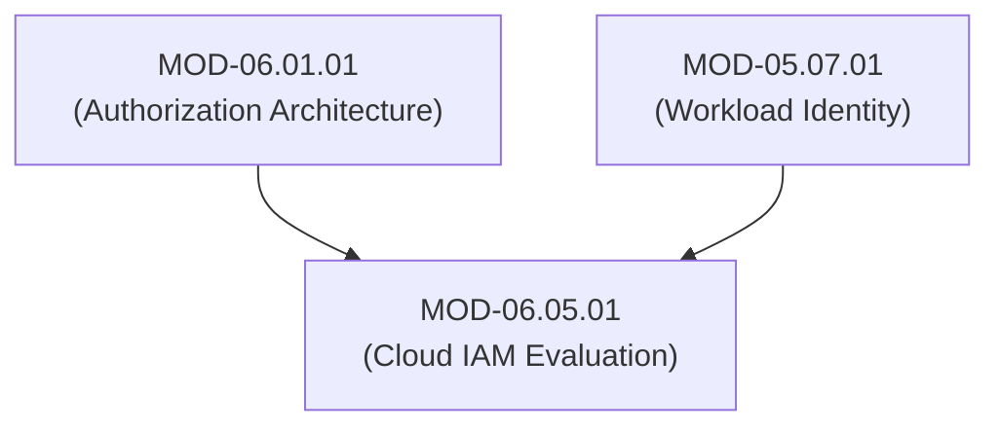
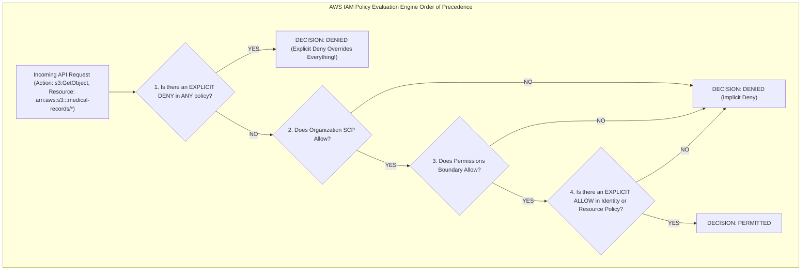

# Cloud IAM Policy Evaluation Engines (AWS IAM, Azure RBAC, GCP IAM & Cross-Account Trust)

## 1. Overview & Purpose
Cloud platforms enforce authorization through sophisticated, multi-layered policy evaluation engines processing JSON policy documents, resource policies, boundary limits, and organization service control policies.

This module details AWS IAM Policy Evaluation Logic (Explicit Deny > Explicit Allow > Implicit Deny), Azure RBAC & Management Group Inheritance, GCP IAM Role Bindings, Cloud Service Control Policies (SCPs), IAM Boundaries, and Cross-Account AssumeRole Trust.

---

## 2. Prerequisites & Prerequisites Graph
- **Prerequisites**: `MOD-06.01.01` (Authorization Architecture) & `MOD-05.07.01` (Workload Identity).



---

## 3. Learning Objectives & Taxonomy Alignment
- **L1 Awareness**: Explain the core Cloud IAM rule: *Explicit Deny overrides all Allows*.
- **L2 Understanding**: Detail the complete AWS IAM Policy Evaluation Algorithm (Identity Policies, Resource Policies, SCPs, Permissions Boundaries, Session Policies).
- **L3 Practical**: Construct least-privilege AWS IAM JSON policies and write Policy Simulator test harnesses in Python.
- **L4 Engineering**: Design multi-cloud enterprise organization hierarchy structures enforcing immutable security control boundaries.

---

## 4. L1 — Awareness (Overview & Core Terminology)
In Cloud IAM (AWS, Azure, GCP), by default, all access is **Implicitly Denied**. An **Explicit Allow** grants access, but any matching **Explicit Deny** anywhere in the evaluation chain immediately overrides all Allows, rejecting the request.

---

## 5. L2 — Understanding (Core Theory & Mechanics)



### AWS IAM Policy Evaluation Algorithm Steps:
1. Start with an **Implicit Deny**.
2. Evaluate all applicable policies (Organization SCPs, Resource Policies, Identity Policies, Permissions Boundaries, Session Policies).
3. If an **Explicit Deny** is found in *any* policy $\rightarrow$ **DENY**.
4. If an **Explicit Allow** is found across all required boundary layers $\rightarrow$ **ALLOW**.
5. Otherwise $\rightarrow$ **DENY (Implicit)**.

---

## 6. L3 — Practical (Commands & Configurations)

### Least-Privilege AWS IAM Policy for Secure Healthcare S3 Access (`s3_policy.json`):
```json
{
  "Version": "2012-10-17",
  "Statement": [
    {
      "Sid": "AllowOncologyDoctorS3Read",
      "Effect": "Allow",
      "Action": [
        "s3:GetObject",
        "s3:ListBucket"
      ],
      "Resource": [
        "arn:aws:s3:::securehealth-oncology-records",
        "arn:aws:s3:::securehealth-oncology-records/*"
      ],
      "Condition": {
        "StringEquals": {
          "aws:PrincipalTag/Department": "Oncology"
        },
        "Bool": {
          "aws:SecureTransport": "true"
        }
      }
    },
    {
      "Sid": "ExplicitDenyNonTLS",
      "Effect": "Deny",
      "Action": "s3:*",
      "Resource": "*",
      "Condition": {
        "Bool": {
          "aws:SecureTransport": "false"
        }
      }
    }
  ]
}
```

### Testing Policy Evaluation with AWS SimulateCustomPolicy in Python:
```python
import boto3

iam_client = boto3.client('iam')

def simulate_iam_evaluation():
    response = iam_client.simulate_custom_policy(
        PolicyInputList=[
            open("s3_policy.json").read()
        ],
        ActionNames=["s3:GetObject"],
        ResourceArns=["arn:aws:s3:::securehealth-oncology-records/patient105.pdf"],
        ContextEntries=[
            {
                'ContextKeyName': 'aws:SecureTransport',
                'ContextKeyValues': ['true'],
                'ContextKeyType': 'boolean'
            }
        ]
    )
    decision = response['EvaluationResults'][0]['EvalDecision']
    print(f"AWS Policy Simulation Result: {decision}") # Output: allowed

simulate_iam_evaluation()
```

---

## 7. L4 — Engineering (Design Trade-offs & System Integration)
- **Wildcard Admin Policies (`*:*`) vs Permissions Boundaries**: Developers frequently assign `AdministratorAccess` (`Action: "*", Resource: "*"`) to accelerate deployment. Cloud Security teams MUST attach immutable **Permissions Boundaries** to developer roles, capping maximum possible permissions regardless of what identity policies developers attach to themselves.

---

## 8. Internal Architecture & Data Structures
AWS Cross-Account AssumeRole Trust Policy Schema:
```json
{
  "Version": "2012-10-17",
  "Statement": [
    {
      "Effect": "Allow",
      "Principal": {
        "AWS": "arn:aws:iam::987654321098:root"
      },
      "Action": "sts:AssumeRole",
      "Condition": {
        "StringEquals": {
          "sts:ExternalId": "UniqueCryptographicExternalID_9941"
        }
      }
    }
  ]
}
```

---

## 9. Security Implications & Boundary Controls
- **Confused Deputy Attack in Cross-Account Access**: Assuming cross-account IAM roles without validating a unique `ExternalId` condition allows third-party SaaS vendors to confuse deputies and access arbitrary customer accounts.

---

## 10. Attack Vectors & Exploitation Primitives
1. **IAM Privilege Escalation via `iam:CreatePolicyVersion`**: Creating a new default policy version containing `Action: "*"` to elevate permissions to Cloud Admin.
2. **Confused Deputy Cross-Account Exploitation**: Omitting `sts:ExternalId` in cross-account trust relationships.

---

## 11. Defense & Telemetry Verification
- Enforce **Mandatory `sts:ExternalId` Conditions** on all cross-account trust roles.
- Deploy **Organization Service Control Policies (SCPs)** enforcing region lockouts and root account restrictions.

---

## 12. Detection & Telemetry Verification

### Telemetry Check for IAM Policy Escalation Attempts (CloudTrail):
```json
{
  "eventName": "CreatePolicyVersion",
  "requestParameters": {
    "setAsDefault": true,
    "policyDocument": "*\"Effect\":\"Allow\",\"Action\":\"*\"*"
  }
}
```

---

## 13. Hands-On Lab Reference
- **Associated Lab**: `LAB-AUT005` (AWS IAM Policy Simulator & Cross-Account Trust Security Audit).

---

## 14. Related Projects & Applications
- **Associated Project**: `PRJ-SEC001` (Secure Healthcare Platform).

---

## 15. Troubleshooting & Diagnostics Matrix

| Symptom | Root Cause | Remediation / Diagnostic Command |
| :--- | :--- | :--- |
| `AccessDenied` on S3 read despite valid IAM Identity Policy Allow. | Organization SCP or S3 Bucket Resource Policy contains an Explicit Deny. | Run `aws iam simulate-principal-policy` specifying all resource and organization policies. |

---

## 16. Related Concepts & Cross-Domain Links
- `CON-AUT009`: AWS IAM Policy Evaluation Order (`DOM-06`)
- `CON-AUT010`: Cross-Account AssumeRole Trust (`DOM-06`)
- `CON-CLOUD001`: AWS / Azure / GCP Cloud IAM (`DOM-08`)

---

## 17. Technical Interview Preparation (Q&A)
**Q: Detail the exact order of evaluation precedence when AWS IAM evaluates an API request involving Identity Policies, Resource Policies, SCPs, and Permissions Boundaries.**  
*Answer*: AWS IAM evaluates policies using a strict algorithmic decision tree:  
1. **Explicit Deny Check**: IAM evaluates *all* applicable policies (SCP, Resource Policy, Identity Policy, Permissions Boundary, Session Policy). If an **Explicit Deny** exists anywhere, the decision is immediately **DENIED**.  
2. **Organization SCP Check**: If in AWS Organizations, the action must be allowed by the Organization Service Control Policy (SCP).  
3. **Permissions Boundary Check**: If a Permissions Boundary is attached to the role/user, the action must be allowed by the boundary.  
4. **Explicit Allow Check**: If step 1–3 pass, the action must be granted by an **Explicit Allow** in either an Identity Policy or a Resource Policy (for cross-account access, *both* identity and resource policies must allow).  
5. **Implicit Deny**: If no Explicit Allow matches, the request defaults to **DENIED**.

---

## 18. Self-Assessment & Mastery Checklist
- [ ] Understand Explicit Deny > Explicit Allow > Implicit Deny logic.
- [ ] Able to write AWS IAM JSON policies with condition blocks.

---

## 19. References & Further Reading
- AWS Documentation: *IAM Policy Evaluation Logic*.
- Azure Documentation: *Azure RBAC Evaluation Order*.
- GCP Documentation: *Overview of GCP IAM Policy Evaluation*.
