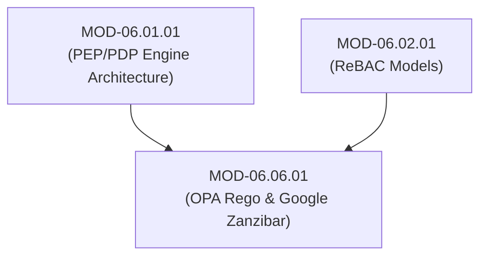

# Authorization Engineering (Open Policy Agent OPA / Rego & Google Zanzibar ReBAC)

## 1. Overview & Purpose
Modern distributed software systems require scalable, fine-grained authorization infrastructure that decouples complex policy evaluation rules from application business code.

This module details Policy-as-Code principles, Open Policy Agent (OPA), Rego Query Language, Google Zanzibar Relationship-Based Access Control (ReBAC) tuple stores, ACL evaluation graphs, and sub-millisecond policy caching.

---

## 2. Prerequisites & Prerequisites Graph
- **Prerequisites**: `MOD-06.01.01` (PEP/PDP Engine) & `MOD-06.02.01` (ReBAC Models).



---

## 3. Learning Objectives & Taxonomy Alignment
- **L1 Awareness**: Contrast Policy-as-Code (OPA / Rego) and Graph Relationship Authorization (Google Zanzibar).
- **L2 Understanding**: Detail OPA Rego declarative policy evaluation semantics and Google Zanzibar relation tuple structures `(object#relation@user)`.
- **L3 Practical**: Author production Rego authorization policies for HTTP APIs and query OpenFGA / Warrant Zanzibar engines.
- **L4 Engineering**: Design global, multi-region fine-grained authorization services supporting millions of relation tuples at sub-10ms evaluation latency.

---

## 4. L1 — Awareness (Overview & Core Terminology)
Hardcoding `if user.role == "admin"` inside application source code makes policy updates fragile and un-auditable. **Policy-as-Code (OPA)** expresses security rules in a declarative language (**Rego**). **Google Zanzibar** provides a global, graph-based relationship tuple store (`doc:105#viewer@user:alice`) powering Google Drive and YouTube authorization.

---

## 5. L2 — Understanding (Core Theory & Mechanics)

```mermaid
graph TD
    subgraph Open Policy Agent (OPA) Policy-as-Code Decision Engine
        INPUT_JSON["Input JSON Data: { 'user': 'alice', 'roles': ['physician'], 'path': '/patients/105' }"]
        REGO_POLICY["Rego Policy File (authz.rego)"]
        DATA_JSON["Context Data: { 'on_call_physicians': ['alice'] }"]

        INPUT_JSON --> OPA["OPA Engine (Evaluates Rego AST)"]
        REGO_POLICY --> OPA
        DATA_JSON --> OPA

        OPA --> OUTPUT["Output Decision: { 'allow': true }"]
    end

    subgraph Google Zanzibar ReBAC Relation Tuple Graph
        TUPLE1["object: doc:105#owner@user:alice"]
        TUPLE2["object: doc:105#viewer@group:oncology#member"]
        TUPLE3["object: group:oncology#member@user:bob"]

        ZANZIBAR["Zanzibar ACL Graph Evaluator"]
        ZANZIBAR <-->|Traverses Graph: Is bob a viewer of doc:105? -> YES!| TUPLE3
    end
```

### Google Zanzibar Relation Tuple Notation:
$$\langle \text{object} \rangle \# \langle \text{relation} \rangle @ \langle \text{user} \rangle$$
Examples:
- `doc:readme.md#viewer@user:alice` (Alice is a viewer of document `readme.md`).
- `folder:medical#parent@doc:readme.md` (Folder `medical` is parent of `readme.md`).
- `group:physicians#member@user:bob` (Bob is a member of group `physicians`).

---

## 6. L3 — Practical (Commands & Configurations)

### Authoring Production API Authorization Rules in OPA Rego (`authz.rego`):
```rego
package app.authz

import future.keywords.in

# Default decision is DENY
default allow = false

# Rule 1: Allow Administrators full access
allow {
    "admin" in input.user.roles
}

# Rule 2: Allow Physicians to READ patient records in their department
allow {
    input.method == "GET"
    "physician" in input.user.roles
    input.user.department == input.resource.department
    input.environment.is_emergency == false
}

# Rule 3: Allow Emergency Overrides for On-Call Doctors
allow {
    "physician" in input.user.roles
    input.environment.is_emergency == true
    input.user.id in data.on_call_physicians
}
```

### Testing OPA Rego Rules via OPA CLI:
```bash
# Evaluate Rego policy with input JSON payload
opa eval --data authz.rego --input input.json "data.app.authz.allow"
```

---

## 7. L4 — Engineering (Design Trade-offs & System Integration)
- **Rego (OPA) vs Zanzibar (ReBAC) Architectural Selection**: OPA excels at attribute-based rule evaluation on structured JSON payloads (API Gateways, Kubernetes Admission Controllers). Zanzibar (OpenFGA) excels at fine-grained, deep relationship graph traversal (social networks, document sharing, multi-tenant SaaS). Enterprise platforms frequently combine OPA for edge request filtering and Zanzibar for resource-level relation checks.

---

## 8. Internal Architecture & Data Structures
OpenFGA (Google Zanzibar Implementation) Tuple Definition JSON:
```json
{
  "user": "user:bob",
  "relation": "viewer",
  "object": "document:patient_record_105"
}
```

---

## 9. Security Implications & Boundary Controls
- **Rego Rule Order Ambiguity**: Unlike traditional imperative code, Rego rules evaluate concurrently as logical OR conditions. If a single `allow` rule evaluates to `true`, the overall decision becomes `true`. Developers MUST carefully structure negation rules.

---

## 10. Attack Vectors & Exploitation Primitives
1. **Rego Policy Logic Errors**: Omitting path checks on wildcard rules, enabling unauthenticated access to administrative OPA evaluation endpoints.
2. **Zanzibar Graph Loop Exhaustion**: Creating circular relationship tuples (`group:A#member@group:B`, `group:B#member@group:A`) to trigger CPU exhaustion during graph traversal.

---

## 11. Defense & Telemetry Verification
- Enforce **Automated Unit Testing for 100% of Rego Rules** using `opa test`.
- Set **Graph Traversal Depth Limits (Max Depth = 10)** in Zanzibar / OpenFGA servers.

---

## 12. Detection & Telemetry Verification

### OPA Unit Test Case Verification (`authz_test.rego`):
```rego
package app.authz_test

import data.app.authz.allow

test_physician_same_dept_allowed {
    allow with input as {
        "method": "GET",
        "user": {"roles": ["physician"], "department": "oncology"},
        "resource": {"department": "oncology"},
        "environment": {"is_emergency": false}
    }
}
```

---

## 13. Hands-On Lab Reference
- **Associated Lab**: `LAB-AUT006` (OPA Rego Policy Authoring & OpenFGA Zanzibar ReBAC Setup).

---

## 14. Related Projects & Applications
- **Associated Project**: `PRJ-SEC001` (Secure Healthcare Platform).

---

## 15. Troubleshooting & Diagnostics Matrix

| Symptom | Root Cause | Remediation / Diagnostic Command |
| :--- | :--- | :--- |
| OPA returns `false` despite input payload matching rule. | Type mismatch in input JSON (e.g. integer vs string comparison). | Debug input AST using `opa eval --explain=full`. |

---

## 16. Related Concepts & Cross-Domain Links
- `CON-AUT011`: Open Policy Agent OPA & Rego (`DOM-06`)
- `CON-AUT012`: Google Zanzibar ReBAC Architecture (`DOM-06`)
- `CON-SEC016`: Decoupled API Authorization (`DOM-04`)

---

## 17. Technical Interview Preparation (Q&A)
**Q: What is Google Zanzibar, how does it model access control using relation tuples, and why is it preferred over traditional RBAC for application authorization?**  
*Answer*: Google Zanzibar is a globally distributed, high-performance Relationship-Based Access Control (ReBAC) system powering authorization across Google Drive, Cloud, and YouTube. Instead of storing static roles assigned to users (RBAC), Zanzibar models authorization as a directed graph of **Relation Tuples** in the format `object#relation@user` (e.g. `doc:105#viewer@group:oncology#member`). When checking access, Zanzibar executes efficient graph traversal to determine if a path exists between the user and object. It is preferred over traditional RBAC because it natively supports complex, nested permissions (e.g., "users who can edit folder X can view all documents inside folder X") at massive scale with sub-10ms global latency.

---

## 18. Self-Assessment & Mastery Checklist
- [ ] Understand OPA Rego declarative evaluation logic.
- [ ] Able to write Google Zanzibar relation tuples (`object#relation@user`).

---

## 19. References & Further Reading
- Open Policy Agent Documentation: *Rego Language Reference*.
- Pang, C. et al. (USENIX ATC 2019): *Zanzibar: Google’s Consistent, Global Authorization System*.
- OpenFGA Standard: *Relationship-Based Access Control Specification*.
