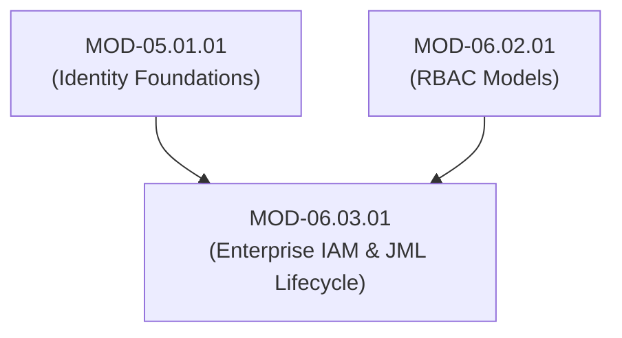

# Enterprise IAM Architecture, Joiner-Mover-Leaver (JML) Lifecycle & Access Governance

## 1. Overview & Purpose
Enterprise Identity & Access Management (IAM) governs identity lifecycle workflows, directory synchronization, and permission compliance across large-scale heterogeneous organizations.

This module details Enterprise IAM Architecture, Joiner-Mover-Leaver (JML) automated workflows, Identity Governance & Administration (IGA), Access Certification Recertifications, Separation of Duties (SoD), and Directory Synchronization (LDAP / Active Directory / Cloud Identity).

---

## 2. Prerequisites & Prerequisites Graph
- **Prerequisites**: `MOD-05.01.01` (Identity Foundations) & `MOD-06.02.01` (RBAC Models).



---

## 3. Learning Objectives & Taxonomy Alignment
- **L1 Awareness**: Contrast Identity Governance & Administration (IGA) and Identity Access Management (IAM).
- **L2 Understanding**: Detail the Joiner-Mover-Leaver (JML) automated state machine, Separation of Duties (SoD) toxic combination detection, and Access Certification campaign cycles.
- **L3 Practical**: Build an automated JML mover workflow script in Python and construct SoD matrix conflict checkers.
- **L4 Engineering**: Design zero-drift enterprise IGA architectures with automated role mining and instant deprovisioning triggers.

---

## 4. L1 — Awareness (Overview & Core Terminology)
**IAM** handles day-to-day login and authorization. **IGA (Identity Governance and Administration)** provides audit oversight, answering: "Who has access to what, who approved it, and is that access still appropriate?"

---

## 5. L2 — Understanding (Core Theory & Mechanics)

```mermaid
graph TD
    subgraph Joiner-Mover-Leaver (JML) Enterprise State Machine
        HR["HR System (Workday / SuccessFactors - Source of Truth)"]

        HR -->|1. Event: New Employee Hired| JOINER["JOINER Workflow: Provisions Base Identity, Assigns Dept RBAC Roles"]
        HR -->|2. Event: Employee Transfers Department| MOVER["MOVER Workflow: Revokes Old Dept Roles, Provisions New Roles (Prevents Privilege Accumulation!)"]
        HR -->|3. Event: Employee Terminated| LEAVER["LEAVER Workflow: Instantly Revokes Active Session Tokens, Disables Accounts in AD/Okta"]

        JOINER --> DIR["Enterprise Directory (Active Directory / Okta)"]
        MOVER --> DIR
        LEAVER --> DIR
    end
```

### Toxic Combination / Separation of Duties (SoD):
SoD enforces policy rules preventing a single user from possessing conflicting permissions that enable fraud (e.g., holding both `CREATE_VENDOR` and `APPROVE_VENDOR_PAYMENT` permissions).

---

## 6. L3 — Practical (Commands & Configurations)

### Separation of Duties (SoD) Conflict Detection Engine in Python:
```python
# Toxic Combination Matrix Definition
SOD_CONFLICT_RULES = [
    {
        "name": "Accounts Payable Fraud Risk",
        "conflicting_roles": {"Vendor_Manager", "Payment_Approver"}
    },
    {
        "name": "Production Code Bypass Risk",
        "conflicting_roles": {"Code_Developer", "Production_Deployer"}
    }
]

def check_sod_violations(user_id: str, assigned_roles: set) -> list:
    violations = []
    for rule in SOD_CONFLICT_RULES:
        conflicting = rule["conflicting_roles"]
        if conflicting.issubset(assigned_roles):
            violations.append({
                "user_id": user_id,
                "rule_violated": rule["name"],
                "conflicting_roles": list(conflicting)
            })
    return violations

# Audit Test
user_roles = {"Code_Developer", "Production_Deployer", "QA_Tester"}
conflicts = check_sod_violations("user_105", user_roles)
print(f"SoD Violations Detected: {conflicts}")
```

---

## 7. L4 — Engineering (Design Trade-offs & System Integration)
- **Manual Manager Access Reviews vs Continuous Automated Governance**: Traditional manual access review campaigns conducted once a year result in managers rubber-stamping 500 employee access requests without inspection. Automated IGA platforms replace periodic reviews with **Continuous Access Certification**, triggering recertification requests only when an employee's context shifts (e.g. manager change or department transfer).

---

## 8. Internal Architecture & Data Structures
SoD Policy Conflict Definition Schema:
```json
{
  "policy_id": "SOD_RULE_0941",
  "name": "Financial Disbursement Controls",
  "severity": "CRITICAL",
  "incompatible_permissions": [
    "finance:vendor:create",
    "finance:invoice:approve"
  ]
}
```

---

## 9. Security Implications & Boundary Controls
- **Privilege Creep via Unhandled Mover Events**: When an employee moves from Accounting to Marketing, keeping their old Accounting roles active creates toxic combination risks and excessive permission accumulation.

---

## 10. Attack Vectors & Exploitation Primitives
1. **Privilege Accumulation Exploitation**: Using legacy permissions retained from past job roles to access unauthorized sensitive financial databases.
2. **Leaver Account Delay Exploitation**: Accessing cloud systems using active credentials of a terminated employee before HR deprovisioning completes.

---

## 11. Defense & Telemetry Verification
- Enforce **Automated MOVER Workflows** that clear old job roles upon department transfer.
- Implement **Automated SoD Validation Gates** blocking role assignments that violate toxic matrices.

---

## 12. Detection & Telemetry Verification

### Telemetry Query (SoD Policy Enforcement Violation in IGA Platform):
```text
event_type: "iga.role_assignment.sod_violation_blocked"
```

---

## 13. Hands-On Lab Reference
- **Associated Lab**: `LAB-AUT003` (Automated JML State Engine Implementation & SoD Matrix Auditing).

---

## 14. Related Projects & Applications
- **Associated Project**: `PRJ-SEC001` (Secure Healthcare Platform).

---

## 15. Troubleshooting & Diagnostics Matrix

| Symptom | Root Cause | Remediation / Diagnostic Command |
| :--- | :--- | :--- |
| Employee loses access to critical systems after internal transfer. | Mover workflow over-aggressively purged required shared enterprise roles. | Refactor Mover policy to preserve core baseline enterprise roles (`Base_Employee`). |

---

## 16. Related Concepts & Cross-Domain Links
- `CON-AUT005`: Joiner-Mover-Leaver JML Lifecycle (`DOM-06`)
- `CON-AUT006`: Separation of Duties SoD Matrix (`DOM-06`)
- `CON-IDE002`: SCIM User Provisioning (`DOM-05`)

---

## 17. Technical Interview Preparation (Q&A)
**Q: What is "Privilege Creep", why does it occur in enterprise environments, and how does the Joiner-Mover-Leaver (JML) lifecycle prevent it?**  
*Answer*: Privilege Creep occurs when an employee moves through various job roles within an organization over time and receives new permissions for each role without having their former permissions revoked. Over time, the employee accumulates excessive, unnecessary privileges. The **Joiner-Mover-Leaver (JML)** automated workflow prevents privilege creep by strictly defining the **Mover** state transition: when HR updates an employee's department or job code, the IGA platform automatically triggers a diff operation—provisioning new role-based access while explicitly revoking all role permissions associated exclusively with the employee's previous position.

---

## 18. Self-Assessment & Mastery Checklist
- [ ] Understand JML lifecycle state machine transitions.
- [ ] Able to write a Separation of Duties (SoD) toxic matrix validator in Python.

---

## 19. References & Further Reading
- NIST SP 800-53 Rev. 5: *Security and Privacy Controls for Information Systems (AC-2 Account Management & AC-5 Separation of Duties)*.
- SailPoint Knowledge Base: *Identity Governance & Administration Architecture Guidelines*.
