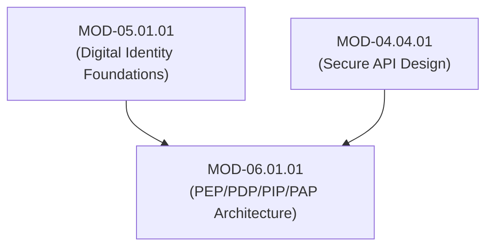

# Authorization Architecture, Access Decision Engine (PEP, PDP, PIP, PAP) & Subject-Object-Action Triples

## 1. Overview & Purpose
Authorization is the security process that determines whether an authenticated identity is permitted to perform a specific action on a protected resource under defined environmental conditions.

This module details the XACML / ISO-IEC 27054 Access Control Architecture, Policy Enforcement Point (PEP), Policy Decision Point (PDP), Policy Information Point (PIP), Policy Administration Point (PAP), and the Subject-Object-Action-Environment authorization tuple.

---

## 2. Prerequisites & Prerequisites Graph
- **Prerequisites**: `MOD-05.01.01` (Digital Identity Foundations) & `MOD-04.04.01` (Secure API Design).



---

## 3. Learning Objectives & Taxonomy Alignment
- **L1 Awareness**: Define the roles of PEP, PDP, PIP, and PAP in authorization engines.
- **L2 Understanding**: Detail the formal evaluation sequence of an access request tuple `(Subject s, Action a, Object o, Environment Context e)`.
- **L3 Practical**: Implement a decoupled Python PEP/PDP microservice middleware using JSON payloads.
- **L4 Engineering**: Design zero-trust microservice PEP sidecar architectures decoupling policy decisions from application business logic.

---

## 4. L1 — Awareness (Overview & Core Terminology)
Authentication verifies *who you are*; authorization determines *what you can do*.
- **PEP (Policy Enforcement Point)**: Intercepts user access requests and enforces decisions.
- **PDP (Policy Decision Point)**: Evaluates access requests against active security policies.
- **PIP (Policy Information Point)**: Supplies contextual attributes (e.g. user department, time of day).
- **PAP (Policy Administration Point)**: Manages and stores policy definitions.

---

## 5. L2 — Understanding (Core Theory & Mechanics)

```mermaid
graph TD
    subgraph Decoupled Access Decision Engine (XACML Architecture)
        USER["Authenticated User / Client"]
        PEP["Policy Enforcement Point (API Gateway / Envoy Proxy)"]
        PDP["Policy Decision Point (OPA Engine / Authorization Server)"]
        PIP["Policy Information Point (LDAP / Database / Risk API)"]
        PAP["Policy Administration Point (Policy Registry / Git Repo)"]

        PAP -->|1. Deploys Signed Policies| PDP

        USER -->|2. HTTP Request: GET /api/v1/patients/9941| PEP
        PEP -->|3. Access Request: (Subject: dr_alice, Action: READ, Object: patient_9941)| PDP

        PDP <-->|4. Queries Contextual Attributes (Is On-Call? Shift Time?)| PIP
        PDP -->|5. Evaluates Policy -> Returns PERMIT / DENY| PEP

        PEP -->|6a. PERMIT: Forwards Request to Backend Service| BACKEND["Healthcare Microservice"]
        PEP -->|6b. DENY: Returns 403 Forbidden to User| USER
    end
```

### Access Decision Request Tuple:
$$\text{Request} = \langle S, A, O, E \rangle$$
Where:
- $S = \{\text{Subject ID}, \text{Roles}, \text{Clearance Level}\}$
- $A = \{\text{READ}, \text{WRITE}, \text{DELETE}, \text{EXECUTE}\}$
- $O = \{\text{Resource URI}, \text{Resource Owner}, \text{Sensitivity Classification}\}$
- $E = \{\text{IP Address}, \text{Device Health Status}, \text{Timestamp}, \text{Geo-Location}\}$

---

## 6. L3 — Practical (Commands & Configurations)

### Decoupled Python PEP / PDP Middleware Implementation:
```python
import requests
from flask import Flask, request, jsonify

app = Flask(__name__)

PDP_URL = "http://pdp-service.internal/v1/evaluate"

# Policy Enforcement Point (PEP) Decorator
def enforce_authorization(resource_type: str, action: str):
    def decorator(f):
        def wrapper(*args, **kwargs):
            # Extract Subject, Object, Action, and Environment Context
            user_id = request.headers.get("X-User-ID")
            user_roles = request.headers.get("X-User-Roles", "").split(",")
            resource_id = kwargs.get("patient_id")
            
            pdp_payload = {
                "subject": {"id": user_id, "roles": user_roles},
                "action": action,
                "object": {"type": resource_type, "id": resource_id},
                "environment": {"ip": request.remote_addr}
            }

            # Query Policy Decision Point (PDP)
            pdp_response = requests.post(PDP_URL, json=pdp_payload)
            decision = pdp_response.json().get("decision")

            if decision != "PERMIT":
                return jsonify({"error": "403 Forbidden - Policy Denial"}), 403

            return f(*args, **kwargs)
        wrapper.__name__ = f.__name__
        return wrapper
    return decorator

@app.route("/patients/<patient_id>", methods=["GET"])
@enforce_authorization(resource_type="patient_record", action="READ")
def get_patient(patient_id):
    return jsonify({"patient_id": patient_id, "status": "Stable", "data": "Confidential Record"})
```

---

## 7. L4 — Engineering (Design Trade-offs & System Integration)
- **Centralized PDP vs Distributed PEP Sidecars**: A single centralized PDP creates a network latency bottleneck and single point of failure. Modern zero-trust architectures run a lightweight PDP instance (like Open Policy Agent) as a local sidecar proxy inside every application pod, syncing policy definitions asynchronously from the PAP.

---

## 8. Internal Architecture & Data Structures
JSON Request Payload Sent from PEP to PDP:
```json
{
  "subject": { "id": "dr_alice", "roles": ["physician"], "dept": "oncology" },
  "action": "READ",
  "object": { "type": "medical_record", "id": "rec_8841029", "owner_dept": "oncology" },
  "environment": { "client_ip": "10.0.4.15", "time_of_day": "14:30" }
}
```

---

## 9. Security Implications & Boundary Controls
- **Failing Open Anti-Pattern**: If a PEP fails to reach the PDP due to a network timeout, it MUST default to **FAIL-CLOSED (DENY ACCESS)**. Failing open introduces critical authorization bypass vulnerabilities.

---

## 10. Attack Vectors & Exploitation Primitives
1. **PEP Bypass via Direct Microservice Access**: Contacting backend application pods directly, bypassing edge API Gateway PEP proxies.
2. **PIP Attribute Tampering**: Forging HTTP headers (`X-User-Roles: admin`) to manipulate PIP data consumed by the PDP.

---

## 11. Defense & Telemetry Verification
- Enforce **Strict Fail-Closed Behavior** across all PEP proxies.
- Require **Mutual TLS (mTLS)** between PEP proxies and backend services so direct non-PEP connections are rejected.

---

## 12. Detection & Telemetry Verification

### Telemetry Log Entry for Policy Enforcement Denial:
```json
{
  "event": "authorization_decision",
  "decision": "DENY",
  "subject": "dr_alice",
  "action": "DELETE",
  "object": "patient_record_9941",
  "reason": "Policy Rule 'no_delete_patient_records' Violated"
}
```

---

## 13. Hands-On Lab Reference
- **Associated Lab**: `LAB-AUT001` (Decoupled PEP/PDP Microservice Implementation & Fail-Closed Audit).

---

## 14. Related Projects & Applications
- **Associated Project**: `PRJ-SEC001` (Secure Healthcare Platform).

---

## 15. Troubleshooting & Diagnostics Matrix

| Symptom | Root Cause | Remediation / Diagnostic Command |
| :--- | :--- | :--- |
| API returns `403 Forbidden` for legitimate admin users. | PIP database lookup timed out, causing PDP to evaluate missing role attributes. | Inspect PIP database latency and increase query timeout thresholds. |

---

## 16. Related Concepts & Cross-Domain Links
- `CON-AUT001`: PEP / PDP / PIP / PAP Architecture (`DOM-06`)
- `CON-AUT002`: Decoupled Authorization Engine (`DOM-06`)
- `CON-SEC016`: Broken Object Level Authorization (`DOM-04`)

---

## 17. Technical Interview Preparation (Q&A)
**Q: Explain the structural responsibilities of PEP, PDP, PIP, and PAP in modern enterprise authorization systems.**  
*Answer*: The **PEP (Policy Enforcement Point)** intercepts incoming requests, extracts request context, sends an access query to the PDP, and enforces the ultimate decision (permitting or blocking the request). The **PDP (Policy Decision Point)** evaluates the request against active access control policies. If necessary, the PDP queries the **PIP (Policy Information Point)** to retrieve external contextual attributes (such as user roles, time of day, or risk score). The **PAP (Policy Administration Point)** serves as the central management repository where security policies are authored, version-controlled, signed, and distributed to PDPs.

---

## 18. Self-Assessment & Mastery Checklist
- [ ] Understand PEP, PDP, PIP, and PAP architectural boundaries.
- [ ] Able to write a Python PEP decorator evaluating JSON access requests against a PDP.

---

## 19. References & Further Reading
- OASIS Standard: *eXtensible Access Control Markup Language (XACML) Version 3.0*.
- NIST SP 800-162: *Guide to Attribute-Based Access Control (ABAC) Definition and Consideration*.
