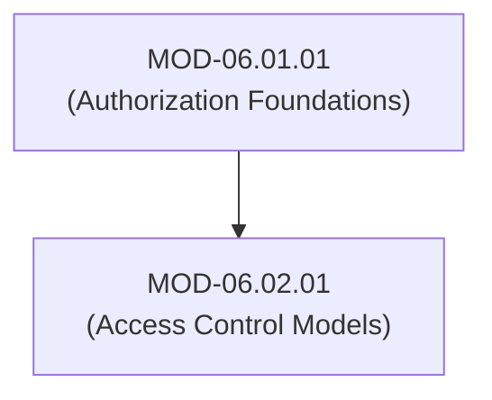

# Access Control Models (DAC, MAC, RBAC, ABAC, ReBAC & Capability Security)

## 1. Overview & Purpose
Access control models provide the mathematical and logical frameworks governing how permissions are assigned, evaluated, and enforced across computer systems.

This module details Discretionary Access Control (DAC), Mandatory Access Control (MAC / Bell-LaPadula & Biba models), Role-Based Access Control (RBAC), Attribute-Based Access Control (ABAC), Relationship-Based Access Control (ReBAC), and Capability-Based Security.

---

## 2. Prerequisites & Prerequisites Graph
- **Prerequisites**: `MOD-06.01.01` (Authorization Architecture).



---

## 3. Learning Objectives & Taxonomy Alignment
- **L1 Awareness**: Contrast DAC, MAC, RBAC, ABAC, and ReBAC models.
- **L2 Understanding**: Detail Bell-LaPadula confidentiality rules ("No Read Up, No Write Down"), Biba integrity rules, ABAC boolean policy evaluations, and ReBAC graph relationship traversal.
- **L3 Practical**: Implement an ABAC decision evaluator in Python and model an RBAC hierarchy in SQL.
- **L4 Engineering**: Architect enterprise hybrid RBAC-ABAC permission models balancing manageability with fine-grained context control.

---

## 4. L1 — Awareness (Overview & Core Terminology)
- **DAC (Discretionary)**: Resource owners determine who has access (POSIX file permissions `chmod`).
- **MAC (Mandatory)**: Central system security policy enforces access based on classification levels (SELinux / Military labels).
- **RBAC (Role-Based)**: Permissions are assigned to job roles; users inherit permissions by joining roles.
- **ABAC (Attribute-Based)**: Access decisions evaluate attributes of Subject, Object, Action, and Environment.
- **ReBAC (Relationship-Based)**: Access is determined by graph relationships between subjects and objects (e.g. Google Drive "shared-with-user").

---

## 5. L2 — Understanding (Core Theory & Mechanics)

```mermaid
graph TD
    subgraph Mathematical Comparison of Access Control Models
        subgraph MAC: Bell-LaPadula Model (Confidentiality)
            TOP_SECRET["Top Secret Clearance"]
            SECRET["Secret Document"]
            CONFIDENTIAL["Confidential Document"]

            TOP_SECRET -->|Simple Security Property: CAN READ| SECRET
            TOP_SECRET -->|Star Property (*): CANNOT WRITE DOWN| SECRET
        end

        subgraph RBAC: Role-Based Hierarchy
            USER["User: Dr. Alice"] --> ROLE["Role: Physician"] --> PERM["Permission: READ_PATIENT_RECORDS"]
        end

        subgraph ABAC: Attribute Boolean Logic
            ABAC_REQ["Subject.Dept == Object.Dept AND Subject.Clearance >= Object.Classification AND Env.Time >= 08:00"]
        end
    end
```

### Access Control Model Formal Comparison:

| Feature | DAC | MAC | RBAC | ABAC | ReBAC |
| :--- | :--- | :--- | :--- | :--- | :--- |
| **Authority** | Resource Owner | Central Security Admin | Organization Roles | Policy Rules Engine | Graph Relations |
| **Flexibility** | High | Low | Medium | Very High | Extremely High |
| **Context Awareness** | None | Classification Labels | Static Roles | Real-Time Dynamic | Object Graph Topology |
| **Explosion Risk** | Access Matrix Bloat | Rigid Policy Management | Role Explosion | Rule Complexity | Graph Traversal Depth |

---

## 6. L3 — Practical (Commands & Configurations)

### ABAC Policy Evaluator Engine in Python:
```python
class ABACEvaluator:
    @staticmethod
    def evaluate(subject: dict, action: str, resource: dict, environment: dict) -> bool:
        # Rule 1: Emergency Override (Physicians in ER during Active Emergencies)
        if subject.get("role") == "physician" and environment.get("is_emergency") is True:
            return True

        # Rule 2: Department Matching + Active Shift Window Check
        if (
            subject.get("department") == resource.get("department") and
            action in resource.get("allowed_actions", []) and
            8 <= environment.get("current_hour", 0) <= 20
        ):
            return True

        # Default Deny
        return False

# Usage Example
subject = {"id": "dr_alice", "role": "physician", "department": "oncology"}
resource = {"id": "patient_105", "department": "oncology", "allowed_actions": ["READ", "WRITE"]}
env = {"current_hour": 14, "is_emergency": False}

permitted = ABACEvaluator.evaluate(subject, "READ", resource, env)
print(f"ABAC Access Permit Status: {permitted}") # Output: True
```

---

## 7. L4 — Engineering (Design Trade-offs & System Integration)
- **Role Explosion in RBAC vs Rule Complexity in ABAC**: Pure RBAC suffers from "role explosion" in large enterprises, creating thousands of micro-roles (`billing-clerk-us-east`, `billing-clerk-us-west`). Modern enterprise architecture adopts **Hybrid RBAC-ABAC**: assigning coarse-grained job roles via RBAC while evaluating fine-grained contextual constraints (location, time, device health) via ABAC policies at runtime.

---

## 8. Internal Architecture & Data Structures
RBAC Database Schema Representation (SQL ERD):
```text
[Users] (1)----(N) [User_Roles] (N)----(1) [Roles] (1)----(N) [Role_Permissions] (N)----(1) [Permissions]
```

---

## 9. Security Implications & Boundary Controls
- **Trojan Horse Vulnerability in DAC**: In DAC systems, a malicious program executed by a user inherits all of that user's DAC file permissions, allowing malware to read or wipe all user files without restriction.

---

## 10. Attack Vectors & Exploitation Primitives
1. **Privilege Creep**: Accumulated RBAC roles assigned to employees over years of department transfers without de-provisioning.
2. **Confused Deputy Attack**: Tricking a privileged capability holder into acting on behalf of an unauthorized caller.

---

## 11. Defense & Telemetry Verification
- Conduct **Quarterly RBAC Access Certification Audits** to purge unused roles.
- Enforce **MAC (SELinux / AppArmor)** on linux servers to contain application compromises.

---

## 12. Detection & Telemetry Verification

### Telemetry Check for SELinux MAC Denials (Auditd Log):
```text
type=AVC msg=audit(1722288000.105:991): avc: denied { read } for pid=1405 comm="nginx" name="shadow" dev="sda1" ino=9941 scontext=system_u:system_r:httpd_t:s0 tcontext=system_u:object_r:shadow_t:s0 tclass=file permissive=0
```

---

## 13. Hands-On Lab Reference
- **Associated Lab**: `LAB-AUT002` (ABAC Policy Engine Implementation & SELinux MAC Hardening).

---

## 14. Related Projects & Applications
- **Associated Project**: `PRJ-SEC001` (Secure Healthcare Platform).

---

## 15. Troubleshooting & Diagnostics Matrix

| Symptom | Root Cause | Remediation / Diagnostic Command |
| :--- | :--- | :--- |
| Process fails with `Permission Denied` despite running as `root`. | Mandatory Access Control (SELinux) blocking action. | Run `ausearch -m avc -ts recent` to inspect SELinux AVC denials. |

---

## 16. Related Concepts & Cross-Domain Links
- `CON-AUT003`: Role-Based Access Control RBAC (`DOM-06`)
- `CON-AUT004`: Attribute-Based Access Control ABAC (`DOM-06`)
- `CON-SYS012`: SELinux LSM Mandatory Access Control (`DOM-01`)

---

## 17. Technical Interview Preparation (Q&A)
**Q: Compare Bell-LaPadula (MAC) and Biba (MAC) models in terms of security objectives and mathematical rules.**  
*Answer*: The **Bell-LaPadula Model** focuses strictly on *Confidentiality* (preventing unauthorized read access to classified information). It enforces two core rules: 1) *Simple Security Property*: "No Read Up" (a subject at Secret clearance cannot read Top Secret data), and 2) *Star Property ($\star$-Property)*: "No Write Down" (a subject at Secret clearance cannot write data down to Confidential level). The **Biba Model** focuses strictly on *Integrity* (preventing unauthorized modification of data). Biba reverses the Bell-LaPadula rules: 1) *Simple Integrity Property*: "No Read Down" (cannot read data from lower integrity levels to prevent corrupting memory), and 2) *Integrity $\star$-Property*: "No Write Up" (cannot write to higher integrity levels).

---

## 18. Self-Assessment & Mastery Checklist
- [ ] Understand formal differences between DAC, MAC, RBAC, ABAC, and ReBAC.
- [ ] Able to write an ABAC policy evaluator in Python.

---

## 19. References & Further Reading
- NIST SP 800-162: *Guide to Attribute-Based Access Control (ABAC)*.
- Bell, D. E., & LaPadula, L. J. (1976): *Secure Computer System: Unified Exposition and Multics Interpretation*.
