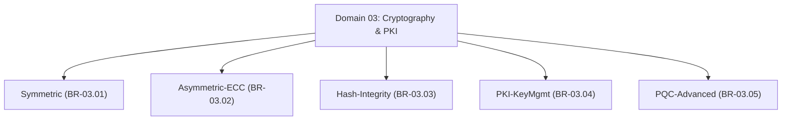

# Master Cryptography & PKI Branch Index

## 1. Overview
This directory (`04 - Branch Knowledge/Cryptography/`) houses the complete implementation of **Domain 03: Cryptography & PKI**.

The domain is organized into **5 core engineering branches** covering symmetric block ciphers, asymmetric elliptic curves, cryptographic hash functions, public key infrastructure (PKI/HSM), and NIST post-quantum cryptographic standards (ML-KEM/ML-DSA).

---

## 2. Directory & Module Map

### Module Registry Table

| Branch ID | Module ID | Module Title | File Location | Key Engineering Concepts |
| :--- | :--- | :--- | :--- | :--- |
| `BR-03.01` | **`MOD-03.01.01`** | **Block Cipher Architecture (AES-GCM/CBC)** | `Symmetric/01 - AES-GCM & Block Cipher Architecture.md` | SPN Networks, AES-128/256, Padding Oracles, AEAD GCM, Nonce Reuse. |
| `BR-03.01` | **`MOD-03.01.02`** | **Stream Ciphers & Key Derivation Functions** | `Symmetric/02 - ChaCha20-Poly1305 & HKDF.md` | ChaCha20, Poly1305, HKDF, Argon2id, PBKDF2. |
| `BR-03.02` | **`MOD-03.02.01`** | **RSA Cryptosystems & Padding Attacks** | `Asymmetric-ECC/01 - RSA Cryptosystems & OAEP.md` | RSA Modulus, PKCS#1 v1.5 vs OAEP, Bleichenbacher Attack. |
| `BR-03.02` | **`MOD-03.02.02`** | **Elliptic Curve Cryptography (ECDSA/Ed25519)** | `Asymmetric-ECC/02 - Elliptic Curve Cryptography.md` | Weierstrass & Edwards Curves, Curve25519, ECDSA Nonce Leakage. |
| `BR-03.03` | **`MOD-03.03.01`** | **Cryptographic Hash Functions (SHA-2/SHA-3)** | `Hash-Integrity/01 - SHA-2 SHA-3 & BLAKE3.md` | Merkle-Damgård, Length Extension, SHA-3 Sponge, BLAKE3. |
| `BR-03.03` | **`MOD-03.03.02`** | **Message Authentication Codes (HMAC/KMAC)** | `Hash-Integrity/02 - HMAC KMAC & Constant Time Comparisons.md` | HMAC-SHA256, Constant-Time Comparison, Statefully Signed LMS. |
| `BR-03.04` | **`MOD-03.04.01`** | **X.509 Certificate Architecture & PKI** | `PKI-KeyMgmt/01 - X509 PKI & OCSP Stapling.md` | X.509 v3 Extensions, Root CAs, CRLs, OCSP Stapling, CT Logs. |
| `BR-03.04` | **`MOD-03.04.02`** | **Key Management Systems (KMS) & HSMs** | `PKI-KeyMgmt/02 - Key Management Systems & HSMs.md` | HSM FIPS 140-3, PKCS#11 API, AES Key Wrapping, Cloud KMS. |
| `BR-03.05` | **`MOD-03.05.01`** | **Post-Quantum Cryptography (ML-KEM/ML-DSA)** | `PQC-Advanced/01 - Post-Quantum Cryptography.md` | Shor's Algorithm, Lattice-Based Crypto, ML-KEM, ML-DSA. |
| `BR-03.05` | **`MOD-03.05.02`** | **Zero-Knowledge Proofs & FHE** | `PQC-Advanced/02 - Zero Knowledge Proofs & FHE.md` | zk-SNARKs, zk-STARKs, Fully Homomorphic Encryption (FHE). |
