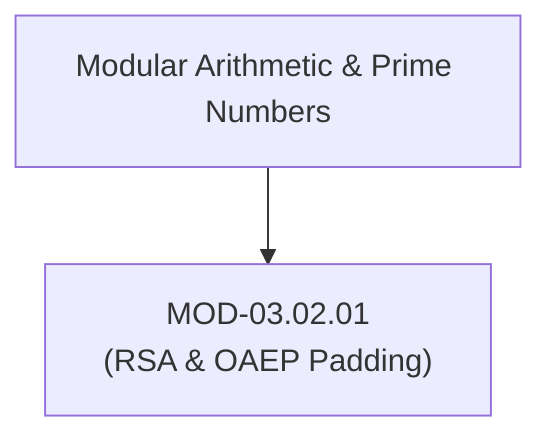

# RSA Cryptosystems, OAEP Padding & Factorization Attack Surfaces

## 1. Overview & Purpose
RSA (Rivest-Shamir-Adleman) is the foundational public-key cryptosystem used for key encapsulation and digital signatures.

This module details modular arithmetic, Euler's totient function, prime factorization difficulty ($n = p \cdot q$), PKCS#1 v1.5 vs Optimal Asymmetric Encryption Padding (OAEP), Bleichenbacher padding oracle attacks, and Wiener's small private exponent attack.

---

## 2. Prerequisites & Prerequisites Graph
- **Prerequisites**: Number theory, greatest common divisor (GCD), modular exponentiation.



---

## 3. Learning Objectives & Taxonomy Alignment
- **L1 Awareness**: Explain public key $e$, private key $d$, and modulus $n$.
- **L2 Understanding**: Detail RSA key generation mathematics, Euler's totient $\phi(n) = (p-1)(q-1)$, and OAEP Feistel masking.
- **L3 Practical**: Generate RSA keys via OpenSSL and decrypt OAEP-padded payloads in Python.
- **L4 Engineering**: Audit RSA implementation padding to block adaptive chosen-ciphertext attacks.

---

## 4. L1 — Awareness (Overview & Core Terminology)
RSA key generation picks two large prime numbers $p$ and $q$. The public key consists of $(e, n)$, where $n = p \cdot q$. The private key $d$ is computed as $d \equiv e^{-1} \pmod{\phi(n)}$. Encryption computes $c = m^e \pmod n$; decryption computes $m = c^d \pmod n$.

---

## 5. L2 — Understanding (Core Theory & Mechanics)

```mermaid
graph TD
    subgraph RSA Key Generation Mathematics
        PRIMES["Select Prime Numbers: p, q (2048-bit / 4096-bit)"]
        MODULUS["Compute Modulus: n = p * q"]
        TOTIENT["Compute Euler Totient: φ(n) = (p-1) * (q-1)"]
        PUB_EXP["Select Public Exponent: e = 65537 (0x10001)"]
        PRIV_EXP["Compute Private Exponent: d = e⁻¹ mod φ(n)"]

        PRIMES --> MODULUS
        MODULUS --> TOTIENT
        TOTIENT --> PUB_EXP
        PUB_EXP --> PRIV_EXP
    end

    subgraph RSA OAEP Padding Mechanics (Prevents M^e mod N Homomorphic Attacks)
        MSG["Message M"] --> MASK["Feistel Network Masking (MGF1 Hash Functions)"]
        SEED["Random Seed"] --> MASK
        MASK --> PADDED_M["Padded Block: [0x00 || SeedMask || DataBlockMask]"]
    end
```

### Bleichenbacher Padding Oracle Attack (Million Message Attack):
When RSA PKCS#1 v1.5 padding is used, servers that return distinct error messages for invalid padding vs valid padding act as an **adaptive chosen-ciphertext oracle**. By sending thousands of modified ciphertext queries $c' = c \cdot s^e \pmod n$, an attacker incrementally narrows down the bounds of $m$, eventually decrypting the entire ciphertext without possessing private key $d$.

---

## 6. L3 — Practical (Commands & Configurations)

### Generating 4096-bit RSA Keys via OpenSSL:
```bash
# Generate 4096-bit RSA private key
openssl genpkey -algorithm RSA -out private_key.pem -pkeyopt rsa_keygen_bits:4096

# Extract public key
openssl rsa -in private_key.pem -pubout -out public_key.pem
```

### Encrypting with RSA-OAEP in Python:
```python
from cryptography.hazmat.primitives.asymmetric import rsa, padding
from cryptography.hazmat.primitives import hashes

# Generate key pair
private_key = rsa.generate_private_key(public_exponent=65537, key_size=3072)
public_key = private_key.public_key()

# Encrypt payload using OAEP with SHA-256
message = b"Secret Financial Data"
ciphertext = public_key.encrypt(
    message,
    padding.OAEP(
        mgf=padding.MGF1(algorithm=hashes.SHA256()),
        algorithm=hashes.SHA256(),
        label=None
    )
)

# Decrypt payload
plaintext = private_key.decrypt(
    ciphertext,
    padding.OAEP(
        mgf=padding.MGF1(algorithm=hashes.SHA256()),
        algorithm=hashes.SHA256(),
        label=None
    )
)
assert plaintext == message
```

---

## 7. L4 — Engineering (Design Trade-offs & System Integration)
- **Minimum RSA Key Size Requirements**: 1024-bit RSA is broken. 2048-bit RSA is deprecated by NIST. Production systems MUST use **3072-bit or 4096-bit RSA** (or migrate to ECC Curve25519/Ed25519) to maintain 128-bit security strength against modern factorization algorithms (Number Field Sieve - GNFS).

---

## 8. Internal Architecture & Data Structures
ASN.1 DER Encoding for RSA Private Key (RFC 3447):
```text
RSAPrivateKey ::= SEQUENCE {
    version           INTEGER, -- 0
    modulus           INTEGER, -- n
    publicExponent    INTEGER, -- e (65537)
    privateExponent   INTEGER, -- d
    prime1            INTEGER, -- p
    prime2            INTEGER, -- q
    exponent1         INTEGER, -- d mod (p-1)
    exponent2         INTEGER, -- d mod (q-1)
    coefficient       INTEGER  -- q⁻¹ mod p
}
```

---

## 9. Security Implications & Boundary Controls
- **Never Use PKCS#1 v1.5 Padding**: Vulnerable to Bleichenbacher's attack. All new implementations MUST mandate **RSA-OAEP** for encryption and **RSA-PSS** for digital signatures.

---

## 10. Attack Vectors & Exploitation Primitives
1. **Bleichenbacher Adaptive Chosen-Ciphertext Attack**: Decrypting ciphertexts by querying servers responding to PKCS#1 v1.5 padding errors.
2. **Wiener's Small Private Exponent Attack**: Factoring $n$ if private exponent $d < \frac{1}{3} n^{1/4}$.

---

## 11. Defense & Telemetry Verification
- Enforce **RSA-OAEP** and **RSA-PSS** padding modes.
- Enforce minimum **3072-bit RSA key length**.

---

## 12. Detection & Telemetry Verification

### Telemetry Audit Command:
```bash
# Inspect RSA key size in active TLS certificate
openssl x509 -in cert.pem -text -noout | grep "Public-Key"
```

---

## 13. Hands-On Lab Reference
- **Associated Lab**: `LAB-CRY003` (RSA OAEP Implementation & Bleichenbacher Oracle Simulation).

---

## 14. Related Projects & Applications
- **Associated Project**: `PRJ-TIP001` (Cryptographic Engine).

---

## 15. Troubleshooting & Diagnostics Matrix

| Symptom | Root Cause | Remediation / Diagnostic Command |
| :--- | :--- | :--- |
| Decryption throws `ValueError: Decryption failed`. | Incorrect OAEP MGF hash function or ciphertext payload corruption. | Ensure both encryptor and decryptor use identical OAEP hash functions (e.g. SHA-256). |

---

## 16. Related Concepts & Cross-Domain Links
- `CON-CRY008`: RSA Modular Arithmetic (`DOM-03`)
- `CON-CRY009`: RSA-OAEP Padding (`DOM-03`)
- `CON-CRY010`: Bleichenbacher Attack (`DOM-03`)

---

## 17. Technical Interview Preparation (Q&A)
**Q: Why is raw RSA encryption ($c = m^e \pmod n$) unsafe, and how does OAEP padding fix it?**  
*Answer*: Raw (textbook) RSA is deterministic (encrypting the same message $m$ twice produces identical ciphertext $c$) and multiplicatively homomorphic ($m_1^e \cdot m_2^e \equiv (m_1 m_2)^e \pmod n$), allowing attackers to manipulate ciphertexts. OAEP (Optimal Asymmetric Encryption Padding) adds a randomized Feistel mask and cryptographic hash functions to the message prior to exponentiation, ensuring semantically secure probabilistic encryption and neutralizing homomorphic attacks.

---

## 18. Self-Assessment & Mastery Checklist
- [ ] Understand RSA key generation math ($n = p \cdot q, d \equiv e^{-1} \pmod{\phi(n)}$).
- [ ] Able to configure RSA-OAEP padding in production code.

---

## 19. References & Further Reading
- RFC 8017: *PKCS #1: RSA Cryptography Specifications Version 2.2*.
- Daniel Bleichenbacher: *Chosen Ciphertext Attacks Against Protocols Based on the RSA Encryption Standard PKCS #1*.
