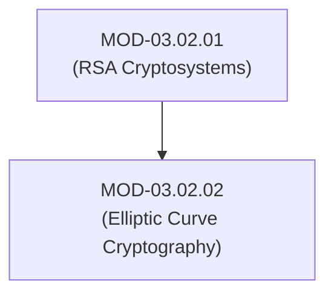
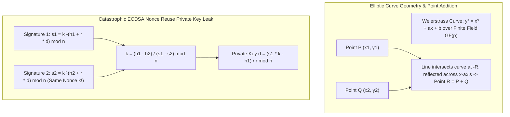

# Elliptic Curve Cryptography (ECDSA, Ed25519 & X25519)

## 1. Overview & Purpose
Elliptic Curve Cryptography (ECC) provides public-key encryption, digital signatures, and key exchange using significantly smaller key sizes than RSA while delivering equivalent cryptographic strength.

This module details Weierstrass curves ($y^2 = x^3 + ax + b$), Edwards curves (Ed25519), Montgomery curves (Curve25519 / X25519), ECDSA nonce reuse private key recovery, and Ed25519 deterministic signatures.

---

## 2. Prerequisites & Prerequisites Graph
- **Prerequisites**: `MOD-03.02.01` (Asymmetric Cryptography Foundations).



---

## 3. Learning Objectives & Taxonomy Alignment
- **L1 Awareness**: Contrast 256-bit ECC keys with 3072-bit RSA keys.
- **L2 Understanding**: Detail Elliptic Curve Discrete Logarithm Problem (ECDLP), point addition, scalar multiplication ($k \cdot P$), and ECDSA signing mechanics.
- **L3 Practical**: Generate Ed25519 SSH keys and execute X25519 key agreements in Python.
- **L4 Engineering**: Design zero-trust microservice communication using Ed25519 high-speed signature validation.

---

## 4. L1 — Awareness (Overview & Core Terminology)
ECC achieves equal security to 3072-bit RSA using a 256-bit key length. **X25519** is the standard for Diffie-Hellman key exchange; **Ed25519** is the standard for fast, deterministic Edwards-curve digital signatures.

---

## 5. L2 — Understanding (Core Theory & Mechanics)



### Catastrophic ECDSA Nonce Reuse Leak:
If an ECDSA signer reuses the same random nonce $k$ twice when signing two distinct messages $h_1$ and $h_2$, an observer can solve for $k$ directly:

$$k = \frac{h_1 - h_2}{s_1 - s_2} \pmod n$$

Once $k$ is known, the private key $d$ is immediately calculated via $d = \frac{s_1 \cdot k - h_1}{r} \pmod n$. (This famously compromised Sony PlayStation 3 security keys).

### Ed25519 Solution (Deterministic Signatures):
Ed25519 eliminates random nonce generation. It derives $k$ deterministically by hashing the private key and the message payload ($k = \text{SHA-512}(d \parallel M)$), completely neutralizing nonce reuse attacks.

---

## 6. L3 — Practical (Commands & Configurations)

### Generating Ed25519 SSH Keys via OpenSSH:
```bash
# Generate high-security Ed25519 SSH key pair
ssh-keygen -t ed25519 -C "admin@corp.internal"
```

### Executing X25519 Diffie-Hellman Key Exchange in Python:
```python
from cryptography.hazmat.primitives.asymmetric import x25519

# Alice generates key pair
alice_private = x25519.X25519PrivateKey.generate()
alice_public = alice_private.public_key()

# Bob generates key pair
bob_private = x25519.X25519PrivateKey.generate()
bob_public = bob_private.public_key()

# Perform mutual ECDH exchange
alice_shared_key = alice_private.exchange(bob_public)
bob_shared_key = bob_private.exchange(alice_public)

# Both shared secrets match exactly
assert alice_shared_key == bob_shared_key
```

---

## 7. L4 — Engineering (Design Trade-offs & System Integration)
- **NIST Curves (P-256) vs Bernstein Curves (Curve25519)**: NIST P-256 uses arbitrary coefficients ($b$ parameter) generated by unknown sources, raising backdoor concerns. Curve25519 uses fully transparent parameters, provides immunity to invalid-curve attacks, and runs in constant time.

---

## 8. Internal Architecture & Data Structures
Ed25519 Public / Private Key Sizes:
```text
Private Key: 32 Bytes (256 bits seed)
Public Key:  32 Bytes (Compressed Y-coordinate + Sign Bit of X)
Signature:   64 Bytes (R point 32B + S scalar 32B)
```

---

## 9. Security Implications & Boundary Controls
- **Invalid Curve Attacks**: In poorly implemented NIST P-256 libraries, failing to verify that a supplied public point lies on the specified curve allows an attacker to choose a weak curve and recover the private key.

---

## 10. Attack Vectors & Exploitation Primitives
1. **ECDSA Nonce Leakage**: Recovering private key $d$ when $k$ is reused or generated with weak entropy.
2. **Invalid Curve Attacks**: Submitting points on weak auxiliary curves during ECDH key exchanges.

---

## 11. Defense & Telemetry Verification
- Enforce **Ed25519 / RFC 8032** for digital signatures.
- Enforce **X25519 / RFC 7748** for ECDH key agreements.

---

## 12. Detection & Telemetry Verification

### Auditing SSH Authorized Keys File:
```bash
# Verify all SSH keys use ed25519
grep -v "ssh-ed25519" ~/.ssh/authorized_keys
```

---

## 13. Hands-On Lab Reference
- **Associated Lab**: `LAB-CRY004` (ECDSA Nonce Reuse Private Key Recovery Simulation).

---

## 14. Related Projects & Applications
- **Associated Project**: `PRJ-TIP001` (Cryptographic Engine).

---

## 15. Troubleshooting & Diagnostics Matrix

| Symptom | Root Cause | Remediation / Diagnostic Command |
| :--- | :--- | :--- |
| `OpenSSL` returns `ecdsa-with-SHA256 signature verification failed`. | Public key mismatched or signature payload corrupted during transit. | Re-export public key using `openssl pkey -pubout`. |

---

## 16. Related Concepts & Cross-Domain Links
- `CON-CRY011`: Elliptic Curve Discrete Logarithm ECDLP (`DOM-03`)
- `CON-CRY012`: Curve25519 / X25519 Key Exchange (`DOM-03`)
- `CON-CRY013`: Ed25519 Deterministic Signatures (`DOM-03`)

---

## 17. Technical Interview Preparation (Q&A)
**Q: Why does Ed25519 prevent the catastrophic private key leaks that affect standard ECDSA?**  
*Answer*: Standard ECDSA relies on a cryptographically secure random number generator (CSPRNG) to generate a unique random nonce $k$ for every signature. If $k$ is reused, the private key can be mathematically recovered. Ed25519 uses a deterministic signature scheme (RFC 8032) where $k$ is calculated by hashing the private key and the message ($k = \text{SHA-512}(d \parallel M)$), eliminating random number generator dependencies and preventing nonce reuse.

---

## 18. Self-Assessment & Mastery Checklist
- [ ] Understand Curve25519 / Ed25519 mathematics.
- [ ] Able to execute X25519 key exchange in Python/C.

---

## 19. References & Further Reading
- RFC 7748: *Elliptic Curves for Security (Curve25519 and Curve448)*.
- RFC 8032: *Edwards-Curve Digital Signature Algorithm (EdDSA)*.
- Daniel J. Bernstein: *High-speed high-security signatures (Ed25519)*.
