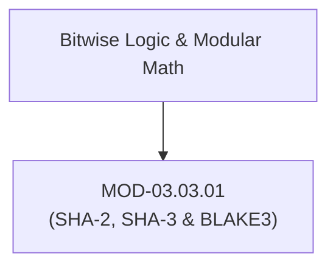

# Cryptographic Hash Functions (SHA-2, SHA-3 & BLAKE3)

## 1. Overview & Purpose
Cryptographic hash functions map arbitrary-sized data inputs into fixed-size digest outputs, providing mathematical data integrity guarantees.

This module details Merkle-Damgård constructions (SHA-256/512), Length Extension Attacks, Sponge constructions (SHA-3 / Keccak), tree-hashing in BLAKE3, and Collision vs Preimage Resistance properties.

---

## 2. Prerequisites & Prerequisites Graph
- **Prerequisites**: Bitwise XOR, bit rotations, compression functions.



---

## 3. Learning Objectives & Taxonomy Alignment
- **L1 Awareness**: Define Preimage Resistance, Second Preimage Resistance, and Collision Resistance.
- **L2 Understanding**: Detail SHA-2 Merkle-Damgård padding, Length Extension Attack mechanics, and SHA-3 Keccak Sponge absorbing/squeezing phases.
- **L3 Practical**: Compute SHA-256/BLAKE3 digests in Python/CLI and demonstrate length extension vulnerabilities.
- **L4 Engineering**: Design ultra-fast SIMD parallelized hashing architectures using BLAKE3 tree structures.

---

## 4. L1 — Awareness (Overview & Core Terminology)
A cryptographic hash function $H(M)$ must satisfy three core properties:
1. **Preimage Resistance**: Given digest $h$, it is computationally infeasible to find $M$ such that $H(M) = h$.
2. **Second Preimage Resistance**: Given $M_1$, it is infeasible to find $M_2 \neq M_1$ such that $H(M_1) = H(M_2)$.
3. **Collision Resistance**: It is infeasible to find *any* two distinct inputs $M_1 \neq M_2$ such that $H(M_1) = H(M_2)$.

---

## 5. L2 — Understanding (Core Theory & Mechanics)

```mermaid
graph TD
    subgraph Merkle-Damgård Construction (SHA-256 - Vulnerable to Length Extension)
        IV["Initial Vector (IV)"]
        M1["Message Block 1 (512-bit)"]
        M2["Message Block 2 (512-bit)"]
        PAD["Padding + Length"]

        IV --> C1["Compression Function f"]
        M1 --> C1
        C1 -->|Intermediate State H1| C2["Compression Function f"]
        M2 --> C2
        C2 -->|Intermediate State H2| C3["Compression Function f"]
        PAD --> C3
        C3 --> DIGEST["Final Hash Digest H(M)"]
    end

    subgraph SHA-3 Keccak Sponge Construction (Immune to Length Extension)
        STATE["1600-bit Internal State Rate (r) + Capacity (c)"]
        ABSORB["Absorb Phase: XOR Message Blocks into Rate r, apply f Permutation"]
        SQUEEZE["Squeeze Phase: Extract Output Blocks from Rate r"]

        ABSORB --> STATE
        STATE --> SQUEEZE
    end
```

### Length Extension Attack (Merkle-Damgård Vulnerability):
Because SHA-256 uses Merkle-Damgård construction, the final output digest $H(M)$ is simply the internal state vector after processing the last padded block. An attacker who knows $H(\text{secret} \parallel \text{data})$ can append extra data $M_{\text{extra}}$ and compute $H(\text{secret} \parallel \text{data} \parallel \text{pad} \parallel M_{\text{extra}})$ **without knowing the secret**, breaking naive MAC constructions (`Hash(secret || data)`).

### BLAKE3 Tree-Hashing:
BLAKE3 processes data as a Merkle tree of 1024-byte chunks. Chunks are hashed in parallel across CPU cores and SIMD vector units, achieving 10x-15x faster throughput than SHA-256 while remaining immune to length extension attacks.

---

## 6. L3 — Practical (Commands & Configurations)

### Computing Digests via CLI and Python:
```bash
# Compute SHA-256 digest
echo -n "CyberAct" | sha256sum

# Compute BLAKE3 digest (b3sum CLI)
echo -n "CyberAct" | b3sum
```

### Hashing with BLAKE3 in Python:
```python
import blake3

# Initialize BLAKE3 hasher
hasher = blake3.blake3()
hasher.update(b"Large Stream Payload Data")
digest = hasher.hexdigest()
print(f"BLAKE3 Digest: {digest}")
```

---

## 7. L4 — Engineering (Design Trade-offs & System Integration)
- **Hash Function Selection Guide**:
  - **SHA-256 / SHA-512**: Standard for compliance, TLS certificates, and legacy compatibility.
  - **SHA-3 (Keccak)**: Hardware-isolated sponge construction when Merkle-Damgård risks must be eliminated.
  - **BLAKE3**: Ideal for internal microservices, file integrity verification, and high-throughput disk/network hashing.

---

## 8. Internal Architecture & Data Structures
SHA-256 State Parameters:
```text
State Vector: Eight 32-bit words (256 bits total)
Block Size:   512 bits (64 bytes)
Digest Size:  256 bits (32 bytes)
Rounds:       64 processing rounds per block
```

---

## 9. Security Implications & Boundary Controls
- **Never use `Hash(secret || message)` for Authentication**: Always use **HMAC-SHA256** or **KMAC** to protect against length extension attacks.

---

## 10. Attack Vectors & Exploitation Primitives
1. **Length Extension Attack**: Appending malicious payload extensions to unauthenticated `Hash(secret || data)` signatures.
2. **MD5 / SHA-1 Collision Attacks**: Generating colliding PDF/X.509 documents sharing identical legacy hash values.

---

## 11. Defense & Telemetry Verification
- Ban legacy **MD5 and SHA-1** across all production environments.
- Require **HMAC-SHA256** or **BLAKE3** for data authentication.

---

## 12. Detection & Telemetry Verification

### Telemetry Check for Deprecated Hash Functions:
```bash
# Audit codebase for MD5 / SHA-1 references
grep -rnE "md5|sha1" ./src/
```

---

## 13. Hands-On Lab Reference
- **Associated Lab**: `LAB-CRY005` (Length Extension Attack Demonstration & BLAKE3 Benchmarking).

---

## 14. Related Projects & Applications
- **Associated Project**: `PRJ-TIP001` (Cryptographic Engine).

---

## 15. Troubleshooting & Diagnostics Matrix

| Symptom | Root Cause | Remediation / Diagnostic Command |
| :--- | :--- | :--- |
| Hash validation fails during API request. | String encoding mismatch (UTF-8 vs ASCII) or line-ending variations (`\n` vs `\r\n`). | Sanitize line endings and convert input explicitly to UTF-8 bytes before hashing. |

---

## 16. Related Concepts & Cross-Domain Links
- `CON-CRY014`: Merkle-Damgård Construction (`DOM-03`)
- `CON-CRY015`: Length Extension Attack (`DOM-03`)
- `CON-CRY016`: SHA-3 Keccak Sponge (`DOM-03`)

---

## 17. Technical Interview Preparation (Q&A)
**Q: What is a Length Extension Attack and why are SHA-256 and SHA-512 vulnerable to it?**  
*Answer*: SHA-256 uses the Merkle-Damgård construction where the final hash output is the exact internal state vector of the compression function after processing the last block. If a system constructs a MAC as $H(\text{secret} \parallel \text{data})$, an attacker knowing the final hash digest can initialize SHA-256 with that hash as its internal state and continue hashing additional data $M_{\text{extra}}$, computing a valid digest for $H(\text{secret} \parallel \text{data} \parallel \text{padding} \parallel M_{\text{extra}})$ without knowing the secret.

---

## 18. Self-Assessment & Mastery Checklist
- [ ] Understand Merkle-Damgård vs Sponge vs Tree Hashing.
- [ ] Able to execute length extension attacks using `hashpumpy`.

---

## 19. References & Further Reading
- NIST FIPS PUB 180-4: *Secure Hash Standard (SHS - SHA-2)*.
- NIST FIPS PUB 202: *SHA-3 Standard: Permutation-Based Hash and Extendable-Output Functions*.
- BLAKE3 Specification: *Official BLAKE3 Cryptographic Hash Function Paper*.
