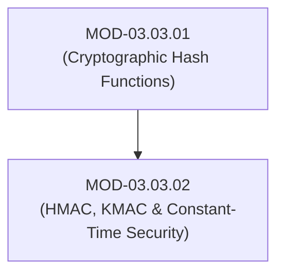
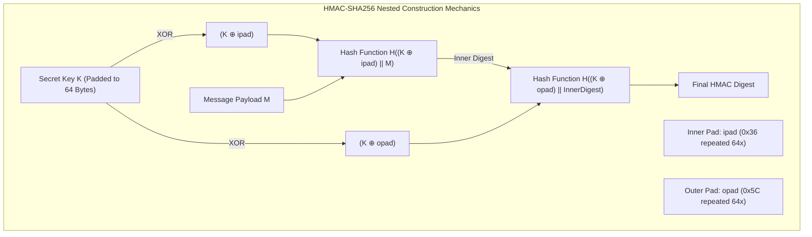

# Message Authentication Codes (HMAC, KMAC) & Constant-Time Security

## 1. Overview & Purpose
Message Authentication Codes (MACs) provide data integrity and authenticity using shared secret keys.

This module details Hash-based Message Authentication Codes (HMAC - RFC 2104), Keccak-based MAC (KMAC), constant-time byte string comparison to prevent timing side-channel leaks, and statefully signed hash schemes (LMS / XMSS).

---

## 2. Prerequisites & Prerequisites Graph
- **Prerequisites**: `MOD-03.03.01` (Cryptographic Hash Functions).



---

## 3. Learning Objectives & Taxonomy Alignment
- **L1 Awareness**: Contrast unauthenticated hashes (SHA-256) and authenticated MACs (HMAC-SHA256).
- **L2 Understanding**: Explain HMAC nested inner/outer padding ($K \oplus \text{ipad}, K \oplus \text{opad}$) and side-channel timing attack mechanics.
- **L3 Practical**: Implement HMAC-SHA256 verification with constant-time comparison in Python/C.
- **L4 Engineering**: Design zero-trust API authentication systems protected against timing leaks.

---

## 4. L1 — Awareness (Overview & Core Terminology)
HMAC provides message authenticity. Even if an attacker modifies the payload, they cannot forge a valid MAC without the secret key. **Constant-time string comparison** ensures verification time does not leak how many bytes matched.

---

## 5. L2 — Understanding (Core Theory & Mechanics)



### HMAC Mathematical Formula (RFC 2104):
$$\text{HMAC}(K, M) = H\Big((K \oplus \text{opad}) \parallel H\big((K \oplus \text{ipad}) \parallel M\big)\Big)$$

Where $\text{ipad} = 0x3636\dots36$ and $\text{opad} = 0x5C5C\dots5C$. This dual-nesting construction mathematically guarantees immunity to Length Extension Attacks.

### Side-Channel Timing Leak Attack:
In naive string comparison (`if mac_user == mac_calculated:`), standard string equality operators abort on the first non-matching byte (`if (a[i] != b[i]) return false`). By measuring response times in microseconds over thousands of requests, an attacker deduces the MAC byte-by-byte.

---

## 6. L3 — Practical (Commands & Configurations)

### Generating and Constant-Time Verifying HMAC-SHA256 in Python:
```python
import hmac
import hashlib

secret_key = b"EnterpriseSecretKey123!"
message = b"Action=Transfer&Amount=10000"

# Generate HMAC-SHA256
mac = hmac.new(secret_key, message, hashlib.sha256).hexdigest()
print(f"HMAC-SHA256: {mac}")

# Constant-Time Verification (Prevents Timing Attacks)
def verify_mac(key: bytes, msg: bytes, user_mac: str) -> bool:
    expected_mac = hmac.new(key, msg, hashlib.sha256).hexdigest()
    # hmac.compare_digest executes in CONSTANT TIME regardless of byte mismatches
    return hmac.compare_digest(expected_mac, user_mac)

assert verify_mac(secret_key, message, mac) == True
```

---

## 7. L4 — Engineering (Design Trade-offs & System Integration)
- **KMAC vs HMAC**: KMAC (Keccak MAC - NIST SP 800-185) runs on top of SHA-3's sponge construction. It requires only a single pass over the message instead of HMAC's two-pass nested hash architecture, making it faster and cleaner.

---

## 8. Internal Architecture & Data Structures
Constant-Time Comparison C Algorithm (`CRYPTO_memcmp`):
```c
int constant_time_compare(const unsigned char *a, const unsigned char *b, size_t len) {
    unsigned char result = 0;
    for (size_t i = 0; i < len; i++) {
        result |= a[i] ^ b[i]; // Accumulate bit differences without early break
    }
    return result == 0;
}
```

---

## 9. Security Implications & Boundary Controls
- **Never Use Standard String Equality (`==`) for MACs**: Always use `hmac.compare_digest()` or `CRYPTO_memcmp()` to neutralize timing side-channels.

---

## 10. Attack Vectors & Exploitation Primitives
1. **Timing Side-Channel Exploitation**: Brute-forcing web application API signatures byte-by-byte by measuring sub-millisecond response delays.
2. **Length Extension on Naive MACs**: Exploiting `$hash = SHA256($secret . $data)` when HMAC is omitted.

---

## 11. Defense & Telemetry Verification
- Mandate **HMAC-SHA256** or **KMAC256** for all webhook signatures and API token validations.
- Mandate **constant-time byte comparison** in code reviews.

---

## 12. Detection & Telemetry Verification

### Code Review Static Analysis (Semgrep Rule for Non-Constant Time MAC Comparison):
```yaml
rules:
  - id: non-constant-time-mac-comparison
    patterns:
      - pattern: $MAC1 == $MAC2
    message: "Potential timing attack vulnerability. Use hmac.compare_digest() for MAC validation."
    languages: [python]
    severity: WARNING
```

---

## 13. Hands-On Lab Reference
- **Associated Lab**: `LAB-CRY006` (Timing Side-Channel Exploitation & Constant-Time Remediation).

---

## 14. Related Projects & Applications
- **Associated Project**: `PRJ-TIP001` (Cryptographic Engine).

---

## 15. Troubleshooting & Diagnostics Matrix

| Symptom | Root Cause | Remediation / Diagnostic Command |
| :--- | :--- | :--- |
| API webhook returns `401 Unauthorized` despite valid key. | String encoding issue (hex string vs raw bytes passed to HMAC). | Ensure both sender and receiver digest format (hex vs raw bytes) match. |

---

## 16. Related Concepts & Cross-Domain Links
- `CON-CRY017`: HMAC Nested Construction (`DOM-03`)
- `CON-CRY018`: Constant-Time String Comparison (`DOM-03`)

---

## 17. Technical Interview Preparation (Q&A)
**Q: Why does comparing cryptographic MAC signatures using standard string comparison (`a == b`) introduce a security vulnerability?**  
*Answer*: Standard string comparison algorithms evaluate strings character-by-character and abort execution immediately upon encountering the first non-matching byte. This creates a timing side-channel where responses return slightly faster when the first byte is wrong versus when the first 5 bytes are correct. An attacker can measure these microsecond variations over thousands of network requests to discover the valid MAC signature one byte at a time.

---

## 18. Self-Assessment & Mastery Checklist
- [ ] Understand HMAC $K \oplus \text{ipad}$ and $K \oplus \text{opad}$ nested construction.
- [ ] Able to implement constant-time string comparison in Python/C.

---

## 19. References & Further Reading
- RFC 2104: *HMAC: Keyed-Hashing for Message Authentication*.
- NIST SP 800-185: *SHA-3 Derived Functions: cSHAKE, KMAC, TupleHash, and ParallelHash*.
