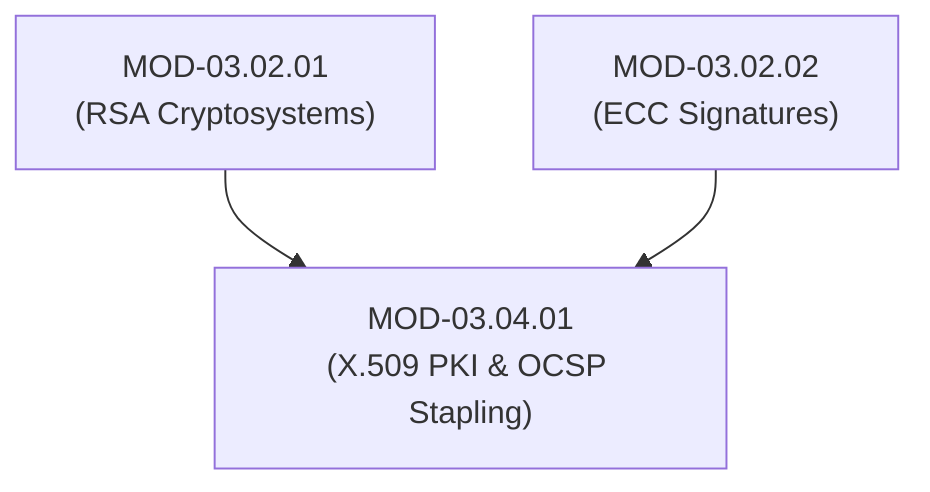

# X.509 Certificate Architecture, CA Hierarchy & OCSP Stapling

## 1. Overview & Purpose
Public Key Infrastructure (PKI) binds public keys to verified identities (individuals, hostnames, or organizations) using digital certificates signed by trusted Certificate Authorities (CAs).

This module details X.509 v3 certificate extensions, Root vs Intermediate CA hierarchies, ASN.1 DER/PEM encodings, Certificate Revocation Lists (CRL), OCSP Stapling (RFC 6066), and Certificate Transparency (CT) logs.

---

## 2. Prerequisites & Prerequisites Graph
- **Prerequisites**: `MOD-03.02.01` (RSA) & `MOD-03.02.02` (ECC Signatures).



---

## 3. Learning Objectives & Taxonomy Alignment
- **L1 Awareness**: Explain Subject, Issuer, Serial Number, and Validity Period in X.509 certificates.
- **L2 Understanding**: Detail X.509 v3 Extensions (Subject Alternative Name - SAN, Basic Constraints, Key Usage), CRL distribution points, and OCSP Stapling mechanics.
- **L3 Practical**: Parse X.509 certificates via `openssl`, issue local CAs, and query CT log monitors.
- **L4 Engineering**: Design enterprise zero-trust PKI architectures with automated short-lived certificate issuance (ACME).

---

## 4. L1 — Awareness (Overview & Core Terminology)
An X.509 v3 digital certificate contains an identity (e.g., `CN=example.com`), a public key, and a digital signature created by a trusted Certificate Authority (CA).

---

## 5. L2 — Understanding (Core Theory & Mechanics)

```mermaid
graph TD
    subgraph X.509 Certificate Authority Chain of Trust
        ROOT["Offline Root CA (Self-Signed X.509 Cert - Kept Air-Gapped)"]
        INTERMEDIATE["Intermediate Issuing CA (Signed by Root CA)"]
        LEAF["End-Entity Leaf Certificate (e.g., example.com - Signed by Intermediate CA)"]

        ROOT -->|Signs Certificate| INTERMEDIATE
        INTERMEDIATE -->|Signs Certificate| LEAF
    end

    subgraph OCSP Stapling Sequence (RFC 6066 - Eliminates Privacy Leak to CA)
        CLIENT["Web Browser Client"]
        SERVER["Web Server"]
        CA_OCSP["CA OCSP Responder"]

        SERVER <-->|Periodically Fetches Signed OCSP Response| CA_OCSP
        CLIENT -->|1. TLS ClientHello| SERVER
        SERVER -->|2. TLS ServerHello + X.509 Cert + Timestamped Signed OCSP Response| CLIENT
        CLIENT -->|3. Verifies Cert & OCSP Signature locally without contacting CA!| CLIENT
    end
```

### X.509 v3 Key Extensions:
- **Basic Constraints (`2.5.29.19`)**: `cA:TRUE` or `cA:FALSE`. Specifies whether the certificate can sign other certificates.
- **Subject Alternative Name (SAN - `2.5.29.17`)**: Lists all valid DNS domain names covered by the certificate (replaces deprecated `Common Name`).
- **Key Usage (`2.5.29.15`)**: Restricts cryptographic operations (`digitalSignature`, `keyEncipherment`, `cRLSign`).

### OCSP Stapling (RFC 6066):
Standard OCSP requires the client's browser to query the CA's server directly during every TLS handshake to check if a certificate is revoked, introducing latency and leaking user browsing history to the CA. **OCSP Stapling** forces the web server to cache a time-stamped, CA-signed OCSP response and "staple" it directly into the TLS handshake.

---

## 6. L3 — Practical (Commands & Configurations)

### Parsing X.509 Certificates with OpenSSL:
```bash
# Display detailed X.509 certificate fields
openssl x509 -in cert.pem -text -noout

# Verify certificate chain against trusted Root CA
openssl verify -CAfile rootCA.pem -untrusted intermediateCA.pem leaf_cert.pem
```

### Querying Certificate Transparency (CT) Logs via `crt.sh`:
```bash
# Query all certificates issued for target domain
curl -s "https://crt.sh/?q=example.com&output=json" | jq '.[].name_value' | sort -u
```

---

## 7. L4 — Engineering (Design Trade-offs & System Integration)
- **Air-Gapped Root CAs**: Production PKIs MUST keep the Root CA private key completely offline on an air-gapped Hardware Security Module (HSM). Intermediate CAs are issued to handle online automated certificate signing (e.g., via HashiCorp Vault or cert-manager).

---

## 8. Internal Architecture & Data Structures
ASN.1 Structure of X.509 v3 Certificate:
```text
Certificate  ::=  SEQUENCE  {
     tbsCertificate       TBSCertificate,
     signatureAlgorithm   AlgorithmIdentifier,
     signatureValue       BIT STRING  }

TBSCertificate  ::=  SEQUENCE  {
     version         [0]  EXPLICIT Version DEFAULT v1,
     serialNumber         CertificateSerialNumber,
     signature            AlgorithmIdentifier,
     issuer               Name,
     validity             Validity,
     subject              Name,
     subjectPublicKeyInfo SubjectPublicKeyInfo,
     extensions      [3]  EXPLICIT Extensions OPTIONAL  }
```

---

## 9. Security Implications & Boundary Controls
- **MitM via Rogue Intermediate CA**: If an attacker gains access to a private key marked `BasicConstraints: cA:TRUE`, they can generate trusted certificates for *any domain on the internet*.

---

## 10. Attack Vectors & Exploitation Primitives
1. **Rogue Intermediate CA Issuance**: Misconfigured CAs signing certificates without proper domain validation.
2. **Subdomain Hijacking via CT Logs**: Monitoring Certificate Transparency logs to discover unlinked staging subdomains.

---

## 11. Defense & Telemetry Verification
- Mandate **OCSP Must-Staple (`1.3.6.1.5.5.7.1.24`)** extension on leaf certificates.
- Monitor **Certificate Transparency (CT)** logs continuously for unauthorized domain certificates.

---

## 12. Detection & Telemetry Verification

### Monitoring CT Logs via Python script:
```python
import requests

def audit_ct_logs(domain: str):
    url = f"https://crt.sh/?q={domain}&output=json"
    res = requests.get(url).json()
    for cert in res:
        print(f"Issued: {cert['logged_at']} | Subdomain: {cert['name_value']}")

audit_ct_logs("example.com")
```

---

## 13. Hands-On Lab Reference
- **Associated Lab**: `LAB-CRY007` (Enterprise PKI Setup & OCSP Stapling Inspection).

---

## 14. Related Projects & Applications
- **Associated Project**: `PRJ-TIP001` (Cryptographic Engine).

---

## 15. Troubleshooting & Diagnostics Matrix

| Symptom | Root Cause | Remediation / Diagnostic Command |
| :--- | :--- | :--- |
| Browser error `NET::ERR_CERT_COMMON_NAME_INVALID`. | Certificate missing Subject Alternative Name (SAN) extension for requested domain. | Re-issue certificate with target domain added to `subjectAltName` extension. |

---

## 16. Related Concepts & Cross-Domain Links
- `CON-CRY019`: X.509 v3 Extensions (`DOM-03`)
- `CON-CRY020`: OCSP Stapling (`DOM-03`)
- `CON-CRY021`: Certificate Transparency CT (`DOM-03`)

---

## 17. Technical Interview Preparation (Q&A)
**Q: What is OCSP Stapling and what dual problems of standard OCSP does it resolve?**  
*Answer*: Standard OCSP requires the client browser to contact the CA's responder during the TLS handshake to check revocation status. This introduces connection latency and leaks the user's browsing destination to the CA. OCSP Stapling (RFC 6066) requires the web server to periodically query the CA's OCSP responder itself, receive a cryptographically signed, timestamped response, and "staple" it directly into the server's TLS handshake, resolving both performance latency and user privacy issues.

---

## 18. Self-Assessment & Mastery Checklist
- [ ] Understand Root vs Intermediate CA relationships.
- [ ] Able to query CT logs using `crt.sh` API.

---

## 19. References & Further Reading
- RFC 5280: *Internet X.509 Public Key Infrastructure Certificate and Certificate Revocation List (CRL) Profile*.
- RFC 6066: *Transport Layer Security (TLS) Extensions: Extension Definitions (OCSP Stapling)*.
- RFC 6962: *Certificate Transparency*.
