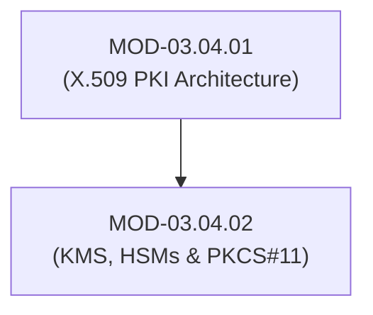

# Key Management Systems (KMS), HSMs & PKCS#11 Interfaces

## 1. Overview & Purpose
Key Management Systems (KMS) and Hardware Security Modules (HSMs) safeguard master cryptographic keys throughout their operational lifecycle (generation, distribution, rotation, storage, and revocation).

This module details HSM physical tamper resistance, FIPS 140-3 validation levels, PKCS#11 Cryptoki C-API standards, Key Wrapping (AES-KW), Envelope Encryption, and Cloud KMS integrations.

---

## 2. Prerequisites & Prerequisites Graph
- **Prerequisites**: `MOD-03.04.01` (X.509 PKI Architecture).



---

## 3. Learning Objectives & Taxonomy Alignment
- **L1 Awareness**: Explain Key Management Lifecycles and HSM physical security boundaries.
- **L2 Understanding**: Detail FIPS 140-3 Levels 1–4, Envelope Encryption (DEK/KEK), and PKCS#11 session handles.
- **L3 Practical**: Perform PKCS#11 slot initialization and call Envelope Encryption APIs in Python.
- **L4 Engineering**: Design high-availability multi-region HSM key replication architectures.

---

## 4. L1 — Awareness (Overview & Core Terminology)
An **HSM (Hardware Security Module)** is a dedicated physical crypto-processor designed to generate, store, and execute cryptographic operations without letting private key material leave hardware boundaries. **PKCS#11** is the standard C API for interacting with HSMs.

---

## 5. L2 — Understanding (Core Theory & Mechanics)

```mermaid
graph TD
    subgraph FIPS 140-3 Hardware Security Module (HSM Boundary)
        PIN["PKCS#11 Slot Authentication (User PIN)"]
        HSM_CORE["HSM Secure Crypto Processor"]
        KEK["Key Encryption Key (KEK - Never Exits HSM Memory)"]

        PIN --> HSM_CORE
        KEK --> HSM_CORE
    end

    subgraph Envelope Encryption Architecture
        DATA["Raw Sensitive Data Payload"]
        DEK["Data Encryption Key (DEK - Generated Locally)"]
        KMS["Cloud KMS / HSM Interface"]

        DEK -->|Encrypts Data| ENC_DATA["Encrypted Data Payload"]
        KMS -->|Encrypts DEK using KEK| ENC_DEK["Encrypted DEK (Ciphertext)"]
        DATA --> DEK
    end
```

### FIPS 140-3 Validation Levels:
- **Level 1**: Basic software security requirements.
- **Level 2**: Adds physical tamper-evident coatings or seals.
- **Level 3**: Adds active physical tamper-response (zeroization of keys upon physical casing breach).
- **Level 4**: Protects against environmental zero-day physical attacks (voltage/temperature manipulation).

### Envelope Encryption Mechanics:
1. Generate a local short-lived **Data Encryption Key (DEK)**.
2. Encrypt large data payloads locally using the DEK via fast symmetric encryption (AES-256-GCM).
3. Send the DEK to the KMS/HSM to be encrypted under a master **Key Encryption Key (KEK)**.
4. Store the `Encrypted Data` alongside the `Encrypted DEK`. Private keys never leave the HSM.

---

## 6. L3 — Practical (Commands & Configurations)

### Interacting with HSM via PKCS#11 (`pkcs11-tool`):
```bash
# List available slots on connected HSM
pkcs11-tool --module /usr/lib/softhsm/libsofthsm2.so --list-slots

# Generate 2048-bit RSA key inside HSM Slot 0
pkcs11-tool --module /usr/lib/softhsm/libsofthsm2.so --slot 0 --login --pin 1234 \
  --keypairgen --key-type rsa:2048 --label "MyHSMKey"
```

### Performing Envelope Encryption in Python (AWS KMS / Local KMS):
```python
from cryptography.hazmat.primitives.ciphers.aead import AESGCM
import os

# 1. Local Data Encryption Key (DEK)
dek = AESGCM.generate_key(bit_length=256)
aesgcm_dek = AESGCM(dek)

# 2. Encrypt Payload locally
plaintext = b"Sensitive Database Record Payload"
nonce = os.urandom(12)
encrypted_payload = aesgcm_dek.encrypt(nonce, plaintext, None)

# 3. Simulate KMS Encrypting the DEK (Envelope)
kek = AESGCM.generate_key(bit_length=256)
aesgcm_kek = AESGCM(kek)
encrypted_dek = aesgcm_kek.encrypt(os.urandom(12), dek, None)

print("Envelope Encryption Complete. Raw DEK discarded from memory.")
```

---

## 7. L4 — Engineering (Design Trade-offs & System Integration)
- **Key Rotation Policies**: Master KEKs should be rotated automatically on an annual basis (or after $2^{32}$ encryption operations). Envelope encryption allows re-encrypting only the lightweight `Encrypted DEK` fields during rotation without re-encrypting gigabytes of raw database payloads.

---

## 8. Internal Architecture & Data Structures
PKCS#11 API C Function Execution Flow:
```c
CK_RV rv;
rv = C_Initialize(NULL_PTR);
rv = C_OpenSession(slotID, CKF_SERIAL_SESSION | CKF_RW_SESSION, NULL, NULL, &hSession);
rv = C_Login(hSession, CKU_USER, pPin, ulPinLen);
rv = C_SignInit(hSession, &mechanism, hKey);
rv = C_Sign(hSession, pData, ulDataLen, pSignature, pulSignatureLen);
rv = C_CloseSession(hSession);
```

---

## 9. Security Implications & Boundary Controls
- **Zeroization Safeguards**: Physical HSMs trigger immediate memory erasure (zeroization) of all internal KEKs if physical sensors detect casing opening, temperature drops below threshold, or excessive invalid PIN attempts.

---

## 10. Attack Vectors & Exploitation Primitives
1. **API Key Extractability Vulnerabilities**: Exploiting poorly configured PKCS#11 attributes (`CKA_EXTRACTABLE=TRUE`) to force the HSM to dump private key material.
2. **KMS IAM Privilege Escalation**: Gaining `kms:Decrypt` policy access in cloud environments to decrypt database backups.

---

## 11. Defense & Telemetry Verification
- Set `CKA_EXTRACTABLE=FALSE` and `CKA_SENSITIVE=TRUE` on all HSM keys.
- Enforce strict **KMS IAM Role Separation** (Separate `kms:Encrypt` and `kms:Decrypt` permissions).

---

## 12. Detection & Telemetry Verification

### Cloud KMS Audit Log Query (AWS CloudTrail / Azure Activity):
```json
{
  "eventName": "Decrypt",
  "eventSource": "kms.amazonaws.com",
  "userIdentity": { "arn": "arn:aws:iam::123456789012:user/unauthorized_user" },
  "errorCode": "AccessDenied"
}
```

---

## 13. Hands-On Lab Reference
- **Associated Lab**: `LAB-CRY008` (SoftHSM2 PKCS#11 Integration & Envelope Encryption).

---

## 14. Related Projects & Applications
- **Associated Project**: `PRJ-TIP001` (Cryptographic Engine).

---

## 15. Troubleshooting & Diagnostics Matrix

| Symptom | Root Cause | Remediation / Diagnostic Command |
| :--- | :--- | :--- |
| `PKCS11_CKR_PIN_LOCKED` error. | Maximum invalid PIN threshold reached on HSM slot. | Reset slot PIN using Security Officer (SO) PIN credentials. |

---

## 16. Related Concepts & Cross-Domain Links
- `CON-CRY022`: Hardware Security Modules HSM (`DOM-03`)
- `CON-CRY023`: PKCS#11 Cryptoki C-API (`DOM-03`)
- `CON-CRY024`: Envelope Encryption DEK/KEK (`DOM-03`)

---

## 17. Technical Interview Preparation (Q&A)
**Q: What is Envelope Encryption and why is it preferred for encrypting large data payloads?**  
*Answer*: Envelope Encryption uses two key tiers: a locally generated short-lived Data Encryption Key (DEK) to encrypt large raw payloads via fast symmetric ciphers (AES-256-GCM), and a Key Encryption Key (KEK) managed inside a secure KMS/HSM to encrypt only the small DEK. This pattern eliminates sending large datasets across network lines to the KMS while ensuring that master KEKs never leave the secure hardware boundary.

---

## 18. Self-Assessment & Mastery Checklist
- [ ] Understand FIPS 140-3 validation levels.
- [ ] Able to write code performing Envelope Encryption using KMS APIs.

---

## 19. References & Further Reading
- OASIS Standard: *PKCS #11 Cryptographic Token Interface Base Specification Version 3.0*.
- NIST FIPS PUB 140-3: *Security Requirements for Cryptographic Modules*.
