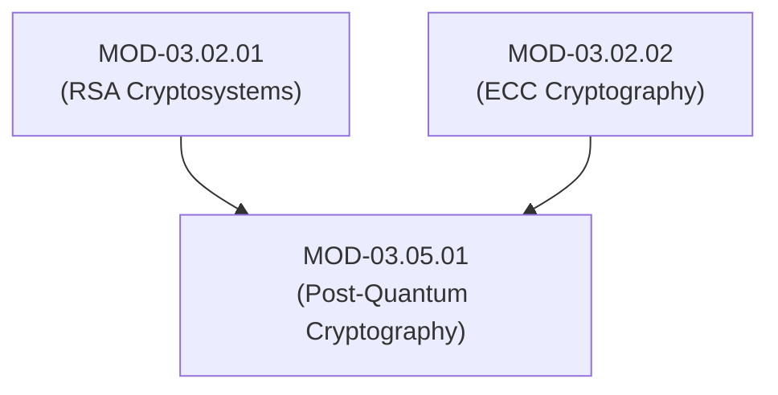

# Post-Quantum Cryptography (NIST ML-KEM & ML-DSA Standards)

## 1. Overview & Purpose
Quantum computers operating Shor's Algorithm will break all legacy asymmetric public-key cryptosystems (RSA, ECDSA, ECDH) by solving discrete logarithm and prime factorization problems in polynomial time.

This module details quantum threats (Shor's & Grover's Algorithms), Harvest-Now-Decrypt-Later (HNDL) attacks, Lattice-Based Cryptography, Module Learning With Errors (MLWE), NIST ML-KEM (FIPS 203 / Kyber), NIST ML-DSA (FIPS 204 / Dilithium), and hybrid classical-PQC migration strategies.

---

## 2. Prerequisites & Prerequisites Graph
- **Prerequisites**: `MOD-03.02.01` (RSA) & `MOD-03.02.02` (ECC Cryptography).



---

## 3. Learning Objectives & Taxonomy Alignment
- **L1 Awareness**: Understand quantum threats to RSA/ECC and NIST Post-Quantum standardization timeline.
- **L2 Understanding**: Detail Module Learning With Errors (MLWE) hard mathematical problems and ML-KEM-768 / ML-DSA-65 algorithms.
- **L3 Practical**: Execute ML-KEM key exchanges using liboqs C/Python wrappers and benchmark hybrid PQC TLS handshakes.
- **L4 Engineering**: Design hybrid classical + post-quantum migration architectures for zero-trust enterprise networks.

---

## 4. L1 — Awareness (Overview & Core Terminology)
Quantum computers utilizing **Shor's Algorithm** will render 3072-bit RSA and 256-bit ECC completely vulnerable. **Grover's Algorithm** reduces symmetric key strength by half (requiring migration to AES-256 and SHA-384/512). NIST has standardized **ML-KEM (Kyber)** for key encapsulation and **ML-DSA (Dilithium)** for digital signatures.

---

## 5. L2 — Understanding (Core Theory & Mechanics)

```mermaid
graph TD
    subgraph Quantum Threat vs Post-Quantum Math
        SHOR["Quantum Computer (Shor's Algorithm)<br/>Solves Factorization & Discrete Logarithms in Polynomial Time O(n³)"]
        LEGACY["Breaks RSA, ECDSA, ECDH, Ed25519"]

        SHOR --> LEGACY

        LATTICE["Lattice-Based Cryptography (ML-KEM / ML-DSA)<br/>Shortest Vector Problem (SVP) in High-Dimensional Grids (n=768)"]
        HARD["Quantum Computer Cannot Solve High-Dimensional Lattice Grid Problems"]

        LATTICE --> HARD
    end

    subgraph Hybrid Classical-PQC Key Exchange Pipeline
        CLIENT["Client"]
        SERVER["Server"]

        CLIENT -->|ClientHello + X25519 ECDH Key + ML-KEM-768 Public Key| SERVER
        SERVER -->|ServerHello + X25519 ECDH Key + ML-KEM-768 Ciphertext| CLIENT
        CLIENT <-->|HKDF Combine (SharedSecret_ECDH || SharedSecret_PQC)| SERVER
    end
```

### Harvest-Now-Decrypt-Later (HNDL) Threat:
Nation-state adversaries are actively intercepting and storing encrypted high-value enterprise network traffic *today*. Once cryptographically relevant quantum computers (CRQCs) become available, adversaries will decrypt historical recorded traffic, making immediate PQC migration mandatory.

### Module Learning With Errors (MLWE):
ML-KEM and ML-DSA rely on finding short vector errors in high-dimensional polynomial lattice modules:

$$\mathbf{b} = \mathbf{A} \cdot \mathbf{s} + \mathbf{e} \pmod q$$

Where $\mathbf{A}$ is a public matrix, $\mathbf{s}$ is a secret vector, and $\mathbf{e}$ is a small error noise vector. Reversing $\mathbf{s}$ without knowing $\mathbf{e}$ is exponentially hard for both classical and quantum supercomputers.

---

## 6. L3 — Practical (Commands & Configurations)

### Executing ML-KEM-768 Key Encapsulation in Python (`liboqs`):
```python
import oqs

# Instantiate ML-KEM-768 (NIST Category 3 Security)
kem = oqs.KeyEncapsulation("Kyber768")

# Key Generation by Receiver
public_key = kem.generate_keypair()

# Encapsulation by Sender
ciphertext, shared_secret_sender = kem.encap_secret(public_key)

# Decapsulation by Receiver
shared_secret_receiver = kem.decap_secret(ciphertext)

# Both shared secrets match
assert shared_secret_sender == shared_secret_receiver
print("ML-KEM-768 Shared Secret Established Successfully!")
```

---

## 7. L4 — Engineering (Design Trade-offs & System Integration)
- **Increased Key and Signature Sizes**:
  - **Ed25519**: 32-byte Public Key | 64-byte Signature.
  - **ML-DSA-65**: 1,952-byte Public Key | 3,309-byte Signature.
  - **Impact**: PQC packets exceed single MTU sizes (1500 bytes), causing IP fragmentation over UDP network protocols. Networks must support TCP/QUIC fallback.

---

## 8. Internal Architecture & Data Structures
NIST PQC Standards Specifications (2024):
```text
┌──────────────┬───────────────────────────────┬──────────────────────────────┐
│ NIST Standard│ Primary Algorithm             │ Purpose                      │
├──────────────┼───────────────────────────────┼──────────────────────────────┤
│ FIPS 203     │ ML-KEM (Module-LWR / Kyber)   │ Key Encapsulation (KEM)      │
│ FIPS 204     │ ML-DSA (Module-LWE / Dilithium│ Digital Signatures           │
│ FIPS 205     │ SLH-DSA (Sphincs+ Hash-based) │ Stateful/Stateless Signatures│
└──────────────┴───────────────────────────────┴──────────────────────────────┘
```

---

## 9. Security Implications & Boundary Controls
- **Hybrid Cryptography Requirement**: During the 10-year transition period, applications MUST use **Hybrid Schemes** combining classical ECDH (X25519) + PQC (ML-KEM-768). If an undiscovered flaw is found in new PQC math, classical ECDH still protects the connection.

---

## 10. Attack Vectors & Exploitation Primitives
1. **Harvest-Now-Decrypt-Later (HNDL)**: Recording current TLS 1.3 streams to decrypt on future quantum hardware.
2. **Implementation Side-Channel Leaks**: Exploiting power/timing variations in initial C PQC library implementations.

---

## 11. Defense & Telemetry Verification
- Enable **X25519 + ML-KEM-768 (X25519Kyber768)** hybrid key exchanges on reverse proxies and TLS endpoints.
- Enforce **AES-256** and **SHA-384/512** across all storage systems.

---

## 12. Detection & Telemetry Verification

### Checking OpenSSL for PQC Support:
```bash
# Query OpenSSL 3.2+ for ML-KEM provider support
openssl list -kem-algorithms | grep -i "kyber\|ml-kem"
```

---

## 13. Hands-On Lab Reference
- **Associated Lab**: `LAB-CRY009` (ML-KEM-768 Key Exchange & Hybrid TLS Benchmarking).

---

## 14. Related Projects & Applications
- **Associated Project**: `PRJ-TIP001` (Cryptographic Engine).

---

## 15. Troubleshooting & Diagnostics Matrix

| Symptom | Root Cause | Remediation / Diagnostic Command |
| :--- | :--- | :--- |
| UDP connections drop during PQC handshake. | ML-DSA public key / signature exceeds MTU size (1500B), causing fragmented IP packet drop. | Increase network MTU or transition transport to TCP / QUIC. |

---

## 16. Related Concepts & Cross-Domain Links
- `CON-CRY025`: Shor's & Grover's Quantum Algorithms (`DOM-03`)
- `CON-CRY026`: Module Learning With Errors MLWE (`DOM-03`)
- `CON-CRY027`: NIST ML-KEM (Kyber) & ML-DSA (`DOM-03`)

---

## 17. Technical Interview Preparation (Q&A)
**Q: Why is a hybrid cryptographic key exchange (e.g., X25519 + ML-KEM-768) recommended instead of switching immediately to pure post-quantum algorithms?**  
*Answer*: Post-quantum algorithms (like lattice-based ML-KEM) rely on relatively new mathematical hardness assumptions compared to decades-tested classical math. If an unforeseen algorithmic vulnerability or implementation flaw is discovered in ML-KEM, a pure PQC system becomes completely vulnerable. Hybrid key exchange combines classical ECDH (X25519) and post-quantum ML-KEM-768 into a joint key derivation function ($K = \text{HKDF}(K_{\text{ECDH}} \parallel K_{\text{PQC}})$), ensuring that security holds as long as *either* individual mechanism remains unbroken.

---

## 18. Self-Assessment & Mastery Checklist
- [ ] Understand Shor's Algorithm threat to RSA/ECC.
- [ ] Able to run hybrid PQC key agreements using `liboqs`.

---

## 19. References & Further Reading
- NIST FIPS PUB 203: *Module-Lattice-Based Key-Encapsulation Mechanism Standard (ML-KEM)*.
- NIST FIPS PUB 204: *Module-Lattice-Based Digital Signature Standard (ML-DSA)*.
- Open Quantum Safe Project: *liboqs Open Source C/Python PQC Library*.
