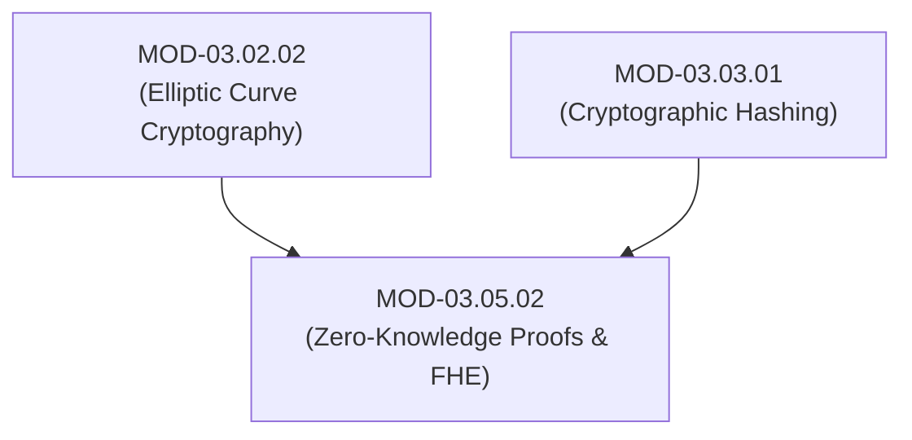

# Zero-Knowledge Proofs (zk-SNARKs/zk-STARKs) & Fully Homomorphic Encryption (FHE)

## 1. Overview & Purpose
Advanced cryptographic primitives allow proving statement validity without revealing underlying private data or executing computations over encrypted data without decrypting it.

This module details Zero-Knowledge Proofs (zk-SNARKs vs zk-STARKs), Rank-1 Constraint Systems (R1CS), Trusted Setups, Fully Homomorphic Encryption (FHE schemes like BGV, CKKS), and Secure Multi-Party Computation (SMPC).

---

## 2. Prerequisites & Prerequisites Graph
- **Prerequisites**: `MOD-03.02.02` (Elliptic Curves) & `MOD-03.03.01` (Hash Functions).



---

## 3. Learning Objectives & Taxonomy Alignment
- **L1 Awareness**: Define Zero-Knowledge properties (Completeness, Soundness, Zero-Knowledge).
- **L2 Understanding**: Explain non-interactive zero-knowledge proofs (zk-SNARKs), transparent quantum-safe zk-STARKs, and homomorphic operations ($E(x) + E(y) = E(x+y)$).
- **L3 Practical**: Compile Circom ZK circuits, generate proof/verifier keys, and test homomorphic additions in Python.
- **L4 Engineering**: Design privacy-preserving Zero-Trust identity verification systems using zk-SNARKs.

---

## 4. L1 — Awareness (Overview & Core Terminology)
A **Zero-Knowledge Proof (ZKP)** allows a Prover to convince a Verifier that a statement is true (e.g., "I know the password to this hash") without revealing the secret statement itself. **Fully Homomorphic Encryption (FHE)** allows arbitrary mathematical calculations to run directly over encrypted ciphertexts.

---

## 5. L2 — Understanding (Core Theory & Mechanics)

```mermaid
graph TD
    subgraph Zero-Knowledge Proof Workflow (zk-SNARKs)
        WITNESS["Private Witness (Secret Inputs w)"]
        CIRCUIT["Arithmetic Circuit (R1CS Constraints)"]
        PROVER["Prover Engine (Generates Cryptographic Proof π)"]
        VERIFIER["Verifier Engine (Checks π using Public Inputs x)"]

        WITNESS --> CIRCUIT
        CIRCUIT --> PROVER
        PROVER -->|Sends Proof π (Small Byte Size)| VERIFIER
        VERIFIER -->|Returns Valid / Invalid in Milliseconds| OUT["Result: Valid (0 Private Data Exposed!)"]
    end

    subgraph Fully Homomorphic Encryption (FHE Evaluation)
        ENC_DATA1["Encrypted X: E(x)"]
        ENC_DATA2["Encrypted Y: E(y)"]
        CLOUD["Untrusted Cloud Processor"]

        ENC_DATA1 --> CLOUD
        ENC_DATA2 --> CLOUD
        CLOUD -->|Executes Add/Multiply on Ciphertexts| ENC_RESULT["Encrypted Result: E(x * y)"]
        ENC_RESULT -->|Decrypted by Owner| PLAIN_RESULT["Result: x * y"]
    end
```

### Core Properties of Zero-Knowledge Proofs:
1. **Completeness**: If the statement is true, an honest verifier will be convinced by an honest prover.
2. **Soundness**: If the statement is false, no cheating prover can convince an honest verifier except with negligible probability.
3. **Zero-Knowledge**: The verifier learns nothing about the secret statement other than its validity.

### zk-SNARKs vs zk-STARKs:
- **zk-SNARKs**: Succinct Non-Interactive Argument of Knowledge. Requires an initial **Trusted Setup** (structured reference string - SRS), yields tiny proof sizes (~200 bytes), but is vulnerable to quantum attacks.
- **zk-STARKs**: Scalable Transparent Argument of Knowledge. **No Trusted Setup** required (transparent), uses hash functions (post-quantum safe), but produces larger proof sizes (~50 KB).

---

## 6. L3 — Practical (Commands & Configurations)

### Writing a Simple ZK Circuit in Circom (Age Verification Circuit):
```circom
pragma circom 2.1.0;

// Verifies User Age >= 21 without exposing exact birthdate!
template AgeCheck() {
    signal input birthYear;
    signal input currentYear;
    signal output isAdult;

    signal age;
    age <-- currentYear - birthYear;
    
    // Constraint: age >= 21
    component gte = GreaterEqThan(7);
    gte.in[0] <== age;
    gte.in[1] <== 21;
    
    isAdult <== gte.out;
}
component main = AgeCheck();
```

---

## 7. L4 — Engineering (Design Trade-offs & System Integration)
- **FHE Performance Overhead**: Fully Homomorphic Encryption enables searching or training ML models over encrypted database records in untrusted cloud environments without revealing data. However, FHE operations run $10,000 \times - 100,000 \times$ slower than plaintext operations, restricting current deployment to high-value financial/medical analytics.

---

## 8. Internal Architecture & Data Structures
Comparison Matrix of Advanced Cryptographic Primitives:
```text
┌──────────────┬──────────────────┬─────────────────┬──────────────────┬─────────────────┐
│ Primitive    │ Proof / Data Size│ Trusted Setup   │ Quantum Safe     │ Computation Cost│
├──────────────┼──────────────────┼─────────────────┼──────────────────┼─────────────────┤
│ zk-SNARKs    │ Very Small (~200B│ Required        │ No (ECC-based)   │ High Prover     │
│ zk-STARKs    │ Medium (~50KB)   │ No (Transparent)│ Yes (Hash-based) │ High Prover     │
│ FHE (CKKS)   │ Large (MBs)      │ No              │ Yes (Lattice)    │ Extremely High  │
└──────────────┴──────────────────┴─────────────────┴──────────────────┴─────────────────┘
```

---

## 9. Security Implications & Boundary Controls
- **Toxic Waste in Trusted Setups**: If the randomness (toxic waste) used during a zk-SNARK trusted setup ceremony is retained by participants, they can forge fake zero-knowledge proofs for arbitrary false statements.

---

## 10. Attack Vectors & Exploitation Primitives
1. **Trusted Setup Compromise**: Retaining SRS entropy to forge valid zk-SNARK proofs.
2. **Under-Constrained ZK Circuits**: Missing mathematical constraints in Circom code allowing provers to supply invalid inputs that pass verification.

---

## 11. Defense & Telemetry Verification
- Utilize **Multi-Party Computation (MPC) Ceremonies** for trusted setups.
- Use static analysis tools (`circomspect`) to audit Circom circuits for under-constrained signals.

---

## 12. Detection & Telemetry Verification

### Auditing Circom Circuits via Static Analyzer:
```bash
# Analyze circom code for missing constraints
circomspect ./circuits/age_check.circom
```

---

## 13. Hands-On Lab Reference
- **Associated Lab**: `LAB-CRY010` (Circom Zero-Knowledge Circuit Development & Proof Generation).

---

## 14. Related Projects & Applications
- **Associated Project**: `PRJ-TIP001` (Cryptographic Engine).

---

## 15. Troubleshooting & Diagnostics Matrix

| Symptom | Root Cause | Remediation / Diagnostic Command |
| :--- | :--- | :--- |
| `snarkjs` throws `Error: Assert Failed`. | Witness input values do not satisfy R1CS circuit constraints. | Verify input signals against arithmetic circuit rules. |

---

## 16. Related Concepts & Cross-Domain Links
- `CON-CRY028`: Zero-Knowledge Proofs ZKP (`DOM-03`)
- `CON-CRY029`: zk-SNARKs vs zk-STARKs (`DOM-03`)
- `CON-CRY030`: Fully Homomorphic Encryption FHE (`DOM-03`)

---

## 17. Technical Interview Preparation (Q&A)
**Q: What is the fundamental difference between zk-SNARKs and zk-STARKs?**  
*Answer*: zk-SNARKs generate tiny proof sizes (~200 bytes) with fast verification times, but require an initial "Trusted Setup" phase to generate structured reference strings (which introduces risk if setup entropy is retained) and rely on elliptic curve math vulnerable to quantum computers. zk-STARKs require no trusted setup (they are transparent), rely strictly on cryptographic hash functions (making them post-quantum secure), but produce larger proof sizes (~50 KB).

---

## 18. Self-Assessment & Mastery Checklist
- [ ] Understand Completeness, Soundness, and Zero-Knowledge definitions.
- [ ] Able to write and compile a basic Circom zero-knowledge circuit.

---

## 19. References & Further Reading
- Eli Ben-Sasson et al.: *Scalable, Transparent, and Post-Quantum Secure Computational Integrity (zk-STARKs)*.
- Shafi Goldwasser, Silvio Micali, Charles Rackoff: *The Knowledge Complexity of Interactive Proof-Systems*.
- Zama: *TFHE & Concrete Fully Homomorphic Encryption Documentation*.
