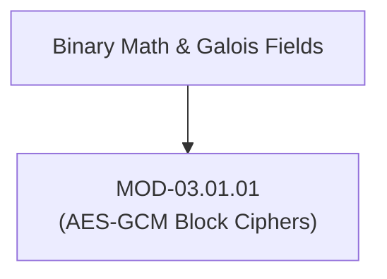
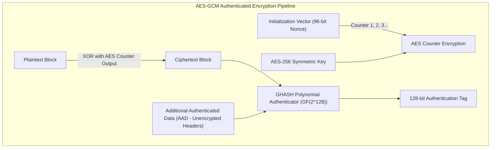

# Block Cipher Architecture (AES-GCM, AES-CBC & AEAD)

## 1. Overview & Purpose
Symmetric block ciphers transform fixed-size blocks of plaintext into ciphertext using secret symmetric keys.

This module details Advanced Encryption Standard (AES) Substitution-Permutation Networks (SPN), Cipher Block Chaining (CBC) padding oracle vulnerabilities, Authenticated Encryption with Associated Data (AEAD) via Galois Counter Mode (AES-GCM), and catastrophic Nonce Reuse attacks.

---

## 2. Prerequisites & Prerequisites Graph
- **Prerequisites**: Binary arithmetic, XOR operations.



---

## 3. Learning Objectives & Taxonomy Alignment
- **L1 Awareness**: Contrast ECB, CBC, and GCM cipher modes.
- **L2 Understanding**: Explain AES internal rounds (`SubBytes`, `ShiftRows`, `MixColumns`, `AddRoundKey`) and Galois Field $\text{GF}(2^8)$ multiplication.
- **L3 Practical**: Encrypt and decrypt payloads via OpenSSL CLI and Python `cryptography` libraries.
- **L4 Engineering**: Design AES-NI hardware-accelerated zero-trust encryption pipelines.

---

## 4. L1 — Awareness (Overview & Core Terminology)
AES operates on 128-bit (16-byte) blocks with key sizes of 128, 192, or 256 bits. **AEAD ciphers (AES-GCM)** provide both confidentiality (encryption) and data integrity (authentication tag), replacing unauthenticated legacy modes like CBC.

---

## 5. L2 — Understanding (Core Theory & Mechanics)



### AES Internal State Rounds (10/12/14 Rounds):
1. **SubBytes**: Non-linear byte substitution using S-box.
2. **ShiftRows**: Cyclic byte shifts across state matrix rows.
3. **MixColumns**: Matrix multiplication over Galois Field $\text{GF}(2^8)$.
4. **AddRoundKey**: Bitwise XOR with round subkey derived via AES Key Schedule.

### Catastrophic GCM Nonce Reuse Attack:
If the same Nonce (IV) is reused twice with the same AES key, an attacker can XOR the two ciphertexts together, eliminating the keystream to recover plaintext XOR differences ($C_1 \oplus C_2 = P_1 \oplus P_2$), and calculate the authentication key $H$ to forge valid GCM tags.

---

## 6. L3 — Practical (Commands & Configurations)

### Executing AES-256-GCM Encryption in Python:
```python
from cryptography.hazmat.primitives.ciphers.aead import AESGCM
import os

# Generate random 256-bit key and 96-bit nonce
key = AESGCM.generate_key(bit_length=256)
nonce = os.urandom(12)
aesgcm = AESGCM(key)

# Encrypt with Additional Authenticated Data (AAD)
aad = b"header_data_unencrypted"
plaintext = b"Confidential Payload Data"
ciphertext = aesgcm.encrypt(nonce, plaintext, aad)

# Decrypt and verify 128-bit tag
decrypted_payload = aesgcm.decrypt(nonce, ciphertext, aad)
assert decrypted_payload == plaintext
```

---

## 7. L4 — Engineering (Design Trade-offs & System Integration)
- **AES-NI Instruction Set Acceleration**: Modern x86_64 CPUs execute AES operations in hardware using specialized instructions (`aesenc`, `aesenclast`), achieving 10+ Gbps encryption speeds with zero side-channel timing leakage.

---

## 8. Internal Architecture & Data Structures
AES $4 \times 4$ State Matrix Layout (16 Bytes):
```text
┌───┬───┬───┬───┐
│s0 │s4 │s8 │s12│
├───┼───┼───┼───┤
│s1 │s5 │s9 │s13│
├───┼───┼───┼───┤
│s2 │s6 │s10│s14│
├───┼───┼───┼───┤
│s3 │s7 │s11│s15│
└───┴───┴───┴───┘
```

---

## 9. Security Implications & Boundary Controls
- **Padding Oracle Attacks (CBC Mode)**: In AES-CBC mode, detailed error messages indicating PKCS#7 padding failure allow attackers to decrypt arbitrary ciphertexts 1 byte at a time using $256 \times N$ requests.

---

## 10. Attack Vectors & Exploitation Primitives
1. **CBC Padding Oracle (Vaudenay Attack)**: Manipulating ciphertext bytes to deduce plaintexts via side-channel padding errors.
2. **GCM Nonce Reuse**: XORing dual ciphertexts to recover plaintexts and forge authentication tags.

---

## 11. Defense & Telemetry Verification
- Enforce **AEAD Modes Only (AES-256-GCM / ChaCha20-Poly1305)**; ban unauthenticated AES-CBC/ECB.
- Generate nonces using cryptographically secure CSPRNGs (`os.urandom`) or deterministic counter sequences.

---

## 12. Detection & Telemetry Verification

### Telemetry Check for Weak Cipher Use:
```bash
# Audit TLS endpoints for legacy CBC or ECB cipher suites
openssl s_client -connect target.corp:443 -cipher "ECDHE-RSA-AES128-SHA"
```

---

## 13. Hands-On Lab Reference
- **Associated Lab**: `LAB-CRY001` (AES-GCM Nonce Reuse & Padding Oracle Analysis).

---

## 14. Related Projects & Applications
- **Associated Project**: `PRJ-TIP001` (Cryptographic Engine).

---

## 15. Troubleshooting & Diagnostics Matrix

| Symptom | Root Cause | Remediation / Diagnostic Command |
| :--- | :--- | :--- |
| `cryptography.exceptions.InvalidTag` during GCM decryption. | Ciphertext corrupted or AAD payload mismatched during tag calculation. | Verify AAD headers match exactly between encryptor and decryptor. |

---

## 16. Related Concepts & Cross-Domain Links
- `CON-CRY003`: AES-GCM Authenticated Encryption (`DOM-03`)
- `CON-CRY004`: Padding Oracle Attacks (`DOM-03`)

---

## 17. Technical Interview Preparation (Q&A)
**Q: Why does AES-GCM require a unique 96-bit Nonce for every encryption operation under a single key?**  
*Answer*: AES-GCM generates a keystream by encrypting increments of the Nonce counter. If a Nonce is reused with the same key, identical keystreams are produced. An attacker can XOR the two ciphertexts to cancel out the keystream, revealing $P_1 \oplus P_2$. Furthermore, Nonce reuse allows an attacker to compute the authentication key $H$, enabling arbitrary ciphertext and tag forgery.

---

## 18. Self-Assessment & Mastery Checklist
- [ ] Understand AES 4-step round operations.
- [ ] Able to write Python scripts implementing AEAD AES-256-GCM.

---

## 19. References & Further Reading
- NIST SP 800-38D: *Recommendation for Block Cipher Modes of Operation: Galois/Counter Mode (GCM)*.
- FIPS PUB 197: *Advanced Encryption Standard (AES)*.
