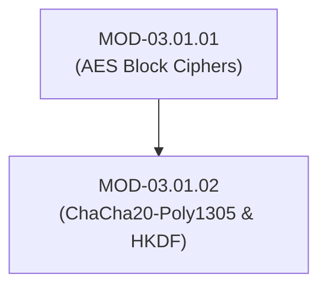

# Stream Ciphers (ChaCha20-Poly1305), HKDF & Password Hashing

## 1. Overview & Purpose
Stream ciphers encrypt arbitrary-length plaintext by combining bytes with a pseudorandom keystream, offering high performance on hardware without dedicated AES acceleration.

This module covers ChaCha20 quarter-round primitives, Poly1305 MAC authentication, HKDF key derivation (Extract-and-Expand), and memory-hard password hashing algorithms (Argon2id, PBKDF2, bcrypt).

---

## 2. Prerequisites & Prerequisites Graph
- **Prerequisites**: `MOD-03.01.01` (Symmetric Block Ciphers).



---

## 3. Learning Objectives & Taxonomy Alignment
- **L1 Awareness**: Explain stream ciphers vs block ciphers and key derivation concepts.
- **L2 Understanding**: Detail ChaCha20 quarter-round ARX (Add-Rotate-XOR) matrix operations and Argon2id memory-hardness against GPU/ASIC cracking.
- **L3 Practical**: Derive subkeys via HKDF and generate password hashes using Argon2id in Python.
- **L4 Engineering**: Design zero-trust mobile transport security using ChaCha20-Poly1305 for non-AES-NI devices.

---

## 4. L1 — Awareness (Overview & Core Terminology)
ChaCha20-Poly1305 combines the **ChaCha20 256-bit stream cipher** with the **Poly1305 128-bit MAC authenticator**. It is mandatory in TLS 1.3 and WireGuard. **HKDF (RFC 5869)** derives cryptographically strong subkeys from master secrets.

---

## 5. L2 — Understanding (Core Theory & Mechanics)

```mermaid
graph TD
    subgraph ChaCha20 4x4 Matrix Quarter-Round State (64 Bytes)
        CONST["Constant Words (16B: 'expand 32-byte k')"]
        KEY["256-bit Key (32B / 8 Words)"]
        COUNTER["Counter (4B / 1 Word)"]
        NONCE["96-bit Nonce (12B / 3 Words)"]

        CONST --> MATRIX["4x4 State Matrix"]
        KEY --> MATRIX
        COUNTER --> MATRIX
        NONCE --> MATRIX

        MATRIX -->|20 Double Rounds (ARX Operations)| KEYSTREAM["64-Byte Keystream Block"]
    end

    subgraph Argon2id Memory-Hard Password Hashing
        PASS["User Password + Salt"] --> L1["Lane Generation"]
        L1 --> MEM_GRID["Memory Grid Allocation (e.g. 64MB RAM Grid)"]
        MEM_GRID -->|Data-Independent (Argon2i) + Data-Dependent (Argon2d)| HASH_OUT["Derived 256-bit Hash"]
    end
```

### ChaCha20 Quarter-Round Primitive (ARX Operations):
Operates on four 32-bit unsigned integers ($a, b, c, d$):
$$\begin{aligned}
a &= a + b; \quad d &= (d \oplus a) \lll 16 \\
c &= c + d; \quad b &= (b \oplus c) \lll 12 \\
a &= a + b; \quad d &= (d \oplus a) \lll 8 \\
c &= c + d; \quad b &= (b \oplus c) \lll 7
\end{aligned}$$

---

## 6. L3 — Practical (Commands & Configurations)

### Password Hashing using Argon2id in Python:
```python
from argon2 import PasswordHasher

# Initialize Argon2id hasher with recommended security parameters
ph = PasswordHasher(
    time_cost=3,        # 3 iterations
    memory_cost=65536,  # 64 MB RAM
    parallelism=4,      # 4 parallel threads
    hash_len=32,
    salt_len=16
)

# Hash password
user_password = "SuperSecretPassword123!"
hashed_pw = ph.hash(user_password)
print(f"Argon2id Hash: {hashed_pw}")

# Verify password
ph.verify(hashed_pw, "SuperSecretPassword123!") # Returns True
```

---

## 7. L4 — Engineering (Design Trade-offs & System Integration)
- **Why Argon2id for Password Hashing?**: Standard hashes (SHA-256) execute quickly, allowing GPU clusters to test billions of guesses per second. Argon2id forces high memory consumption (e.g., 64MB per hash), rendering GPU and ASIC parallel cracking arrays ineffective.

---

## 8. Internal Architecture & Data Structures
ChaCha20 64-Byte State Matrix:
```text
┌──────────┬──────────┬──────────┬──────────┐
│  0x61707865  │  0x3320646e  │  0x79622d32  │  0x6b206574  │ (Constants)
├──────────┼──────────┼──────────┼──────────┤
│   Key 0  │   Key 1  │   Key 2  │   Key 3  │ (256-bit Key)
├──────────┼──────────┼──────────┼──────────┤
│   Key 4  │   Key 5  │   Key 6  │   Key 7  │
├──────────┼──────────┼──────────┼──────────┤
│  Counter │  Nonce 0 │  Nonce 1 │  Nonce 2 │ (32b Counter + 96b Nonce)
└──────────┴──────────┴──────────┴──────────┘
```

---

## 9. Security Implications & Boundary Controls
- **HKDF Salt Security**: HKDF-Extract utilizes a salt to extract pseudo-random keys from input keying material. Omitting salts reduces entropy quality when deriving subkeys from low-entropy inputs.

---

## 10. Attack Vectors & Exploitation Primitives
1. **GPU/ASIC Password Cracking**: Cracking legacy weak hashes (MD5, SHA-1, single-round SHA-256) using Hashcat arrays.
2. **ChaCha20 Nonce Reuse**: XORing outputs to break confidentiality when nonces are repeated under the same key.

---

## 11. Defense & Telemetry Verification
- Enforce **Argon2id** (Winner of Password Hashing Competition) for user password storage.
- Use **HKDF (RFC 5869)** for key derivation in cryptographic protocols.

---

## 12. Detection & Telemetry Verification

### Telemetry Check for Argon2id Parameters:
```python
# Verify Argon2id configuration meets OWASP guidelines
assert memory_cost >= 65536  # 64 MB Minimum
assert time_cost >= 2        # 2 Iterations Minimum
```

---

## 13. Hands-On Lab Reference
- **Associated Lab**: `LAB-CRY002` (HKDF Key Derivation & Argon2id Benchmarking).

---

## 14. Related Projects & Applications
- **Associated Project**: `PRJ-TIP001` (Cryptographic Engine).

---

## 15. Troubleshooting & Diagnostics Matrix

| Symptom | Root Cause | Remediation / Diagnostic Command |
| :--- | :--- | :--- |
| Server CPU maxes out during user login surges. | Argon2id `time_cost` or `memory_cost` configured too high for server thread pool. | Tune Argon2id parameters (e.g. 32MB / 2 iterations) to balance security and latency. |

---

## 16. Related Concepts & Cross-Domain Links
- `CON-CRY005`: ChaCha20-Poly1305 (`DOM-03`)
- `CON-CRY006`: HKDF Key Derivation (`DOM-03`)
- `CON-CRY007`: Argon2id Memory-Hard Hashing (`DOM-03`)

---

## 17. Technical Interview Preparation (Q&A)
**Q: What makes Argon2id superior to PBKDF2 for password hashing?**  
*Answer*: PBKDF2 relies solely on CPU iteration loops, allowing adversaries to build custom GPU/ASIC hardware arrays capable of running millions of parallel candidate checks. Argon2id is a memory-hard algorithm that forces each hashing thread to allocate large memory arrays (e.g., 64MB RAM per attempt), rendering GPU memory bandwidth the limiting bottleneck and neutralizing specialized cracking hardware.

---

## 18. Self-Assessment & Mastery Checklist
- [ ] Understand ChaCha20 ARX quarter-round steps.
- [ ] Able to configure Argon2id password hashing using OWASP guidelines.

---

## 19. References & Further Reading
- RFC 8439: *ChaCha20 and Poly1305 for IETF Protocols*.
- RFC 5869: *HMAC-based Extract-and-Expand Key Derivation Function (HKDF)*.
- OWASP: *Password Storage Cheat Sheet*.
