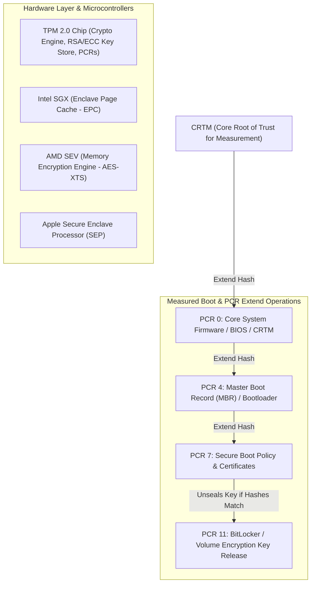

# Hardware Root of Trust, TPM 2.0 & Secure Enclaves

## 1. Overview & Purpose
Software security measures are only as secure as the underlying hardware anchor that validates their integrity during system boot and runtime execution.

This module details hardware roots of trust, Trusted Platform Module 2.0 (TPM 2.0), Platform Configuration Registers (PCRs), Measured Boot vs Secure Boot, Intel SGX (Software Guard Extensions), AMD SEV (Secure Encrypted Virtualization), and Apple Secure Enclave Processor (SEP). Understanding hardware isolation enclaves is essential for confidential computing, full-disk encryption (BitLocker/LUKS), and Zero-Trust hardware attestation.

---

## 2. Architecture & Key Components



---

## 3. Detailed Mechanics & Internal Structures

### 3.1 Trusted Platform Module (TPM 2.0) Architecture
A TPM is an isolated secure microcontroller containing non-volatile key storage, hardware random number generators (RNG), cryptographic engines, and **Platform Configuration Registers (PCRs)**.

#### PCR Extend Mechanics:
PCR registers cannot be overwritten directly. They can only be updated via the hardware `Extend` operation, which cryptographically chains new measurement hashes with previous values:

$$\text{PCR}_{\text{new}} = \text{SHA-256}(\text{PCR}_{\text{old}} \mathbin{\Vert} \text{Hash}(\text{Component}))$$

- **PCR 0**: Firmware / UEFI BIOS code.
- **PCR 4**: Boot Manager (`bootmgr.efi` / `grub`).
- **PCR 7**: Secure Boot state and DB/DBX certificate databases.
- **Key Unsealing**: BitLocker seals the Volume Master Key (VMK) inside the TPM, specifying that PCR 0, 4, 7, and 11 must match expected golden hashes. If an attacker tampers with the bootloader, PCR values change, and the TPM refuses to release the encryption key.

---

### 3.2 Secure Enclaves & Confidential Computing

#### Intel SGX (Software Guard Extensions):
- Creates isolated memory regions called **Enclaves** inside the Enclave Page Cache (EPC).
- Hardware Memory Encryption Engine (MEE) encrypts EPC RAM pages on the fly.
- Even if the host OS kernel or hypervisor is completely compromised by malware, Ring 0 **cannot read or write enclave memory**.

#### AMD SEV (Secure Encrypted Virtualization):
- Encrypts entire Virtual Machine memory spaces using distinct AES-128/256 keys managed by the dedicated AMD Secure Processor.
- Prevents malicious hypervisors (Ring -1) from inspecting guest VM memory or registers.

---

## 4. Security Implications & Boundary Controls

- **Hardware Attestation**: Enables remote parties to verify that an application is executing inside a genuine, untampered hardware enclave via cryptographic signatures generated by TPM/SGX Endorsement Keys (EK).
- **Physical Bus Interception**: Encryption keys in transit over LPC/SPI buses between CPU and discrete TPM chips can be vulnerable to hardware sniffing if not protected by TPM 2.0 bus encryption.

---

## 5. Attack Vectors & Bypasses

1. **TPM Bus Sniffing (LPC / SPI Bus Interception)**:
   Attaching logic analyzer probes to unencrypted SPI/LPC bus traces between the CPU and discrete TPM chip to capture the plaintext BitLocker Volume Master Key (VMK) during boot unsealing.
2. **Enclave Side-Channel Attacks (Meltdown / Spectre / Foreshadow)**:
   Leveraging CPU speculative execution flaws to extract secret cryptographic keys from Intel SGX enclaves via cache timing side-channels.
3. **Firmware Downgrade Attacks**:
   Exploiting roll-back vulnerabilities in UEFI firmware to flash older, vulnerable firmware builds, bypassing PCR measurements.

---

## 6. Defense & Telemetry Verification

### Telemetry Tracing Sources:
- **Windows Security Log Event 7035**: TPM State & PCR Measurement verification.
- **Linux `tpm2-tools` Telemetry**: Remote attestation logs via TPM Quote operations.

---

## 7. Engineering & Hands-On Implementation

### Auditing TPM 2.0 PCR Values in Linux:
```bash
# Display TPM 2.0 PCR register values
tpm2_pcrread sha256:0,4,7,11

# Example Output:
# sha256:
#   0 : 0x47B2...
#   4 : 0x821A...
#   7 : 0xB901...
#  11 : 0x33F1...
```

---

## 8. Troubleshooting & Diagnostics

| Symptom | Root Cause | Remediation / Diagnostic Command |
| :--- | :--- | :--- |
| BitLocker prompts for Recovery Key on every boot. | PCR values shifted due to BIOS update, boot order change, or hardware modification. | Reseal BitLocker key using `manage-bde -protectors -disable C:` followed by `-enable`. |
| TPM 2.0 Initialization error: `TPM Provisioning Failed`. | TPM disabled in UEFI settings or owner authorization cleared. | Enable TPM 2.0 (fTPM / PTT) in UEFI BIOS configuration. |

---

## 9. References
- Trusted Computing Group (TCG), *TPM 2.0 Library Specification*.
- Intel Corporation, *Software Guard Extensions (SGX) Developer Reference*.
