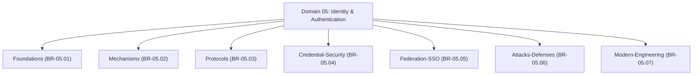

# Master Identity & Authentication Branch Index

## 1. Overview
This directory (`04 - Branch Knowledge/Identity-Authentication/`) houses the complete technical implementation of **Domain 05: Identity & Authentication**.

The domain is partitioned into **7 core engineering branches** covering identity foundations, authentication mechanisms, enterprise auth protocols, credential security, web federation & SSO, identity attacks & defenses, and modern workload identity engineering.

---

## 2. Directory & Module Map

### Module Registry Table

| Branch ID | Module ID | Module Title | File Location | Key Engineering Concepts |
| :--- | :--- | :--- | :--- | :--- |
| `BR-05.01` | **`MOD-05.01.01`** | **Digital Identity Foundations & Lifecycle** | `Foundations/01 - Digital Identity Foundations & Lifecycle.md` | IAL/AAL/FAL NIST 800-63-3 levels, Human vs Machine Identity, Lifecycle States. |
| `BR-05.02` | **`MOD-05.02.01`** | **Passkeys, MFA & FIDO2 WebAuthn** | `Mechanisms/01 - Passwords MFA & FIDO2 Passkeys.md` | TOTP RFC 6238, FIDO2 / WebAuthn, CTAP2, WebAuthn Challenge/Response. |
| `BR-05.03` | **`MOD-05.03.01`** | **Enterprise Auth Protocols Kerberos & NTLM** | `Protocols/01 - Enterprise Auth Protocols Kerberos & NTLM.md` | Kerberos Ticket Granting Ticket (TGT), Service Ticket (ST), NTLMv2 Challenge-Response. |
| `BR-05.03` | **`MOD-05.03.02`** | **Web Auth Protocols SAML, OAuth 2.0 & OIDC** | `Protocols/02 - Web Auth Protocols SAML OAuth2 & OIDC.md` | SAML 2.0 Assertions, OAuth 2.0 PKCE Flow, OpenID Connect ID Tokens (`id_token`). |
| `BR-05.04` | **`MOD-05.04.01`** | **Password Hashing Argon2id & Credential Theft** | `Credential-Security/01 - Password Hashing Argon2id & Credential Theft.md` | Argon2id memory-hardness, bcrypt, LSASS Dumping (`MiniDumpWriteDump`), SAM Hives. |
| `BR-05.05` | **`MOD-05.05.01`** | **Identity Federation, SSO & JWT Tokens** | `Federation-SSO/01 - Identity Federation SSO & JWT Tokens.md` | Identity Provider (IdP) vs Service Provider (SP), JWT Signature Verification, `alg: none`. |
| `BR-05.06` | **`MOD-05.06.01`** | **Identity Attacks (Pass-the-Hash & Golden Tickets)** | `Attacks-Defenses/01 - Identity Attacks Pass-the-Hash & Golden Tickets.md` | Credential Stuffing, Pass-the-Hash (PtH), Pass-the-Ticket (PtT), KRBTGT Golden Tickets. |
| `BR-05.07` | **`MOD-05.07.01`** | **Machine & Workload Identity (SPIFFE, K8s & Cloud)** | `Modern-Engineering/01 - Machine & Workload Identity SPIFFE K8s & Cloud.md` | SPIFFE/SPIRE SVIDs, K8s ServiceAccount JWT Tokens, AWS IAM OIDC Federation. |
