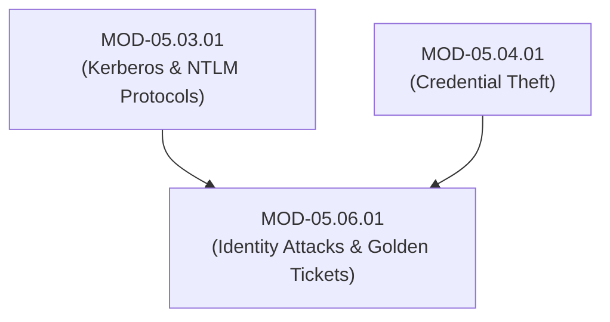

# Identity Attack Primitives (Credential Stuffing, Pass-the-Hash, Pass-the-Ticket & Golden Tickets)

## 1. Overview & Purpose
Adversaries target identity infrastructures to achieve initial access, elevate privileges, and maintain persistent domain dominance across enterprise networks.

This module details Password Spraying, Credential Stuffing, Pass-the-Hash (PtH), Pass-the-Ticket (PtT), Kerberos KRBTGT Golden Tickets, Silver Tickets, and Authentication Bypass primitives.

---

## 2. Prerequisites & Prerequisites Graph
- **Prerequisites**: `MOD-05.03.01` (Kerberos & NTLM) & `MOD-05.04.01` (Password Hashing).



---

## 3. Learning Objectives & Taxonomy Alignment
- **L1 Awareness**: Contrast Credential Stuffing, Password Spraying, Pass-the-Hash, and Golden Ticket attacks.
- **L2 Understanding**: Detail Kerberos KRBTGT account password hashing, PAC forging mechanics, and NTLM Pass-the-Hash network execution.
- **L3 Practical**: Detect Golden Tickets via Event Log analysis and execute Impacket `psexec.py` / `sekurlsa::pth` simulations.
- **L4 Engineering**: Design enterprise Active Directory tiering models (Tier 0 / Tier 1 / Tier 2) isolating domain administrator credentials.

---

## 4. L1 — Awareness (Overview & Core Terminology)
**Password Spraying** tests a single common password (`Password123!`) across thousands of usernames to avoid account lockout thresholds. **Pass-the-Hash (PtH)** authenticates using an NTLM hash directly without cracking the plaintext password. A **Golden Ticket** is a forged Kerberos TGT signed with the domain's secret `KRBTGT` key, granting unlimited domain admin access.

---

## 5. L2 — Understanding (Core Theory & Mechanics)

```mermaid
graph TD
    subgraph Active Directory Golden Ticket Forgery Mechanics
        ATTACKER["Adversary (Dumped KRBTGT Password Hash via DCSync)"]
        CLIENT["Attacker Workstation"]
        DC["Domain Controller (KDC)"]
        MEMBER["Member Server (SharePoint / MSSQL)"]

        ATTACKER -->|1. Forges Kerberos TGT (Injects Domain Admin SID 500 into PAC) Signed with KRBTGT Hash| CLIENT
        CLIENT -->|2. Presents Forged TGT in TGS-REQ| DC
        DC -->|3. Validates TGT Signature against KRBTGT Hash -> Returns Valid Service Ticket (ST)| CLIENT
        CLIENT -->|4. Presents ST to Member Server| MEMBER
        MEMBER -->|5. Grants Domain Admin Access without Domain Controller Verification!| CLIENT
    end
```

### Golden Ticket vs Silver Ticket:
- **Golden Ticket**: Forged using the **`KRBTGT` account hash**. Encrypts a TGT, allowing the attacker to request Service Tickets for *any* service across the entire Active Directory forest for up to 10 years.
- **Silver Ticket**: Forged using a specific **Service Account hash** (e.g. `cifs/server01`). Encrypts a Service Ticket directly, granting access only to that specific target service without communicating with the KDC.

---

## 6. L3 — Practical (Commands & Configurations)

### Executing Pass-the-Hash via Impacket (`psexec.py`):
```bash
# Authenticate to target host using NTLM Hash directly (No plaintext password required!)
python3 psexec.py Administrator@192.168.1.10 -hashes :aad3b435b51404eeaad3b435b51404ee:31d6cfe0d16ae931b73c59d7e0c089c0
```

### Forging Golden Ticket via Mimikatz:
```text
mimikatz # kerberos::golden /domain:corp.internal /sid:S-1-5-21-123456789-987654321-111111 /rc4:2b57605886e082... /user:Administrator /id:500 /ptt
```

---

## 7. L4 — Engineering (Design Trade-offs & System Integration)
- **Active Directory Administrative Tiering Model**: Tier 0 (Domain Controllers, KRBTGT), Tier 1 (Enterprise Servers), Tier 2 (User Workstations). Tier 0 accounts MUST NEVER log into Tier 1 or Tier 2 machines to prevent credential dumping and Pass-the-Hash escalation.

---

## 8. Internal Architecture & Data Structures
Active Directory Privilege Attribute Certificate (PAC) Structure:
```text
PAC_LOGON_INFO ::= STRUCTURE {
  UserSid: S-1-5-21-...-1001,
  GroupSids: [
    S-1-5-21-...-513 (Domain Users),
    S-1-5-21-...-512 (Domain Admins - Forged by Golden Ticket!)
  ],
  ServerSignature: HMAC-SHA1(Service Key),
  KdcSignature: HMAC-SHA1(KRBTGT Key)
}
```

---

## 9. Security Implications & Boundary Controls
- **Resetting KRBTGT Password Twice**: If a `KRBTGT` key compromise occurs, the `KRBTGT` account password MUST be reset **twice** (with 24 hours between resets) to invalidate all existing Golden Tickets and historic password hashes.

---

## 10. Attack Vectors & Exploitation Primitives
1. **Pass-the-Hash (PtH)**: Replaying NTLM hashes over SMB/RPC (`port 445`).
2. **Golden Ticket Persistence**: Injecting forged TGTs to maintain 10-year persistence.

---

## 11. Defense & Telemetry Verification
- Enable **Protected Users Security Group** in Active Directory (disables NTLM and weak Kerberos encryption).
- Rotate `KRBTGT` account password on a 180-day schedule.

---

## 12. Detection & Telemetry Verification

### Windows Event ID 4624 (Pass-the-Hash Detection via Logon Type 3 with NTLM):
```yaml
title: Potential Pass-the-Hash Activity via Network Logon
id: c9102941-8210-41ab-b01b-920191fa6605
logsource:
  category: security
  product: windows
detection:
  selection:
    EventID: 4624
    LogonType: 3 # Network Logon
    AuthenticationPackageName: NTLM
    KeyLength: 0
  condition: selection
level: high
```

---

## 13. Hands-On Lab Reference
- **Associated Lab**: `LAB-IDE007` (Pass-the-Hash Exploitation & KRBTGT Golden Ticket Analysis).

---

## 14. Related Projects & Applications
- **Associated Project**: `PRJ-SEC001` (Secure Healthcare Platform).

---

## 15. Troubleshooting & Diagnostics Matrix

| Symptom | Root Cause | Remediation / Diagnostic Command |
| :--- | :--- | :--- |
| `KRB_AP_ERR_MODIFIED` when using Silver Ticket. | Service account password hash changed since Silver Ticket was generated. | Re-dump service hash or verify target SPN service account settings. |

---

## 16. Related Concepts & Cross-Domain Links
- `CON-IDE013`: Pass-the-Hash PtH (`DOM-05`)
- `CON-IDE014`: KRBTGT Golden Tickets (`DOM-05`)
- `CON-WIN006`: Active Directory Tiering Model (`DOM-10`)

---

## 17. Technical Interview Preparation (Q&A)
**Q: What is a Kerberos Golden Ticket attack, how is it constructed, and why does resetting the KRBTGT password once fail to mitigate it?**  
*Answer*: A Golden Ticket is a forged Kerberos Ticket Granting Ticket (TGT). An adversary who obtains the secret password hash of the Active Directory `KRBTGT` account uses offline tools (Mimikatz) to forge a valid TGT, injecting arbitrary user SIDs (such as Domain Admins SID 512) into the Privilege Attribute Certificate (PAC) and signing it with the `KRBTGT` hash. Because Active Directory retains the *previous* `KRBTGT` password hash to support active ticket validity windows during password rotation, resetting the `KRBTGT` password once leaves the old hash valid for existing tickets. The `KRBTGT` password MUST be reset **twice** (allowing active ticket lifetimes to expire) to completely invalidate all forged Golden Tickets.

---

## 18. Self-Assessment & Mastery Checklist
- [ ] Understand Golden Ticket vs Silver Ticket differences.
- [ ] Able to identify Pass-the-Hash telemetry signatures in Windows Event 4624 logs.

---

## 19. References & Further Reading
- MITRE ATT&CK: *Technique T1558.001 - Steal or Forge Kerberos Tickets: Golden Ticket*.
- Microsoft Security Guidance: *Securing Active Directory Administrative Interfaces*.
