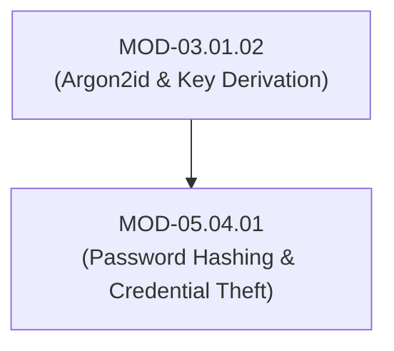

# Password Hashing Algorithms (Argon2id, bcrypt) & Credential Dumping Safeguards

## 1. Overview & Purpose
Passwords must never be stored in plaintext. Secure credential storage relies on specialized, computationally expensive key derivation functions designed to resist GPU and ASIC brute-force attacks.

This module details Password Hashing Functions (Argon2id, bcrypt, PBKDF2), Memory-Hardness, Cryptographic Salts, Work Factors, Credential Theft Primitives (LSASS Dumping, SAM Hives, DPAPI), and Credential Hardening.

---

## 2. Prerequisites & Prerequisites Graph
- **Prerequisites**: `MOD-03.01.02` (Argon2id & Stream Ciphers).



---

## 3. Learning Objectives & Taxonomy Alignment
- **L1 Awareness**: Explain why general cryptographic hashes (SHA-256) are inappropriate for password storage.
- **L2 Understanding**: Detail Argon2id memory-hardness parameters (Memory $m$, Time iterations $t$, Parallelism $p$) and LSASS memory dumping mechanics (`MiniDumpWriteDump`).
- **L3 Practical**: Implement Argon2id password hashing in Python and audit Windows PPL / Credential Guard protections.
- **L4 Engineering**: Design enterprise credential storage and secret management systems with HSM integration.

---

## 4. L1 — Awareness (Overview & Core Terminology)
Fast cryptographic hashes (SHA-256) process billions of hashes per second on GPUs, making them vulnerable to offline dictionary attacks. **Password Hashing Functions (Argon2id)** force high CPU time and RAM usage, neutralizing GPU acceleration.

---

## 5. L2 — Understanding (Core Theory & Mechanics)

```mermaid
graph TD
    subgraph Argon2id Password Hashing Memory-Hard Mechanics
        PASS["Plaintext User Password"]
        SALT["Cryptographic Salt (16 Bytes Random)"]
        PARAMS["Argon2id Parameters: Memory=64MB, Time=3 Iterations, Parallelism=4 Threads"]

        PASS --> ARGON["Argon2id Algorithm (Resists GPU/ASIC Acceleration via RAM Memory Latency Blocks)"]
        SALT --> ARGON
        PARAMS --> ARGON

        ARGON --> HASH["Encoded Hash ($argon2id$v=19$m=65536,t=3,p=4$...)"]
    end

    subgraph LSASS Memory Dumping & Protection
        ATTACKER["Adversary Process (Mimikatz)"]
        LSASS["LSASS Process Memory (Holds Plaintext Kerberos/NTLM Hashes)"]
        PPL["RunAsPPL / Credential Guard (Virtualization-Based Security)"]

        ATTACKER -->|OpenProcess() / MiniDumpWriteDump()| LSASS
        PPL -->|Blocks Process Access & Isolates Memory in VBS Container| ATTACKER
    end
```

### Argon2id Parameters (Winner of Password Hashing Competition):
Argon2id combines **Argon2d** (resists GPU trade-off attacks) and **Argon2i** (resists side-channel timing attacks).
- **$m$ (Memory Cost)**: 64 MB (65,536 KiB) allocated in RAM per hash computation.
- **$t$ (Time Cost)**: 3 iterations over memory.
- **$p$ (Parallelism)**: 4 parallel threads.

---

## 6. L3 — Practical (Commands & Configurations)

### Hashing and Verifying Passwords with Argon2id in Python (`argon2-cffi`):
```python
from argon2 import PasswordHasher
from argon2.exceptions import VerifyMismatchError

# Initialize Argon2id Hasher with OWASP Recommended Parameters
ph = PasswordHasher(
    time_cost=3,        # 3 iterations
    memory_cost=65536,  # 64 MB RAM
    parallelism=4,      # 4 threads
    hash_len=32,
    salt_len=16
)

# Hash password (automatically generates unique random salt)
hash_str = ph.hash("EnterpriseSuperSecretPassword123!")
print(f"Argon2id Encoded Hash:\n{hash_str}")

# Verify password
try:
    ph.verify(hash_str, "EnterpriseSuperSecretPassword123!")
    print("Password Verification Successful!")
except VerifyMismatchError:
    print("Invalid Password!")
```

---

## 7. L4 — Engineering (Design Trade-offs & System Integration)
- **Work Factor Tuning & DoS Vulnerability**: Setting Argon2id parameters too high (e.g. 1 GB RAM per hash) allows attackers to trigger Denial of Service (DoS) by submitting thousands of simultaneous login requests, exhausting server RAM. Parameters MUST be tuned to complete in 250ms–500ms under expected API concurrency.

---

## 8. Internal Architecture & Data Structures
Argon2id Encoded String Format:
```text
$argon2id$v=19$m=65536,t=3,p=4$s29tZVNhbHQxMjM0NTY3OA$Y3J5cHRvRGF0YUhhc2hPdXRwdXQ...
└───────┘ └───┘ ──────────────┘ ────────────────────┘ ─────────────────────────┘
 Algorithm Ver   m, t, p Params    Base64 Salt (16B)     Base64 Digest (32B)
```

---

## 9. Security Implications & Boundary Controls
- **Never Use SHA-256 for Passwords**: An off-the-shelf GPU rig computes over 100 billion SHA-256 hashes per second, cracking 8-character passwords in minutes.

---

## 10. Attack Vectors & Exploitation Primitives
1. **LSASS Credential Dumping**: Calling `MiniDumpWriteDump` on `lsass.exe` process memory to extract cleartext credentials or NTLM hashes.
2. **Offline Hash Cracking (Hashcat)**: Cracking weak bcrypt/MD5/NTLM hashes using GPU wordlists.

---

## 11. Defense & Telemetry Verification
- Enforce **Argon2id** or **bcrypt (work factor >= 12)** for all password storage.
- Enable **Windows LSA Protection (`RunAsPPL=1`)** and **Credential Guard**.

---

## 12. Detection & Telemetry Verification

### Telemetry Check for LSASS Memory Access (Sysmon Event ID 10):
```yaml
title: LSASS Memory Dumping via Process Access
id: f9102941-8210-41ab-b01b-920191fa4405
logsource:
  category: process_access
  product: windows
detection:
  selection:
    TargetImage|endswith: '\lsass.exe'
    GrantedAccess: '0x1410' # PROCESS_VM_READ | PROCESS_QUERY_INFORMATION
  condition: selection
level: critical
```

---

## 13. Hands-On Lab Reference
- **Associated Lab**: `LAB-IDE005` (Argon2id Parameter Tuning & LSASS Memory Protection Audit).

---

## 14. Related Projects & Applications
- **Associated Project**: `PRJ-SEC001` (Secure Healthcare Platform).

---

## 15. Troubleshooting & Diagnostics Matrix

| Symptom | Root Cause | Remediation / Diagnostic Command |
| :--- | :--- | :--- |
| Login endpoint latency spikes to 3+ seconds under load. | Argon2id `time_cost` or `memory_cost` parameters set too high for server capacity. | Benchmark Argon2id execution time using `argon2 -t 2 -m 32768`. |

---

## 16. Related Concepts & Cross-Domain Links
- `CON-IDE009`: Argon2id Memory-Hard Hashing (`DOM-05`)
- `CON-IDE010`: LSASS Credential Dumping (`DOM-05`)
- `CON-WIN005`: Windows Credential Guard & PPL (`DOM-01`)

---

## 17. Technical Interview Preparation (Q&A)
**Q: Why are general-purpose cryptographic hash functions like SHA-256 unsuitable for password storage, and how does Argon2id mitigate GPU cracking?**  
*Answer*: General-purpose cryptographic hash functions (SHA-256, SHA-512) were engineered for high execution throughput (hashing gigabytes of data per second). A modern GPU cluster can compute over 100 billion SHA-256 hashes per second, allowing adversaries to execute brute-force dictionary attacks effortlessly. Argon2id is a memory-hard password hashing function designed to fill large blocks of RAM (e.g. 64 MB) during calculation. Because GPUs possess limited dedicated memory per core, allocating 64 MB per hash bottleneck GPU parallel execution, neutralizing offline hardware cracking.

---

## 18. Self-Assessment & Mastery Checklist
- [ ] Understand Argon2id $m$, $t$, $p$ parameters.
- [ ] Able to audit Windows LSASS RunAsPPL registry settings.

---

## 19. References & Further Reading
- OWASP Cheat Sheet: *Password Storage Cheat Sheet*.
- Password Hashing Competition: *Argon2 Specification v1.3*.
- Microsoft Documentation: *Configuring Additional LSA Protection (RunAsPPL)*.
