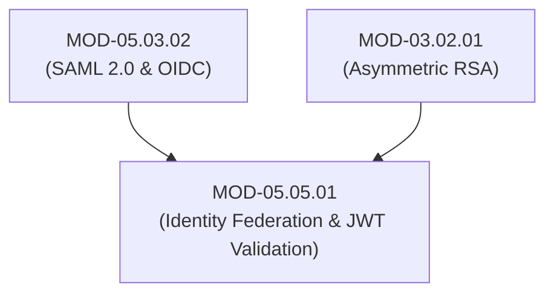

# Identity Federation, Single Sign-On (SSO) Architecture & JWT Token Validation

## 1. Overview & Purpose
Identity Federation enables users to access applications across organizational trust boundaries using a single digital identity without re-entering credentials.

This module details Identity Provider (IdP) vs Service Provider (SP) trust relationships, Single Sign-On (SSO) workflows, JSON Web Tokens (JWT - RFC 7519), JSON Web Signature (JWS), JSON Web Encryption (JWE), and JWT security flaws (`alg: none`, Key Confusion Attacks).

---

## 2. Prerequisites & Prerequisites Graph
- **Prerequisites**: `MOD-05.03.02` (SAML & OIDC) & `MOD-03.02.01` (RSA Cryptography).



---

## 3. Learning Objectives & Taxonomy Alignment
- **L1 Awareness**: Contrast Identity Providers (IdP) and Service Providers (SP / Relying Parties).
- **L2 Understanding**: Detail JWT structure (Header, Payload, Signature), JWS signature verification, and `alg: none` vulnerability mechanics.
- **L3 Practical**: Parse and cryptographically verify JWTs using `PyJWT` in Python.
- **L4 Engineering**: Design high-availability federated SSO proxy architectures enforcing strict cryptographic JWKS key rotation.

---

## 4. L1 — Awareness (Overview & Core Terminology)
**Identity Federation** links user identities across distinct security domains. **Single Sign-On (SSO)** allows a user to log in once with an **Identity Provider (IdP)** (e.g., Okta, Azure AD) and gain access to multiple **Service Providers (SP)** (e.g., Salesforce, GitHub).

---

## 5. L2 — Understanding (Core Theory & Mechanics)

```mermaid
graph TD
    subgraph Federated Single Sign-On (SSO) Architecture
        USER["Web Client Browser"]
        SP["Service Provider (App.com)"]
        IDP["Identity Provider (IdP - Okta / Azure AD)"]

        USER -->|1. Accesses App.com| SP
        SP -->|2. Redirects to IdP with Auth Request| IDP
        USER <-->|3. Authenticates (Password + WebAuthn FIDO2)| IDP
        IDP -->|4. Generates Signed Assertion / JWT Token| USER
        USER -->|5. Submits Signed Token to App.com| SP
        SP -->|6. Verifies IdP Signature via JWKS -> Grants Access!| USER
    end

    subgraph JWT Structure & Verification Mechanics
        HDR["Header: { 'alg': 'RS256', 'typ': 'JWT' } (Base64URL)"]
        PAY["Payload: { 'sub': '105', 'exp': 1722288000 } (Base64URL)"]
        SIG["Signature: RSA-SHA256(Base64(HDR) + '.' + Base64(PAY), IdP_PrivateKey)"]

        HDR --> JWT_STR["Encoded JWT: Base64(HDR).Base64(PAY).Base64(SIG)"]
        PAY --> JWT_STR
        SIG --> JWT_STR
    end
```

### Critical JWT Security Vulnerabilities:
1. **`alg: none` Vulnerability**: If a JWT verification library accepts `"alg": "none"` in the header without verification, an attacker can modify the payload (changing `"sub": "admin"`) and remove the signature component entirely.
2. **Key Confusion Attack (HMAC vs RSA)**: An attacker changes `"alg"` from `RS256` (Asymmetric) to `HS256` (Symmetric) and signs the token using the IdP's *public* RSA key. Poorly coded verifiers treat the public key string as an HMAC secret key, accepting the forged signature.

---

## 6. L3 — Practical (Commands & Configurations)

### Cryptographic JWT Verification in Python (`PyJWT`):
```python
import jwt
import requests

# Fetch Public Key Set (JWKS) from Identity Provider
JWKS_URL = "https://idp.corp.com/.well-known/jwks.json"

def verify_jwt_token(token: str) -> dict:
    jwks_client = jwt.PyJWKClient(JWKS_URL)
    signing_key = jwks_client.get_signing_key_from_jwt(token)

    # SECURE VERIFICATION: Explicitly mandate RS256 algorithm
    decoded_payload = jwt.decode(
        token,
        signing_key.key,
        algorithms=["RS256"],  # Rejects "none" and "HS256" Key Confusion attacks!
        audience="https://api.securehealth.com",
        issuer="https://idp.corp.com/"
    )
    return decoded_payload
```

---

## 7. L4 — Engineering (Design Trade-offs & System Integration)
- **Token Revocation Trade-off (Stateless JWT vs Revocation Checks)**: Stateless JWT tokens eliminate database lookups at the API gateway. However, if a user account is compromised or offboarded, a 1-hour JWT remains valid until expiration. Systems must enforce short-lived Access Tokens (e.g. 5–15 minutes) paired with stateful Refresh Token revocation lists.

---

## 8. Internal Architecture & Data Structures
JSON Web Key Set (JWKS Structure):
```json
{
  "keys": [
    {
      "kty": "RSA",
      "use": "sig",
      "alg": "RS256",
      "kid": "idp-sig-key-2026-01",
      "n": "0vx7agoebGcQSuuPiLJXZptNn_55...",
      "e": "AQAB"
    }
  ]
}
```

---

## 9. Security Implications & Boundary Controls
- **Never Trust `alg` Header Blindly**: Always hardcode allowed verification algorithms (`["RS256"]`) in server verification logic.

---

## 10. Attack Vectors & Exploitation Primitives
1. **JWT Algorithm Downgrade (`alg: none`)**: Stripping signatures to achieve privilege escalation.
2. **HMAC vs RSA Key Confusion**: Signing tokens with public keys using `HS256`.

---

## 11. Defense & Telemetry Verification
- Mandate **JWKS Public Key Verification** with explicit `RS256` or `ES256` algorithm whitelisting.
- Enforce **Short Token Expiration (`exp < 15 minutes`)**.

---

## 12. Detection & Telemetry Verification

### Telemetry Check for JWT Algorithm Downgrade Attempts:
```yaml
title: Potential JWT Alg None / Downgrade Attack
id: a9102941-8210-41ab-b01b-920191fa5505
logsource:
  category: application
  product: apigateway
detection:
  selection:
    jwt_header_alg: ["none", "None", "NONE", "HS256"]
  condition: selection
level: critical
```

---

## 13. Hands-On Lab Reference
- **Associated Lab**: `LAB-IDE006` (JWT Algorithm Downgrade Exploitation & JWKS Remediation).

---

## 14. Related Projects & Applications
- **Associated Project**: `PRJ-SEC001` (Secure Healthcare Platform).

---

## 15. Troubleshooting & Diagnostics Matrix

| Symptom | Root Cause | Remediation / Diagnostic Command |
| :--- | :--- | :--- |
| `jwt.exceptions.ExpiredSignatureError`. | Token current timestamp exceeds `exp` claim. | Request new Access Token using valid Refresh Token flow. |

---

## 16. Related Concepts & Cross-Domain Links
- `CON-IDE011`: Identity Provider IdP vs Service Provider SP (`DOM-05`)
- `CON-IDE012`: JSON Web Token JWT RFC 7519 (`DOM-05`)
- `CON-CRY020`: RSA / ES256 Public Key Verification (`DOM-03`)

---

## 17. Technical Interview Preparation (Q&A)
**Q: How does the JWT "Key Confusion Attack" (HMAC vs RSA) work, and how do developers protect against it?**  
*Answer*: In a Key Confusion Attack, an adversary takes a server that expects RSA-signed JWTs (`RS256`) verified using a public key. The attacker modifies the token payload (e.g. changing role to `admin`), changes the header algorithm to `HS256` (Symmetric HMAC), and signs the token using the server's *public* RSA key string as the secret key. If the server verification code relies dynamically on `header.alg` and passes the public key to `jwt.decode()`, the library treats the public key string as a raw HMAC secret and accepts the forged signature. To protect against this, developers MUST explicitly whitelist allowed algorithms (e.g., `algorithms=["RS256"]`) and reject any token specifying an algorithm that does not match expectations.

---

## 18. Self-Assessment & Mastery Checklist
- [ ] Understand IdP vs SP federated SSO workflows.
- [ ] Able to write code verifying JWT signatures against JWKS endpoints.

---

## 19. References & Further Reading
- RFC 7519: *JSON Web Token (JWT)*.
- RFC 7517: *JSON Web Key (JWK)*.
- OWASP: *JSON Web Token Cheat Sheet for Java/Python*.
