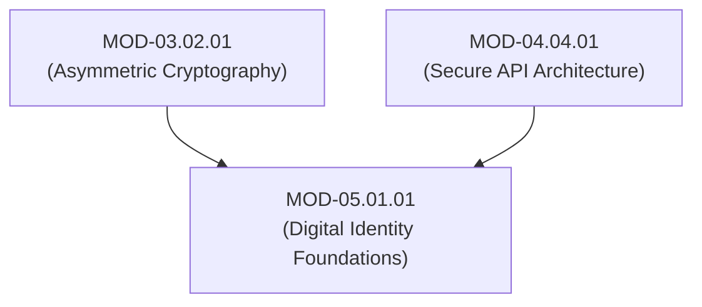

# Digital Identity Foundations, Assurance Levels (NIST 800-63) & Lifecycle Architecture

## 1. Overview & Purpose
Digital identity is the electronic representation of a human user, machine process, or service device within an IT system.

This module details NIST SP 800-63-3 Digital Identity Guidelines, Identity Assurance Levels (IAL1–IAL3), Authenticator Assurance Levels (AAL1–AAL3), Federation Assurance Levels (FAL1–FAL3), Identity Lifecycle States (Provisioning, Binding, Authentication, Deprovisioning), and Human vs Machine Identity models.

---

## 2. Prerequisites & Prerequisites Graph
- **Prerequisites**: `MOD-03.02.01` (Asymmetric Cryptography) & `MOD-04.04.01` (Secure API Architecture).



---

## 3. Learning Objectives & Taxonomy Alignment
- **L1 Awareness**: Define NIST IAL, AAL, and FAL assurance metrics.
- **L2 Understanding**: Detail the Identity Provisioning Lifecycle (SCIM 2.0 protocol) and Human vs Machine Identity characteristics.
- **L3 Practical**: Construct SCIM 2.0 provisioning payloads in Python and map user assurance levels.
- **L4 Engineering**: Design zero-trust identity lifecycle automation platforms with immediate orphan account revocation.

---

## 4. L1 — Awareness (Overview & Core Terminology)
Digital identity binds an applicant's real-world identity to a digital account. **IAL (Identity Assurance Level)** measures identity proofing rigor. **AAL (Authenticator Assurance Level)** measures authentication strength. **FAL (Federation Assurance Level)** measures federated assertion security.

---

## 5. L2 — Understanding (Core Theory & Mechanics)

```mermaid
graph TD
    subgraph NIST SP 800-63-3 Digital Identity Assurance Model
        PROOF["1. Identity Proofing (Applicant -> CSP)"] -->|Determines IAL (IAL1 - IAL3)| IAL["Identity Assurance Level (IAL)"]
        AUTH["2. Authentication (User -> RP)"] -->|Determines AAL (AAL1 - AAL3)| AAL["Authenticator Assurance Level (AAL)"]
        FED["3. Federation (IdP -> RP Assertion)"] -->|Determines FAL (FAL1 - FAL3)| FAL["Federation Assurance Level (FAL)"]
    end

    subgraph Identity Provisioning Lifecycle (SCIM 2.0)
        IDP["Identity Provider (Okta / Azure AD)"]
        SCIM_API["SCIM 2.0 REST Endpoint (/Users, /Groups)"]
        APP["Target Application (Secure Healthcare Platform)"]

        IDP -->|1. POST /Users (Create Account)| SCIM_API
        SCIM_API --> APP
        IDP -->|2. PATCH /Users/105 (Deactivate Account)| SCIM_API
        SCIM_API -->|Immediate Access Revocation!| APP
    end
```

### NIST SP 800-63-3 Assurance Matrix:
- **IAL1**: Self-asserted identity (no verification required).
- **IAL2**: Remote or in-person verification of government-issued ID documents.
- **IAL3**: In-person biometrics verification by an authorized credential service provider (CSP).
- **AAL1**: Single-factor authentication (password).
- **AAL2**: Two-factor authentication (password + TOTP or SMS).
- **AAL3**: Hardware cryptographic token with phishing resistance (FIDO2 / WebAuthn).

---

## 6. L3 — Practical (Commands & Configurations)

### Generating SCIM 2.0 User Provisioning Requests in Python:
```python
import requests
import json

SCIM_ENDPOINT = "https://app.securehealth.com/scim/v2/Users"
BEARER_TOKEN = "secret_scim_token_9941"

headers = {
    "Authorization": f"Bearer {BEARER_TOKEN}",
    "Content-Type": "application/scim+json"
}

# SCIM 2.0 Standard User Creation Payload
scim_user_payload = {
    "schemas": ["urn:ietf:params:scim:schemas:core:2.0:User"],
    "userName": "dr.johnson@securehealth.com",
    "name": {
        "givenName": "Alice",
        "familyName": "Johnson"
    },
    "emails": [{
        "value": "dr.johnson@securehealth.com",
        "primary": True
    }],
    "active": True
}

response = requests.post(SCIM_ENDPOINT, headers=headers, json=scim_user_payload)
print(f"SCIM Status Code: {response.status_code} | User ID: {response.json().get('id')}")
```

---

## 7. L4 — Engineering (Design Trade-offs & System Integration)
- **Human vs Machine Identity Lifecycle Management**: Human identities tie to employee onboarding/offboarding workflows. Machine identities (service accounts, API tokens, bots) multiply $100\times$ faster than human identities. Machine identity systems MUST utilize automated expiration, short TTLs (e.g. 1-hour certificates), and automated renewal (SPIFFE/SPIRE).

---

## 8. Internal Architecture & Data Structures
SCIM 2.0 Deprovisioning Schema (`PATCH /Users/{id}`):
```json
{
  "schemas": ["urn:ietf:params:scim:api:messages:2.0:PatchOp"],
  "Operations": [
    {
      "op": "replace",
      "path": "active",
      "value": false
    }
  ]
}
```

---

## 9. Security Implications & Boundary Controls
- **Orphan Account Exposure**: Terminated employees whose accounts remain active due to missing SCIM automated deprovisioning represent prime targets for initial access attacks.

---

## 10. Attack Vectors & Exploitation Primitives
1. **Identity Proofing Fraud**: Submitting forged identity documents during remote IAL2 onboarding.
2. **Orphan Account Takeover**: Logging into active accounts belonging to departed employees.

---

## 11. Defense & Telemetry Verification
- Implement **SCIM 2.0 Automated User Deprovisioning** triggered directly by HR system events.
- Enforce **AAL3 (FIDO2 / Hardware Security Keys)** for all administrative identities.

---

## 12. Detection & Telemetry Verification

### Telemetry Check for Offboarded User Logins:
```yaml
title: Successful Login from Suspicious Terminated Account
id: f9102941-8210-41ab-b01b-920191fa1105
logsource:
  category: authentication
  product: okta
detection:
  selection:
    event_type: "user.authentication.auth_via_mfa"
    user_status: "DEACTIVATED"
  condition: selection
level: critical
```

---

## 13. Hands-On Lab Reference
- **Associated Lab**: `LAB-IDE001` (SCIM 2.0 Automated User Lifecycle & NIST AAL Mapping).

---

## 14. Related Projects & Applications
- **Associated Project**: `PRJ-SEC001` (Secure Healthcare Platform).

---

## 15. Troubleshooting & Diagnostics Matrix

| Symptom | Root Cause | Remediation / Diagnostic Command |
| :--- | :--- | :--- |
| `HTTP 409 Conflict` during SCIM user creation. | User with matching `userName` or `email` already exists in target database. | Issue SCIM `PATCH` request to update existing user record instead of `POST`. |

---

## 16. Related Concepts & Cross-Domain Links
- `CON-IDE001`: NIST SP 800-63-3 Assurance Levels (`DOM-05`)
- `CON-IDE002`: SCIM 2.0 Identity Provisioning (`DOM-05`)

---

## 17. Technical Interview Preparation (Q&A)
**Q: Explain the difference between Identity Assurance Level (IAL), Authenticator Assurance Level (AAL), and Federation Assurance Level (FAL) in NIST SP 800-63-3.**  
*Answer*: IAL measures the confidence that a applicant's claimed real-world identity matches their true identity during onboarding (proof of identity). AAL measures the strength of the authentication mechanism used by an established user during login (e.g. AAL1 password vs AAL3 FIDO2 hardware key). FAL measures the cryptographic security and integrity of the assertion token transmitted between an Identity Provider (IdP) and a Relying Party (RP) during federated Single Sign-On (e.g. signed vs encrypted SAML/OIDC assertions).

---

## 18. Self-Assessment & Mastery Checklist
- [ ] Understand NIST IAL1-3, AAL1-3, and FAL1-3 metrics.
- [ ] Able to write a SCIM 2.0 payload for automated account deprovisioning.

---

## 19. References & Further Reading
- NIST SP 800-63-3: *Digital Identity Guidelines*.
- RFC 7644: *System for Cross-domain Identity Management (SCIM) 2.0 Protocol*.
