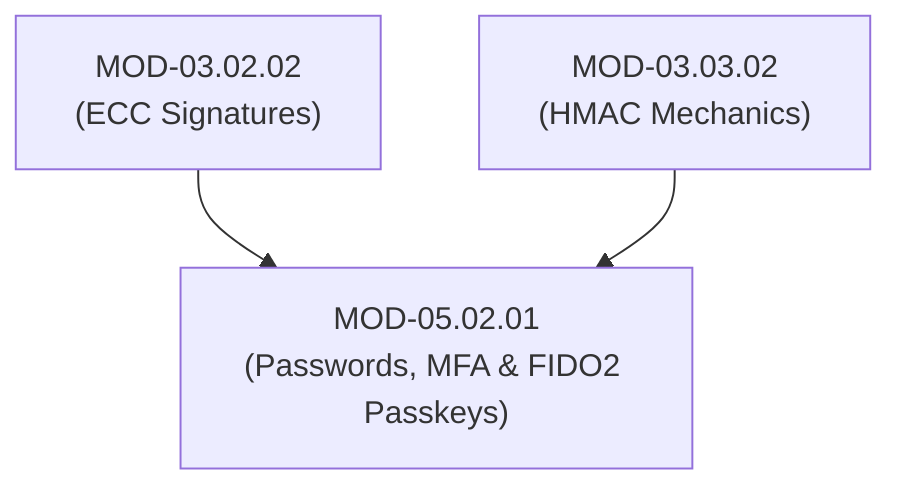

# Authentication Mechanisms (Passwords, TOTP MFA & FIDO2 WebAuthn Passkeys)

## 1. Overview & Purpose
Authentication mechanisms prove a claimed identity using three classic factors: Something You Know (Passwords), Something You Have (Security Keys / TOTP tokens), and Something You Are (Biometrics).

This module details Password Authentication drawbacks, Time-Based One-Time Passwords (TOTP - RFC 6238), FIDO2 / WebAuthn specifications, Client-to-Authenticator Protocol (CTAP2), Hardware Security Keys (YubiKey), and Phishing-Resistant Passkeys.

---

## 2. Prerequisites & Prerequisites Graph
- **Prerequisites**: `MOD-03.02.02` (ECC Signatures) & `MOD-03.03.02` (HMAC).



---

## 3. Learning Objectives & Taxonomy Alignment
- **L1 Awareness**: Contrast Phishing-Vulnerable MFA (SMS/TOTP) and Phishing-Resistant MFA (FIDO2 / WebAuthn).
- **L2 Understanding**: Detail TOTP HMAC-SHA1 timestep derivation and WebAuthn Challenge/Response asymmetric signature verification.
- **L3 Practical**: Implement TOTP token generation in Python and parse WebAuthn public key attestation structures.
- **L4 Engineering**: Design enterprise passwordless authentication architectures eliminating credential theft vectors.

---

## 4. L1 — Awareness (Overview & Core Terminology)
Legacy passwords and SMS/TOTP MFA can be intercepted by modern adversary-in-the-middle (AiTM) phishing proxies (Evilginx2). **FIDO2 / WebAuthn Passkeys** replace passwords with public-key cryptography bound explicitly to domain origin URLs, achieving 100% phishing resistance.

---

## 5. L2 — Understanding (Core Theory & Mechanics)

```mermaid
graph TD
    subgraph TOTP Algorithm Mechanics (RFC 6238)
        K["Shared Secret Key K (Base32 Encoded)"]
        T["Time Counter T = floor(Current Unix Time / 30)"]
        HMAC["HMAC-SHA1(K, T)"]
        TRUNC["Dynamic Truncation (Extract 4 Bytes)"]
        TOTP["Final 6-Digit Code = Truncated Integer mod 10⁶"]

        K --> HMAC
        T --> HMAC
        HMAC --> TRUNC
        TRUNC --> TOTP
    end

    subgraph FIDO2 / WebAuthn Phishing-Resistant Flow
        CLIENT["Web Browser (Origin: app.securehealth.com)"]
        AUTH["Authenticator (YubiKey / TouchID)"]
        SERVER["Relying Party (RP Server)"]

        SERVER -->|1. Returns Challenge + RP ID (app.securehealth.com)| CLIENT
        CLIENT -->|2. CTAP2 Request| AUTH
        AUTH -->|3. Verifies Origin URL. Signs (Challenge + Origin) using Private Key| CLIENT
        CLIENT -->|4. Sends Signed Assertion| SERVER
        SERVER -->|5. Verifies Signature using stored Public Key -> Authenticated!| SERVER
    end
```

### Why FIDO2 WebAuthn is Phishing-Resistant:
During WebAuthn authentication, the browser automatically injects the exact domain origin URL (`https://app.securehealth.com`) into the authenticator payload. If an attacker tricks a user into visiting a fake phishing domain (`https://app.securehea1th.com`), the authenticator signs the *fake* domain origin. When forwarded to the real server, the server detects the origin mismatch and rejects the authentication attempt.

---

## 6. L3 — Practical (Commands & Configurations)

### Generating TOTP Codes in Python (`pyotp`):
```python
import pyotp
import time

# Shared secret key between Server and User Authenticator App
secret_base32 = "JBSWY3DPEHPK3PXP"

totp = pyotp.TOTP(secret_base32)
current_code = totp.now()
print(f"Current TOTP Code: {current_code}")

# Server-side verification
is_valid = totp.verify(current_code)
assert is_valid == True
```

---

## 7. L4 — Engineering (Design Trade-offs & System Integration)
- **TOTP vs WebAuthn Passkey Adoption Trade-off**: TOTP requires zero hardware changes and works on any authenticator app (Google Authenticator), but remains vulnerable to real-time AiTM phishing proxies. WebAuthn Passkeys eliminate phishing entirely, but require modern browser/hardware support and robust fallback account recovery flows.

---

## 8. Internal Architecture & Data Structures
WebAuthn Authenticator Assertion Response Payload:
```json
{
  "id": "Km94...==",
  "rawId": "Km94...==",
  "response": {
    "authenticatorData": "SZYN5YgZ5...",
    "clientDataJSON": "eyJ0eXBlIjoid2ViYXV0aG4uZ2V0IiwiY2hhbGxlbmdlIjoi...",
    "signature": "MEUCIQD..."
  },
  "type": "public-key"
}
```

---

## 9. Security Implications & Boundary Controls
- **Never Use SMS / Voice MFA**: SMS channels are vulnerable to SIM swapping, SS7 signaling attacks, and intercept proxies.

---

## 10. Attack Vectors & Exploitation Primitives
1. **Adversary-in-the-Middle (AiTM) Phishing**: Proxies (Evilginx2) capturing session cookies after users type valid TOTP codes.
2. **MFA Push Fatigue**: Bombarding users with hundreds of push notifications until they approve out of frustration.

---

## 11. Defense & Telemetry Verification
- Mandate **FIDO2 WebAuthn / Passkeys** for all high-privilege access.
- Require **MFA Number Matching** on push notifications to block MFA fatigue attacks.

---

## 12. Detection & Telemetry Verification

### Telemetry Check for Suspicious AiTM Proxy Session Creation:
```yaml
title: Potential AiTM Proxy Session Creation
id: e9102941-8210-41ab-b01b-920191fa2205
logsource:
  category: authentication
  product: okta
detection:
  selection:
    event_type: "user.session.start"
    user_agent|contains: "Evilginx"
  condition: selection
level: critical
```

---

## 13. Hands-On Lab Reference
- **Associated Lab**: `LAB-IDE002` (TOTP Algorithm Implementation & FIDO2 WebAuthn Verification).

---

## 14. Related Projects & Applications
- **Associated Project**: `PRJ-SEC001` (Secure Healthcare Platform).

---

## 15. Troubleshooting & Diagnostics Matrix

| Symptom | Root Cause | Remediation / Diagnostic Command |
| :--- | :--- | :--- |
| TOTP code rejected despite typing correct 6 digits. | Client or Server clock drift exceeds 30-second window. | Synchronize server clock using Network Time Protocol (`ntpdate -u pool.ntp.org`). |

---

## 16. Related Concepts & Cross-Domain Links
- `CON-IDE003`: TOTP Algorithm RFC 6238 (`DOM-05`)
- `CON-IDE004`: FIDO2 / WebAuthn Specification (`DOM-05`)
- `CON-CRY012`: Ed25519 / ECC Signatures (`DOM-03`)

---

## 17. Technical Interview Preparation (Q&A)
**Q: How does FIDO2 WebAuthn achieve 100% resistance against Adversary-in-the-Middle (AiTM) phishing attacks that easily bypass TOTP and SMS MFA?**  
*Answer*: In a TOTP or SMS workflow, the user manually types a 6-digit code into whatever webpage is displayed on their screen. If an attacker creates a fake phishing site (`evil-bank.com`), the user enters the code, and the attacker immediately forwards it to the real site to steal the session cookie. In FIDO2 WebAuthn, the browser itself extracts the exact origin domain (`origin: https://real-bank.com`) from the address bar and passes it directly to the hardware authenticator (YubiKey/TouchID). The authenticator signs the challenge concatenated with the origin domain using asymmetric cryptography. If the user is on `evil-bank.com`, the authenticator signs `evil-bank.com`. When the real server verifies the signature, the origin validation fails, completely blocking the attack.

---

## 18. Self-Assessment & Mastery Checklist
- [ ] Understand TOTP time step derivation (RFC 6238).
- [ ] Able to explain why WebAuthn is origin-bound and phishing-resistant.

---

## 19. References & Further Reading
- RFC 6238: *TOTP: Time-Based One-Time Password Algorithm*.
- W3C Recommendation: *Web Authentication: An API for accessing Public Key Credentials (WebAuthn Level 3)*.
- FIDO Alliance: *FIDO2: Moving Technology to Global Adoption*.
