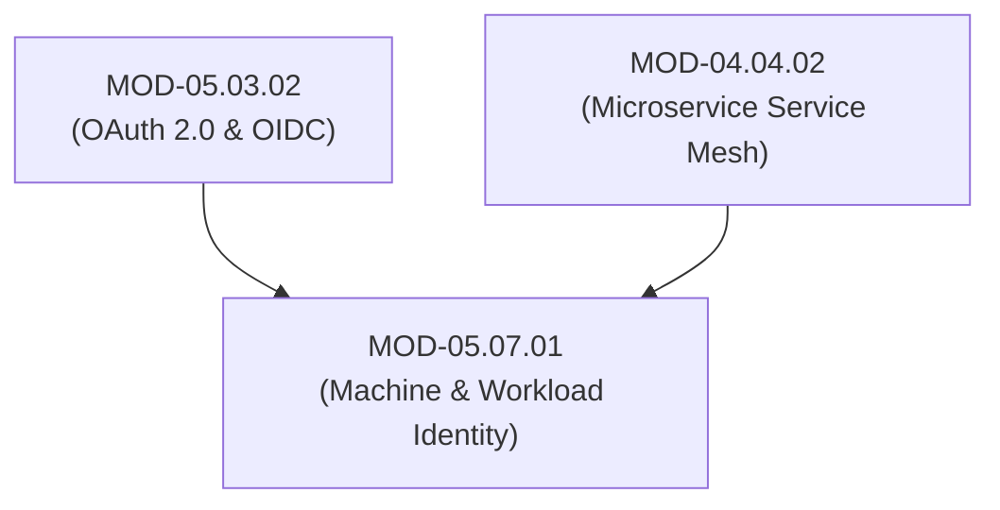

# Machine & Workload Identity Engineering (SPIFFE/SPIRE, Kubernetes & Cloud IAM OIDC)

## 1. Overview & Purpose
Modern cloud-native systems contain significantly more software workloads, microservices, and container tasks than human users, creating a massive machine identity management surface.

This module details Machine-to-Machine (M2M) Authentication, SPIFFE/SPIRE Workload Attestation, Kubernetes ServiceAccount JWT Token Request API, Cloud IAM OIDC Workload Identity Federation (AWS IAM Roles for Service Accounts - IRSA, Azure Workload Identity), and Secretless Authentication.

---

## 2. Prerequisites & Prerequisites Graph
- **Prerequisites**: `MOD-05.03.02` (OIDC) & `MOD-04.04.02` (Microservice Mesh).



---

## 3. Learning Objectives & Taxonomy Alignment
- **L1 Awareness**: Define Machine-to-Machine (M2M) identity vs Human identity.
- **L2 Understanding**: Detail Kubernetes Projected ServiceAccount Tokens, OIDC Federation with AWS/GCP, and SPIFFE SVID X.509 issuance.
- **L3 Practical**: Configure Kubernetes IRSA service account bindings and verify JWT workload identity assertions.
- **L4 Engineering**: Architect secretless, zero-trust cloud workload authentication pipelines eliminating long-lived API keys.

---

## 4. L1 — Awareness (Overview & Core Terminology)
Hardcoding long-lived cloud credentials (`AWS_SECRET_ACCESS_KEY`) inside application source code creates high-risk credential leak vectors. **Workload Identity Federation** allows Kubernetes pods or cloud microservices to exchange short-lived OIDC tokens directly for short-lived cloud IAM role credentials without storing any static secret keys.

---

## 5. L2 — Understanding (Core Theory & Mechanics)

```mermaid
graph TD
    subgraph Secretless Cloud Workload Identity Federation (Kubernetes IRSA to AWS IAM)
        POD["Kubernetes App Pod (ServiceAccount: payment-sa)"]
        K8S_OIDC["Kubernetes OIDC Provider (https://container.eks.amazonaws.com/id/105)"]
        AWS_STS["AWS Security Token Service (STS: AssumeRoleWithWebIdentity)"]
        AWS_IAM["AWS IAM Role (arn:aws:iam::12345:role/payment-role)"]

        POD -->|1. Projected ServiceAccount JWT Token| AWS_STS
        AWS_STS <-->|2. Validates Token Issuer Signature via JWKS| K8S_OIDC
        AWS_STS -->|3. Verifies Audience & Subject Claim (system:serviceaccount:prod:payment-sa)| AWS_IAM
        AWS_STS -->|4. Returns 1-Hour Temporary AWS Access Keys (AWS_SESSION_TOKEN)| POD
        POD -->|5. Calls AWS S3 / DynamoDB API securely without static keys!| AWS_S3["AWS S3 Bucket"]
    end
```

### Key Elements of Secretless Workload Authentication:
1. **Kubernetes Projected Tokens**: The K8s kubelet projects a short-lived (1-hour), cryptographically signed OIDC JWT token directly into the pod filesystem at `/var/run/secrets/tokens/vault-token`.
2. **Federated Trust**: The Cloud Provider (AWS/GCP/Azure) establishes an OIDC Trust Relationship pointing to the Kubernetes cluster's public OIDC discovery endpoint (`/.well-known/openid-configuration`).
3. **Dynamic STS Exchange**: The AWS SDK automatically reads the projected token and calls `sts:AssumeRoleWithWebIdentity` to obtain temporary, self-expiring cloud credentials.

---

## 6. L3 — Practical (Commands & Configurations)

### Kubernetes ServiceAccount with AWS IAM Role Binding (`serviceaccount.yaml`):
```yaml
apiVersion: v1
kind: ServiceAccount
metadata:
  name: payment-sa
  namespace: prod
  annotations:
    # Binds K8s ServiceAccount directly to AWS IAM Role via IRSA!
    eks.amazonaws.com/role-arn: arn:aws:iam::123456789012:role/ProdPaymentServiceRole
```

### Inspecting K8s Projected OIDC Token inside Pod:
```bash
# Display projected ServiceAccount JWT token header & payload
cat /var/run/secrets/kubernetes.io/serviceaccount/token | jq -R 'split(".") | .[1] | @base64d | fromjson'
```

---

## 7. L4 — Engineering (Design Trade-offs & System Integration)
- **Workload Identity vs HashiCorp Vault Secrets Management**: Vault injects static secret values into pods dynamically at launch. Workload Identity (IRSA/OIDC) eliminates secret values entirely by converting identity assertions directly into temporary IAM permissions, achieving a true **Secretless Architecture**.

---

## 8. Internal Architecture & Data Structures
Kubernetes Projected ServiceAccount OIDC Token Payload:
```json
{
  "iss": "https://container.eks.us-east-1.amazonaws.com/id/105",
  "sub": "system:serviceaccount:prod:payment-sa",
  "aud": ["sts.amazonaws.com"],
  "exp": 1722288000,
  "kubernetes.io": {
    "namespace": "prod",
    "serviceaccount": { "name": "payment-sa", "uid": "f9102941-8210..." }
  }
}
```

---

## 9. Security Implications & Boundary Controls
- **Overly Permissive ServiceAccount Binding**: Setting wildcards on IAM OIDC trust policies (`sub: system:serviceaccount:*`) allows *any* pod in *any* namespace in the cluster to assume administrative cloud roles. Always restrict `sub` to specific namespaces and service account names.

---

## 10. Attack Vectors & Exploitation Primitives
1. **Cloud Credential Leakage via Git**: Committing long-lived `AWS_SECRET_ACCESS_KEY` credentials to code repositories.
2. **Kubernetes Namespace Escape to Cloud IAM**: Exploiting un-isolated ServiceAccounts to assume privileged cross-account IAM roles.

---

## 11. Defense & Telemetry Verification
- Ban **Long-Lived Static Cloud API Keys** across all production workloads.
- Mandate **Secretless Workload Identity (IRSA / Azure Workload Identity / GCP Workload Identity)**.

---

## 12. Detection & Telemetry Verification

### Telemetry Check for Creation of Static AWS Access Keys:
```yaml
title: Creation of Static IAM User Access Key
id: d9102941-8210-41ab-b01b-920191fa7705
logsource:
  category: cloudtrail
  product: aws
detection:
  selection:
    eventName: "CreateAccessKey"
  condition: selection
level: medium
```

---

## 13. Hands-On Lab Reference
- **Associated Lab**: `LAB-IDE008` (Secretless Workload Identity Setup with Kubernetes & AWS OIDC).

---

## 14. Related Projects & Applications
- **Associated Project**: `PRJ-SEC001` (Secure Healthcare Platform).

---

## 15. Troubleshooting & Diagnostics Matrix

| Symptom | Root Cause | Remediation / Diagnostic Command |
| :--- | :--- | :--- |
| `AccessDenied: InvalidIdentityToken` during STS AssumeRole. | K8s OIDC Thumbprint mismatched or IAM Role trust policy `sub` claim misconfigured. | Verify IAM Role Trust Relationship matches exact `system:serviceaccount:<ns>:<sa>` string. |

---

## 16. Related Concepts & Cross-Domain Links
- `CON-IDE015`: Workload Identity Federation (`DOM-05`)
- `CON-IDE016`: Kubernetes Projected ServiceAccount Token (`DOM-05`)
- `CON-CLOUD002`: Cloud IAM Roles (`DOM-08`)

---

## 17. Technical Interview Preparation (Q&A)
**Q: How does Cloud Workload Identity Federation (such as AWS IRSA or Azure Workload Identity) eliminate the security risks associated with managing cloud API credentials in microservices?**  
*Answer*: In traditional setups, applications require long-lived static API keys (e.g. `AWS_ACCESS_KEY_ID` / `AWS_SECRET_ACCESS_KEY`) stored in configuration files, environment variables, or secret vaults, exposing them to source code leaks, hardcoding, and rotation failures. Workload Identity Federation replaces static keys with a secretless cryptographic exchange: the container runtime projects a short-lived OIDC JWT token into the application pod. The application passes this token to the Cloud Security Token Service (STS). STS validates the token's cryptographic signature against the Kubernetes cluster's public OIDC endpoint and issues temporary, 1-hour cloud credentials dynamically in-memory, eliminating static keys entirely.

---

## 18. Self-Assessment & Mastery Checklist
- [ ] Understand secretless workload identity architecture.
- [ ] Able to inspect and decode Kubernetes projected ServiceAccount JWT tokens.

---

## 19. References & Further Reading
- AWS Documentation: *IAM Roles for Service Accounts (IRSA)*.
- Kubernetes Documentation: *Service Account Token Volume Projection*.
- SPIFFE Specification: *Workload API Standard*.
