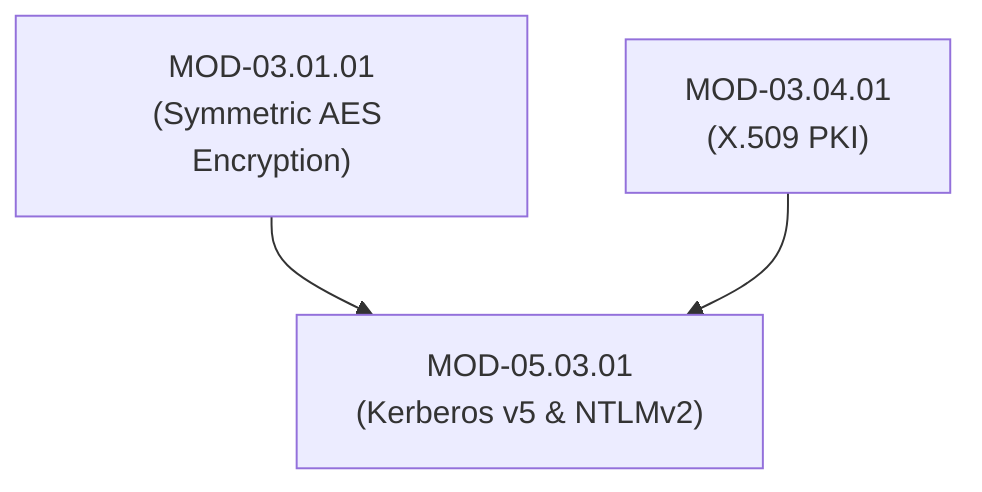

# Enterprise Authentication Protocols (Kerberos v5, NTLMv2 & LDAP)

## 1. Overview & Purpose
Enterprise network environments (Microsoft Active Directory) rely on ticket-based and challenge-response authentication protocols to authenticate users and computer objects across Windows and Linux domains.

This module details Kerberos v5 ticket-granting architecture (AS-REQ, AS-REP, TGS-REQ, TGS-REP, AP-REQ), Key Distribution Center (KDC), NTLMv2 Challenge-Response authentication, and LDAP Simple vs SASL bind mechanisms.

---

## 2. Prerequisites & Prerequisites Graph
- **Prerequisites**: `MOD-03.01.01` (AES-GCM) & `MOD-03.04.01` (X.509 PKI).



---

## 3. Learning Objectives & Taxonomy Alignment
- **L1 Awareness**: Contrast Kerberos v5 ticket-based authentication and legacy NTLMv2 challenge-response.
- **L2 Understanding**: Detail Kerberos ticket issuance flows (AS / TGS Exchanges), PAC (Privilege Attribute Certificate) structure, and NTLMv2 challenge hashes.
- **L3 Practical**: Inspect Kerberos ticket caches using `klist` and parse Kerberos traffic via `tcpdump` / Wireshark.
- **L4 Engineering**: Design enterprise Active Directory Kerberos hardening policies with complete NTLMv2 disablement.

---

## 4. L1 — Awareness (Overview & Core Terminology)
**Kerberos v5** is a third-party trusted authentication protocol using secret key cryptography and timestamped tickets issued by a **Key Distribution Center (KDC)**. **NTLMv2** is a legacy challenge-response protocol vulnerable to relay attacks.

---

## 5. L2 — Understanding (Core Theory & Mechanics)

```mermaid
graph TD
    subgraph Kerberos v5 Ticket Granting Sequence
        CLIENT["Client Workstation"]
        KDC_AS["KDC Authentication Service (AS)"]
        KDC_TGS["KDC Ticket Granting Service (TGS)"]
        SERVICE["Target Service (e.g. MSSQL Server)"]

        CLIENT -->|1. AS-REQ (Client Pre-Auth Timestamp)| KDC_AS
        KDC_AS -->|2. AS-REP (Ticket Granting Ticket - TGT encrypted with KRBTGT key)| CLIENT

        CLIENT -->|3. TGS-REQ (TGT + Authenticator)| KDC_TGS
        KDC_TGS -->|4. TGS-REP (Service Ticket - ST encrypted with Service SPN key)| CLIENT

        CLIENT -->|5. AP-REQ (Service Ticket - ST)| SERVICE
        SERVICE -->|6. Decrypts ST using Service Secret Key -> Authenticated!| CLIENT
    end
```

### Kerberos Exchange Breakdown:
1. **AS-REQ / AS-REP**: Client authenticates to KDC AS service using user password hash (Pre-Authentication). KDC returns a **Ticket Granting Ticket (TGT)** encrypted with the secret `KRBTGT` key.
2. **TGS-REQ / TGS-REP**: Client submits TGT to KDC TGS service to request access to a target service (Service Principal Name - SPN). KDC returns a **Service Ticket (ST)** encrypted with the target service's secret password hash.
3. **AP-REQ / AP-REP**: Client presents the Service Ticket directly to the target service to gain access. The service decrypts the ST locally without contacting the KDC.

---

## 6. L3 — Practical (Commands & Configurations)

### Inspecting Kerberos Ticket Cache on Linux & Windows:
```bash
# Display cached Kerberos TGT and Service Tickets on Linux
klist -e

# Request a new Kerberos TGT (Linux Heimdal / MIT Kerberos)
kinit alice@CORP.INTERNAL

# Windows PowerShell: Display active Kerberos tickets
klist
```

### Disabling Legacy NTLM in Windows Group Policy:
```text
Group Policy Path:
  Computer Configuration -> Windows Settings -> Security Settings -> Local Policies -> Security Options
Policy Name:
  Network security: Restrict NTLM: Incoming NTLM traffic -> Select "Deny all accounts"
```

---

## 7. L4 — Engineering (Design Trade-offs & System Integration)
- **Kerberos Time Synchronization Requirements**: Kerberos timestamped authenticators protect against replay attacks. If the clock skew between a client, KDC, and target server exceeds 5 minutes, Kerberos authentication fails (`KRB_AP_ERR_SKEW`). Production networks MUST enforce strict NTP time synchronization.

---

## 8. Internal Architecture & Data Structures
Kerberos Ticket Granting Ticket (TGT) Structure:
```text
Ticket ::= SEQUENCE {
  tkt-vno[0]          INTEGER (5),
  realm[1]            Realm,
  sname[2]            PrincipalName (krbtgt/CORP.INTERNAL),
  enc-part[3]         EncryptedData (Encrypted with KRBTGT Secret Key)
}
```

---

## 9. Security Implications & Boundary Controls
- **NTLM Relay Vulnerability**: Because NTLMv2 lacks mutual session binding by default, an attacker who intercepts an NTLM challenge-response can relay those authentication bytes to a remote SMB/HTTP server to gain unauthorized access.

---

## 10. Attack Vectors & Exploitation Primitives
1. **Kerberoasting**: Requesting TGS Service Tickets for accounts with SPNs and cracking the service hash offline.
2. **AS-REP Roasting**: Requesting AS-REP tickets for user accounts with Kerberos pre-authentication disabled (`DONT_REQ_PREAUTH`).

---

## 11. Defense & Telemetry Verification
- Disable **NTLMv1 and NTLMv2** across all Active Directory domains in favor of pure Kerberos.
- Set complex 30+ character random passwords on service accounts with SPNs.

---

## 12. Detection & Telemetry Verification

### Windows Event ID 4769 (Kerberos Service Ticket Requested - Kerberoasting Detection):
```yaml
title: Potential Kerberoasting Activity
id: a9102941-8210-41ab-b01b-920191fa3305
logsource:
  category: security
  product: windows
detection:
  selection:
    EventID: 4769
    TicketEncryptionType: '0x17' # RC4-HMAC (Weak Encryption Request)
  condition: selection
level: high
```

---

## 13. Hands-On Lab Reference
- **Associated Lab**: `LAB-IDE003` (Kerberos Ticket Granting Analysis & Kerberoasting Detection).

---

## 14. Related Projects & Applications
- **Associated Project**: `PRJ-SEC001` (Secure Healthcare Platform).

---

## 15. Troubleshooting & Diagnostics Matrix

| Symptom | Root Cause | Remediation / Diagnostic Command |
| :--- | :--- | :--- |
| `KRB_AP_ERR_SKEW (Clock skew too great)`. | Time difference between workstation and Domain Controller exceeds 5 minutes. | Sync system clock using `w32tm /resync` (Windows) or `chronyc step` (Linux). |

---

## 16. Related Concepts & Cross-Domain Links
- `CON-IDE005`: Kerberos Ticket Granting Ticket TGT (`DOM-05`)
- `CON-IDE006`: NTLMv2 Challenge-Response (`DOM-05`)
- `CON-WIN004`: Active Directory Domain Controller (`DOM-10`)

---

## 17. Technical Interview Preparation (Q&A)
**Q: How does the Kerberos v5 protocol prevent servers from needing to contact the Domain Controller during every user login request?**  
*Answer*: Kerberos uses symmetric key cryptography and trusted ticket delegation. When a client wants to access a service, it submits its TGT to the KDC's Ticket Granting Service (TGS) to request a Service Ticket (ST). The KDC encrypts the ST using the secret key (password hash) of the target service account. When the client presents the ST to the target service, the service decrypts the ticket locally using its own known secret key to extract the user's identity and privilege attributes (PAC), granting access without initiating any network call to the KDC.

---

## 18. Self-Assessment & Mastery Checklist
- [ ] Understand AS-REQ, AS-REP, TGS-REQ, TGS-REP, and AP-REQ exchanges.
- [ ] Able to inspect cached tickets using `klist`.

---

## 19. References & Further Reading
- RFC 4120: *The Kerberos Network Authentication Service (v5)*.
- Microsoft Documentation: *NTLM Over-the-Wire Protocol Specification*.
