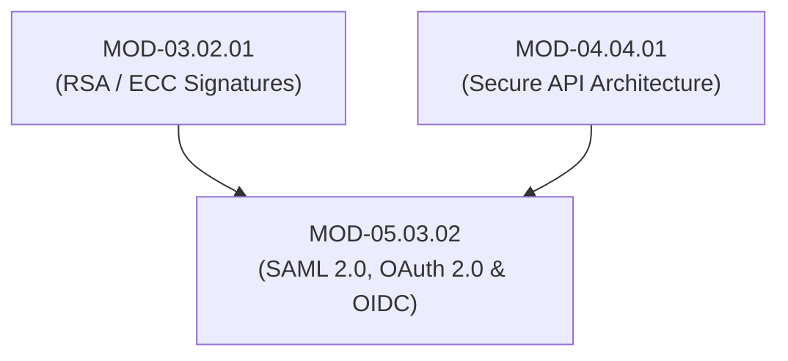

# Web & API Authentication Protocols (SAML 2.0, OAuth 2.0 & OpenID Connect - OIDC)

## 1. Overview & Purpose
Modern web applications, mobile apps, and microservice APIs rely on standardized HTTP token protocols for identity federation, delegated authorization, and user authentication.

This module details SAML 2.0 XML Assertions, OAuth 2.0 Framework (RFC 6749), Authorization Code Flow with PKCE (RFC 7636), OpenID Connect (OIDC) Identity Tokens (`id_token`), Access Tokens (`access_token`), and UserInfo endpoints.

---

## 2. Prerequisites & Prerequisites Graph
- **Prerequisites**: `MOD-03.02.01` (RSA / ECC Signatures) & `MOD-04.04.01` (API Design).



---

## 3. Learning Objectives & Taxonomy Alignment
- **L1 Awareness**: Contrast Authorization (OAuth 2.0) and Authentication (OpenID Connect / SAML 2.0).
- **L2 Understanding**: Detail OAuth 2.0 Authorization Code Flow with PKCE (`code_verifier`, `code_challenge`) and OIDC JWT `id_token` verification.
- **L3 Practical**: Implement OIDC PKCE flow in Python/Web applications and validate JWT signature algorithms.
- **L4 Engineering**: Design enterprise zero-trust identity proxy gateways validating federated OIDC assertions.

---

## 4. L1 — Awareness (Overview & Core Terminology)
**OAuth 2.0** is a delegated *authorization* framework allowing a third-party application to access HTTP resources on behalf of a user. **OpenID Connect (OIDC)** is an *identity layer* built on top of OAuth 2.0 that introduces an **ID Token (`id_token`)** to authenticate the user's identity.

---

## 5. L2 — Understanding (Core Theory & Mechanics)

```mermaid
graph TD
    subgraph OAuth 2.0 Authorization Code Flow with PKCE (RFC 7636)
        CLIENT["Single Page App / Mobile Client"]
        AUTH_SERVER["Authorization Server / Identity Provider (Okta / Auth0)"]
        API["Resource Server / API Endpoint"]

        CLIENT -->|1. Generates PKCE code_verifier & code_challenge = SHA256(verifier)| CLIENT
        CLIENT -->|2. GET /authorize?response_type=code&code_challenge=...| AUTH_SERVER
        AUTH_SERVER -->|3. Authenticates User & Returns Authorization Code| CLIENT

        CLIENT -->|4. POST /token + code + code_verifier| AUTH_SERVER
        AUTH_SERVER -->|5. Verifies SHA256(code_verifier) == code_challenge| AUTH_SERVER
        AUTH_SERVER -->|6. Returns access_token + id_token| CLIENT

        CLIENT -->|7. GET /api/data Header: Bearer access_token| API
        API -->|8. Validates access_token Signature & Scopes -> Returns Data| CLIENT
    end
```

### Proof Key for Code Exchange (PKCE - RFC 7636):
PKCE prevents authorization code interception attacks on public clients (mobile/SPA apps). The client generates a random secret (`code_verifier`) and sends its hash (`code_challenge`) in the initial request. When exchanging the authorization code for tokens, the client proves ownership by supplying the raw `code_verifier`.

---

## 6. L3 — Practical (Commands & Configurations)

### Validating OIDC ID Token in Python (`python-jose`):
```python
from jose import jwt
import requests

OIDC_JWKS_URL = "https://auth.corp.com/.well-known/jwks.json"
ISSUER = "https://auth.corp.com/"
CLIENT_ID = "secure-health-app"

def verify_oidc_token(id_token_str: str) -> dict:
    # 1. Fetch public JWKS keys from Identity Provider
    jwks = requests.get(OIDC_JWKS_URL).json()

    # 2. Cryptographically verify signature, issuer, and audience
    payload = jwt.decode(
        id_token_str,
        jwks,
        algorithms=["RS256"],
        audience=CLIENT_ID,
        issuer=ISSUER
    )
    return payload
```

---

## 7. L4 — Engineering (Design Trade-offs & System Integration)
- **SAML 2.0 vs OIDC Architecture Trade-off**: SAML 2.0 uses heavy XML assertions designed in the 2000s for enterprise web browser SSO. OIDC uses lightweight JSON Web Tokens (JWT) natively supported by mobile devices, modern JavaScript SPAs, and REST/gRPC APIs, making OIDC the canonical choice for modern systems.

---

## 8. Internal Architecture & Data Structures
OpenID Connect ID Token (`id_token`) Decoded Payload:
```json
{
  "iss": "https://auth.corp.com/",
  "sub": "user_9941029",
  "aud": "secure-health-app",
  "exp": 1722288000,
  "iat": 1722284400,
  "auth_time": 1722284390,
  "email": "alice@corp.com",
  "email_verified": true
}
```

---

## 9. Security Implications & Boundary Controls
- **OAuth 2.0 `redirect_uri` Wildcard Vulnerabilities**: Registering wildcard redirect URIs (`https://app.com/*`) allows attackers to craft state parameters that leak authorization codes to attacker-controlled domains.

---

## 10. Attack Vectors & Exploitation Primitives
1. **Authorization Code Interception**: Intercepting OAuth codes on mobile devices lacking PKCE.
2. **SAML XML Signature Exclusion**: Stripping XML signatures to forge SAML assertions.

---

## 11. Defense & Telemetry Verification
- Mandate **OAuth 2.0 PKCE (RFC 7636)** for 100% of authorization flows.
- Enforce strict exact-string match on registered `redirect_uri` URLs.

---

## 12. Detection & Telemetry Verification

### Telemetry Query (OAuth Redirect URI Mismatch Errors):
```text
event_type: "user.authentication.oauth.invalid_redirect_uri"
```

---

## 13. Hands-On Lab Reference
- **Associated Lab**: `LAB-IDE004` (OIDC PKCE Flow Implementation & JWT Token Verification).

---

## 14. Related Projects & Applications
- **Associated Project**: `PRJ-SEC001` (Secure Healthcare Platform).

---

## 15. Troubleshooting & Diagnostics Matrix

| Symptom | Root Cause | Remediation / Diagnostic Command |
| :--- | :--- | :--- |
| OIDC Token verification returns `JWTClaimsError: Invalid Audience`. | Token `aud` claim does not match configured `CLIENT_ID`. | Verify application client ID registration on Identity Provider. |

---

## 16. Related Concepts & Cross-Domain Links
- `CON-IDE007`: OAuth 2.0 PKCE Flow RFC 7636 (`DOM-05`)
- `CON-IDE008`: OpenID Connect OIDC ID Token (`DOM-05`)
- `CON-CRY020`: RSA / ECC Signature Verification (`DOM-03`)

---

## 17. Technical Interview Preparation (Q&A)
**Q: Why is OAuth 2.0 alone insufficient for user authentication, and how does OpenID Connect (OIDC) resolve this?**  
*Answer*: OAuth 2.0 is strictly an *authorization* framework designed to issue Access Tokens for API resource access; it does not specify user identity attributes, authentication timestamps, or identity proofing formats. Attempting to use an OAuth access token for authentication leads to security anti-patterns (such as assuming possession of a token proves identity). OpenID Connect (OIDC) builds an identity layer directly on top of OAuth 2.0 by introducing a cryptographically signed **ID Token (`id_token`)** containing explicit user identity claims (`sub`, `iss`, `aud`, `auth_time`), formalizing federated identity verification.

---

## 18. Self-Assessment & Mastery Checklist
- [ ] Understand OAuth 2.0 vs OIDC differences.
- [ ] Able to implement PKCE code verifier / challenge generation in Python.

---

## 19. References & Further Reading
- RFC 6749: *The OAuth 2.0 Authorization Framework*.
- RFC 7636: *Proof Key for Code Exchange by OAuth Public Clients (PKCE)*.
- OpenID Foundation: *OpenID Connect Core 1.0 Specification*.
