# Kernel Extension Signing, Probe Verification & Endpoint Security APIs

## 1. Overview & Purpose
As modern operating systems deprecate raw kernel-mode third-party code execution, operating systems provide specialized user-space and hypervisor-enforced extension APIs (Windows System Extensions, macOS Endpoint Security API, Linux LSM/eBPF probes).

This module details cross-signing certificate chains, WHQL certification, driver signing enforcement, macOS System Extensions (`EndpointSecurity.framework`), and probe integrity verification. Understanding extension signing architecture is essential for enterprise security software engineering and endpoint security architecture.

---

## 2. Architecture & Key Components

```mermaid
graph TD
    subgraph Windows Kernel Extension Verification
        WIN_DRV["Windows Kernel Driver (.sys)"]
        WHQL["WHQL Hardware Portal (Microsoft Portal Signing)"]
        DSE_CHECK["CI.DLL (Driver Signature Enforcement Check)"]

        WIN_DRV --> WHQL
        WHQL --> DSE_CHECK
    end

    subgraph macOS User-Space System Extensions
        MAC_AGENT["Endpoint Security Agent (User Space)"]
        ES_API["EndpointSecurity.framework (Apple Managed System Extension)"]
        XNU_PROBE["XNU Kernel Event Hooks (Authorization & Notification Events)"]

        MAC_AGENT <--> ES_API
        ES_API <--> XNU_PROBE
    end

    subgraph Linux eBPF Probe Signing & Verification
        EBPF_SRC["eBPF Probe Bytecode"]
        EBPF_VER["Kernel eBPF Verifier & CAP_BPF Check"]

        EBPF_SRC --> EBPF_VER
    end
```



---

## 3. Detailed Mechanics & Internal Structures

### 3.1 Windows WHQL & Cross-Signing Certificates
- **Hardware Security Requirements**: 64-bit Windows drivers require WHQL (Windows Hardware Lab Kit) testing and digital signatures issued directly by Microsoft's Hardware Developer Portal.
- **EV Certificates**: Extended Validation (EV) Code Signing certificates are mandatory to submit driver packages for WHQL signing.
- **Code Integrity (`CI.DLL`)**: During `NtLoadDriver()`, `CI.DLL` validates that the driver image signature chains to Microsoft's Root Authority.

---

### 3.2 macOS Endpoint Security API (`EndpointSecurity.framework`)
Apple deprecated legacy Kexts (Kernel Extensions) in favor of user-space **System Extensions**:
- **System Extensions Framework**: Runs security daemons in user space while receiving kernel security events directly from XNU via Mach IPC.
- **Event Types**:
  - `NOTIFY`: Asynchronous events (e.g., process executed, file modified).
  - `AUTH`: Synchronous authorization events (e.g., ES agent can block file execution or process creation by returning `ES_AUTH_RESULT_DENIED`).

---

### 3.3 Linux eBPF Program Signing & Probe Validation
Modern Linux kernels implement `CONFIG_BPF_SIGNATURE`, requiring eBPF bytecode binaries to carry PKCS#7 signatures generated by trusted keys before `BPF_PROG_LOAD` accepts them into kernel execution space.

---

## 4. Security Implications & System Stability

- **Elimination of Kernel Panic Risk**: Moving security agents out of kernel space (via DriverKit, EndpointSecurity.framework, or eBPF) ensures that a bug in a third-party security product causes a daemon restart rather than a total system Crash (BSOD / Kernel Panic).

---

## 5. Attack Vectors & Bypasses

1. **Stolen / Compromised Driver Certificates**:
   Threat actors purchase or steal valid EV signing certificates on darknet markets to sign malicious kernel drivers, tricking DSE into loading rootkits.
2. **ESF Agent Termination**:
   If an adversary with root access (`uid 0`) kills an Endpoint Security user-space daemon process (`pkill -9 es_agent`), authorization hooks may default to allow mode unless protected by SIP or systemd restart policies.

---

## 6. Defense & Telemetry Verification

### Telemetry Tracing Sources:
- **Windows Security Log 5038**: Code Integrity image hash validation failure.
- **macOS Unified Logs**: `log stream --predicate 'subsystem == "com.apple.EndpointSecurity"'`.

---

## 7. Engineering & Hands-On Implementation

### Verifying Driver Signature Integrity in Windows:
```powershell
# PowerShell Sigcheck / Driver Validation
Get-AuthenticodeSignature -FilePath C:\Windows\System32\drivers\target_driver.sys
```

---

## 8. Troubleshooting & Diagnostics

| Symptom | Root Cause | Remediation / Diagnostic Command |
| :--- | :--- | :--- |
| `NtLoadDriver` returns `STATUS_IMAGE_HASH_NOT_SIGNED` (`0xC0000428`). | Driver signature invalid, revoked, or lacks WHQL portal signature. | Re-submit driver package to Microsoft Partner Center for WHQL signing. |
| macOS ES Agent fails to receive system events. | Missing `com.apple.developer.endpoint-security.client` entitlement or SIP blocking installation. | Verify Developer Entitlement approval from Apple. |

---

## 9. References
- Microsoft Partner Center: *Windows Driver Signing Requirements*.
- Apple Developer Documentation: *Building an Endpoint Security App*.
