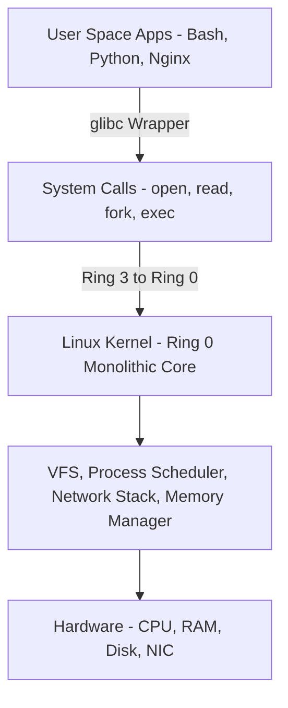
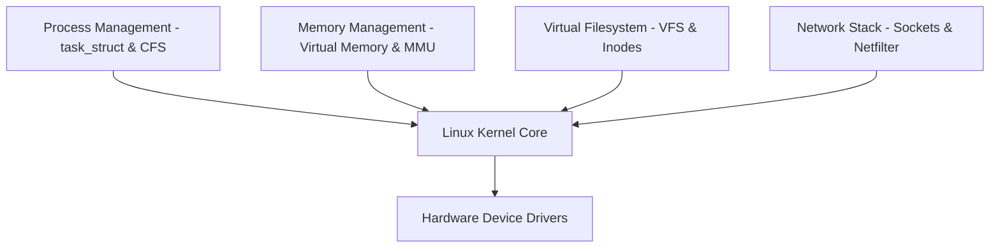
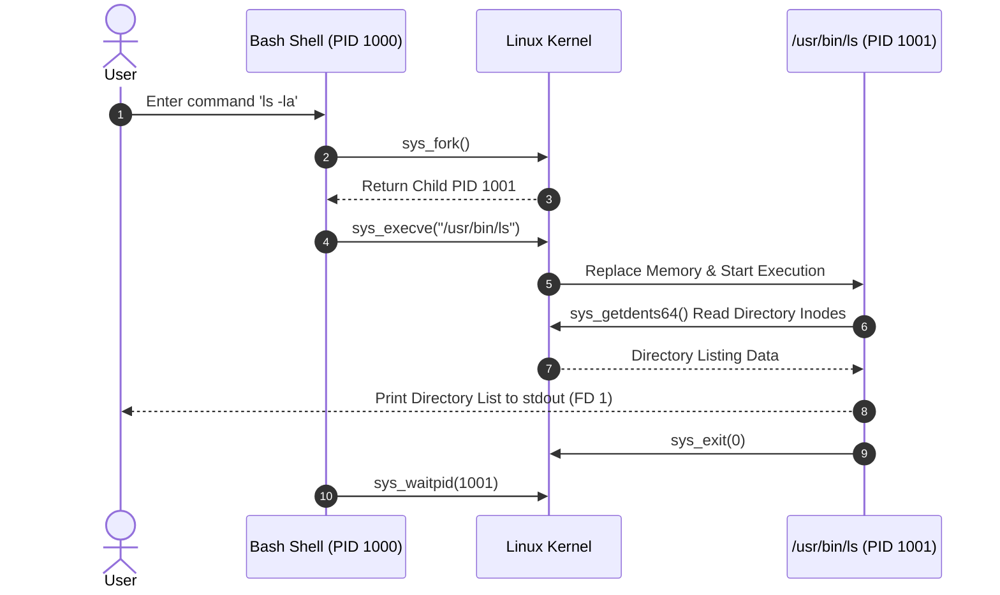

# P-02: Linux System Foundations

> **Module ID:** P-02  
> **Category:** Operating Systems & Systems Engineering  
> **Difficulty:** Beginner  
> **Estimated Time:** 8 Hours  
> **Prerequisites:** Basic Command Line Literacy  
> **Related Topics:** POSIX, Monolithic Kernels, File Permissions, Shell Environment, Systemd, Security Hardening  
> **Framework Standard:** Cyber Act Universal Engineering Framework (v2 Standard)

---

# Part I — Understanding

## Overview

### Definition
* **Definition:** Linux is an open-source, POSIX-compliant monolithic Unix-like operating system kernel that manages hardware resources, process execution, virtual memory, filesystems, networking, and security privileges.
* **One-Line Summary:** A POSIX-compliant monolithic OS kernel managing system hardware, processes, filesystems, and security permissions.

### Purpose & Problem Statement
* **Purpose:** Provides a high-performance, stable, multi-user, multi-tasking operating environment for servers, cloud infrastructure, embedded systems, and security applications.
* **Problem it Solves:** Eliminates proprietary OS vendor lock-in, un-auditable closed-source codebases, high licensing overhead, and restrictive system customization.
* **Why it Exists:** Developed by Linus Torvalds in 1991 to create a free, open-source replacement for MINIX and proprietary Unix operating systems.

### History & Evolution
* **Origins & Evolution:** Created in 1991, combined with GNU software utilities, evolved into enterprise distributions (RHEL, Ubuntu, Debian, Alpine) powering 90%+ of top public cloud workloads and supercomputers.

### Mental Model & Analogy
* **Real-World Analogy:** An automated factory building: The Kernel is the factory general manager, system calls are formal resource request forms, processes are production workers, and filesystems are storage shelves.
* **Mental Model:** User space programs interact with hardware through GNU C Library (`glibc`) wrappers that execute system calls into the monolithic Linux kernel (Ring 0).

> [!NOTE]
> The fundamental UNIX philosophy: "Everything is a file". Sockets, hardware devices, process information (`/proc`), and system configurations (`/sys`) are presented as files.

---

## Terminology

### Key Terms & Definitions

#### **Kernel vs User Space**
* **Definition:** Kernel Space (Ring 0) has unrestricted hardware and memory access; User Space (Ring 3) is an isolated execution mode for applications.
* **Context / Scope:** CPU Privilege Modes.
* **Key Properties:** System calls bridge User Space requests to Kernel Space execution.

#### **POSIX (Portable Operating System Interface)**
* **Definition:** IEEE standard defining API and CLI compatibility standards for Unix-like operating systems.
* **Context / Scope:** OS Interoperability Standard.
* **Key Properties:** Standardizes syscalls, C libraries, and shell CLI behavior.

#### **Root User (UID 0)**
* **Definition:** The superuser account possessing unrestricted administrative capabilities over all files, processes, and system configurations.
* **Context / Scope:** Security Privilege Model.
* **Key Properties:** UID 0 bypasses standard POSIX file permission checks.

#### **File Descriptors (FD)**
* **Definition:** Non-negative integers assigned by the kernel tracking open process I/O streams: `0` (stdin), `1` (stdout), `2` (stderr).
* **Context / Scope:** Process I/O Subsystem.
* **Key Properties:** Indexed in the process `files_struct` table.

#### **Systemd**
* **Definition:** The default system and service manager (PID 1) initializing user space daemons, managing cgroups, mount points, and logging (`journald`).
* **Context / Scope:** Master OS Init System.
* **Key Properties:** Replaced legacy SysVinit scripts.

---

## Big Picture

### Domain & Ecosystem Placement
* **Domain:** Operating Systems & Systems Infrastructure
* **Parent Topic:** Operating Systems Foundations
* **Child Topics:** Linux Kernel, VFS, Shell Scripting, Package Management, POSIX Permissions, Systemd, Linux Security Hardening
* **Prerequisites:** Basic Computer Hardware Literacy
* **Topics Enabled:** Linux Internals (P-14), Process Internals (P-07), Virtual Memory (P-09), Containerization (Docker/Kubernetes), Cloud Engineering

### Architectural Placement
* **Technology Ecosystem:** Linux Kernel, GNU Utilities (`bash`, `coreutils`), Systemd, Package Managers (`apt`, `dnf`, `pacman`).
* **Architecture Placement:** Operating System & System Services Layer.
* **Stack Placement:** Core Infrastructure Layer.

### System Ecosystem Map


---

# Part II — Internal Engineering

## Architecture

### Directory Hierarchy Standard (FHS)
* `/`: Root directory.
* `/bin`, `/usr/bin`: Essential binary executables.
* `/etc`: System configuration files.
* `/var`: Variable data files (logs, databases, spools).
* `/proc`: Virtual filesystem presenting process and kernel status.
* `/sys`: Virtual filesystem exposing kernel hardware devices and drivers.
* `/dev`: Device nodes representing physical hardware storage and pseudo-devices (`/dev/null`, `/dev/urandom`).

### Component Architecture Map


---

## Mechanism

### Core Execution Workflow (Shell Command Execution)
1. User types `ls -la` in `bash` shell and presses Enter.
2. `bash` searches directories in `$PATH` for the `ls` binary executable.
3. `bash` invokes `fork()` system call to create a child process.
4. Child process executes `execve("/usr/bin/ls", ["ls", "-la"], ...)` replacing its memory space with `ls`.
5. `ls` invokes `sys_getdents64()` to read directory entries and outputs results to stdout (FD 1).
6. Child process calls `exit(0)`. Parent `bash` reads exit code via `waitpid()`.

### Execution Sequence Map


---

## Relationships

### Upstream & Downstream Dependencies
* **Depends On:** X86-64 / ARM Hardware CPU, UEFI/BIOS Firmware, Storage Controllers.
* **Used By:** Web Servers, Database Engines, Security Agents, Cloud Containers, Hypervisors.
* **Communicates With:** Peripherals via interrupt lines and hardware device drivers.

### Resource Lifecycle
* **Creates / Uses:** Allocates PIDs, file descriptors, virtual memory pages.
* **Execution Ordering:** BIOS/UEFI ➔ GRUB ➔ Kernel Load ➔ Init (`systemd` PID 1) ➔ User Shell.

---

## Runtime Environment

### Execution & System Context
* **Execution Environment:** Bare Metal Server / Hypervisor VM / Cloud Container.
* **Location:** System Memory & Disk Partition (`/`).
* **Space:** Kernel Space & User Space.
* **Storage Unit:** Files & Directories.
* **Deployment Model:** Installed OS Distribution.
* **Lifetime:** Continuous runtime session until system reboot or shutdown.

---

# Part III — Operations

## Installation & Configuration

### Package Management Commands
```bash
# Ubuntu / Debian
sudo apt update && sudo apt install -y htop curl git

# RedHat / Rocky Linux
sudo dnf check-update && sudo dnf install -y htop curl git
```

---

## Configuration

### Core Configuration Files
* `/etc/passwd`: User account database.
* `/etc/shadow`: Salted password hashes (restricted `600` permissions).
* `/etc/group`: Group memberships.
* `/etc/fstab`: Filesystem mount configurations.
* `/etc/sudoers`: Sudo privilege rules.

---

## Interfaces

### Core CLI Commands Reference

#### `ls`
* **Purpose:** Lists directory contents and file metadata.
* **Syntax:** `ls [options] [path]`
* **Parameters:** `-la` (long format, show hidden files), `-i` (inode numbers), `-h` (human-readable sizes).
* **Example:** `ls -laih /var/log`

---

#### `chmod` & `chown`
* **Purpose:** `chmod` modifies POSIX permissions (Read `4`, Write `2`, Execute `1`); `chown` alters file ownership (User:Group).
* **Syntax:** `chmod <octal> <file>` / `chown <user>:<group> <file>`
* **Parameters:** `-R` (recursive).
* **Example:**
  ```bash
  chmod 755 script.sh
  chmod 600 secret.key
  sudo chown -R root:root /etc/shadow
  ```

---

#### `umask`
* **Purpose:** Sets default file creation permission mask for newly created files and directories.
* **Syntax:** `umask [mode]`
* **Example:** `umask 027` (Default directory 750, default file 640).

---

#### `find` & `grep`
* **Purpose:** `find` searches directory trees by name/attribute; `grep` searches file contents using regular expressions.
* **Syntax:** `find <path> -name <pattern>` / `grep [options] <pattern> <file>`
* **Parameters:** `grep -ri` (recursive, case-insensitive).
* **Example:**
  ```bash
  find /var/log -type f -name "*.log"
  grep -ri "Failed password" /var/log/auth.log
  ```

---

#### `sed` & `awk`
* **Purpose:** `sed` performs stream editing/text replacement; `awk` processes structured column data.
* **Syntax:** `sed 's/find/replace/g' <file>` / `awk '{print $1, $3}' <file>`
* **Example:**
  ```bash
  sed -i 's/PermitRootLogin yes/PermitRootLogin no/g' /etc/ssh/sshd_config
  awk -F: '$3 == 0 {print $1}' /etc/passwd
  ```

---

#### `systemctl` & `journalctl`
* **Purpose:** `systemctl` manages systemd services; `journalctl` queries system logs.
* **Syntax:** `systemctl [action] <service>` / `journalctl [options]`
* **Example:**
  ```bash
  sudo systemctl restart sshd
  journalctl -u sshd -n 20 --no-pager
  ```

---

#### `df` & `free` & `uname`
* **Purpose:** `df` reports disk space; `free` displays memory usage; `uname` prints kernel details.
* **Example:**
  ```bash
  df -h
  free -h
  uname -a
  ```

---

#### `sudo` & `su` & `whoami` & `id`
* **Purpose:** User privilege management and security identity verification commands.
* **Example:**
  ```bash
  whoami
  id
  sudo -i
  ```

---

#### `tar` & `gzip`
* **Purpose:** Archiving and compressing file bundles.
* **Example:**
  ```bash
  tar -czvf logs.tar.gz /var/log/*.log
  tar -xzvf logs.tar.gz
  ```

---

#### `lsof` & `strace`
* **Purpose:** `lsof` lists open file handles; `strace` intercepts and logs process system calls.
* **Example:**
  ```bash
  sudo lsof -i :80
  sudo strace -p 1234
  ```

---

### APIs & Libraries
* **SDKs & Libraries:** GNU C Library (`glibc`), POSIX APIs (`unistd.h`, `sys/types.h`).

### Data Formats & Protocols
* **Formats:** ELF (`Executable and Linkable Format`), Plaintext config files, Syslog.

---

# Part IV — Observation

## Monitoring

### Telemetry & Inspection Tools
* **Inspection Tools:** `top`, `htop`, `ps aux`, `lsof`, `df -h`, `free -h`, `journalctl`.
* **Log Sources:** `/var/log/auth.log` (Ubuntu), `/var/log/secure` (RHEL), `/var/log/syslog`.

---

## Debugging

### Step-by-Step Debugging Workflow
1. **Identify System Load:** Run `top` or `htop` to locate CPU/Memory bottlenecks.
2. **Inspect Service Logs:** Run `journalctl -u <service-name> -e`.
3. **Trace Syscalls:** Run `strace -p <PID>` to debug hanging processes.

> [!TIP]
> Use `lsof -p <PID>` to see all open files, sockets, and memory-mapped libraries held by a process.

---

# Part V — Security

## Security

### Threat Model & Attack Surface
* **Threat Model:** Weak file permissions, SUID/SGID binary exploitation, unauthorized sudo escalation, exposed SSH ports, cleartext password files.
* **Attack Surface:** World-writable files (`777`), SUID binaries, `/etc/sudoers`, SSH configuration.

### Attack Vectors & Vulnerabilities
* **SUID Binary Privilege Escalation:** An attacker executing an unhardened SUID binary owned by root to spawn a root shell (`UID 0`).

### Detection & Telemetry
* **Detection Opportunities:** Auditd logs tracking `chmod +s`, failed SSH logons in `/var/log/auth.log`.
* **MITRE ATT&CK Mapping:** T1548.001 (Abuse Elevation Control Mechanism: Setuid and Setgid).

### Hardening & Security Best Practices
* Disable root SSH login (`PermitRootLogin no` in `/etc/ssh/sshd_config`).
* Audit SUID binaries (`find / -perm -4000 2>/dev/null`).
* Enforce strict `umask 027` across system profiles.

- [ ] Is SSH Root Login disabled?
- [ ] Are world-writable files eliminated?
- [ ] Is sudo configured to require password authentication?

> [!CAUTION]
> Setting permissions to `777` on sensitive files allows any unprivileged local user or compromised service to overwrite system code.

---

# Part VI — Engineering

## Engineering Analysis

### Design Rationale & Philosophy
* Monolithic kernel architecture places OS drivers in Ring 0 for maximum execution speed, sacrificing complete driver crash isolation for performance.

### Technology Comparison Matrix
| Attribute | Linux | Windows | FreeBSD |
| :--- | :--- | :--- | :--- |
| **Kernel Type** | Monolithic | Hybrid | Monolithic |
| **Primary CLI** | Bash / Zsh | PowerShell / CMD | TCSH / Bash |
| **Permission Model** | POSIX + Capabilities | ACLs + SIDs | POSIX + ACLs |

---

# Part VII — Practical

## Basic Lab
```bash
# Verify kernel and system information
uname -a
whoami
id
```

## Observation Lab
```bash
# Monitor system memory and disk utilization
free -h
df -h
```

## Internal Lab (Permission Hardening)
```bash
mkdir -p ~/secure-lab
echo "CONFIDENTIAL" > ~/secure-lab/secret.txt
chmod 600 ~/secure-lab/secret.txt
ls -l ~/secure-lab/secret.txt
```

## Security Lab (Find SUID Binaries)
```bash
# Locate all SUID binaries on system
find /usr/bin -perm -4000 2>/dev/null | head -n 10
```

---

# Part VIII — Reference

## Quick Reference & Cheat Sheet
* `ls -la` | `chmod 600 <file>` | `chown root:root <file>` | `ps aux`
* `systemctl status <service>` | `journalctl -u <service> -e` | `df -h` | `free -h`
* Key Paths: `/etc/passwd`, `/etc/shadow`, `/etc/sudoers`, `/var/log/`, `/proc/`, `/sys/`.

---

# Part IX — Professional

## Interview Questions

### Fundamental & Architecture Questions
* **Question 1:** *What is the difference between Kernel Space (Ring 0) and User Space (Ring 3) in Linux?*
  > [!NOTE]
  > Kernel Space has unrestricted hardware and physical memory access. User Space is an isolated CPU execution mode for user applications, requiring system calls (`syscall`) to access hardware.

### Security & Troubleshooting Questions
* **Question 2:** *Why is an SUID binary owned by root a significant security risk if improperly configured?*
  > [!IMPORTANT]
  > An SUID binary executes with the effective privileges of its owner (root). If the binary contains vulnerabilities or allows shell escapes, an unprivileged user can escalate to UID 0 root access.

---

## Revision

### Executive Summary & Revision
* **Key Takeaways:** Linux is a POSIX-compliant monolithic OS kernel managing hardware and processes via system calls, secured by POSIX permissions and systemd services.
* **One-Minute Revision:** Shell Command ➔ `fork()`/`execve()` ➔ System Call (Ring 0) ➔ Kernel Subsystem ➔ Hardware Execution.

---

## Master Completion Checklist

### Understanding
- [x] Can define it
- [x] Can explain why it exists
- [x] Understand terminology
- [x] Know where it fits

### Internal Engineering
- [x] Can explain architecture
- [x] Can explain workflow
- [x] Can draw diagrams
- [x] Understand lifecycle

### Operations
- [x] Can install/configure
- [x] Can use CLI commands
- [x] Understand APIs/protocols

### Observation
- [x] Can monitor telemetry
- [x] Can debug failures
- [x] Know log sources

### Security
- [x] Know attack vectors
- [x] Know mitigations
- [x] Know detection telemetry

### Engineering
- [x] Can compare alternatives
- [x] Understand trade-offs
- [x] Know performance limits

### Practical
- [x] Completed basic lab
- [x] Completed observation lab
- [x] Completed security lab

### Professional
- [x] Can answer interview questions
- [x] Can explain to an engineer
- [x] Can implement independently
