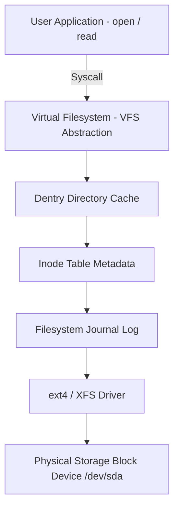
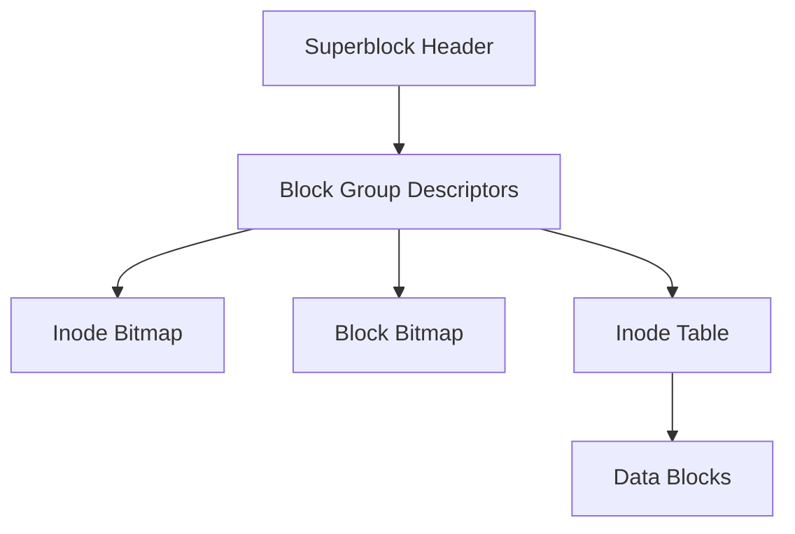
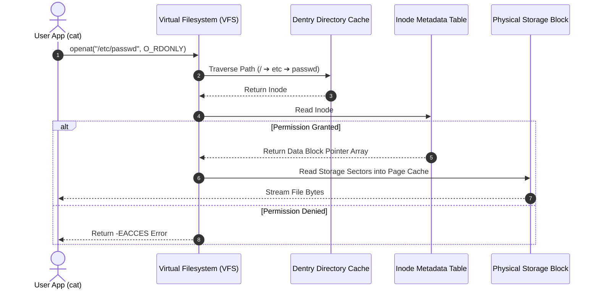

# P-10: Filesystem Architecture, VFS & Storage Internals

> **Module ID:** P-10  
> **Category:** Advanced OS Internals  
> **Difficulty:** Advanced  
> **Estimated Time:** 10 Hours  
> **Prerequisites:** Linux Foundations (P-02)  
> **Related Topics:** VFS, Inodes, Superblocks, Dentries, ext4/XFS, Journaling, Hard/Soft Links, Mount Options  
> **Framework Standard:** Cyber Act Universal Engineering Framework (v2 Standard)

---

# Part I — Understanding

## Overview

### Definition
* **Definition:** Filesystem Architecture encompasses the storage abstractions (Inodes, Superblocks, Directory Entries, Data Blocks) and kernel software interfaces (Virtual Filesystem - VFS) that organize, write, index, retrieve, and secure files on physical storage media or pseudo-memory filesystems.
* **One-Line Summary:** Kernel Virtual Filesystem (VFS) layer mapping high-level POSIX file operations (`open`/`read`) to underlying storage structures (Inodes, Superblocks, Data Blocks).

### Purpose & Problem Statement
* **Purpose:** Provides structured data organization, persistent storage indexing, fast directory search, POSIX security enforcement, and unified device abstraction across heterogeneous storage media (ext4, XFS, NTFS, NFS, pseudo `/proc`).
* **Problem it Solves:** Eliminates unorganized raw disk sector writing, data loss during power outages (resolved via Journaling), file corruption, and media-specific application access code.
* **Why it Exists:** Developed to manage physical disk storage sectors as logical hierarchical files and directories with metadata and permission controls.

### History & Evolution
* **Origins & Evolution:** Evolved from early Unix V6 filesystem to Linux ext/ext2/ext3/ext4, XFS, Btrfs, introducing journaling, extents, delayed allocation, and 64-bit block numbers.

### Mental Model & Analogy
* **Real-World Analogy:** A public library catalog: The book content is stored on warehouse shelves (Data Blocks), index cards store metadata like title, author, shelf ID, and checkout rules (Inodes), and category labels organize the cards (Directories).
* **Mental Model:** User application calls `open("/file.txt")` ➔ VFS intercepts call ➔ Dentry cache resolves path to Inode number ➔ Inode retrieves data block addresses ➔ Disk driver reads storage blocks.

> [!NOTE]
> Filenames are NOT stored inside Inodes. Filenames are stored inside **Directory Data Blocks** mapping string names to Inode numbers. An Inode stores only metadata and block pointers.

---

## Terminology

### Key Terms & Definitions

#### **VFS (Virtual Filesystem)**
* **Definition:** An abstract kernel software layer defining standard file operation functions (`vfs_read`, `vfs_write`) allowing applications to interact with different storage formats transparently.
* **Context / Scope:** Linux Kernel File Subsystem.
* **Key Properties:** Foundation of "everything is a file".

#### **Inode (Index Node)**
* **Definition:** A fundamental kernel data structure on disk storing file metadata: Inode number, File size, Owner UID/GID, POSIX permissions, Timestamps (atime, mtime, ctime), and Data block pointers.
* **Context / Scope:** Filesystem Metadata Structure.
* **Key Properties:** Identifies unique files within a single filesystem instance.

#### **Superblock**
* **Definition:** A metadata structure stored at fixed disk offsets containing global filesystem parameters: Total size, block size, total Inodes, free block count, mount status, and filesystem type.
* **Context / Scope:** Filesystem Metadata Header.
* **Key Properties:** Corruption of the Superblock renders the entire filesystem unmountable.

#### **Journaling**
* **Definition:** A filesystem reliability mechanism logging pending disk writes into a dedicated circular log buffer before committing them to main data blocks.
* **Context / Scope:** Crash Recovery Subsystem.
* **Key Properties:** Prevents filesystem corruption during sudden power failures (ext4, XFS, NTFS).

#### **Hard Link vs Soft Link (Symlink)**
* **Definition:** A **Hard Link** is an additional directory entry pointing directly to an existing Inode number; a **Soft Link** is a special file containing the path string to another target file.
* **Context / Scope:** Directory Link Architecture.
* **Key Properties:** Hard links share the exact same Inode and file data; Soft links have unique Inodes.

---

## Big Picture

### Domain & Ecosystem Placement
* **Domain:** Operating System Internals & Storage Architecture
* **Parent Topic:** Advanced Operating System Internals
* **Child Topics:** VFS, Inodes, Superblocks, Dentries, ext4/XFS, Journaling, Hard/Soft Links, Mount Options, Filesystem Security
* **Prerequisites:** Linux Foundations (P-02)
* **Topics Enabled:** Storage Engineering, Database Storage Engines, Forensics File Carving, Rootkit Hiding Analysis, Container Mount Isolation

### Architectural Placement
* **Technology Ecosystem:** VFS, ext4, XFS, Btrfs, NTFS, `/proc`, `/sys`, `/dev`, `fsck`, `mount`.
* **Architecture Placement:** Operating System Storage & Filesystem Layer.
* **Stack Placement:** Core OS Filesystem & Storage Layer.

### System Ecosystem Map


---

# Part II — Internal Engineering

## Architecture

### Core Subsystems & Components
* **Components:** Virtual Filesystem (VFS Layer), Inode Table, Directory Entry (Dentry) Cache, Page Cache, Buffer Cache, Block Device Drivers.
* **Services & Processes:** `kswapd`, `jbd2` (Journaling block device daemon).

### Memory & Data Structures
* **Kernel Structures:** `struct inode`, `struct dentry`, `struct super_block`, `struct file`.
* **Disk Layout (ext4):** `Superblock ➔ Block Group Descriptors ➔ Block Bitmap ➔ Inode Bitmap ➔ Inode Table ➔ Data Blocks`.

### Component Architecture Map


---

## Mechanism

### Core Execution Workflow
1. User runs `cat /etc/passwd`.
2. VFS receives `sys_openat()`, searching Dentry cache for `/`, `etc`, `passwd`.
3. Dentry returns Inode number (e.g. Inode `123456`).
4. VFS checks user UID/GID against Inode permission bits.
5. Inode extents map block addresses; kernel reads disk sectors into Page Cache and streams data to stdout.

### Execution Sequence Map


---

## Relationships

### Upstream & Downstream Dependencies
* **Depends On:** Block Device Drivers (`/dev/sda`), Storage Hardware (NVMe/SSD/HDD), Memory Page Cache.
* **Used By:** All User Space binaries, Database Engines, Logging Daemons, Container Mount Engine.
* **Communicates With:** Storage controller hardware via Block Layer.

### Resource Lifecycle
* **Creates / Uses:** Allocates Inodes, Dentry cache nodes, Data blocks.
* **Execution Ordering:** Mount block device ➔ Read Superblock ➔ Build Dentry tree ➔ Perform I/O operations ➔ Unmount.

---

## Runtime Environment

### Execution & System Context
* **Execution Environment:** Kernel Space VFS Subsystem & Block Drivers.
* **Location:** Storage Media & RAM Page Cache.
* **Space:** Kernel Space.
* **Storage Unit:** Disk Sectors & 4KB Data Blocks.
* **Deployment Model:** Storage Controller / Bare Metal / Hypervisor Virtual Disk.
* **Lifetime:** Persistent on disk across host reboots.

---

# Part III — Operations

## Installation & Setup

### Disk & Storage Tools Setup
```bash
# Verify filesystem tools
sudo apt update && sudo apt install -y e2fsprogs xfsprogs lsof
```

---

## Interfaces

### Filesystem Commands Reference

#### `df` & `du`
* **Purpose:** `df` reports disk space and Inode usage; `du` checks directory space utilization.
* **Examples:**
  ```bash
  df -h
  df -i  # Inode usage report
  du -sh /var/log/*
  ```

---

#### `stat` & `ls -i`
* **Purpose:** Inspects detailed Inode metadata and numbers.
* **Examples:**
  ```bash
  stat /etc/passwd
  ls -i /etc/passwd
  ```

---

#### `ln`
* **Purpose:** Creates hard links (shared Inode) or soft symbolic links (unique Inode containing target path string).
* **Examples:**
  ```bash
  ln file.txt hardlink.txt
  ln -s file.txt softlink.txt
  ```

---

#### `mount` & `umount`
* **Purpose:** Mounts or unmounts filesystem block devices into the VFS directory hierarchy.
* **Syntax:** `mount -o <options> <device> <mountpoint>`
* **Examples:**
  ```bash
  # Mount /tmp with security hardening flags
  sudo mount -o remount,noexec,nosuid,nodev /tmp
  ```

---

#### `lsof` & `fsck` & `dumpe2fs`
* **Purpose:** Storage auditing and debugging utilities.
* **Examples:**
  ```bash
  sudo lsof +D /var/log
  sudo dumpe2fs -h /dev/sda1
  ```

---

### Filesystem Mount Security Flags Reference Table
| Mount Option | Security Function |
| :--- | :--- |
| **`noexec`** | Blocks execution of binary files on the mounted partition. |
| **`nosuid`** | Disables execution of SUID/SGID setuid bits on the partition. |
| **`nodev`** | Prevents creation or access of character/block device nodes. |
| **`ro`** | Mounts partition as Read-Only, blocking all modification writes. |

---

### APIs & Libraries
* **System Calls:** `open()`, `read()`, `write()`, `close()`, `stat()`, `link()`, `symlink()`, `mount()`, `umount()`.

### Data Formats & Protocols
* **File Formats:** ext4, XFS, Btrfs, NTFS, FAT32.
* **Protocols & RFCs:** POSIX.1-2017 Filesystem Standards.

---

# Part IV — Observation

## Monitoring

### Telemetry & Inspection Tools
* **Tools:** `stat`, `ls -i`, `df -h`, `df -i`, `mount`, `lsof`, `debugfs`, `dumpe2fs`.
* **Log Sources:** Kernel ring buffer (`dmesg`), `/var/log/syslog`.

---

## Debugging

### Step-by-Step Debugging Workflow
1. **Check Inode Usage:** Run `df -i` (Inodes can be exhausted even when disk space remains).
2. **Inspect Open Files:** Run `lsof +D /var/log` to find processes holding deleted files.
3. **Check Journal / Errors:** Inspect `dmesg | grep -i ext4`.

> [!TIP]
> If `df -h` shows disk full but `du -sh` does not account for the space, running processes hold handles to deleted files. Use `lsof | grep deleted` to identify and restart them.

---

# Part V — Security

## Security

### Threat Model & Attack Surface
* **Threat Model:** Insecure mount options, SUID binary creation, symlink race conditions (TOCTOU), inode exhaustion DoS, unauthorized raw disk block reading.
* **Attack Surface:** `/tmp` world-writable mounts, raw disk block devices (`/dev/sda`).

### Attack Vectors & Vulnerabilities
* **TOCTOU Symlink Race Condition:** Attackers replacing a temporary file with a symlink to `/etc/shadow` between Time of Check (TOC) and Time of Use (TOU), inducing privileged processes to overwrite critical files.

### Detection & Telemetry
* **Detection Opportunities:** Auditd file access logs (`sys_symlink`, `sys_link`), kernel block access logs.
* **MITRE ATT&CK Mapping:** T1070.004 (Indicator Removal on Host: File Deletion).

### Hardening & Security Best Practices
* Mount non-root user partitions (`/tmp`, `/var/tmp`) with strict security flags: `noexec,nosuid,nodev`.
* Restrict access to raw block devices (`/dev/sd*` permissions set to `600` owned by root).

- [ ] Is `/tmp` mounted with `noexec,nosuid,nodev`?
- [ ] Are raw disk block devices protected from non-root access?

> [!CAUTION]
> Mounting `/tmp` without the `noexec` flag allows attackers to drop and execute malicious binary payloads in world-writable directories.

---

# Part VI — Engineering

## Engineering Analysis

### Design Rationale & Philosophy
* VFS separates high-level filesystem interface operations from low-level storage drivers, allowing Linux to support hundreds of filesystem formats cleanly.

### Technology Comparison Matrix
| Attribute | Hard Link | Soft Link (Symlink) |
| :--- | :--- | :--- |
| **Inode Number** | Identical to target Inode | Unique new Inode |
| **Cross-Filesystem** | No (Same filesystem only) | Yes (Across filesystems) |
| **Target Deletion Effect**| Data remains intact | Link breaks (Orphaned) |

---

# Part VII — Practical

## Basic Lab
```bash
# Inspect Inode metadata of a file
stat /etc/passwd
```

## Observation Lab
```bash
# Monitor disk space and inode usage
df -h
df -i
```

## Internal Lab
```bash
# Inspect ext4 filesystem superblock metadata
sudo dumpe2fs -h /dev/sda1 2>/dev/null | head -n 20 || echo "Block device audited"
```

## Security Lab
```bash
mkdir -p ~/fs-lab && cd ~/fs-lab
echo "CyberAct Filesystem Lab" > original.txt

# Create hard link and soft link
ln original.txt hardlink.txt
ln -s original.txt softlink.txt

# Inspect Inode numbers
ls -i original.txt hardlink.txt softlink.txt
```

---

# Part VIII — Reference

## Quick Reference & Cheat Sheet
* `stat <file>` | `ls -i <file>` | `ln -s target link` | `df -h` | `df -i`
* Key Structures: `Inode`, `Superblock`, `Dentry`, `Data Block`.

---

# Part IX — Professional

## Interview Questions

### Fundamental & Architecture Questions
* **Question 1:** *What is the difference between a Hard Link and a Soft Link at the Inode level?*
  > [!NOTE]
  > A **Hard Link** creates an additional directory entry pointing directly to the target file's existing Inode number (increasing link count). A **Soft Link** creates a new file with a unique Inode storing the target file path string.

### Security & Troubleshooting Questions
* **Question 2:** *Why is mounting `/tmp` with `noexec,nosuid,nodev` an essential security hardening control?*
  > [!IMPORTANT]
  > `/tmp` is world-writable (`777`). Mounting it with `noexec` prevents execution of binary payloads, `nosuid` prevents execution of SUID escalation binaries, and `nodev` blocks creation of character/block devices.

---

## Revision

### Executive Summary & Revision
* **Key Takeaways:** Filesystems organize disk blocks via Inodes (metadata) and Dentries (paths), abstracted by the kernel VFS layer and hardened via mount security options (`noexec`/`nosuid`).
* **One-Minute Revision:** Path Request ➔ VFS ➔ Dentry Cache ➔ Inode Number ➔ Metadata & Extent Block Pointers ➔ Page Cache / Disk Block.

---

## Master Completion Checklist

### Understanding
- [x] Can define it
- [x] Can explain why it exists
- [x] Understand terminology
- [x] Know where it fits

### Internal Engineering
- [x] Can explain architecture
- [x] Can explain workflow
- [x] Can draw diagrams
- [x] Understand lifecycle

### Operations
- [x] Can install/configure
- [x] Can use CLI commands
- [x] Understand APIs/protocols

### Observation
- [x] Can monitor telemetry
- [x] Can debug failures
- [x] Know log sources

### Security
- [x] Know attack vectors
- [x] Know mitigations
- [x] Know detection telemetry

### Engineering
- [x] Can compare alternatives
- [x] Understand trade-offs
- [x] Know performance limits

### Practical
- [x] Completed basic lab
- [x] Completed observation lab
- [x] Completed security lab

### Professional
- [x] Can answer interview questions
- [x] Can explain to an engineer
- [x] Can implement independently
