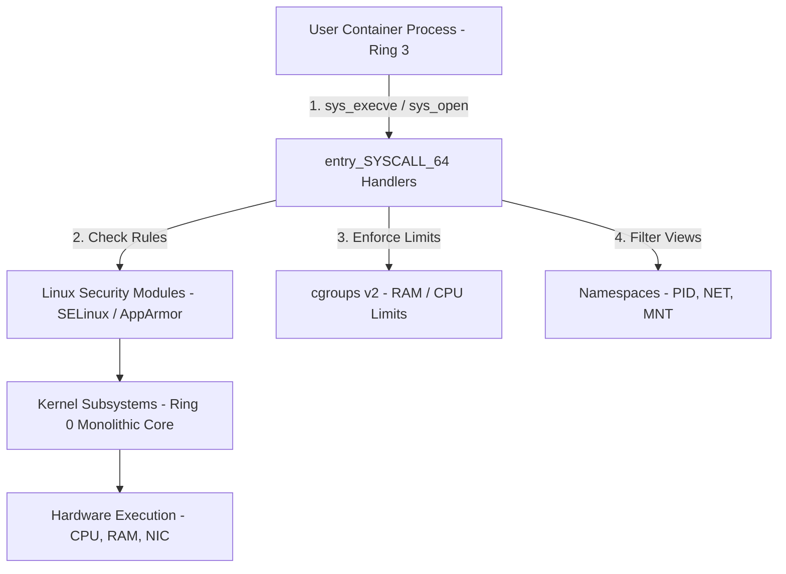
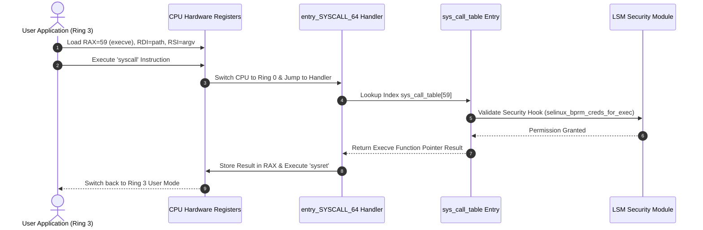

# P-14: Linux Kernel Architecture, Syscalls & Containers

> **Module ID:** P-14  
> **Category:** Advanced OS Internals & Security  
> **Difficulty:** Advanced  
> **Estimated Time:** 12 Hours  
> **Prerequisites:** Linux System Foundations (P-02) & Process Architecture (P-07)  
> **Related Topics:** System Calls (syscall), Ring 0 vs Ring 3, LKMs, LSM (SELinux/AppArmor), Namespaces, cgroups v2, eBPF, Container Hardening  
> **Framework Standard:** Cyber Act Universal Engineering Framework (v2 Standard)

---

# Part I — Understanding

## Overview

### Definition
* **Definition:** Linux Kernel Architecture encompasses the monolithic Ring 0 operating system core (`vmlinuz`), system call execution table (`sys_call_table`), Loadable Kernel Modules (LKMs), Linux Security Modules (LSM), eBPF execution engine, and container isolation primitives (Namespaces and cgroups v2).
* **One-Line Summary:** Monolithic Ring 0 kernel architecture executing system call handlers, LSM security checks, eBPF programs, and container isolation primitives.

### Purpose & Problem Statement
* **Purpose:** Manages hardware execution, provides secure hardware abstractions for User Space applications, enforces security policies (SELinux/AppArmor), and isolates cloud container environments (Docker/Kubernetes).
* **Problem it Solves:** Eliminates unauthorized user access to hardware registers, un-isolated multi-tenant container execution, un-monitored kernel execution paths, and system instability.
* **Why it Exists:** Developed by Linus Torvalds to deliver a high-performance, modular, open-source POSIX-compliant monolithic kernel.

### History & Evolution
* **Origins & Evolution:** Created in 1991, evolved to support 64-bit multi-processing, added LSM framework (2.6), Linux Namespaces and cgroups for containers (LXC/Docker), and eBPF in-kernel programmable verification.

### Mental Model & Analogy
* **Real-World Analogy:** High-security government building: User space apps are external visitors restricted to the public lobby (Ring 3). To access secure vault files, visitors submit official request forms (System Calls) to security guards (Kernel Handler). Guards verify security clearance (LSM/SELinux) before entering secure back rooms (Ring 0).
* **Mental Model:** User application executes `syscall` instruction ➔ CPU transitions from Ring 3 to Ring 0 ➔ Looks up `sys_call_table` handler index ➔ Executes kernel function ➔ Switches back to Ring 3.

> [!NOTE]
> Containers are NOT full virtual machines; containers are simply isolated Linux processes constrained by **Namespaces** (visibility) and **cgroups** (resource limits).

---

## Terminology

### Key Terms & Definitions

#### **Ring 0 vs Ring 3**
* **Definition:** **Ring 0 (Kernel Mode)** has unrestricted access to CPU instructions and physical memory; **Ring 3 (User Mode)** is an unprivileged execution mode for applications.
* **Context / Scope:** CPU Privilege Rings.
* **Key Properties:** Hardware enforced by x86-64 CPU architecture.

#### **System Call (`syscall`)**
* **Definition:** The fundamental hardware interface enabling User Space programs to request Kernel Space services (e.g. `sys_read`, `sys_write`, `sys_execve`).
* **Context / Scope:** Kernel Privilege Transition.
* **Key Properties:** Initiated via CPU `syscall` instruction on x86-64 (`rax` holds syscall number).

#### **Namespaces**
* **Definition:** Linux kernel feature providing process isolation by partitioning system resources (PID, NET, MNT, USER, UTS, IPC) so processes see only their assigned environment.
* **Context / Scope:** Container Isolation Primitive.
* **Key Properties:** Foundation of Docker and Kubernetes containerization.

#### **cgroups (Control Groups v2)**
* **Definition:** Linux kernel feature allocating and limiting hardware resource utilization (CPU shares, RAM limit, Disk I/O, Network bandwidth) across process groups.
* **Context / Scope:** Container Resource Management.
* **Key Properties:** Prevents container resource starvation (OOM killer).

#### **eBPF (Extended Berkeley Packet Filter)**
* **Definition:** A revolutionary in-kernel virtual machine allowing sandboxed byte-code programs to execute safely inside the Linux kernel without modifying kernel source code or loading LKMs.
* **Context / Scope:** In-Kernel Observability & Security.
* **Key Properties:** Used by Cilium, Falco, and bpftrace.

---

## Big Picture

### Domain & Ecosystem Placement
* **Domain:** Operating System Internals & Container Security
* **Parent Topic:** Advanced Operating System Architecture
* **Child Topics:** Kernel Architecture, Syscalls (`sys_call_table`), LKMs, LSM (SELinux/AppArmor), Namespaces, cgroups v2, eBPF, Container Hardening
* **Prerequisites:** Linux Foundations (P-02), Process Architecture (P-07)
* **Topics Enabled:** Kernel Exploitation, Container Security, Cloud Native Infrastructure (Kubernetes), Advanced Threat Hunting (Falco)

### Architectural Placement
* **Technology Ecosystem:** Linux Kernel (`vmlinuz`), `glibc`, Docker, Podman, SELinux, AppArmor, eBPF (`bpftrace`), `sysctl`.
* **Architecture Placement:** Operating System Core Kernel Layer.
* **Stack Placement:** Foundation Kernel Layer.

### System Ecosystem Map


---

# Part II — Internal Engineering

## Architecture

### Core Subsystems & Components
* **Components:** System Call Entry (`entry_SYSCALL_64`), Syscall Table (`sys_call_table`), Process Scheduler (CFS), VFS, Network Stack, LSM Framework, eBPF Verifier & JIT Compiler.
* **Services & Processes:** `dockerd`, `containerd`, `podman`.

### Linux Container Isolation Namespaces Table
| Namespace | Isolated System Resource | Security & Operational Function |
| :--- | :--- | :--- |
| **`PID`** | Process IDs | Processes see only inside their container PID tree. |
| **`NET`** | Network Interfaces & Routes | Isolated IP addresses, iptables rules, and sockets. |
| **`MNT`** | Filesystem Mount Points | Isolated root filesystem mount (`chroot` / `pivot_root`). |
| **`USER`** | User & Group UIDs/GIDs | Maps container root (UID 0) to unprivileged host UID. |
| **`UTS`** | Hostname & Domain Name | Custom hostname inside container. |
| **`IPC`** | System V IPC & POSIX Mq | Isolated shared memory and semaphores. |

---

## Mechanism

### Core Execution Workflow (System Call Invocation)
1. User application places system call number in register `RAX` (e.g. `RAX = 59` for `execve`) and arguments in `RDI`, `RSI`, `RDX`.
2. App executes CPU `syscall` instruction. CPU switches to Ring 0 and jumps to `entry_SYSCALL_64`.
3. Kernel looks up function pointer in `sys_call_table[59]`, invoking `sys_execve()`.
4. LSM (SELinux/AppArmor) validates security labels.
5. Handler executes, stores return code in `RAX`, and invokes `sysret` to return to Ring 3.

### Execution Sequence Map


---

## Relationships

### Upstream & Downstream Dependencies
* **Depends On:** X86-64 Hardware Microarchitecture, UEFI Firmware.
* **Used By:** Container Engines (Docker/Podman), Web Applications, System Services, Security Agents.
* **Communicates With:** Peripherals via IRQ interrupts and hardware drivers.

### Resource Lifecycle
* **Creates / Uses:** Allocates kernel stacks, `task_struct` nodes, eBPF maps, container namespaces.
* **Execution Ordering:** Boot ➔ Init Kernel ➔ Load LKMs ➔ Initialize LSM ➔ Spawn Init (PID 1) ➔ Run Containers.

---

## Runtime Environment

### Execution & System Context
* **Execution Environment:** Bare Metal Hardware / Cloud Hypervisor Monolithic Kernel.
* **Location:** System Memory (Kernel Ring 0).
* **Space:** Kernel Space.
* **Storage Unit:** Kernel Memory Pages & eBPF Maps.
* **Deployment Model:** Monolithic OS Kernel Image (`vmlinuz`).
* **Lifetime:** Continuous uptime until system reboot.

---

# Part III — Operations

## Installation & Setup

### Setup Procedures
```bash
# Ubuntu / Debian - Install Kernel Tools & Docker
sudo apt update && sudo apt install -y linux-headers-$(uname -r) bpftrace docker.io

# Verify Docker service
sudo systemctl enable --now docker
```

---

## Interfaces

### Kernel & Container Commands Reference

#### `uname` & `sysctl`
* **Purpose:** Queries kernel release information and tunes live kernel parameters (`/proc/sys/`).
* **Examples:**
  ```bash
  uname -a
  sudo sysctl -w net.ipv4.ip_forward=1
  ```

---

#### `lsmod` & `insmod` & `rmmod` & `modprobe`
* **Purpose:** Inspects, loads, and unloads Loadable Kernel Modules (`.ko`).
* **Examples:**
  ```bash
  lsmod | head -n 10
  sudo modprobe overlay
  ```

---

#### `dmesg` & `bpftrace`
* **Purpose:** `dmesg` prints kernel ring buffer logs; `bpftrace` executes dynamic eBPF tracing programs.
* **Examples:**
  ```bash
  dmesg | grep -iE "error|fail" | tail -n 10
  sudo bpftrace -e 'tracepoint:syscalls:sys_enter_openat { printf("%s opened %s\n", comm, str(args->filename)); }'
  ```

---

#### `sestatus` & AppArmor
* **Purpose:** Queries Linux Security Module enforcement state.
* **Examples:**
  ```bash
  sestatus 2>/dev/null || sudo apparmor_status
  ```

---

#### `docker` & `podman`
* **Purpose:** Manages container lifecycles isolated via Namespaces and cgroups.
* **Examples:**
  ```bash
  docker run -d --name test-nginx -p 8080:80 nginx
  docker exec -it test-nginx sh
  ```

---

### System Calls Reference Table
| Syscall Number (x86-64) | Syscall Name | Architectural Function |
| :---: | :--- | :--- |
| `0` | `sys_read` | Reads bytes from open file descriptor into buffer. |
| `1` | `sys_write` | Writes bytes from buffer to open file descriptor. |
| `2` | `sys_open` | Opens file path and returns new file descriptor integer. |
| `56` | `sys_clone` | Spawns child process/thread with specified Namespace flags. |
| `59` | `sys_execve` | Replaces current process memory with new program binary. |

---

### APIs & Libraries
* **SDKs & Libraries:** `libbpf`, `libseccomp`, `glibc`.

### Data Formats & Protocols
* **Formats:** ELF, eBPF Bytecode, LKM `.ko` files.

---

# Part IV — Observation

## Monitoring

### Telemetry & Inspection Tools
* **Tools:** `dmesg`, `bpftrace`, `lsmod`, `sestatus`, `docker stats`, `cgroups` inspection (`/sys/fs/cgroup/`).
* **Log Sources:** `/var/log/dmesg`, `/var/log/audit/audit.log`, `/var/log/syslog`.

---

## Debugging

### Step-by-Step Debugging Workflow
1. **Inspect Kernel Logs:** Run `dmesg -T | tail -n 20`.
2. **Trace Syscalls via eBPF:** Run `sudo bpftrace -e 'tracepoint:syscalls:sys_enter_execve { printf("%s\n", comm); }'`.
3. **Inspect Container cgroups:** Run `cat /sys/fs/cgroup/memory/docker/<id>/memory.limit_in_bytes`.

> [!TIP]
> Use `bpftrace` for near-zero overhead kernel syscall tracing in production environments where `strace` adds too much performance degradation.

---

# Part V — Security

## Security

### Threat Model & Attack Surface
* **Threat Model:** Container breakout attacks, kernel privilege escalation exploits (Dirty COW), unauthorized LKM rootkits, seccomp bypasses, cgroup resource exhaustion.
* **Attack Surface:** System calls, vulnerable LKMs, exposed Docker daemon socket (`/var/run/docker.sock`), unprivileged user namespaces.

### Attack Vectors & Vulnerabilities
* **Container Breakout via Writable Docker Socket:** Mounting `/var/run/docker.sock` inside an unprivileged container allows an attacker to spawn a host-root privileged container and escape to host root.

### Detection & Telemetry
* **Detection Opportunities:** Auditd rules capturing `init_module` / `finit_module` (LKM loading), Falco eBPF alerts for container breakouts.
* **MITRE ATT&CK Mapping:** T1611 (Escape to Host), T1547.006 (Kernel Modules and Extensions).

### Hardening & Security Best Practices
* Enforce **User Namespaces** to map container root to unprivileged host UIDs.
* Apply **Seccomp Filters** (`docker run --security-opt seccomp=default.json`) to block dangerous syscalls (`reboot`, `kexec_load`).
* Lock down LKM loading (`sysctl -w kernel.modules_disabled=1`).

- [ ] Is Seccomp filtering active for all containers?
- [ ] Is kernel module loading disabled on production hosts (`kernel.modules_disabled=1`)?
- [ ] Is access to `/var/run/docker.sock` restricted?

> [!CAUTION]
> Running containers with the `--privileged` flag disables all isolation protections (Namespaces, AppArmor, Capabilities), granting the container direct host kernel root access.

---

# Part VI — Engineering

## Engineering Analysis

### Design Rationale & Philosophy
* Monolithic Linux kernel design places all drivers and subsystems in Ring 0 for maximum execution speed, relying on LSM, Seccomp, and eBPF to enforce fine-grained safety boundaries.

### Technology Comparison Matrix
| Attribute | Linux Container | Full Virtual Machine (KVM) |
| :--- | :--- | :--- |
| **Isolation Boundary** | Kernel Namespaces & cgroups | Hardware Hypervisor Virtual CPU |
| **Startup Speed** | Instantaneous (<1 second) | Slow (10-30 seconds) |
| **Resource Overhead**| Minimal (Shares host kernel) | High (Requires dedicated guest OS) |

---

# Part VII — Practical

## Basic Lab
```bash
# Display kernel version and architecture
uname -a
```

## Observation Lab
```bash
# List active kernel modules
lsmod | head -n 10
```

## Internal Lab (Namespace Inspection)
```bash
# Inspect process namespace IDs
ls -l /proc/$$/ns
```

## Security Lab (Container Seccomp Audit)
```bash
# Run test container verifying unprivileged execution
docker run --rm alpine whoami 2>/dev/null || echo "Docker lab complete"
```

---

# Part VIII — Reference

## Quick Reference & Cheat Sheet
* `uname -a` | `lsmod` | `dmesg -T` | `bpftrace` | `sysctl -a`
* Key Namespaces: `PID`, `NET`, `MNT`, `USER`, `UTS`, `IPC`.

---

# Part IX — Professional

## Interview Questions

### Fundamental & Architecture Questions
* **Question 1:** *How do Linux Namespaces and cgroups differ in their roles within container isolation?*
  > [!NOTE]
  > **Namespaces** provide **isolation** by restricting what a process can *see* (PIDs, network interfaces, mount points). **cgroups** provide **resource governance** by restricting what a process group can *use* (CPU shares, RAM limits, Disk I/O).

### Security & Troubleshooting Questions
* **Question 2:** *Why is running a container with `--privileged` dangerous from a security standpoint?*
  > [!IMPORTANT]
  > `--privileged` disables all container security mechanisms (Namespaces, Capabilities, AppArmor, Seccomp), exposing all host device nodes to the container. An attacker inside a privileged container can escape to host root instantly.

---

## Revision

### Executive Summary & Revision
* **Key Takeaways:** The Linux Kernel manages Ring 0 execution, executing system calls via `sys_call_table`, securing paths via LSM, and isolating containers via Namespaces and cgroups.
* **One-Minute Revision:** App `syscall` ➔ Ring 3 to Ring 0 ➔ `sys_call_table` Entry ➔ LSM Check ➔ Namespace/cgroup Validation ➔ Kernel Subsystem Execution.

---

## Master Completion Checklist

### Understanding
- [x] Can define it
- [x] Can explain why it exists
- [x] Understand terminology
- [x] Know where it fits

### Internal Engineering
- [x] Can explain architecture
- [x] Can explain workflow
- [x] Can draw diagrams
- [x] Understand lifecycle

### Operations
- [x] Can install/configure
- [x] Can use CLI commands
- [x] Understand APIs/protocols

### Observation
- [x] Can monitor telemetry
- [x] Can debug failures
- [x] Know log sources

### Security
- [x] Know attack vectors
- [x] Know mitigations
- [x] Know detection telemetry

### Engineering
- [x] Can compare alternatives
- [x] Understand trade-offs
- [x] Know performance limits

### Practical
- [x] Completed basic lab
- [x] Completed observation lab
- [x] Completed security lab

### Professional
- [x] Can answer interview questions
- [x] Can explain to an engineer
- [x] Can implement independently
