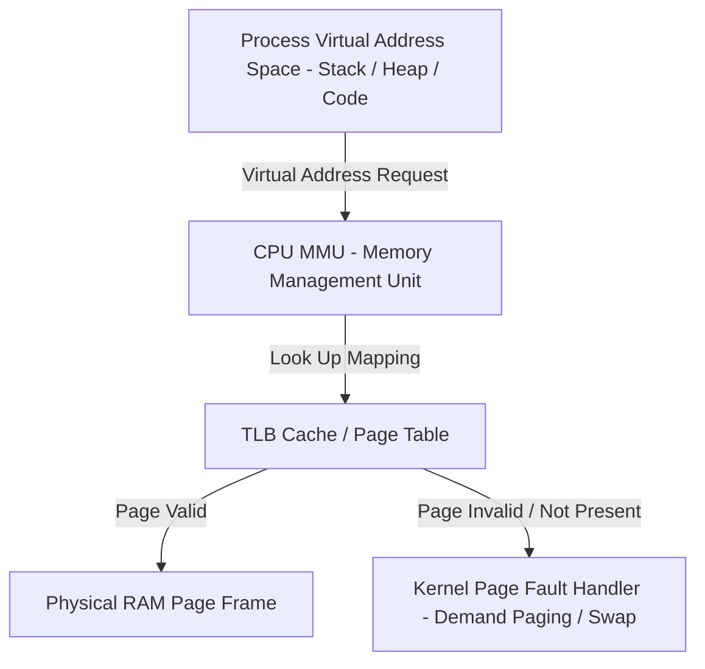
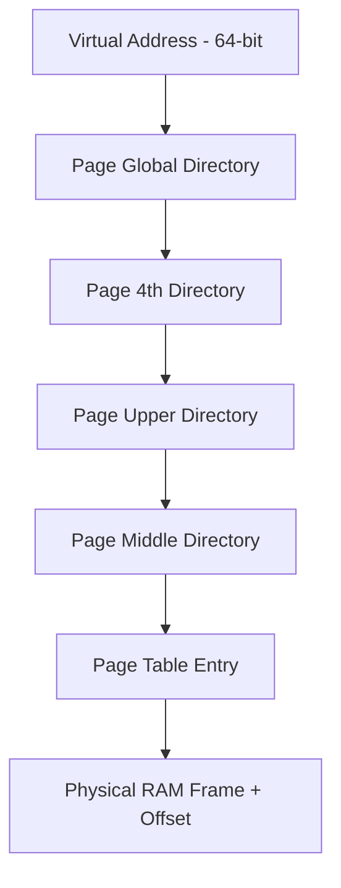
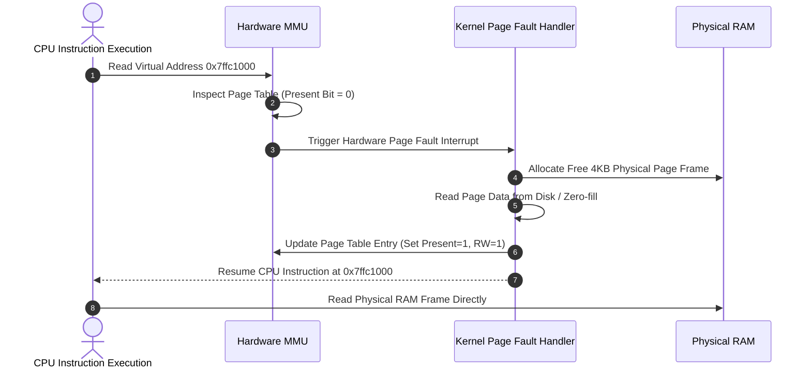

# P-09: Virtual Memory, Paging & Allocation

> **Module ID:** P-09  
> **Category:** Advanced OS Internals  
> **Difficulty:** Advanced  
> **Estimated Time:** 10 Hours  
> **Prerequisites:** Process Architecture (P-07)  
> **Related Topics:** MMU, Page Tables, Stack/Heap, malloc/free, Demand Paging, ASLR, DEP/NX, Buffer Overflow  
> **Framework Standard:** Cyber Act Universal Engineering Framework (v2 Standard)

---

# Part I — Understanding

## Overview

### Definition
* **Definition:** Virtual Memory is a hardware and operating system memory management architecture that provides each process with an isolated, contiguous virtual address space, translating virtual memory addresses to physical RAM frames via CPU Memory Management Units (MMU), page tables, and demand paging.
* **One-Line Summary:** Contiguous virtual address space isolation managed by CPU MMU page tables, demand paging, and hardware security flags (NX/ASLR).

### Purpose & Problem Statement
* **Purpose:** Enables hardware process memory isolation, virtual memory expansion beyond physical RAM via Swap, efficient memory sharing (Copy-on-Write), and hardware memory protection (Read/Write/Execute flags).
* **Problem it Solves:** Eliminates processes reading or overwriting each other's physical RAM, fragmented memory allocation bottlenecks, and unauthorized execution of injected data payloads.
* **Why it Exists:** Developed to move past early bare-metal systems where programs accessed physical RAM directly, leading to catastrophic system crashes and zero application security boundary isolation.

### History & Evolution
* **Origins & Evolution:** Introduced in Atlas computer (1962), integrated into x86 paging (80386), expanded to x86-64 48-bit/57-bit virtual addressing, adding hardware NX/XD bits and randomized ASLR.

### Mental Model & Analogy
* **Real-World Analogy:** A PO Box rental facility: Every customer is assigned PO Box numbers `1` through `1000` (Virtual Address Space). The post office manager (MMU Page Table) maps PO Box #50 to Physical Storage Locker #B-12 on the warehouse floor (Physical RAM).
* **Mental Model:** CPU issues Virtual Address ➔ MMU intercepts address ➔ Traverses Page Directory & Page Table ➔ Validates permission bits (R/W/X) ➔ Translates to Physical Memory Frame address.

> [!NOTE]
> Physical RAM is non-contiguous and fragmented. Virtual Memory tricks the process into seeing a clean, contiguous memory block starting from address `0x000000000000` up to kernel space.

---

## Terminology

### Key Terms & Definitions

#### **MMU (Memory Management Unit)**
* **Definition:** Physical hardware component inside the CPU that performs real-time translation of virtual memory addresses into physical RAM addresses using page tables.
* **Context / Scope:** Hardware CPU Architecture.
* **Key Properties:** Uses Translation Lookaside Buffer (TLB) cache to accelerate translations.

#### **Page & Page Frame**
* **Definition:** A **Page** is a fixed-size block of virtual memory (typically 4KB); a **Page Frame** is a matching fixed-size block of physical RAM.
* **Context / Scope:** Memory Allocation Unit.
* **Key Properties:** Standard page size is 4096 bytes (4KB).

#### **Stack vs Heap**
* **Definition:** The **Stack** is a LIFO memory segment storing local function variables and call frames (grows downward); the **Heap** is a dynamically allocated memory pool (`malloc`/`free`) for runtime objects (grows upward).
* **Context / Scope:** Virtual Address Space Layout.
* **Key Properties:** Stack overflows occur from unbounded recursion; Heap corruption occurs from double frees or memory leaks.

#### **ASLR (Address Space Layout Randomization)**
* **Definition:** A security mitigation technique that randomizes the memory locations of program execution segments (Stack, Heap, Libraries) upon process startup.
* **Context / Scope:** Exploit Mitigation Standard.
* **Key Properties:** Prevents attackers from predicting target function addresses for buffer overflow exploits.

#### **DEP / NX Bit (Data Execution Prevention / No-Execute)**
* **Definition:** A hardware-enforced CPU security bit marking memory pages (e.g. Stack and Heap) as non-executable.
* **Context / Scope:** Hardware Security Enforcement.
* **Key Properties:** Prevents execution of injected shellcode payloads in Stack or Heap memory.

---

## Big Picture

### Domain & Ecosystem Placement
* **Domain:** Operating System Internals & Memory Architecture
* **Parent Topic:** Advanced Operating System Internals
* **Child Topics:** MMU, Page Tables, Stack/Heap, `malloc`/`free`, `mmap`, Page Faults, Buffer Overflows, ASLR, DEP/NX, Memory Forensics
* **Prerequisites:** Process Architecture (P-07)
* **Topics Enabled:** Binary Exploitation, Reverse Engineering, Kernel Memory Management (P-14), Memory Malware Forensics (Volatility)

### Architectural Placement
* **Technology Ecosystem:** CPU MMU, Linux Kernel Memory Manager, `glibc` `malloc`, Valgrind, Volatility.
* **Architecture Placement:** Hardware & OS Kernel Memory Subsystem Layer.
* **Stack Placement:** Core Hardware Memory Layer.

### System Ecosystem Map


---

# Part II — Internal Engineering

## Architecture

### Memory & Address Space Layout
```text
High Address  0x7FFFFFFFFFFF ┌──────────────────────────┐
                             │       Kernel Space       │
                             ├──────────────────────────┤
                             │          Stack           │  │ (Grows Downward)
                             │            │             │  ▼
                             │            ▼             │
                             │                          │
                             │            ▲             │
                             │            │             │  ▲
                             │          Heap            │  │ (Grows Upward)
                             ├──────────────────────────┤
                             │       BSS Segment        │
                             ├──────────────────────────┤
                             │       Data Segment       │
                             ├──────────────────────────┤
                             │       Text (Code)        │
Low Address   0x000000000000 └──────────────────────────┘
```

### Component Architecture Map


---

## Mechanism

### Core Execution Workflow (Demand Paging & Page Faults)
1. Process accesses virtual address `0x7ffca1234000`.
2. CPU MMU checks Page Table entry. Valid bit is `0` (Page not loaded in RAM).
3. CPU triggers hardware `Page Fault` interrupt.
4. Kernel Page Fault Handler catches interrupt, allocates physical RAM page frame, loads data from disk/swap, updates Page Table, and resumes instruction.

### Execution Sequence Map


---

## Relationships

### Upstream & Downstream Dependencies
* **Depends On:** CPU Hardware MMU, Physical RAM Chips, Swap Space Storage.
* **Used By:** All User Space binaries, Dynamic Memory Allocators (`malloc`), Shared Libraries.
* **Communicates With:** Hardware RAM & Kernel Memory Subsystem.

### Resource Lifecycle
* **Creates / Uses:** Allocates virtual memory page mappings (`mmap`), page table entries, physical RAM frames.
* **Execution Ordering:** Process startup ➔ Map ELF segments ➔ Allocate Heap (`brk`/`mmap`) ➔ Execute stack frames ➔ Free on exit.

---

## Runtime Environment

### Execution & System Context
* **Execution Environment:** Hardware CPU MMU & Kernel Space Memory Subsystem.
* **Location:** Hardware RAM & Virtual Memory Swap Files.
* **Space:** Virtual Memory Address Space (Ring 3 User / Ring 0 Kernel).
* **Execution Unit:** Memory Management Unit (MMU) & Kernel Page Fault Handler.
* **Storage Unit:** 4KB Memory Pages.
* **Deployment Model:** Hardware Level / Hypervisor Memory Management.
* **Lifetime:** Dynamic memory allocation lifetime (`malloc` to `free`).

---

# Part III — Operations

## Installation & Configuration

### Memory Commands Reference

#### `free` & `vmstat`
* **Purpose:** Displays total, used, free memory and swap statistics.
* **Syntax:** `free [options]` / `vmstat [interval] [count]`
* **Example:**
  ```bash
  free -h
  vmstat 1 5
  ```

---

#### `pmap`
* **Purpose:** Displays virtual memory map of a process by PID.
* **Syntax:** `pmap [options] <PID>`
* **Example:**
  ```bash
  pmap $$
  ```

---

#### `sysctl` ASLR Configuration
* **Purpose:** Queries or sets global Address Space Layout Randomization state.
* **Example:**
  ```bash
  # Query ASLR state (0 = Disabled, 1 = Conservative, 2 = Full Randomization)
  sysctl kernel.randomize_va_space
  ```

---

## Interfaces

### C Memory Allocation APIs Reference

#### `malloc()`, `calloc()`, `realloc()`, `free()`
```c
#include <stdio.h>
#include <stdlib.h>

int main() {
    // Heap Allocation (1024 bytes)
    char *ptr = (char *)malloc(1024);
    if (!ptr) return 1;

    snprintf(ptr, 1024, "Cyber Act Memory Allocation");
    printf("[+] Memory: %s\n", ptr);

    // Free allocated memory
    free(ptr);
    return 0;
}
```

---

#### Low-Level Memory APIs (`mmap()`, `mprotect()`, `munmap()`, `brk()`)
* `mmap()`: Maps files or anonymous memory pages into process address space.
* `mprotect()`: Modifies memory protection access flags (`PROT_READ`, `PROT_WRITE`, `PROT_EXEC`).
* `munmap()`: Unmaps mapped virtual memory pages.
* `brk()` / `sbrk()`: Changes location of program break (Heap boundary).

```c
#include <sys/mman.h>

// Allocate 4096 bytes of Anonymous Read/Write Memory
void *addr = mmap(NULL, 4096, PROT_READ | PROT_WRITE, MAP_PRIVATE | MAP_ANONYMOUS, -1, 0);
// Change protection to Read-Only
mprotect(addr, 4096, PROT_READ);
// Unmap page
munmap(addr, 4096);
```

---

### APIs & Libraries
* **SDKs & Libraries:** `glibc` `malloc`, `valgrind`, `gdb`.

### Data Formats & Protocols
* **File Formats:** Core Dumps (`core`), ELF Program Headers (`PT_LOAD`).
* **Protocols & RFCs:** x86-64 Memory Management Specification.

---

# Part IV — Observation

## Monitoring

### Telemetry & Inspection Tools
* **Tools:** `free -h`, `vmstat`, `/proc/<PID>/maps`, `/proc/meminfo`, `pmap <PID>`, `valgrind`.
* **Log Sources:** Kernel ring buffer (`dmesg` OOM-killer logs).

---

## Debugging

### Step-by-Step Debugging Workflow
1. **Inspect Memory Maps:** Run `cat /proc/<PID>/maps`.
2. **Check Valgrind Leak:** Execute `valgrind --leak-check=full ./binary`.
3. **Inspect Core Dump:** Analyze crash via `gdb ./binary core`.

> [!TIP]
> Use `valgrind --leak-check=full` to catch un-freed heap pointers and memory leaks in C/C++ binaries.

---

# Part V — Security

## Security

### Threat Model & Attack Surface
* **Threat Model:** Buffer overflow vulnerabilities, stack smash attacks, heap corruption, use-after-free (UAF), memory leaks, memory scraping (LSASS dumping).
* **Attack Surface:** Unbounded `strcpy`/`gets` C functions, heap allocators, un-sanitized array indexing.

### Security Mitigations Reference Table
| Mitigation | Mechanism | Purpose |
| :--- | :--- | :--- |
| **ASLR** | Randomizes memory segment base addresses (`kernel.randomize_va_space=2`) | Blocks Return-to-libc & ROP attacks. |
| **DEP / NX Bit** | CPU hardware flag preventing execution in Stack/Heap pages | Blocks injected shellcode execution. |
| **Stack Canary** | Guard integer value placed before saved return address | Detects Stack Buffer Overflows before function returns. |
| **PIE** | Compiles binary as Position Independent Executable | Enables full ASLR for code (`Text`) segment. |

---

# Part VI — Engineering

## Engineering Analysis

### Design Rationale & Philosophy
* Virtual memory isolates process execution spaces, ensuring a crash or memory corruption in one process cannot alter or corrupt physical RAM used by other processes.

### Technology Comparison Matrix
| Memory Region | Allocation Lifetime | Access Speed | Growth Direction |
| :--- | :--- | :--- | :--- |
| **Stack** | Automatic (Function scope) | Extremely Fast (CPU SP) | Downward (High ➔ Low) |
| **Heap** | Manual (`malloc`/`free`) | Moderate | Upward (Low ➔ High) |

---

# Part VII — Practical

## Basic Lab
```bash
# Display system memory statistics
free -h
cat /proc/meminfo | head -n 5
```

## Observation Lab
```bash
# Monitor page faults and memory activity
vmstat 1 5
```

## Internal Lab
```bash
# Inspect process virtual memory address mapping
pmap $$ | head -n 15
```

## Security Lab
```bash
# Check global ASLR configuration
sysctl kernel.randomize_va_space

# Inspect process memory address randomness
pmap $$ | head -n 5
```

---

# Part VIII — Reference

## Quick Reference & Cheat Sheet
* `free -h` | `vmstat 1` | `pmap <PID>` | `sysctl kernel.randomize_va_space`
* Standard Page Size: `4096 bytes` (4KB).

---

# Part IX — Professional

## Interview Questions

### Fundamental & Architecture Questions
* **Question 1:** *How does the CPU Memory Management Unit (MMU) translate virtual memory addresses to physical RAM addresses?*
  > [!NOTE]
  > The MMU uses page tables maintained by the kernel to map virtual memory pages to physical RAM page frames. It splits virtual addresses into page table indexes and offsets, accelerating lookups via the Translation Lookaside Buffer (TLB).

### Security & Troubleshooting Questions
* **Question 2:** *How do ASLR and the NX/DEP bit combine to mitigate buffer overflow exploits?*
  > [!IMPORTANT]
  > The **NX/DEP bit** marks Stack and Heap pages as non-executable, preventing injected shellcode execution. **ASLR** randomizes memory addresses, preventing attackers from predicting library function addresses (e.g. `system()`) for Return-to-libc attacks.

---

## Revision

### Executive Summary & Revision
* **Key Takeaways:** Virtual memory provides isolated, contiguous 4KB page spaces mapped to physical RAM frames via CPU MMUs, secured via ASLR, Stack Canaries, and NX execution flags.
* **One-Minute Revision:** CPU Virtual Address ➔ MMU TLB Lookup ➔ Page Table Entry ➔ Present Bit Check (Page Fault if 0) ➔ Physical RAM Frame Access.

---

## Master Completion Checklist

### Understanding
- [x] Can define it
- [x] Can explain why it exists
- [x] Understand terminology
- [x] Know where it fits

### Internal Engineering
- [x] Can explain architecture
- [x] Can explain workflow
- [x] Can draw diagrams
- [x] Understand lifecycle

### Operations
- [x] Can install/configure
- [x] Can use CLI commands
- [x] Understand APIs/protocols

### Observation
- [x] Can monitor telemetry
- [x] Can debug failures
- [x] Know log sources

### Security
- [x] Know attack vectors
- [x] Know mitigations
- [x] Know detection telemetry

### Engineering
- [x] Can compare alternatives
- [x] Understand trade-offs
- [x] Know performance limits

### Practical
- [x] Completed basic lab
- [x] Completed observation lab
- [x] Completed security lab

### Professional
- [x] Can answer interview questions
- [x] Can explain to an engineer
- [x] Can implement independently
