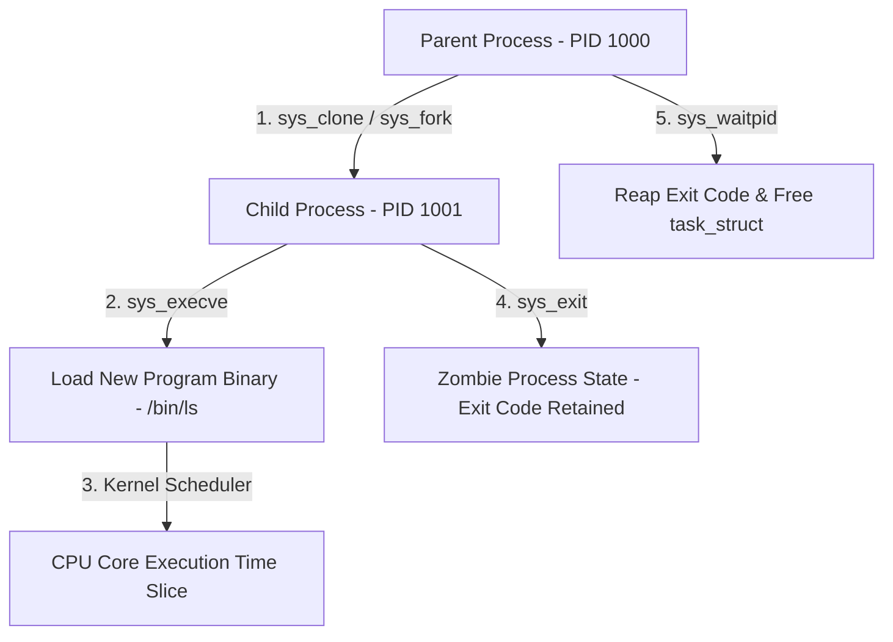
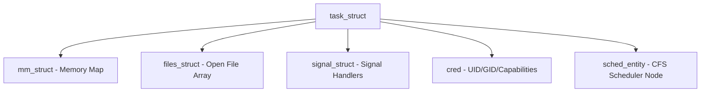
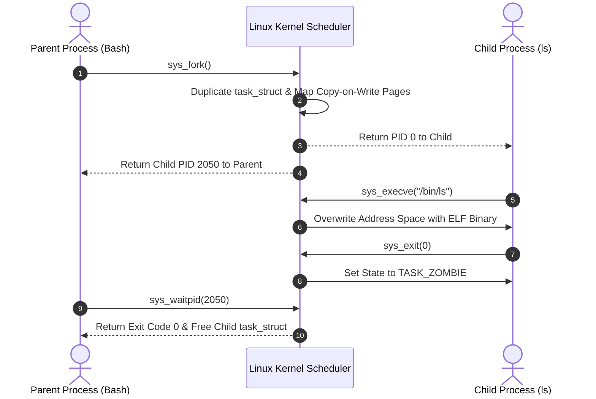

# P-07 / P-08: Process Architecture, Lifecycle & Concurrency

> **Module ID:** P-07 / P-08  
> **Category:** Advanced OS Internals  
> **Difficulty:** Advanced  
> **Estimated Time:** 10 Hours  
> **Prerequisites:** Linux System Foundations (P-02)  
> **Related Topics:** task_struct, fork/execve, Copy-on-Write, Signals, IPC, POSIX Threads, CFS Scheduler  
> **Framework Standard:** Cyber Act Universal Engineering Framework (v2 Standard)

---

# Part I — Understanding

## Overview

### Definition
* **Definition:** A Process is an operating system abstraction representing an active instance of a running program, possessing a dedicated virtual address space, execution state, security context, file descriptor table, and one or more concurrent execution Threads (`task_struct`) managed by the OS kernel scheduler.
* **One-Line Summary:** Kernel process execution abstraction managing virtual address space, task descriptors (`task_struct`), threads, IPC, and state transitions.

### Purpose & Problem Statement
* **Purpose:** Enables multi-tasking execution, isolated memory spaces, resource accounting, inter-process communication, and hardware resource scheduling across multi-core CPUs.
* **Problem it Solves:** Eliminates memory corruption between executing programs, uncoordinated hardware access, application freeze lockups, and un-tracked resource utilization.
* **Why it Exists:** Introduced in early operating systems to transition from single-task batch processing to multi-user, multi-tasking execution environments.

### History & Evolution
* **Origins & Evolution:** Evolved from Unix process model (`fork`/`exec`), through NPTL (Native POSIX Thread Library in Linux 2.6), to modern CFS (Completely Fair Scheduler) and `clone3()` system calls.

### Mental Model & Analogy
* **Real-World Analogy:** A construction project site: The blueprint is the program binary on disk (`/bin/ls`), the entire fenced construction site is the Process (Virtual Memory & File Descriptors), and the active workers building on site are the Threads (`task_struct` execution units).
* **Mental Model:** Kernel allocates `task_struct` in memory ➔ Maps virtual address space ➔ Loads binary code ➔ Assigns Process ID (PID) ➔ Schedules CPU time slices via CFS scheduler.

> [!NOTE]
> In Linux, the kernel does NOT distinguish between processes and threads at the low-level scheduler level; both are represented as `task_struct` entities created via `clone()`.

---

## Terminology

### Key Terms & Definitions

#### **`task_struct`**
* **Definition:** The fundamental Linux kernel C struct representing a process or thread descriptor, containing PID, state, credentials, memory maps (`mm_struct`), and file tables (`files_struct`).
* **Context / Scope:** Linux Kernel Core.
* **Key Properties:** Memory footprint allocated in kernel space.

#### **PID & PPID**
* **Definition:** Process Identifier (PID) uniquely identifies a running task; Parent Process Identifier (PPID) identifies the process that spawned it.
* **Context / Scope:** Process Hierarchy.
* **Key Properties:** PID 1 is always the master `systemd` init process.

#### **`fork()` vs `execve()`**
* **Definition:** `fork()` duplicates the calling process creating a child process via Copy-on-Write (COW); `execve()` replaces the current process address space with a new program binary.
* **Context / Scope:** Process Creation System Calls.
* **Key Properties:** Standard Unix process spawn sequence is `fork()` followed by `execve()`.

#### **Inter-Process Communication (IPC)**
* **Definition:** System mechanisms allowing separate isolated processes to exchange data: Anonymous Pipes, Named Pipes (FIFOs), Shared Memory (`shm`), UNIX Domain Sockets, Signals.
* **Context / Scope:** Process Communication.
* **Key Properties:** Shared memory provides fastest IPC throughput.

#### **Zombie Process**
* **Definition:** A terminated process whose exit status has not yet been read by its parent via `waitpid()`, leaving its entry in the process table.
* **Context / Scope:** Process Lifecycle State.
* **Key Properties:** Reaped when parent calls `waitpid()`.

---

## Big Picture

### Domain & Ecosystem Placement
* **Domain:** Operating System Internals & Process Management
* **Parent Topic:** Advanced Operating System Architecture
* **Child Topics:** `task_struct`, `fork`/`execve`, Process States, Signals, POSIX Threads (pthreads), Mutexes & Semaphores, IPC, Process Injection
* **Prerequisites:** Linux Foundations (P-02)
* **Topics Enabled:** Virtual Memory (P-09), Linux Kernel (P-14), Exploit Analysis, High-Performance Concurrency, EDR Process Telemetry

### Architectural Placement
* **Technology Ecosystem:** Linux Kernel CFS Scheduler, GNU C Library (`glibc`), `systemd`, `ps`, `top`, `kill`.
* **Architecture Placement:** Operating System Execution & Scheduling Layer.
* **Stack Placement:** Core OS Process Execution Layer.

### System Ecosystem Map


---

# Part II — Internal Engineering

## Architecture

### Core Subsystems & Components
* **Components:** Completely Fair Scheduler (CFS), Signals Subsystem, IPC Subsystem (Pipes, Shared Memory, Sockets), Process Credentials (`uid`, `gid`, `capabilities`).
* **Services & Processes:** `systemd` (PID 1), kernel thread daemons (`kthreadd`).

### Memory & Data Structures
* **Data Structures:** `task_struct`, `mm_struct` (Virtual memory map), `files_struct` (Open file descriptor array), `signal_struct` (Pending signals).

### Component Architecture Map


---

## Mechanism

### Core Execution Workflow
1. Parent process executes `fork()`. Kernel allocates new `task_struct` and copies parent page tables marked Copy-on-Write (COW).
2. Child process executes `execve("/usr/bin/python3", ...)`. Kernel wipes old address space and maps new ELF binary segments.
3. CPU executes program instructions. When process calls `exit(0)`, state transitions to `TASK_ZOMBIE`.
4. Parent calls `waitpid()`, reading exit code and freeing child `task_struct`.

### Execution Sequence Map


---

## Relationships

### Upstream & Downstream Dependencies
* **Depends On:** CPU Hardware Timer Interrupts, Memory Management Unit (MMU), Kernel Scheduler.
* **Used By:** All User Space binaries, background daemons, thread pools.
* **Communicates With:** Parent/Child processes via Signals and IPC channels.

### Resource Lifecycle
* **Creates / Uses:** Allocates `task_struct`, virtual memory pages, file descriptors.
* **Execution Ordering:** `fork()` ➔ `execve()` ➔ Task Execution ➔ `exit()` ➔ `waitpid()`.

---

## Runtime Environment

### Execution & System Context
* **Execution Environment:** User Space code execution managed by Kernel Space scheduler.
* **Location:** Local Machine RAM & CPU Cores.
* **Space:** User Space & Kernel Space (`task_struct`).
* **Execution Unit:** Threads (`task_struct`).
* **Storage Unit:** RAM Memory Pages & File Handles.
* **Lifetime:** From process spawn (`fork`) to process termination (`exit`).

---

# Part III — Operations

## Installation & Setup

### Setup Procedures
```bash
# Verify process monitoring tools
ps -ef | head -n 5
```

---

## Interfaces

### Process Monitoring & Management Commands Reference

#### `ps`
* **Purpose:** Displays snapshot of current running processes.
* **Syntax:** `ps [options]`
* **Parameters:**
  * `-ef`: Full format listing of all processes.
  * `aux`: Detailed process listing showing CPU/RAM percentage and state flags (`R`, `S`, `D`, `Z`, `T`).
* **Example:** `ps aux | grep python3`

---

#### `top` & `htop`
* **Purpose:** Interactive real-time process viewer and system resource monitor.
* **Example:** `htop`

---

#### `pstree`
* **Purpose:** Displays running processes as a hierarchical visual tree.
* **Syntax:** `pstree [options]`
* **Parameters:** `-p` (show PIDs), `-u` (show user transitions).
* **Example:** `pstree -pu 1`

---

#### `pgrep` & `pkill` & `kill`
* **Purpose:** Process signaling and searching utilities.
* **Syntax:** `kill [-signal] <PID>` / `pkill -f <pattern>`
* **Parameters:**
  * `-15` (`SIGTERM`): Graceful termination request.
  * `-9` (`SIGKILL`): Uncatchable immediate kernel termination.
  * `-2` (`SIGINT`): Interrupt from keyboard (Ctrl+C).
  * `-1` (`SIGHUP`): Terminal disconnect / reload config.
* **Examples:**
  ```bash
  pgrep -l python
  kill -15 1234
  kill -9 1234
  ```

---

#### `strace` & `lsof`
* **Purpose:** Process syscall tracing and file handle auditing.
* **Examples:**
  ```bash
  sudo strace -f -p 1234
  sudo lsof -p 1234
  ```

---

### Core POSIX Signals Reference Table
| Signal Name | Number | Default Action | Security & Operational Purpose |
| :--- | :---: | :--- | :--- |
| **`SIGHUP`** | `1` | Terminate Process | Reload daemon configuration. |
| **`SIGINT`** | `2` | Terminate Process | Interrupt process from terminal (Ctrl+C). |
| **`SIGKILL`** | `9` | Immediate Kill (Uncatchable) | Force kill un-responsive process by kernel. |
| **`SIGSEGV`** | `11` | Terminate & Core Dump | Invalid memory access (Segmentation Fault). |
| **`SIGTERM`** | `15` | Graceful Termination | Standard process stop request. |
| **`SIGCHLD`** | `17` | Ignore Signal | Child process terminated / stopped notification to parent. |

---

### System Calls & Thread APIs
* **System Calls:** `fork()`, `vfork()`, `execve()`, `clone()`, `exit()`, `waitpid()`, `kill()`, `pipe()`.
* **POSIX Threads (pthreads):** `pthread_create()`, `pthread_join()`, `pthread_mutex_lock()`, `pthread_mutex_unlock()`.

### Data Formats & Protocols
* **File Formats:** ELF (`Executable and Linkable Format`).
* **Protocols & RFCs:** POSIX 1003.1 (Process & Threading Standard).

---

# Part IV — Observation

## Monitoring

### Telemetry & Inspection Tools
* **Tools:** `ps aux`, `top`, `htop`, `pstree`, `strace`, `/proc/<PID>/status`, `/proc/<PID>/cmdline`.
* **Log Sources:** `/var/log/syslog`, Auditd EXECVE events.

---

## Debugging

### Step-by-Step Debugging Workflow
1. **Locate PID:** Run `pgrep -f target_app`.
2. **Inspect Process Details:** Run `cat /proc/<PID>/status`.
3. **Trace System Calls:** Execute `sudo strace -p <PID> -f`.

> [!TIP]
> Use `strace -f -e trace=process <command>` to trace child processes spawned via `fork()`.

---

# Part V — Security

## Security

### Threat Model & Attack Surface
* **Threat Model:** Process injection (DLL/SO injection, `ptrace` abuse), process hollowing, privilege escalation via SUID, rogue background daemons.
* **Attack Surface:** `ptrace` system call API, `/proc/<PID>/mem`, SUID binaries.

### Attack Vectors & Vulnerabilities
* **Process Hollowing:** Adversary spawns legitimate process in suspended state, unmaps image memory, injects malicious shellcode payload into address space, and resumes thread.

### Detection & Telemetry
* **Detection Opportunities:** Auditd EXECVE logs, Sysmon Event ID 10 (ProcessAccess), `ptrace` syscall monitoring.
* **MITRE ATT&CK Mapping:** T1055.012 (Process Injection: Process Hollowing).

### Hardening & Security Best Practices
* Restrict process tracing by setting `sysctl kernel.yama.ptrace_scope = 1` or `2`.
* Monitor process creation via **Sysmon Event ID 1** or **Auditd EXECVE** logs.

- [ ] Is `kernel.yama.ptrace_scope` set to 1 or higher?
- [ ] Are process creation events logged with full command line arguments?

> [!CAUTION]
> Leaving `ptrace_scope = 0` allows unprivileged malware running under the same user account to inject code directly into running SSH agents or browser processes.

---

# Part VI — Engineering

## Engineering Analysis

### Design Rationale & Philosophy
* Linux uses a unified `task_struct` for both processes and threads (`clone()`), providing light execution context switching while isolating memory spaces.

### Technology Comparison Matrix
| Attribute | Process | Thread |
| :--- | :--- | :--- |
| **Memory Boundary** | Dedicated Isolated Virtual Address Space | Shared Address Space within Process |
| **Creation Overhead**| Higher (`fork` + COW) | Lower (`clone` sharing `CLONE_VM`) |
| **IPC Requirement** | Required (Pipes, Sockets, Shared Memory) | Direct Shared Variable Access |

---

# Part VII — Practical

## Basic Lab
```bash
# Display process hierarchy tree
pstree -p | head -n 10
```

## Observation Lab
```bash
# Monitor process CPU usage in real-time
top -b -n 1 | head -n 20
```

## Internal Lab
```bash
# Inspect process memory map and status
cat /proc/$$/status | grep -iE "Name|State|Pid|PPid|Uid"
```

## Security Lab
```bash
# 1. Spawn background sleep process
sleep 300 &
SLEEP_PID=$!

# 2. Inspect process details via /proc
cat /proc/$SLEEP_PID/status | grep -iE "Name|State|Pid|PPid|Uid"

# 3. Clean up process
kill -9 $SLEEP_PID
```

---

# Part VIII — Reference

## Quick Reference & Cheat Sheet
* `ps aux` | `pstree -p` | `kill -15 <PID>` | `strace -p <PID>`
* Key Signals: `SIGINT` (`2`), `SIGKILL` (`9`), `SIGSEGV` (`11`), `SIGTERM` (`15`).

---

# Part IX — Professional

## Interview Questions

### Fundamental & Architecture Questions
* **Question 1:** *What is the difference between `fork()` and `execve()` in Unix/Linux?*
  > [!NOTE]
  > `fork()` duplicates the calling process to create a child process with an identical copy-on-write memory space. `execve()` overwrites the current process address space with a new program binary.

### Security & Troubleshooting Questions
* **Question 2:** *What is a Zombie Process and how can un-reaped processes impact system security?*
  > [!IMPORTANT]
  > A Zombie process is a terminated process whose exit code has not yet been read by its parent via `waitpid()`. While holding no memory, excessive zombies exhaust available Process IDs (PIDs), causing Denial of Service (DoS).

---

## Revision

### Executive Summary & Revision
* **Key Takeaways:** Processes are kernel-scheduled `task_struct` execution units managing virtual address spaces, spawned via `fork()`/`execve()`, and monitored via `/proc` and signals.
* **One-Minute Revision:** Parent `fork()` (COW memory copy) ➔ Child `execve()` (ELF binary load) ➔ Execution ➔ `exit()` (TASK_ZOMBIE) ➔ Parent `waitpid()` (Reap).

---

## Master Completion Checklist

### Understanding
- [x] Can define it
- [x] Can explain why it exists
- [x] Understand terminology
- [x] Know where it fits

### Internal Engineering
- [x] Can explain architecture
- [x] Can explain workflow
- [x] Can draw diagrams
- [x] Understand lifecycle

### Operations
- [x] Can install/configure
- [x] Can use CLI commands
- [x] Understand APIs/protocols

### Observation
- [x] Can monitor telemetry
- [x] Can debug failures
- [x] Know log sources

### Security
- [x] Know attack vectors
- [x] Know mitigations
- [x] Know detection telemetry

### Engineering
- [x] Can compare alternatives
- [x] Understand trade-offs
- [x] Know performance limits

### Practical
- [x] Completed basic lab
- [x] Completed observation lab
- [x] Completed security lab

### Professional
- [x] Can answer interview questions
- [x] Can explain to an engineer
- [x] Can implement independently
