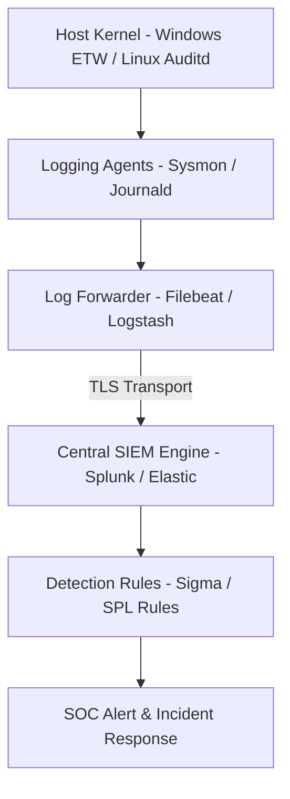
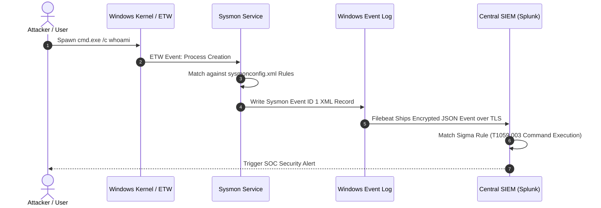

# P-13: Logging Fundamentals, Telemetry & SIEM Architecture

> **Module ID:** P-13  
> **Category:** Security Operations & Detection Engineering  
> **Difficulty:** Advanced  
> **Estimated Time:** 10 Hours  
> **Prerequisites:** Linux Foundations (P-02) & Windows Foundations (P-03)  
> **Related Topics:** Journald, Auditd, Windows Event Logs, Sysmon, Log Forwarding, SIEM, Sigma Rules, Detection Engineering  
> **Framework Standard:** Cyber Act Universal Engineering Framework (v2 Standard)

---

# Part I — Understanding

## Overview

### Definition
* **Definition:** Logging Fundamentals & Telemetry encompasses the kernel logging agents (Linux Auditd, systemd-journald, Windows ETW, Sysmon), structured log serialization formats (JSON, EVTX, Syslog RFC 5424), forwarding agents (Filebeat, Logstash), and SIEM engines (Splunk, Elastic) that capture, transport, index, and analyze security telemetry.
* **One-Line Summary:** System telemetry infrastructure capturing kernel execution events, forwarding structured logs, and correlating security incidents in SIEM.

### Purpose & Problem Statement
* **Purpose:** Enables security visibility, threat detection, incident response forensics, regulatory compliance auditing, and system diagnostic troubleshooting across enterprise IT environments.
* **Problem it Solves:** Eliminates unmonitored host execution, undetected attacker lateral movement, un-audited administrative activity, and lack of forensic evidence during security breaches.
* **Why it Exists:** Developed to provide an immutable record of system and user activities across computer networks.

### History & Evolution
* **Origins & Evolution:** Evolved from early Syslog (RFC 3164) to systemd-journald, Windows EVTX, Sysmon, eBPF telemetry, and modern cloud SIEM platforms (Splunk, Elastic, Microsoft Sentinel).

### Mental Model & Analogy
* **Real-World Analogy:** Security camera network in a bank: Sensors (Kernel Auditd/Sysmon) capture video frames (Events), cables (Log Forwarders) stream data to a central security control room (SIEM), where automated alerts (Sigma Rules) trigger when unauthorized personnel enter closed vaults.
* **Mental Model:** System Event occurs ➔ Kernel Instrumentation Hook fires ➔ Logging Agent formats Event ➔ Forwarder transports log over TLS ➔ SIEM indexes payload for threat hunting queries.

> [!NOTE]
> Unstructured text logs are difficult to parse; modern SOCs require **Structured JSON Telemetry** for fast indexing and correlation.

---

## Terminology

### Key Terms & Definitions

#### **ETW (Event Tracing for Windows)**
* **Definition:** High-performance kernel-level tracing facility in Windows that publishes system and application events to registered consumers.
* **Context / Scope:** Windows Kernel Telemetry Engine.
* **Key Properties:** Powers Sysmon and Defender telemetry.

#### **Sysmon (System Monitor)**
* **Definition:** A Windows system service and device driver that monitors and logs detailed system activity (Process Creation, Network Connections, Raw Disk Access) to the Windows Event Log.
* **Context / Scope:** Host Threat Detection Subsystem.
* **Key Properties:** Primary telemetry source for Windows threat hunting.

#### **Auditd**
* **Definition:** The Linux Audit Subsystem kernel component tracking system calls, file access, and user executions based on predefined audit rules (`/etc/audit/audit.rules`).
* **Context / Scope:** Linux Kernel Audit Infrastructure.
* **Key Properties:** Captures execution events via `auditctl`.

#### **SIEM (Security Information and Event Management)**
* **Definition:** Centralized security platform that collects, aggregates, indexes, correlates, and alerts on log data from enterprise hosts, firewalls, and applications.
* **Context / Scope:** Security Operations Center (SOC) Infrastructure.
* **Key Properties:** Examples include Splunk, Elastic Security, Microsoft Sentinel.

#### **Sigma Rules**
* **Definition:** An open, vendor-agnostic signature format for describing log events and security detection logic in a standardized YAML structure.
* **Context / Scope:** Detection Engineering Standard.
* **Key Properties:** Converts seamlessly into Splunk SPL, Elastic DSL, or Sentinel KQL queries.

---

## Big Picture

### Domain & Ecosystem Placement
* **Domain:** Security Operations & Detection Engineering
* **Parent Topic:** Security Operations & Monitoring
* **Child Topics:** Journald, Auditd, EVTX, Sysmon, Log Forwarding (Filebeat), SIEM Architecture, Sigma Rules, Threat Hunting
* **Prerequisites:** Linux Foundations (P-02), Windows Foundations (P-03)
* **Topics Enabled:** Threat Hunting, Incident Response Forensics, Automated SOC Detection Pipelines, SOAR Playbooks

### Architectural Placement
* **Technology Ecosystem:** Linux Auditd, Sysmon, Filebeat, Logstash, Elastic Search, Splunk, Sigma Engine.
* **Architecture Placement:** Telemetry Collection & Security Operations Layer.
* **Stack Placement:** Monitoring & Detection Layer.

### System Ecosystem Map


---

# Part II — Internal Engineering

## Architecture

### Core Subsystems & Components
* **Components:** Kernel Instrumentation Hooks, Logging Daemons (`auditd`, `journald`), Event Log Subsystem (`EventLog`), Transport Agents (`filebeat`), Storage Indexer (Elasticsearch).
* **Services & Processes:** `auditd`, `systemd-journald`, `Sysmon.exe`, `filebeat`.

### Key Windows Security & Sysmon Event IDs Table
| Source | Event ID | Description & Security Purpose |
| :--- | :---: | :--- |
| **Windows Security** | `4624` | Successful Account Logon. |
| **Windows Security** | `4625` | Failed Account Logon (Brute-force indicator). |
| **Windows Security** | `4688` | Process Creation (Tracks command line arguments). |
| **Windows Security** | `1102` | Security Audit Log Cleared (Tampering indicator). |
| **Sysmon** | `1` | Process Creation (Includes parent process & file hashes). |
| **Sysmon** | `3` | Network Connection Initiated by Process. |
| **Sysmon** | `10` | ProcessAccess (Targeting LSASS memory reads). |

---

## Mechanism

### Core Execution Workflow (Sysmon Process Event Generation)
1. User spawns malicious process `cmd.exe /c whoami`.
2. Windows Kernel ETW provider intercepts process creation event.
3. Sysmon driver filters event based on `sysmonconfig.xml` rules.
4. Sysmon formats Event ID 1 (Process Creation) XML payload containing Process GUID, Parent PID, Command Line, and SHA256 Hash.
5. Writes event to `Microsoft-Windows-Sysmon/Operational.evtx`. Filebeat ships event to SIEM.

### Execution Sequence Map


---

## Relationships

### Upstream & Downstream Dependencies
* **Depends On:** Operating System Kernel Event Hooks (ETW / Auditd), Network Transport.
* **Used By:** Security Operations Center (SOC) Analysts, Incident Responders, Threat Hunters.
* **Communicates With:** SIEM Indexers over TLS Port 5044 / 9200.

### Resource Lifecycle
* **Creates / Uses:** Allocates ring log buffers, generates `.evtx` / Syslog files, consumes SIEM index storage.
* **Execution Ordering:** System Event ➔ Kernel Collector ➔ Format Log ➔ Forwarder ➔ SIEM Index ➔ Alert Rule.

---

## Runtime Environment

### Execution & System Context
* **Execution Environment:** Kernel Drivers & User Space Log Collector Services.
* **Location:** Enterprise Workstations, Cloud Servers, SIEM Cluster.
* **Space:** Kernel & User Space.
* **Storage Unit:** `.evtx` Logs, Syslog Files, JSON Indices.
* **Deployment Model:** Enterprise Agent Deployment.
* **Lifetime:** Continuous persistent logging service.

---

# Part III — Operations

## Installation & Setup

### Setup Procedures
```bash
# Ubuntu / Debian - Install Auditd
sudo apt update && sudo apt install -y auditd audispd-plugins

# Verify service state
sudo systemctl enable --now auditd
```

---

## Interfaces

### Logging Commands Reference

#### `journalctl`
* **Purpose:** Queries systemd-journald binary logs on Linux.
* **Examples:**
  ```bash
  journalctl -u sshd -n 20 --no-pager
  journalctl -p err..emerg -n 10
  ```

---

#### `auditctl` & `ausearch`
* **Purpose:** `auditctl` configures Linux audit rules; `ausearch` queries Auditd log files.
* **Examples:**
  ```bash
  # Audit all execve system calls (Process Executions)
  sudo auditctl -a always,exit -F arch=b64 -S execve -k process_exec

  # Search logs for audit key
  sudo ausearch -k process_exec -i | head -n 20
  ```

---

#### Windows PowerShell `Get-WinEvent` & `wevtutil`
* **Purpose:** Command line utilities for querying and managing Windows Event Logs.
* **Examples:**
  ```powershell
  Get-WinEvent -FilterHashtable @{LogName='Security'; ID=4624} -MaxEvents 5
  wevtutil qe Security /c:5 /f:text
  ```

---

#### `logman`
* **Purpose:** Windows Event Tracing (ETW) control command line tool.
* **Example:**
  ```cmd
  logman query -ets
  ```

---

### Sigma Rule Detection Example
```yaml
title: Suspicious Execution of Whoami
id: a1b2c3d4-5678-90ab-cdef-1234567890ab
status: experimental
description: Detects execution of whoami command used for reconnaissance.
logsource:
    category: process_creation
    product: windows
detection:
    selection:
        Image|endswith: '\whoami.exe'
    condition: selection
falsepositives:
    - Administrative maintenance scripts
level: medium
```

---

### APIs & Libraries
* **SDKs & Libraries:** Elastic Beats API, Windows Event Log API (`EvtQuery`).

### Data Formats & Protocols
* **Formats:** `.evtx` (Binary XML), Syslog RFC 5424, Structured JSON, CEF (Common Event Format).
* **Protocols & RFCs:** Syslog Protocol (RFC 5424).

---

# Part IV — Observation

## Monitoring

### Telemetry & Inspection Tools
* **Tools:** `journalctl`, `ausearch`, `Get-WinEvent`, Splunk Search, Kibana.
* **Log Sources:** `/var/log/audit/audit.log`, `/var/log/syslog`, `Security.evtx`, `Sysmon/Operational.evtx`.

---

## Debugging

### Step-by-Step Debugging Workflow
1. **Verify Collector Daemon:** Run `systemctl status auditd` or `Get-Service Sysmon`.
2. **Verify Filebeat Forwarder:** Run `filebeat test output`.
3. **Verify SIEM Ingestion:** Run Splunk/Kibana search query `host="target-host"`.

> [!TIP]
> Always verify log forwarder connectivity using `filebeat test output` before debugging SIEM detection rules.

---

# Part V — Security

## Security

### Threat Model & Attack Surface
* **Threat Model:** Log tampering / wiping (`wevtutil cl Security`), log forwarder denial of service, unencrypted log transport eavesdropping, log injection attacks.
* **Attack Surface:** Administrative privileges allowing event log clearing (`1102`).

### Attack Vectors & Vulnerabilities
* **Event Log Tampering:** Adversaries with local administrative privileges executing `wevtutil cl Security` to delete evidence of malicious activity.

### Detection & Telemetry
* **Detection Opportunities:** Windows Security Event ID 1102 (Audit log cleared), Auditd log deletion alerts.
* **MITRE ATT&CK Mapping:** T1070.001 (Indicator Removal on Host: Clear Windows Event Logs).

### Hardening & Security Best Practices
* Forward logs **in real-time** over encrypted TLS to a remote central SIEM.
* Alert immediately on **Event ID 1102** (Log clearing).
* Enforce Least Privilege restricting write access to `/var/log/audit/`.

- [ ] Are logs streamed in real time to a remote SIEM?
- [ ] Is an alert rule active for Event ID 1102 (Log Cleared)?

> [!CAUTION]
> Relying solely on local log storage allows attackers who gain root/administrator access to wipe all forensic log files cleanly before exiting.

---

# Part VI — Engineering

## Engineering Analysis

### Design Rationale & Philosophy
* Telemetry infrastructure must decouple kernel event logging from SIEM processing, utilizing lightweight forwarders (Filebeat) to transmit structured JSON asynchronously.

### Technology Comparison Matrix
| Telemetry Agent | OS | Primary Use Case | Output Format |
| :--- | :--- | :--- | :--- |
| **Sysmon** | Windows | Process / Network Threat Telemetry | EVTX / XML |
| **Auditd** | Linux | Syscall / File Audit Telemetry | Text / Audit Logs |
| **Journald** | Linux | Service & Daemon Management Logs | Binary Systemd Log |

---

# Part VII — Practical

## Basic Lab
```bash
# Query recent sshd authentication logs
journalctl -u sshd -n 5 --no-pager
```

## Observation Lab
```bash
# Check active auditd rules
sudo auditctl -l
```

## Internal Lab (Auditd Rule Setup)
```bash
# Add audit rule tracking execution of /usr/bin/id
sudo auditctl -w /usr/bin/id -p x -k id_execution
id
sudo ausearch -k id_execution -i | head -n 15
```

## Security Lab (Sigma Rule Inspection)
```bash
# Inspect simple JSON telemetry layout
echo '{"timestamp": "2026-07-28T12:00:00Z", "event_id": 4624, "user": "vamshi", "ip": "192.168.1.50"}' | jq .
```

---

# Part VIII — Reference

## Quick Reference & Cheat Sheet
* `journalctl -u <service> -e` | `ausearch -k <key>` | `Get-WinEvent -LogName Security`
* Critical Event IDs: `4624` (Logon), `4625` (Failed Logon), `4688` (Process Create), `1102` (Log Cleared), Sysmon `1` (Process Create).

---

# Part IX — Professional

## Interview Questions

### Fundamental & Architecture Questions
* **Question 1:** *Why is structured logging (e.g. JSON) preferred over unstructured text logging for SIEM telemetry?*
  > [!NOTE]
  > Structured logging provides explicit key-value pairs (e.g. `{"user": "vamshi", "ip": "192.168.1.1"}`), enabling SIEM indexers to query and correlate fields instantly without complex regular expressions.

### Security & Troubleshooting Questions
* **Question 2:** *How do you detect an attacker attempting to cover their tracks by clearing Windows Event Logs?*
  > [!IMPORTANT]
  > Windows generates **Event ID 1102** ("The audit log was cleared") whenever the Security Event Log is cleared. SIEM platforms should have high-severity alert rules configured for Event ID 1102.

---

## Revision

### Executive Summary & Revision
* **Key Takeaways:** Telemetry captures system events via kernel agents (Sysmon, Auditd), forwards structured JSON to central SIEMs, and triggers security alerts via Sigma rules.
* **One-Minute Revision:** Kernel Event ➔ ETW / Auditd ➔ Sysmon / Journald ➔ Filebeat Forwarder ➔ SIEM Indexer ➔ Sigma Alert Rule.

---

## Master Completion Checklist

### Understanding
- [x] Can define it
- [x] Can explain why it exists
- [x] Understand terminology
- [x] Know where it fits

### Internal Engineering
- [x] Can explain architecture
- [x] Can explain workflow
- [x] Can draw diagrams
- [x] Understand lifecycle

### Operations
- [x] Can install/configure
- [x] Can use CLI commands
- [x] Understand APIs/protocols

### Observation
- [x] Can monitor telemetry
- [x] Can debug failures
- [x] Know log sources

### Security
- [x] Know attack vectors
- [x] Know mitigations
- [x] Know detection telemetry

### Engineering
- [x] Can compare alternatives
- [x] Understand trade-offs
- [x] Know performance limits

### Practical
- [x] Completed basic lab
- [x] Completed observation lab
- [x] Completed security lab

### Professional
- [x] Can answer interview questions
- [x] Can explain to an engineer
- [x] Can implement independently
