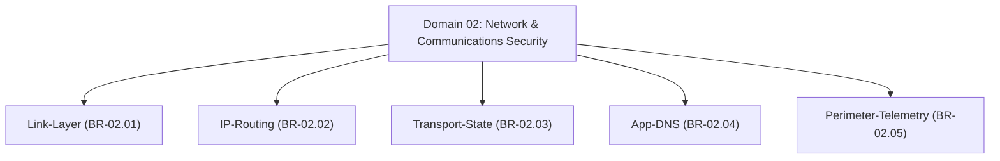

# Master Network & Communications Security Branch Index

## 1. Overview
This directory (`04 - Branch Knowledge/Networking/`) houses the complete implementation of **Domain 02: Network & Communications Security**.

The domain is organized into **5 core engineering branches** covering link-layer encryption, IP routing integrity, transport state machine security, application protocol security (DNSSEC/DoH/HTTP3), stateful firewalls, eBPF XDP filtering, and network security monitoring (Zeek/Suricata/IPFIX).

---

## 2. Directory & Module Map

### Module Registry Table

| Branch ID | Module ID | Module Title | File Location | Key Engineering Concepts |
| :--- | :--- | :--- | :--- | :--- |
| `BR-02.01` | **`MOD-02.01.01`** | **Ethernet, MACsec & ARP Security** | `Link-Layer/01 - Ethernet MACsec & ARP Security.md` | 802.1AE MACsec, 802.1Q VLANs, ARP Poisoning, DAI, Port Security. |
| `BR-02.01` | **`MOD-02.01.02`** | **Wireless LAN Security (WPA3 & EAP-TLS)** | `Link-Layer/02 - Wireless Security WPA3 & EAP-TLS.md` | WPA3-Enterprise, SAE, 4-Way Handshake, EAP-TLS, 802.11w PMF. |
| `BR-02.02` | **`MOD-02.02.01`** | **IPv4/IPv6 Protocol Internals** | `IP-Routing/01 - IPv4 IPv6 Protocol Internals.md` | Header Security, IPv6 Extension Headers, ICMPv6 NDP, Router Advertisements. |
| `BR-02.02` | **`MOD-02.02.02`** | **BGP Routing Security & RPKI** | `IP-Routing/02 - BGP Routing Security & RPKI.md` | BGP Route Hijacking, RPKI / ROA Validation, BGPsec, OSPF HMAC. |
| `BR-02.03` | **`MOD-02.03.01`** | **TCP State Machine & Syn Cookies** | `Transport-State/01 - TCP State Machine & Syn Cookies.md` | TCP 3-Way Handshake, SYN Flood DDoS, SYN Cookies, TCP Resets. |
| `BR-02.03` | **`MOD-02.03.02`** | **TLS 1.3 & Encrypted Client Hello** | `Transport-State/02 - TLS 1.3 & Encrypted Client Hello.md` | TLS 1.3 1-RTT Handshake, ECDHE PFS, SNI Leakage, ECH, JA3 Fingerprinting. |
| `BR-02.04` | **`MOD-02.04.01`** | **DNS, DNSSEC & DoH/DoT Security** | `App-DNS/01 - DNS DNSSEC & DoH DoT Security.md` | Kaminsky Cache Poisoning, DNSSEC (RRSIG/DNSKEY), DoH/DoT, DNS Tunneling. |
| `BR-02.04` | **`MOD-02.04.02`** | **HTTP/2 & HTTP/3 QUIC Security** | `App-DNS/02 - HTTP2 & HTTP3 QUIC Security.md` | HTTP Request Smuggling, HTTP/2 Rapid Reset DDoS, QUIC Encryption. |
| `BR-02.05` | **`MOD-02.05.01`** | **Stateful Firewalls & eBPF XDP** | `Perimeter-Telemetry/01 - Stateful Firewalls & eBPF XDP.md` | Netfilter / nftables, eBPF XDP High-Speed Packet Filter, Conntrack, DPI. |
| `BR-02.05` | **`MOD-02.05.02`** | **Network Telemetry Architecture** | `Perimeter-Telemetry/02 - Network Telemetry Architecture.md` | NetFlow / IPFIX, Zeek Security Monitoring, Suricata Signatures, PCAP. |
