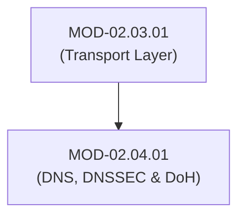
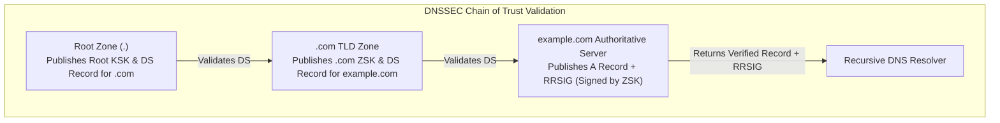

# DNS Protocol Mechanics, DNSSEC & DoH/DoT Security

## 1. Overview & Purpose
The Domain Name System (DNS) is the critical internet directory service mapping human-readable domain names (`example.com`) to IP addresses (`93.184.216.34`).

This module covers DNS resolution hierarchy, DNS cache poisoning (Kaminsky attack), DNS Security Extensions (DNSSEC - RRSIG, DNSKEY, DS records), DNS over HTTPS (DoH / RFC 8484), DNS over TLS (DoT / RFC 7858), and DNS tunneling/exfiltration telemetry analysis.

---

## 2. Prerequisites & Prerequisites Graph
- **Prerequisites**: `MOD-02.03.01` (TCP/UDP Transport Layer).



---

## 3. Learning Objectives & Taxonomy Alignment
- **L1 Awareness**: Trace recursive DNS resolution (Root -> TLD -> Authoritative).
- **L2 Understanding**: Explain Kaminsky cache poisoning and DNSSEC cryptographic trust chains (KSK / ZSK).
- **L3 Practical**: Query DNS records via `dig`, test DNSSEC validation, and inspect DoH traffic.
- **L4 Engineering**: Design enterprise DNS architectures detecting covert DNS exfiltration channels.

---

## 4. L1 — Awareness (Overview & Core Terminology)
DNS operates primarily over UDP port 53. Because standard DNS queries are unencrypted and unauthenticated, adversary sensors can inspect, redirect, or spoof DNS responses.

---

## 5. L2 — Understanding (Core Theory & Mechanics)



### DNS Cache Poisoning (Kaminsky Attack):
Exploits predictable 16-bit Transaction IDs (`TxID`) in UDP queries. Attacker floods resolver with fake responses containing forged `A` records before the real authoritative server responds, poisoning the resolver's cache.

### DNSSEC Solution:
DNSSEC cryptographically signs DNS resource record sets (RRsets) using digital signatures:
- **RRSIG**: Cryptographic signature covering an RRset.
- **DNSKEY**: Public key used to verify RRSIG signatures (ZSK = Zone Signing Key, KSK = Key Signing Key).
- **DS (Delegation Signer)**: Hash of child KSK stored in parent zone, establishing a chain of trust back to the Root KSK.

---

## 6. L3 — Practical (Commands & Configurations)

### Performing DNSSEC Queries via `dig`:
```bash
# Query A record with DNSSEC validation flags (+dnssec)
dig +dnssec +multi example.com A

# Trace DNSSEC chain of trust from Root down
dig +trace +dnssec example.com
```

### Testing DoT (DNS over TLS) on Linux (`kdig` / `systemd-resolved`):
```bash
# Query DNS over TLS (Port 853) using kdig
kdig @1.1.1.1 +tls-ca +tls-hostname=one.one.one.one example.com
```

---

## 7. L4 — Engineering (Design Trade-offs & System Integration)
- **DoH / DoT Enterprise Visibility Conflict**: DoH (UDP/TCP 443) encrypts DNS inside standard HTTPS traffic, bypassing perimeter DNS firewalls and blocking enterprise visibility into malware C2 domains. Enterprises must deploy internal DoH resolvers and enforce Canary Domains (`use-application-dns.net`).

---

## 8. Internal Architecture & Data Structures
DNS Header Format (12 Bytes Base):
```text
Transaction ID (16b)
Flags: QR (1b), Opcode (4b), AA (1b), TC (1b), RD (1b), RA (1b), Z (3b), RCODE (4b)
Questions Count (16b) | Answer RRs (16b)
Authority RRs (16b)   | Additional RRs (16b)
```

---

## 9. Security Implications & Boundary Controls
- **DNS Tunneling Exfiltration**: Threat actors use DNS queries (e.g., `<base64_data>.attacker.com`) to leak data past firewalls that allow outbound UDP 53.

---

## 10. Attack Vectors & Exploitation Primitives
1. **DNS Cache Poisoning**: Injecting false IP addresses into vulnerable resolver caches.
2. **DNS Tunneling / C2 Exfiltration**: Encoding command-and-control data inside subdomains of A / TXT record requests.

---

## 11. Defense & Telemetry Verification
- Deploy **DNSSEC validation** on all recursive resolvers.
- Implement **High Entropy Subdomain Monitoring** to detect DNS tunneling.

---

## 12. Detection & Telemetry Verification

### Sigma Detection Rule (DNS Tunneling Exfiltration):
```yaml
title: High Entropy DNS Subdomain Request (Possible DNS Tunneling)
id: c9102941-8210-41ba-b01b-829101fa771a
status: experimental
logsource:
  category: dns
  product: windows
detection:
  selection:
    QueryName|length: '> 80'
  condition: selection
level: high
```

---

## 13. Hands-On Lab Reference
- **Associated Lab**: `LAB-NET007` (DNSSEC Verification & DNS Tunneling Analysis).

---

## 14. Related Projects & Applications
- **Associated Project**: `PRJ-TIP001` (DNS Tunneling Detection Parser).

---

## 15. Troubleshooting & Diagnostics Matrix

| Symptom | Root Cause | Remediation / Diagnostic Command |
| :--- | :--- | :--- |
| `dig` returns `SERVFAIL` when querying domain. | DNSSEC validation failed due to expired RRSIG signature or invalid DS record. | Execute `dig +cdflag` (Checking Disabled) to test if resolution succeeds without DNSSEC. |

---

## 16. Related Concepts & Cross-Domain Links
- `CON-NET012`: DNSSEC Chain of Trust (`DOM-02`)
- `CON-NET013`: DNS over HTTPS DoH (`DOM-02`)

---

## 17. Technical Interview Preparation (Q&A)
**Q: How does DNSSEC prevent Kaminsky DNS cache poisoning attacks?**  
*Answer*: The Kaminsky attack relies on spoofing UDP DNS responses matching a 16-bit Transaction ID. DNSSEC attaches digital signatures (`RRSIG`) to all resource record sets. Even if an attacker successfully guesses the 16-bit TxID, the resolver rejects the forged response because the attacker lacks the private Zone Signing Key (ZSK) required to generate a valid cryptographic signature.

---

## 18. Self-Assessment & Mastery Checklist
- [ ] Understand DNSSEC RRSIG, DNSKEY, and DS validation chain.
- [ ] Able to identify DNS exfiltration patterns in PCAP files.

---

## 19. References & Further Reading
- RFC 4033: *DNS Security Introduction and Requirements*.
- RFC 8484: *DNS Queries over HTTPS (DoH)*.
