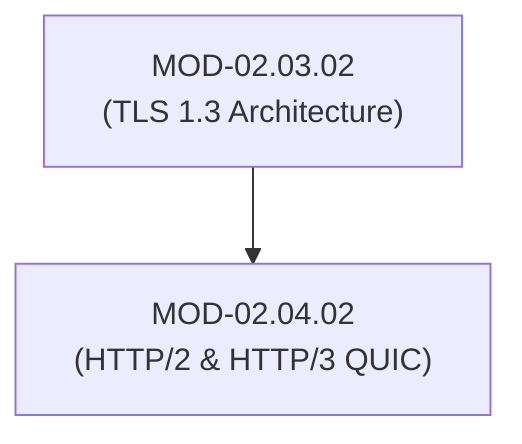

# HTTP/2 & HTTP/3 (QUIC) Security Primitives & Multiplexed Attacks

## 1. Overview & Purpose
Modern web applications have evolved from text-based HTTP/1.1 to binary-framed HTTP/2 and UDP-based HTTP/3 (QUIC protocol).

This module covers HTTP/1.1 vs HTTP/2 binary framing, HPACK header compression, HTTP Request Smuggling, HTTP/2 Rapid Reset DDoS (`CVE-2023-44487`), HTTP/3 QUIC (UDP 443) transport encryption, and Application-Layer Protocol Negotiation (ALPN).

---

## 2. Prerequisites & Prerequisites Graph
- **Prerequisites**: `MOD-02.03.02` (TLS 1.3 Architecture).



---

## 3. Learning Objectives & Taxonomy Alignment
- **L1 Awareness**: Explain binary streams and multiplexing in HTTP/2 and QUIC UDP transport.
- **L2 Understanding**: Detail HTTP/2 `RST_STREAM` frame floods and HTTP Request Smuggling (CL.TE / TE.CL).
- **L3 Practical**: Inspect HTTP/2 frame headers using Wireshark and configure QUIC firewalls.
- **L4 Engineering**: Build high-throughput reverse proxy mitigations against multiplexed stream exhaustion attacks.

---

## 4. L1 — Awareness (Overview & Core Terminology)
HTTP/2 replaces HTTP/1.1 plain text with binary frames multiplexed over a single TCP connection. HTTP/3 moves transport from TCP to **QUIC (UDP 443)**, embedding TLS 1.3 encryption directly into the transport header.

---

## 5. L2 — Understanding (Core Theory & Mechanics)

```mermaid
graph TD
    subgraph HTTP/2 Rapid Reset DDoS Attack Mechanics (CVE-2023-44487)
        ATTACKER["Attacker Client"]
        SERVER["HTTP/2 Web Server (Nginx / Apache / IIS)"]

        ATTACKER -->|1. HEADERS Frame (Opens Stream 1)| SERVER
        ATTACKER -->|2. RST_STREAM Frame (Cancels Stream 1 Immediately)| SERVER
        ATTACKER -->|3. Repeats 1,000,000x over Single TCP Session| SERVER
        SERVER -->|Exhausts CPU Processing Streams without hitting Max Streams Limit| SERVER
    end
```

### HTTP/2 Rapid Reset DDoS (`CVE-2023-44487`):
In HTTP/2, clients can open streams with `HEADERS` frames and instantly cancel them with `RST_STREAM` frames. Because the stream closes instantly, the concurrent stream counter never breaches limits (e.g., `SETTINGS_MAX_CONCURRENT_STREAMS = 100`), allowing a single machine to generate millions of stream requests per second and exhaust server CPU.

### HTTP/3 QUIC Protocol (UDP 443):
QUIC combines transport and encryption into UDP. It solves TCP Head-of-Line (HoL) blocking—if one packet is dropped, only that specific stream pauses while other streams continue unhindered.

---

## 6. L3 — Practical (Commands & Configurations)

### Testing HTTP/2 and HTTP/3 via `curl`:
```bash
# Force HTTP/2 negotiation via ALPN
curl --http2 -I https://example.com

# Force HTTP/3 QUIC negotiation (requires curl built with nghttp3 / quiche)
curl --http3 -I https://example.com
```

### Hardening Nginx against HTTP/2 Rapid Reset:
```nginx
# Limit HTTP/2 request rates in nginx.conf
http {
    limit_req_zone $binary_remote_addr zone=http2_limit:10m rate=100r/s;

    server {
        listen 443 ssl http2;
        server_name example.com;

        # Restrict max concurrent streams and frame buffer sizes
        http2_max_concurrent_streams 64;
        limit_req zone=http2_limit burst=20 nodelay;
    }
}
```

---

## 7. L4 — Engineering (Design Trade-offs & System Integration)
- **UDP Firewall Challenges**: HTTP/3 operates over UDP port 443. Legacy firewalls optimized for TCP connection tracking (`conntrack`) often struggle to apply stateful inspection to high-volume QUIC UDP streams, requiring eBPF XDP acceleration.

---

## 8. Internal Architecture & Data Structures
HTTP/2 Frame Format (9 Bytes Header + Payload):
```text
Length (24b) | Type (8b: DATA=0, HEADERS=1, RST_STREAM=3, SETTINGS=4)
Flags (8b: END_STREAM=0x1, END_HEADERS=0x4)
Reserved (1b) | Stream Identifier (31b)
Frame Payload (Variable: HPACK compressed headers or binary data)
```

---

## 9. Security Implications & Boundary Controls
- **Bypassing Perimeter WAFs via Request Smuggling**: Differences in how frontend reverse proxies and backend application servers handle ambiguous `Content-Length` (CL) and `Transfer-Encoding` (TE) headers allow attackers to smuggle unauthorized HTTP requests directly to backend application microservices.

---

## 10. Attack Vectors & Exploitation Primitives
1. **HTTP/2 Rapid Reset (`CVE-2023-44487`)**: Flooding `HEADERS` + `RST_STREAM` frame pairs over a single connection.
2. **HTTP Request Smuggling (CL.TE / TE.CL)**: Desynchronizing frontend and backend HTTP parsers.

---

## 11. Defense & Telemetry Verification
- Patch reverse proxies against `CVE-2023-44487` and enforce strict rate limiting on `RST_STREAM` frames.
- Disable legacy `Transfer-Encoding` processing on frontend proxies.

---

## 12. Detection & Telemetry Verification

### Suricata Rule (HTTP/2 Rapid Reset Flood Detection):
```text
alert http2 any any -> $HOME_NET 443 (msg:"NETSEC - High Rate HTTP2 RST_STREAM Detected"; content:"|03|"; depth:1; offset:3; threshold: type threshold, track by_src, count 200, seconds 1; sid:2000003; rev:1;)
```

---

## 13. Hands-On Lab Reference
- **Associated Lab**: `LAB-NET008` (HTTP/2 Rapid Reset & Request Smuggling Analysis).

---

## 14. Related Projects & Applications
- **Associated Project**: `PRJ-TIP001` (HTTP/2 Frame Inspection Engine).

---

## 15. Troubleshooting & Diagnostics Matrix

| Symptom | Root Cause | Remediation / Diagnostic Command |
| :--- | :--- | :--- |
| Nginx CPU reaches 100% with low network bandwidth. | HTTP/2 Rapid Reset attack (`CVE-2023-44487`). | Update Nginx to `>= 1.25.3` and apply `keepalive_requests` caps. |

---

## 16. Related Concepts & Cross-Domain Links
- `CON-NET014`: HTTP/2 Binary Framing (`DOM-02`)
- `CON-NET015`: QUIC UDP Transport (`DOM-02`)

---

## 17. Technical Interview Preparation (Q&A)
**Q: How does HTTP/3 (QUIC) solve the TCP Head-of-Line (HoL) blocking problem?**  
*Answer*: In HTTP/2, multiplexed streams share a single TCP connection. If a single packet is dropped, TCP halts all streams until the missing packet is retransmitted. HTTP/3 runs over QUIC (UDP), implementing independent packet sequence numbers for each stream. A dropped packet affects only its specific stream while all other independent streams continue uninterrupted.

---

## 18. Self-Assessment & Mastery Checklist
- [ ] Understand HTTP/2 binary frame types (`HEADERS`, `DATA`, `RST_STREAM`).
- [ ] Able to trace QUIC UDP packets in Wireshark.

---

## 19. References & Further Reading
- RFC 9113: *HTTP/2 Semantics and Framing*.
- RFC 9000: *QUIC: A UDP-Based Multiplexed and Secure Transport*.
