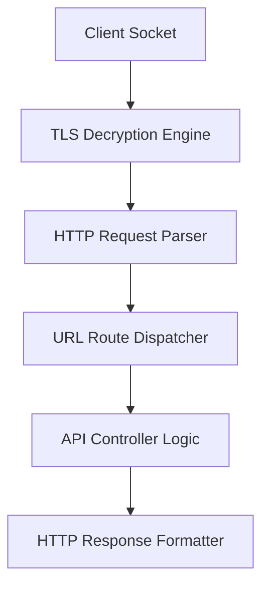
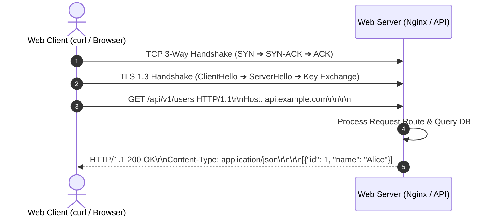

# P-06: HTTP & REST Web Architecture

> **Module ID:** P-06  
> **Category:** Web Protocols & Systems Architecture  
> **Difficulty:** Intermediate  
> **Estimated Time:** 8 Hours  
> **Prerequisites:** Basic Networking Concepts & Client-Server Model  
> **Related Topics:** HTTP Methods, Status Codes, REST APIs, TLS 1.3, CORS, Cookies, Security Headers  
> **Framework Standard:** Cyber Act Universal Engineering Framework (v2 Standard)

---

# Part I — Understanding

## Overview

### Definition
* **Definition:** HTTP (Hypertext Transfer Protocol) is an application-layer, stateless request-response protocol operating over TCP/TLS that formats client-server web communications, while REST (Representational State Transfer) is an architectural style utilizing standard HTTP methods (`GET`, `POST`, `PUT`, `DELETE`), URI resource identifiers, and stateless data representations (JSON/XML).
* **One-Line Summary:** Application-layer client-server web protocol (HTTP) and resource-oriented API design standard (REST).

### Purpose & Problem Statement
* **Purpose:** Enables universal web browsing, API client-server communication, microservice integration, and distributed web resource retrieval over global IP networks.
* **Problem it Solves:** Eliminates proprietary client-server network protocols, tightly coupled RPC data schemas, unstandardized error handling, and unencrypted transmission across public networks.
* **Why it Exists:** Created by Tim Berners-Lee in 1989 (HTTP/0.9) to distribute hypertext documents, standardized as HTTP/1.1 (RFC 2616) and HTTP/2 (RFC 7540), with REST formalized by Roy Fielding in 2000.

### History & Evolution
* **Origins & Evolution:** Evolved from ASCII HTTP/0.9 to HTTP/1.1 (Keep-Alive TCP connections), HTTP/2 (Binary multiplexing over single TCP socket), and HTTP/3 (QUIC protocol over UDP), while HTTPS adds mandatory TLS encryption.

### Mental Model & Analogy
* **Real-World Analogy:** Postal mail delivery system: The envelope header specifies recipient address (URL), transport speed, and return address (HTTP Headers), while the letter inside contains the actual payload (HTTP Request/Response Body).
* **Mental Model:** Client opens TCP/TLS connection to server on port 80/443 ➔ Transmits ASCII/Binary HTTP Request payload ➔ Server processes logic ➔ Streams HTTP Response (Status Code + Headers + Body) ➔ Closes or reuses TCP socket.

> [!NOTE]
> HTTP is fundamentally **Stateless**: The web server treats every incoming HTTP request as entirely independent, requiring Cookies, Sessions, or Authorization Tokens to track user state across requests.

---

## Terminology

### Key Terms & Definitions

#### **HTTP Request Methods (Verbs)**
* **Definition:** Standardized actions indicating the desired operation on a resource: `GET` (Retrieve), `POST` (Create), `PUT` (Replace), `PATCH` (Modify), `DELETE` (Remove), `OPTIONS` (CORS Preflight).
* **Context / Scope:** HTTP Protocol Spec.
* **Key Properties:** `GET` must be safe and idempotent.

#### **HTTP Status Codes**
* **Definition:** 3-digit numeric server responses categorizing request outcomes: `1xx` (Info), `2xx` (Success - 200 OK), `3xx` (Redirection - 301/302), `4xx` (Client Error - 400/401/403/404), `5xx` (Server Error - 500/502/503).
* **Context / Scope:** HTTP Protocol Response.
* **Key Properties:** Standardized globally via IANA/RFCs.

#### **REST (Representational State Transfer)**
* **Definition:** Software architectural style for web APIs emphasizing statelessness, uniform interfaces, client-server separation, and resource-based URI endpoints.
* **Context / Scope:** API Design Architecture.
* **Key Properties:** Uses standard HTTP verbs and JSON payloads.

#### **CORS (Cross-Origin Resource Sharing)**
* **Definition:** Browser security mechanism using HTTP headers (`Access-Control-Allow-Origin`) to restrict cross-origin HTTP requests initiated from scripts.
* **Context / Scope:** Web Browser Security Model.
* **Key Properties:** Enforced by web browsers, NOT web servers.

#### **HTTPS / TLS Handshake**
* **Definition:** Encrypted HTTP transport running over Transport Layer Security (TLS 1.2/1.3), providing confidentiality, integrity, and server authentication.
* **Context / Scope:** Transport Layer Security.
* **Key Properties:** Operates over TCP port 443.

---

## Big Picture

### Domain & Ecosystem Placement
* **Domain:** Web Protocols & Systems Architecture
* **Parent Topic:** Network Protocols & Application Layer
* **Child Topics:** HTTP Methods, Status Codes, Headers, Cookies, REST APIs, TLS 1.3 Handshake, CORS, Web Security Headers
* **Prerequisites:** Basic Computer Networking & Client-Server Architecture
* **Topics Enabled:** Web Application Penetration Testing, Secure API Engineering, Cloud Microservices, Security Operations (SIEM)

### Architectural Placement
* **Technology Ecosystem:** Web Browsers (Chrome/Firefox), Web Servers (Nginx, Apache), API Clients (`curl`, Postman), Web Frameworks (FastAPI, Express).
* **Architecture Placement:** Application Layer (OSI Layer 7).
* **Stack Placement:** Web Communications & API Layer.

### System Ecosystem Map
```mermaid
graph TD
    Client[Web Browser / API Client] -->|HTTPS Request over TCP 443| Proxy[Nginx Reverse Proxy / WAF]
    Proxy -->|Forward Request| Server[Backend REST API Server]
    Server -->|Read / Write| DB[Database Engine]
    Server-->>Proxy: HTTP Response 200 OK (JSON Payload)
    Proxy-->>Client: Stream TLS Encrypted Response
```

---

# Part II — Internal Engineering

## Architecture

### Core Subsystems & Components
* **Components:** HTTP Client Engine, Socket Handler, TLS Engine (OpenSSL), HTTP Request Parser, Routing Handler, Response Generator.
* **Services & Processes:** Web Server Daemons (`nginx`, `httpd`, `uvicorn`).

### Memory & Data Structures
* **Request Packet Layout:** `Method + Request-URI + HTTP-Version \r\n Headers \r\n\r\n Body`.
* **Response Packet Layout:** `HTTP-Version + Status-Code + Reason-Phrase \r\n Headers \r\n\r\n Body`.

### Component Architecture Map


---

## Mechanism

### Core Execution Workflow
1. User enters `https://api.example.com/v1/users` in browser.
2. Client performs DNS lookup, opens TCP connection to IP on port 443, and completes TLS 1.3 Handshake.
3. Client sends HTTP GET Request message string over encrypted TLS socket.
4. Web server parses headers, executes route logic, retrieves user list from database, and generates JSON payload.
5. Server sends `HTTP/1.1 200 OK` response with `Content-Type: application/json` header.

### Execution Sequence Map


---

## Relationships

### Upstream & Downstream Dependencies
* **Depends On:** TCP/IP Transport Layer (TCP Port 80 / 443), TLS Encryption Engine, DNS Domain Resolution.
* **Used By:** Web Browsers, Mobile Apps, Cloud Services, Security Scanners.
* **Communicates With:** Web Clients via TCP 80/443.

### Resource Lifecycle
* **Creates / Uses:** Establishes TCP connections, allocates socket buffers, issues session cookies.
* **Execution Ordering:** DNS Resolution ➔ TCP Handshake ➔ TLS Handshake ➔ HTTP Request ➔ HTTP Response.

---

## Runtime Environment

### Execution & System Context
* **Execution Environment:** User Space Web Servers & Application Runtimes.
* **Location:** Public Internet Host / Cloud Load Balancer / Enterprise Web Server.
* **Space:** User Space.
* **Storage Unit:** Memory Buffers & Sockets.
* **Lifetime:** Continuous HTTP daemon service.

---

# Part III — Operations

## Installation & Setup

### Setup Procedures
```bash
# Ubuntu / Debian - Install Nginx & Curl
sudo apt update && sudo apt install -y nginx curl wget

# Verify installation
curl --version
nginx -v
```

---

## Interfaces

### Tools & Commands Reference

#### `curl`
* **Purpose:** Command line tool for transferring data over HTTP, HTTPS, and network protocols.
* **Syntax:** `curl [options] <URL>`
* **Parameters:**
  * `-i`: Include HTTP response headers in output.
  * `-v`: Verbose mode displaying complete request/response handshake headers.
  * `-X <METHOD>`: Specify HTTP request method (`GET`, `POST`, `PUT`, `DELETE`).
  * `-H "<Header: Value>"`: Pass custom HTTP request header.
  * `-d "<data>"`: Send HTTP POST data payload.
  * `-k`: Ignore SSL/TLS certificate warnings (for local dev).
* **Examples:**
  ```bash
  curl -i -X GET https://jsonplaceholder.typicode.com/posts/1
  curl -v -X POST -H "Content-Type: application/json" -d '{"title":"CyberAct"}' https://httpbin.org/post
  curl -s -I https://www.google.com | grep -i "strict-transport-security"
  ```

---

#### `wget`
* **Purpose:** Non-interactive network downloader.
* **Example:**
  ```bash
  wget -qO- https://api.ipify.org
  ```

---

#### `nginx` Service Management
* **Purpose:** Reverse proxy and HTTP web server management commands.
* **Example:**
  ```bash
  sudo nginx -t  # Test configuration syntax
  sudo systemctl reload nginx
  ```

---

### HTTP Request Verbs & Status Codes Reference

#### HTTP Verbs
* `GET`: Safe & idempotent retrieval of resources.
* `POST`: Non-idempotent creation of new sub-resources.
* `PUT`: Idempotent full replacement of target resource.
* `PATCH`: Partial modification of target resource.
* `DELETE`: Removal of target resource.
* `OPTIONS`: Returns allowed HTTP methods and CORS origins.

#### HTTP Status Codes
* `200 OK`: Standard successful response.
* `201 Created`: Resource successfully created.
* `301 Moved Permanently`: Permanent URI redirection.
* `302 Found`: Temporary URI redirection.
* `400 Bad Request`: Invalid request syntax/payload.
* `401 Unauthorized`: Missing or invalid authentication.
* `403 Forbidden`: Authenticated client lacks permissions.
* `404 Not Found`: Resource URI does not exist.
* `500 Internal Server Error`: Backend application crash.
* `502 Bad Gateway`: Invalid response from upstream proxy.
* `503 Service Unavailable`: Server overloaded or undergoing maintenance.

---

### APIs & Libraries
* **SDKs & Libraries:** `requests` (Python), `axios` (JavaScript), `fetch`.
* **APIs:** RESTful HTTP API Endpoints.

### Data Formats & Protocols
* **File Formats:** JSON, XML, HTML, Form Data (`application/x-www-form-urlencoded`).
* **Protocols & RFCs:** RFC 7230-7235 (HTTP/1.1), RFC 7540 (HTTP/2), RFC 9114 (HTTP/3).

---

# Part IV — Observation

## Monitoring

### Telemetry & Inspection Tools
* **Tools:** `curl -v`, Browser DevTools (Network Tab), Wireshark, Burp Suite, Nginx Access Logs (`/var/log/nginx/access.log`).
* **Log Sources:** Nginx Access Log, WAF Log.

---

## Debugging

### Step-by-Step Debugging Workflow
1. **Inspect Handshake:** Run `curl -v -I https://api.example.com`.
2. **Inspect Headers:** Check status code, `Content-Type`, and CORS headers.
3. **Trace Network Packets:** Capture HTTP packets using `sudo tcpdump -i eth0 port 80 -A`.

> [!TIP]
> Use `curl -v -k` to bypass self-signed certificate warnings when testing local development HTTPS endpoints.

---

# Part V — Security

## Security

### Threat Model & Attack Surface
* **Threat Model:** Man-in-the-Middle (MitM) eavesdropping, Cross-Site Scripting (XSS), Cross-Site Request Forgery (CSRF), Broken Object Level Authorization (BOLA), Insecure Direct Object References (IDOR).
* **Attack Surface:** Exposed HTTP endpoints, unencrypted HTTP traffic, missing security headers.

### Security Headers Reference Table
| Security Header | Recommended Value | Security Purpose |
| :--- | :--- | :--- |
| **Strict-Transport-Security** | `max-age=31536000; includeSubDomains` | Enforces HTTPS-only connections. |
| **Content-Security-Policy** | `default-src 'self'` | Blocks XSS inline scripts & untrusted domains. |
| **X-Frame-Options** | `DENY` or `SAMEORIGIN` | Mitigates Clickjacking iframe attacks. |
| **X-Content-Type-Options** | `nosniff` | Prevents browser MIME-type sniffing. |

### Hardening & Security Best Practices
* Enforce **HTTPS Everywhere** (Redirect HTTP port 80 to HTTPS port 443 with HSTS).
* Set **Cookie Flags**: `Secure; HttpOnly; SameSite=Strict`.

- [ ] Is HTTPS enforced across 100% of web endpoints?
- [ ] Is `Strict-Transport-Security` (HSTS) enabled?
- [ ] Are sensitive cookies flagged with `HttpOnly`, `Secure`, and `SameSite=Strict`?

> [!CAUTION]
> Transmitting authentication tokens or session cookies over unencrypted HTTP (port 80) allows network attackers to steal user sessions instantly via Wireshark.

---

# Part VI — Engineering

## Engineering Analysis

### Design Rationale & Philosophy
* REST leverages standard HTTP verbs and status codes to create predictable, uniform, stateless interfaces that scale horizontally across web caches and proxies.

### Technology Comparison Matrix
| Protocol / Style | Transport | Format | Performance | Use Case |
| :--- | :--- | :--- | :--- | :--- |
| **REST over HTTP/1.1**| TCP Port 443 | JSON / XML | High | Standard Web APIs |
| **gRPC over HTTP/2** | TCP Port 443 | Protobuf Binary| Maximum | Microservices |
| **GraphQL** | TCP Port 443 | JSON | High | Complex Frontend Queries |

---

# Part VII — Practical

## Basic Lab
```bash
# Execute HTTP GET request with headers inspection
curl -i https://httpbin.org/get
```

## Observation Lab
```bash
# Inspect raw HTTP response headers
curl -s -I https://www.google.com
```

## Internal Lab
```bash
# Send custom POST payload with JSON headers
curl -v -X POST https://httpbin.org/post -H "Content-Type: application/json" -d '{"user":"test"}'
```

## Security Lab
```bash
# Audit security response headers of a domain
curl -s -I https://www.google.com | grep -iE "strict-transport-security|content-security-policy|x-frame-options"
```

---

# Part VIII — Reference

## Quick Reference & Cheat Sheet
* `curl -i -X GET <URL>` | `curl -X POST -H "Content-Type: application/json" -d '{...}' <URL>`
* Status Codes: `200 OK`, `201 Created`, `301 Moved`, `400 Bad Request`, `401 Unauthorized`, `403 Forbidden`, `404 Not Found`, `500 Server Error`.

---

# Part IX — Professional

## Interview Questions

### Fundamental & Architecture Questions
* **Question 1:** *What does it mean that HTTP is a stateless protocol, and how do web applications maintain user sessions?*
  > [!NOTE]
  > HTTP is stateless because each request-response pair is processed independently without server memory of previous requests. Applications maintain state by issuing session cookies or JWT tokens in HTTP headers, which clients include in subsequent requests.

### Security & Troubleshooting Questions
* **Question 2:** *Why are `HttpOnly` and `SameSite` flags critical for securing session cookies?*
  > [!IMPORTANT]
  > The `HttpOnly` flag prevents client-side JavaScript from accessing the cookie, mitigating XSS cookie theft. The `SameSite=Strict` flag prevents browsers from sending the cookie on cross-site requests, mitigating CSRF attacks.

---

## Revision

### Executive Summary & Revision
* **Key Takeaways:** HTTP is a stateless application-layer protocol operating over TCP/TLS, while REST structures API endpoints using uniform HTTP verbs, status codes, and JSON representations.
* **One-Minute Revision:** Client Request ➔ DNS ➔ TCP 3-Way Handshake ➔ TLS 1.3 ➔ HTTP Headers/Body ➔ Server Routing ➔ HTTP Response.

---

## Master Completion Checklist

### Understanding
- [x] Can define it
- [x] Can explain why it exists
- [x] Understand terminology
- [x] Know where it fits

### Internal Engineering
- [x] Can explain architecture
- [x] Can explain workflow
- [x] Can draw diagrams
- [x] Understand lifecycle

### Operations
- [x] Can install/configure
- [x] Can use CLI commands
- [x] Understand APIs/protocols

### Observation
- [x] Can monitor telemetry
- [x] Can debug failures
- [x] Know log sources

### Security
- [x] Know attack vectors
- [x] Know mitigations
- [x] Know detection telemetry

### Engineering
- [x] Can compare alternatives
- [x] Understand trade-offs
- [x] Know performance limits

### Practical
- [x] Completed basic lab
- [x] Completed observation lab
- [x] Completed security lab

### Professional
- [x] Can answer interview questions
- [x] Can explain to an engineer
- [x] Can implement independently
