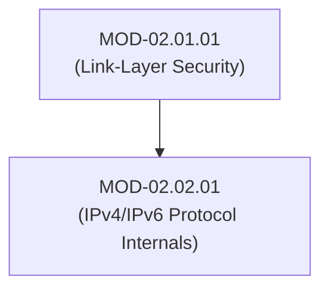

# IPv4/IPv6 Protocol Internals & Header Security

## 1. Overview & Purpose
The Internet Protocol (IPv4 and IPv6) provides logical addressing, routing, and packet fragmentation capabilities across global networks (Layer 3).

This module details IPv4 header options, IPv6 fixed headers vs Extension Headers, ICMP/ICMPv6 error and control messages, Neighbor Discovery Protocol (NDP) spoofing, and IPv6 Router Advertisement (RA) attacks.

---

## 2. Prerequisites & Prerequisites Graph
- **Prerequisites**: `MOD-02.01.01` (Ethernet & Link Layer).



---

## 3. Learning Objectives & Taxonomy Alignment
- **L1 Awareness**: Contrast IPv4 (20-byte base header) and IPv6 (40-byte fixed header).
- **L2 Understanding**: Detail IPv6 Extension Header chaining (Hop-by-Hop, Routing, Fragment, ESP).
- **L3 Practical**: Analyze IPv6 Neighbor Discovery packets in Wireshark and configure RA Guard.
- **L4 Engineering**: Design dual-stack network perimeters resilient to IPv6 transition tunnel evasion.

---

## 4. L1 — Awareness (Overview & Core Terminology)
IPv4 uses 32-bit addresses and variable headers. IPv6 uses 128-bit addresses and a fixed 40-byte main header. IPv6 replaces ARP with **Neighbor Discovery Protocol (NDP)** running over ICMPv6.

---

## 5. L2 — Understanding (Core Theory & Mechanics)

```mermaid
graph TD
    subgraph IPv4 Header (20 Bytes Base + Options)
        V_IHL["Version (4b) | IHL (4b)"]
        TOS["DSCP / ECN (8b)"]
        LEN["Total Length (16b)"]
        ID["Identification (16b)"]
        FLAGS["Flags (3b) | Frag Offset (13b)"]
        TTL["TTL (8b) | Protocol (8b)"]
        CKSUM["Header Checksum (16b)"]
        SRC_IP4["Source IPv4 Address (32b / 4B)"]
        DST_IP4["Destination IPv4 Address (32b / 4B)"]
    end

    subgraph IPv6 Fixed Header (40 Bytes Fixed + Extension Header Chain)
        VER_CLASS["Version (4b) | Traffic Class (8b) | Flow Label (20b)"]
        PAYLOAD_LEN["Payload Length (16b) | Next Header (8b) | Hop Limit (8b)"]
        SRC_IP6["Source IPv6 Address (128b / 16B)"]
        DST_IP6["Destination IPv6 Address (128b / 16B)"]
        EXT_HDR["Next Header -> Hop-by-Hop -> Routing -> Fragment -> TCP/UDP"]
    end
```

---

## 6. L3 — Practical (Commands & Configurations)

### Inspecting IPv6 Neighbor Cache on Linux:
```bash
# View IPv6 neighbor cache (NDP table)
ip -6 neighbor show

# Display IPv6 routes
ip -6 route show
```

### Enabling IPv6 RA Guard on Cisco Switches:
```text
! Enable IPv6 First Hop Security (FHS) RA Guard
ipv6 nd raguard policy RAGUARD_POLICY
 device-role host

interface GigabitEthernet1/0/1
 ipv6 nd raguard attach-policy RAGUARD_POLICY
```

---

## 7. L4 — Engineering (Design Trade-offs & System Integration)
- **Extension Header Evasion**: Firewalls that inspect only the fixed 40-byte IPv6 header can be bypassed if malicious payloads are concealed behind deep chains of arbitrary Extension Headers. Modern DPI firewalls must parse the full Next Header chain.

---

## 8. Internal Architecture & Data Structures
ICMPv6 Router Advertisement Header Format:
```text
Type: 134 (Router Advertisement)
Code: 0
Checksum: 16-bit ICMPv6 Checksum
Cur Hop Limit: 64
Flags: Managed Address (M), Other Config (O)
Options: Prefix Information (Type 3), Source Link-Layer Address (Type 1)
```

---

## 9. Security Implications & Boundary Controls
- **Rogue Router Advertisements**: Attacker sends forged ICMPv6 RA packets (Type 134), convincing hosts to update default gateway to attacker IPv6 address, hijacking all IPv6 traffic.

---

## 10. Attack Vectors & Exploitation Primitives
1. **Rogue IPv6 Router Advertisements (`mitm6`)**: Exploiting Windows preference for IPv6 over IPv4 to assign rogue DNS/gateway via IPv6 RAs, intercepting NTLM authentication.
2. **IPv4 Fragmentation Overlap (Teardrop)**: Sending overlapping fragmented IPv4 packets to crash legacy OS kernel memory reassembly handlers.

---

## 11. Defense & Telemetry Verification
- Implement **IPv6 RA Guard** on all access switch ports.
- Disable unused IPv6 interfaces or enforce **SeND (Secure Neighbor Discovery - RFC 3971)**.

---

## 12. Detection & Telemetry Verification

### Suricata Rule (Rogue IPv6 Router Advertisement Detection):
```text
alert icmp any any -> any any (msg:"NETSEC - Rogue IPv6 Router Advertisement Detected"; icode:0; itype:134; sid:2000001; rev:1;)
```

---

## 13. Hands-On Lab Reference
- **Associated Lab**: `LAB-NET003` (IPv6 NDP Poisoning & RA Guard Inspection).

---

## 14. Related Projects & Applications
- **Associated Project**: `PRJ-TIP001` (Network Sensor Engine).

---

## 15. Troubleshooting & Diagnostics Matrix

| Symptom | Root Cause | Remediation / Diagnostic Command |
| :--- | :--- | :--- |
| Windows hosts default to slow rogue IPv6 DNS. | Rogue ICMPv6 RA broadcast on LAN (`mitm6` attack). | Enable RA Guard on switches or set `DisabledComponents` in Windows Registry. |

---

## 16. Related Concepts & Cross-Domain Links
- `CON-NET004`: IPv6 Extension Headers (`DOM-02`)
- `CON-NET005`: ICMPv6 Neighbor Discovery (`DOM-02`)

---

## 17. Technical Interview Preparation (Q&A)
**Q: Why is IPv6 Neighbor Discovery Protocol (NDP) inherently vulnerable to spoofing by default?**  
*Answer*: NDP relies on ICMPv6 multicast messages (Neighbor Solicitations and Router Advertisements) without cryptographic signatures. Any host on the local link can send forged RAs or NS responses to update neighbor caches or claim to be the default router.

---

## 18. Self-Assessment & Mastery Checklist
- [ ] Understand IPv6 Extension Header chaining rules.
- [ ] Able to trace ICMPv6 Router Advertisements in Wireshark.

---

## 19. References & Further Reading
- RFC 8200: *Internet Protocol, Version 6 (IPv6) Specification*.
- RFC 4861: *Neighbor Discovery for IP version 6 (IPv6)*.
