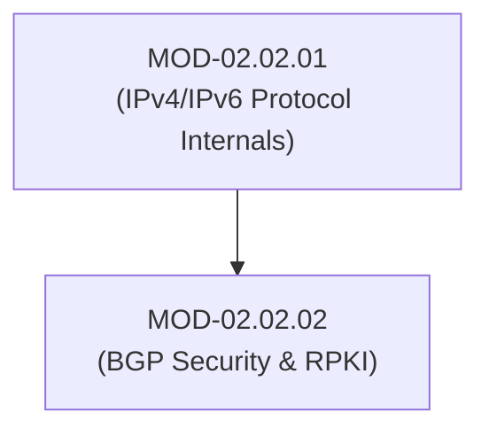

# BGP Routing Security, RPKI & Route Leak Prevention

## 1. Overview & Purpose
Border Gateway Protocol (BGP-4) is the routing protocol that binds the global Internet together, allowing Autonomous Systems (ASNs) to exchange IP prefix reachability information.

This module covers BGP Path Vector mechanics, BGP Route Hijacking, BGP Route Leaks, Resource Public Key Infrastructure (RPKI / ROA Validation), BGPsec path validation, and OSPF/IS-IS authentication primitives.

---

## 2. Prerequisites & Prerequisites Graph
- **Prerequisites**: `MOD-02.02.01` (IPv4/IPv6 Protocols).



---

## 3. Learning Objectives & Taxonomy Alignment
- **L1 Awareness**: Understand Autonomous Systems (ASNs), BGP peering sessions, and BGP Route Hijacking risks.
- **L2 Understanding**: Explain Route Origin Authorizations (ROAs), RPKI validation states (`Valid`, `Invalid`, `NotFound`), and BGPsec.
- **L3 Practical**: Configure RPKI validator daemons (`Routinator`) and BGP prefix filters on enterprise routers.
- **L4 Engineering**: Design MANRS-compliant (Mutually Agreed Norms for Routing Security) ISP routing infrastructures.

---

## 4. L1 — Awareness (Overview & Core Terminology)
BGP was designed assuming implicit trust between Autonomous Systems. Without validation, any AS can announce ownership of another organization's IP address block (BGP Hijack), rerouting global internet traffic through the attacker's network.

---

## 5. L2 — Understanding (Core Theory & Mechanics)

```mermaid
graph TD
    subgraph Global BGP Route Hijacking Scenario
        VICTIM_AS["Victim AS100 (Announces 1.1.1.0/24)"]
        ATTACKER_AS["Attacker AS666 (Falsely Announces 1.1.1.0/24 with Shorter Path)"]
        ISP_AS["Tier 1 ISP AS300 (Accepts Unverified BGP Update)"]

        ATTACKER_AS -->|Fake BGP UPDATE| ISP_AS
        VICTIM_AS -->|Legitimate BGP UPDATE| ISP_AS
        ISP_AS -->|Reroutes Traffic to Attacker| ATTACKER_AS
    end

    subgraph RPKI Route Origin Validation (ROV Protection)
        RPKI_CACHE["RPKI Validator (Routinator / StayRtr)"]
        ROA["Cryptographic ROA (AS100 is Authorized for 1.1.1.0/24)"]

        RPKI_CACHE -->|Validates Signatures| ROA
        ISP_AS -->|Queries RPKI Cache| RPKI_CACHE
        ISP_AS -->|Marks AS666 Update INVALID -> DROPS ROUTE| ATTACKER_AS
    end
```

### Resource Public Key Infrastructure (RPKI):
RPKI binds IP address blocks and Autonomous System Numbers (ASNs) using X.509 cryptographic certificates issued by Regional Internet Registries (RIRs like ARIN, RIPE). Organizations publish **Route Origin Authorizations (ROAs)** specifying which ASN is authorized to originate their IP prefixes.

---

## 6. L3 — Practical (Commands & Configurations)

### Running RPKI Routinator Validator Daemon on Linux:
```bash
# Start Routinator RPKI validator
routinator --config /etc/routinator/routinator.conf run

# Check RPKI validation status for a specific IP prefix
routinator validate --prefix 1.1.1.0/24 --asn 100
```

### BGP RPKI Validation Configuration on Cisco IOS-XE:
```text
! Configure RPKI Cache Server Connection
router bgp 65001
 bgp rpki server tcp 192.168.1.100 port 3323 refresh 300

! Enable RPKI Route Origin Validation Filtering
 address-family ipv4
  bgp origin-as validation enable
  table-map RPKI_FILTER

route-map RPKI_FILTER permit 10
 match rpki valid
route-map RPKI_FILTER permit 20
 match rpki not-found
route-map RPKI_FILTER deny 30
 match rpki invalid
```

---

## 7. L4 — Engineering (Design Trade-offs & System Integration)
- **RPKI vs BGPsec**: RPKI validates only the *Origin AS* (first hop). **BGPsec** cryptographically signs the entire AS path chain, but requires substantial router CPU and hardware crypto acceleration across all transit providers.

---

## 8. Internal Architecture & Data Structures
RPKI ROA Record Format (RFC 6482):
```text
ROA Payload:
  IP Address Prefix: 198.51.100.0/24
  Max Length: /24
  AS Number: 64501
Signature: X.509 Cryptographic Certificate Chain
```

---

## 9. Security Implications & Boundary Controls
- **Traffic Interception & Blackholing**: BGP hijacks allow attackers to perform silent Man-in-the-Middle eavesdropping or global Denial-of-Service blackholing of enterprise services.

---

## 10. Attack Vectors & Exploitation Primitives
1. **Sub-Prefix Hijacking**: Announcing a more specific prefix (e.g., `/24` instead of victim's `/22`). BGP longest-prefix matching forces all global routers to prefer the attacker's route.
2. **BGP Route Leak**: Misconfigured AS re-broadcasting private peering routes to global transit providers, creating massive internet traffic bottlenecks.

---

## 11. Defense & Telemetry Verification
- Implement **MANRS (Mutually Agreed Norms for Routing Security)** guidelines.
- Enforce strict **RPKI Route Origin Validation (ROV)** on all BGP edge interfaces.

---

## 12. Detection & Telemetry Verification

### BGP Hijack Alert (BGPstream / BGPMon Event):
```yaml
title: BGP Prefix Hijack Detected
id: a8102941-8210-41ab-a02b-910291fa882b
logsource:
  category: network_routing
  product: bgp_monitoring
detection:
  selection:
    EventType: 'BGP_Hijack'
    TargetPrefix: '198.51.100.0/24'
  condition: selection
level: critical
```

---

## 13. Hands-On Lab Reference
- **Associated Lab**: `LAB-NET004` (BGP Peering & RPKI Routinator Setup).

---

## 14. Related Projects & Applications
- **Associated Project**: `PRJ-TIP001` (BGP Routing Telemetry Parser).

---

## 15. Troubleshooting & Diagnostics Matrix

| Symptom | Root Cause | Remediation / Diagnostic Command |
| :--- | :--- | :--- |
| BGP router drops valid customer prefixes. | RPKI cache connection down or stale ROA. | Verify RPKI validator daemon status using `routinator status`. |

---

## 16. Related Concepts & Cross-Domain Links
- `CON-NET006`: BGP Path Vector Routing (`DOM-02`)
- `CON-NET007`: RPKI ROA Validation (`DOM-02`)

---

## 17. Technical Interview Preparation (Q&A)
**Q: How does BGP RPKI Route Origin Validation (ROV) prevent sub-prefix hijacking?**  
*Answer*: RPKI ROAs explicitly define the authorized origin ASN and the maximum permitted prefix length (`maxLength`). If an unauthorized ASN announces a more specific sub-prefix (e.g., announcing a `/24` when the ROA permits up to `/22` for AS100), the receiving router evaluates the update as `RPKI INVALID` and drops the route.

---

## 18. Self-Assessment & Mastery Checklist
- [ ] Understand RPKI validation states (`Valid`, `Invalid`, `NotFound`).
- [ ] Able to configure BGP RPKI table maps on edge routers.

---

## 19. References & Further Reading
- MANRS Initiative: *Mutually Agreed Norms for Routing Security*.
- RFC 6480: *An Infrastructure to Support Secure Internet Routing*.
