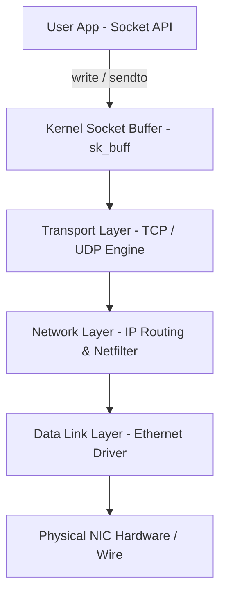
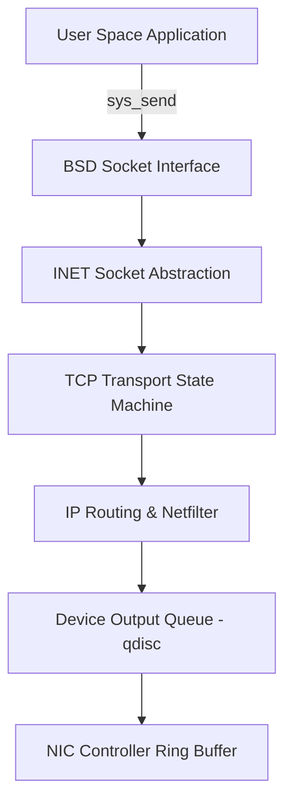
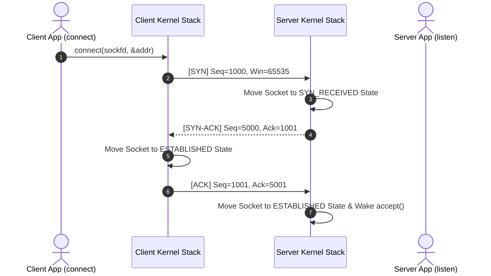

# P-11: Network Protocol Stack & Socket Internals

> **Module ID:** P-11  
> **Category:** Network Systems & Protocols  
> **Difficulty:** Advanced  
> **Estimated Time:** 10 Hours  
> **Prerequisites:** HTTP & REST Architecture (P-06)  
> **Related Topics:** OSI 7-Layer Model, TCP/IP, TCP 3-Way Handshake, Socket APIs (`sk_buff`), Packet Encapsulation, Firewall Filtering  
> **Framework Standard:** Cyber Act Universal Engineering Framework (v2 Standard)

---

# Part I — Understanding

## Overview

### Definition
* **Definition:** The Network Protocol Stack is the kernel networking subsystem managing packet processing, socket IPC abstractions, protocol encapsulation (L2 Data Link, L3 IP Network, L4 TCP/UDP Transport, L7 Application), and network interface controllers (NICs) across host operating systems.
* **One-Line Summary:** Kernel networking engine managing socket IPC, OSI 7-layer encapsulation, TCP state machines, and packet filtering (Netfilter/iptables).

### Purpose & Problem Statement
* **Purpose:** Enables end-to-end data packet transmission, reliable byte stream delivery (TCP), datagram transport (UDP), routing, framing, and network traffic filtering across global IP networks.
* **Problem it Solves:** Eliminates un-routed network signals, packet collisions, corrupted packet delivery, un-ordered data streams, and un-filtered network intrusion traffic.
* **Why it Exists:** Developed via ARPANET and BSD Unix socket implementations to standardize heterogeneous computer networking.

### History & Evolution
* **Origins & Evolution:** Created in 1970s (TCP/IP RFC 791/793), adopted BSD Sockets (1983), expanded to 64-bit multi-core NIC ring buffers, adding Netfilter, eBPF packet processing (XDP), and QUIC over UDP.

### Mental Model & Analogy
* **Real-World Analogy:** International postal freight shipping: An item (Data Payload) is packed in a product box (L7), placed in a cardboard box with recipient name (L4 TCP/UDP Port), packed in a shipping crate with street address (L3 IP Address), and loaded onto a cargo ship with port dock numbers (L2 MAC Address).
* **Mental Model:** User application writes bytes to socket descriptor ➔ Kernel packages payload into `sk_buff` ➔ Appends L4 TCP header, L3 IP header, and L2 Ethernet trailer ➔ Passes frame to NIC Ring Buffer for wire transmission.

> [!NOTE]
> Network sockets are represented inside the kernel as file descriptors (`struct socket` / `struct sock`), enabling processes to use standard `read()` and `write()` calls for network I/O.

---

## Terminology

### Key Terms & Definitions

#### **OSI 7-Layer Model**
* **Definition:** Conceptual framework categorizing network communications into 7 layers: Application (L7), Presentation (L6), Session (L5), Transport (L4), Network (L3), Data Link (L2), Physical (L1).
* **Context / Scope:** Network Architecture Model.
* **Key Properties:** Standard reference model for network engineering.

#### **TCP 3-Way Handshake**
* **Definition:** Connection setup sequence establishing reliable TCP streams: `SYN` (Client) ➔ `SYN-ACK` (Server) ➔ `ACK` (Client).
* **Context / Scope:** Transport Layer Connection Setup.
* **Key Properties:** Negotiates initial sequence numbers (ISN) and window sizes.

#### **`sk_buff` (Socket Buffer)**
* **Definition:** The core Linux kernel data structure representing a network packet as it traverses the protocol stack from network card driver to user space socket.
* **Context / Scope:** Kernel Network Memory Buffer.
* **Key Properties:** Avoids data copying by prepending/stripping header pointers in place.

#### **Netfilter / iptables**
* **Definition:** Linux kernel framework hooks (`PREROUTING`, `INPUT`, `FORWARD`, `OUTPUT`, `POSTROUTING`) enabling stateful packet filtering, NAT, and port forwarding.
* **Context / Scope:** Host Network Firewall.
* **Key Properties:** Controlled via `iptables` or `nftables`.

---

## Big Picture

### Domain & Ecosystem Placement
* **Domain:** Network Systems Engineering & Protocol Security
* **Parent Topic:** Network Systems Architecture
* **Child Topics:** OSI Model, TCP/IP Stack, TCP Handshake/Teardown, UDP, Sockets API, `sk_buff`, Netfilter/iptables, Packet Analysis (`tcpdump`, Wireshark)
* **Prerequisites:** HTTP & REST Architecture (P-06)
* **Topics Enabled:** Network Penetration Testing, Firewall Engineering, Intrusion Detection (Snort/Suricata), eBPF Packet Filtering (Cilium)

### Architectural Placement
* **Technology Ecosystem:** Linux Kernel Network Stack, BSD Sockets, `tcpdump`, Wireshark, `iptables`, `nftables`, `bpftrace`.
* **Architecture Placement:** Operating System Networking Subsystem Layer.
* **Stack Placement:** Core OS Network Communications Layer.

### System Ecosystem Map


---

# Part II — Internal Engineering

## Architecture

### Core Subsystems & Components
* **Components:** Socket Layer, TCP/UDP Engine, IP Routing Subsystem, Netfilter Firewall Engine, Neighbor Table (ARP), Network Device Drivers (`eth0`).
* **Services & Processes:** `systemd-networkd`, `NetworkManager`.

### Memory & Data Structures
* **Kernel Data Structures:** `struct socket`, `struct sock`, `struct sk_buff` (Socket Buffer), `struct net_device`.
* **Frame Headers:** Ethernet Header (14 Bytes), IP Header (20 Bytes), TCP Header (20 Bytes).

### Component Architecture Map


---

## Mechanism

### Core Execution Workflow (TCP 3-Way Handshake)
1. Client calls `connect(sockfd, &server_addr, addrlen)`.
2. Client kernel sends TCP packet with `SYN` flag set and Initial Sequence Number (e.g. `ISN = 1000`).
3. Server receives `SYN`, allocates connection buffer, and returns `SYN-ACK` (`ACK = 1001`, Server `ISN = 5000`).
4. Client receives `SYN-ACK`, transitions socket state to `ESTABLISHED`, and returns `ACK` (`ACK = 5001`).

### Execution Sequence Map


---

## Relationships

### Upstream & Downstream Dependencies
* **Depends On:** Physical Network Interface Card (NIC), Hardware Transceivers, Kernel Memory Allocator.
* **Used By:** HTTP Servers, SSH Daemons, Remote Databases, Cloud Microservices.
* **Communicates With:** Remote Host Network Stacks over LAN/WAN.

### Resource Lifecycle
* **Creates / Uses:** Allocates socket descriptors, `sk_buff` packets, connection queues (SYN queue & Accept queue).
* **Execution Ordering:** `socket()` ➔ `bind()` ➔ `listen()` ➔ `accept()` ➔ `read()`/`write()` ➔ `close()`.

---

## Runtime Environment

### Execution & System Context
* **Execution Environment:** User Space Socket APIs & Kernel Space Netfilter/IP/TCP Engine.
* **Location:** Local Machine / Gateway Router / Firewall Appliance.
* **Space:** User Space & Kernel Space.
* **Storage Unit:** Memory Ring Buffers & Network Packets (`sk_buff`).
* **Deployment Model:** Host OS Kernel / Virtual Network Function (VNF).
* **Lifetime:** Continuous runtime networking subsystem.

---

# Part III — Operations

## Installation & Setup

### Setup Procedures
```bash
# Verify active socket listeners and IP address configuration
sudo apt update && sudo apt install -y iproute2 net-tools tcpdump tshark iptables
```

---

## Interfaces

### Network Commands & Tools Reference

#### `ip` & `ifconfig`
* **Purpose:** Manages network interfaces, IP addresses, and routing tables on Linux.
* **Examples:**
  ```bash
  ip addr show
  ip route show
  sudo ip link set dev eth0 up
  ```

---

#### `ss` & `netstat`
* **Purpose:** Displays active sockets, listening ports, and TCP state statistics.
* **Parameters:** `-t` (TCP), `-u` (UDP), `-l` (Listening), `-n` (Numeric), `-p` (PIDs).
* **Examples:**
  ```bash
  ss -tuln
  sudo ss -tulpn
  ```

---

#### `tcpdump` & `wireshark` / `tshark`
* **Purpose:** Command line and GUI packet analyzers capturing raw network frames.
* **Parameters:** `-i <interface>`, `-nn` (disable DNS resolution), `-w <file>` (save PCAP).
* **Examples:**
  ```bash
  sudo tcpdump -i any -nn tcp port 80
  sudo tcpdump -i eth0 -nn -w capture.pcap
  ```

---

#### `iptables` & `nftables`
* **Purpose:** Configures Linux kernel Netfilter firewall packet filtering rules.
* **Examples:**
  ```bash
  # Block incoming traffic on TCP port 23 (Telnet)
  sudo iptables -A INPUT -p tcp --dport 23 -j DROP
  
  # Allow incoming SSH (port 22)
  sudo iptables -A INPUT -p tcp --dport 22 -j ACCEPT
  ```

---

#### `ping` & `traceroute` & `nmap`
* **Purpose:** Network diagnostics, ICMP connectivity tests, route tracing, and port scanning.
* **Examples:**
  ```bash
  ping -c 4 8.8.8.8
  traceroute 8.8.8.8
  nmap -sS -p 80,443 192.168.1.1
  ```

---

### BSD Socket API C Reference
```c
#include <sys/socket.h>
#include <netinet/in.h>

int main() {
    int sockfd = socket(AF_INET, SOCK_STREAM, 0); // Create TCP Socket
    struct sockaddr_in addr;
    addr.sin_family = AF_INET;
    addr.sin_port = htons(8080);
    addr.sin_addr.s_addr = INADDR_ANY;

    bind(sockfd, (struct sockaddr *)&addr, sizeof(addr));
    listen(sockfd, 5);
    // accept(), send(), recv(), close()
    return 0;
}
```

---

### APIs & Libraries
* **SDKs & Libraries:** BSD Sockets API (`sys/socket.h`), `libpcap`.

### Data Formats & Protocols
* **File Formats:** PCAP (`Packet Capture`), PCAPNG.
* **Protocols & RFCs:** RFC 791 (IPv4), RFC 793 (TCP), RFC 768 (UDP).

---

# Part IV — Observation

## Monitoring

### Telemetry & Inspection Tools
* **Tools:** `ss -tuln`, `ip addr`, `tcpdump`, `wireshark`, `netstat`, `/proc/net/tcp`, `nmap`.
* **Log Sources:** `/var/log/messages`, Auditd netfilter logs.

---

## Debugging

### Step-by-Step Debugging Workflow
1. **Verify Interface & IP:** Run `ip addr show`.
2. **Verify Listening Sockets:** Run `ss -tuln | grep <port>`.
3. **Capture Packets:** Execute `sudo tcpdump -i any -nn port <port>`.

> [!TIP]
> Use `ss -tulpn` with root privileges to display the exact Process ID (PID) holding a listening network port.

---

# Part V — Security

## Security

### Threat Model & Attack Surface
* **Threat Model:** TCP SYN Flood Denial of Service (DoS), ARP Poisoning, IP Spoofing, Port Scanning, Packet Sniffing, MitM Attacks.
* **Attack Surface:** Exposed listening TCP/UDP ports, raw socket interfaces.

### Attack Vectors & Vulnerabilities
* **TCP SYN Flood DoS:** Attacker floods server with thousands of `SYN` packets from spoofed IPs, filling the kernel's SYN Queue and blocking legitimate users.

### Detection & Telemetry
* **Detection Opportunities:** Netfilter dropped packet logs, Suricata/Snort IDS rules for SYN floods or port scans.
* **MITRE ATT&CK Mapping:** T1498.001 (Network Denial of Service: Direct Volume Flood).

### Hardening & Security Best Practices
* Enable **SYN Cookies** (`sysctl -w net.ipv4.tcp_syncookies=1`) to mitigate SYN Floods.
* Enforce strict **Host Firewall Rules** via `iptables` / `nftables` (Drop all incoming by default).
* Disable ICMP redirects (`sysctl -w net.ipv4.conf.all.accept_redirects=0`).

- [ ] Is `tcp_syncookies` enabled?
- [ ] Is default firewall input policy set to `DROP`?

> [!CAUTION]
> Disabling SYN Cookies (`tcp_syncookies=0`) leaves production web servers vulnerable to complete Denial of Service via simple SYN flood scripts.

---

# Part VI — Engineering

## Engineering Analysis

### Design Rationale & Philosophy
* BSD Sockets interface abstracts complex network hardware and protocol state machines into standard file descriptor read/write operations.

### Technology Comparison Matrix
| Protocol | Connection Type | Delivery Guarantee | Header Size | Use Case |
| :--- | :--- | :--- | :--- | :--- |
| **TCP** | Connection-Oriented | Guaranteed (In-Order) | 20 Bytes | Web (HTTP), SSH, SQL |
| **UDP** | Connectionless | Best Effort (No Retries)| 8 Bytes | DNS, Video Streaming, Gaming |

---

# Part VII — Practical

## Basic Lab
```bash
# Display IP addresses and routing table
ip addr show
ip route show
```

## Observation Lab
```bash
# Inspect active listening sockets with PIDs
sudo ss -tulpn
```

## Internal Lab
```bash
# Capture raw HTTP network packets
sudo tcpdump -i any -nn -c 5 tcp port 80 2>/dev/null || echo "Packet capture complete"
```

## Security Lab
```bash
# Audit SYN Cookie status
sysctl net.ipv4.tcp_syncookies
```

---

# Part VIII — Reference

## Quick Reference & Cheat Sheet
* `ip addr` | `ss -tuln` | `tcpdump -i eth0 -nn tcp port 80`
* TCP Flags: `SYN`, `ACK`, `FIN`, `RST`, `PSH`, `URG`.

---

# Part IX — Professional

## Interview Questions

### Fundamental & Architecture Questions
* **Question 1:** *Explain the TCP 3-Way Handshake sequence.*
  > [!NOTE]
  > The client sends a `SYN` packet containing its Initial Sequence Number (ISN). The server responds with `SYN-ACK` acknowledging the client's ISN and sending its own. The client returns `ACK`, establishing the socket connection.

### Security & Troubleshooting Questions
* **Question 2:** *What is a SYN Flood attack and how do TCP SYN Cookies mitigate it?*
  > [!IMPORTANT]
  > A SYN flood sends spoofed `SYN` requests to exhaust server connection queues. **SYN Cookies** eliminate the need to allocate memory for pending connections; the server encodes state into the TCP sequence number and only allocates memory when the final `ACK` returns.

---

## Revision

### Executive Summary & Revision
* **Key Takeaways:** The network stack encapsulates application data into TCP/UDP, IP, and Ethernet frames, managed via BSD Sockets and Netfilter firewalls.
* **One-Minute Revision:** Socket `send()` ➔ L4 TCP/UDP ➔ L3 IP Netfilter ➔ L2 Ethernet Frame ➔ Physical NIC ➔ Wire.

---

## Master Completion Checklist

### Understanding
- [x] Can define it
- [x] Can explain why it exists
- [x] Understand terminology
- [x] Know where it fits

### Internal Engineering
- [x] Can explain architecture
- [x] Can explain workflow
- [x] Can draw diagrams
- [x] Understand lifecycle

### Operations
- [x] Can install/configure
- [x] Can use CLI commands
- [x] Understand APIs/protocols

### Observation
- [x] Can monitor telemetry
- [x] Can debug failures
- [x] Know log sources

### Security
- [x] Know attack vectors
- [x] Know mitigations
- [x] Know detection telemetry

### Engineering
- [x] Can compare alternatives
- [x] Understand trade-offs
- [x] Know performance limits

### Practical
- [x] Completed basic lab
- [x] Completed observation lab
- [x] Completed security lab

### Professional
- [x] Can answer interview questions
- [x] Can explain to an engineer
- [x] Can implement independently
