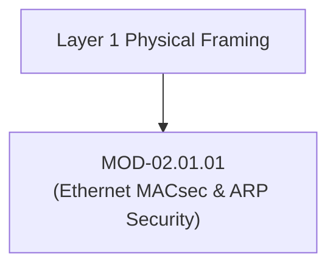

# Ethernet, MACsec & ARP Protocol Security

## 1. Overview & Purpose
Layer 2 (Data Link Layer) forms the physical switching and framing foundation of local area networks (LANs). Security controls at Layer 2 prevent man-in-the-middle (MitM) eavesdropping, MAC address spoofing, and rogue switch insertions.

This module covers Ethernet II framing, 802.1AE MACsec (Media Access Control Security), 802.1Q VLAN Tagging, Address Resolution Protocol (ARP) mechanics, ARP Poisoning attacks, Dynamic ARP Inspection (DAI), and Port Security controls.

---

## 2. Prerequisites & Prerequisites Graph
- **Prerequisites**: Basic networking concepts, OSI model layers.



---

## 3. Learning Objectives & Taxonomy Alignment
- **L1 Awareness**: Explain Ethernet II frame headers, MAC addresses, and ARP request/reply flows.
- **L2 Understanding**: Detail 802.1AE MACsec AES-GCM framing and 802.1Q VLAN trunking security.
- **L3 Practical**: Configure Dynamic ARP Inspection (DAI), Port Security, and inspect ARP caches.
- **L4 Engineering**: Design Layer 2 zero-trust switching topologies and MACsec hardware encryption lines.

---

## 4. L1 — Awareness (Overview & Core Terminology)
Ethernet II is the standard framing format for LAN communications. Devices communicate using 48-bit hardware MAC addresses. Because ARP lacks authentication, any host can broadcast malicious ARP responses, claiming ownership of another host's IP address.

---

## 5. L2 — Understanding (Core Theory & Mechanics)

```mermaid
graph TD
    subgraph Ethernet II Frame (Standard 1518 Bytes Max)
        DST_MAC["Dst MAC (6B)"]
        SRC_MAC["Src MAC (6B)"]
        ETHERTYPE["EtherType (2B - e.g. 0x0800 IPv4 / 0x0806 ARP)"]
        PAYLOAD["Payload (46-1500 Bytes)"]
        FCS["FCS (4B CRC)"]
    end

    subgraph 802.1AE MACsec Frame (Point-to-Point Layer 2 Encryption)
        DST_MAC2["Dst MAC (6B)"]
        SRC_MAC2["Src MAC (6B)"]
        SECTAG["SecTAG (8B / 16B Header - System Identifier & Packet Number)"]
        ENC_PAYLOAD["Encrypted Payload (AES-GCM-128 / AES-GCM-256)"]
        ICV["ICV (16B Integrity Check Value)"]
    end
```

### 802.1AE MACsec (Layer 2 Encryption):
MACsec provides line-rate hardware encryption and data origin authentication directly between switch-to-switch or host-to-switch links. It encrypts everything after the Source MAC address (including 802.1Q VLAN tags and IP headers), rendering passive link tapping useless.

---

## 6. L3 — Practical (Commands & Configurations)

### Inspecting ARP Cache on Linux:
```bash
# View active ARP table
ip neighbor show

# Clear ARP cache
sudo ip neighbor flush all
```

### Cisco Switch Configuration for Dynamic ARP Inspection (DAI):
```text
! Enable DHCP Snooping globally
ip dhcp snooping
ip dhcp snooping vlan 10,20

! Enable Dynamic ARP Inspection on VLANs
ip arp inspection vlan 10,20

! Set trusted uplink interface to router
interface GigabitEthernet1/0/24
 ip dhcp snooping trust
 ip arp inspection trust
```

---

## 7. L4 — Engineering (Design Trade-offs & System Integration)
- **MACsec vs IPsec**: MACsec encrypts all traffic at Layer 2 (including IP headers) with zero CPU overhead on supported switch ASIC hardware, but operates strictly over point-to-point physical segments. IPsec operates at Layer 3 across routed internet paths.

---

## 8. Internal Architecture & Data Structures
An ARP request packet payload (`EtherType: 0x0806`):
```text
Hardware Type: Ethernet (1)
Protocol Type: IPv4 (0x0800)
Hardware Size: 6 | Protocol Size: 4
Opcode: Request (1) / Reply (2)
Sender MAC: 00:11:22:33:44:55 | Sender IP: 192.168.1.50
Target MAC: 00:00:00:00:00:00 | Target IP: 192.168.1.1
```

---

## 9. Security Perspective & Boundary Protection
- **VLAN Hopping**: Attackers send double-tagged 802.1Q frames (`Outer VLAN 10, Inner VLAN 20`) to bridge across isolated switch networks if switch ports are misconfigured as dynamic auto-trunking ports.

---

## 10. Attack Perspective & Exploitation Primitives
1. **ARP Cache Poisoning (`arpspoof`)**: Sending gratuitous ARP replies mapping Target Gateway IP (`192.168.1.1`) to Attacker MAC Address, routing victim traffic through attacker host.
2. **MAC Flooding**: Overwhelming switch CAM tables with fake MAC addresses, forcing switch into fail-open hub mode.

---

## 11. Defense Perspective & Hardening Guidelines
- Enable **DHCP Snooping** and **Dynamic ARP Inspection (DAI)** on all access switch ports.
- Configure **Port Security** limits (maximum 2 MAC addresses per access port with `violation shutdown`).

---

## 12. Detection & Telemetry Verification

### Zeek Network Security Monitoring Script (ARP Spoofing Detection):
```zeek
event arp_reply(mac_src: string, ip_src: string, mac_dst: string, ip_dst: string) {
    if ( ip_src in arp_db && arp_db[ip_src] != mac_src ) {
        NOTICE([$note=ARP::Spoofing,
                $msg=fmt("Possible ARP spoofing: IP %s claimed by MAC %s (was %s)", ip_src, mac_src, arp_db[ip_src])]);
    }
}
```

---

## 13. Hands-On Lab Reference
- **Associated Lab**: `LAB-NET001` (ARP Poisoning & DAI Mitigation Analysis).

---

## 14. Related Projects & Applications
- **Associated Project**: `PRJ-TIP001` (Network Sensor Integration).

---

## 15. Troubleshooting & Diagnostics Matrix

| Symptom | Root Cause | Remediation / Diagnostic Command |
| :--- | :--- | :--- |
| Host loses gateway connectivity after new device joins. | ARP cache poisoned by rogue MAC address. | Run `ip neighbor` to verify gateway MAC against router interface. |
| DAI drops legitimate ARP responses. | Switch port connected to DHCP server not marked as `trusted`. | Execute `ip arp inspection trust` on designated switch trunk port. |

---

## 16. Related Concepts & Cross-Domain Links
- `CON-NET001`: Ethernet Frame Structure (`DOM-02`)
- `CON-NET002`: Dynamic ARP Inspection (`DOM-02`)

---

## 17. Technical Interview Preparation (Q&A)
**Q: How does Dynamic ARP Inspection (DAI) prevent ARP poisoning attacks?**  
*Answer*: DAI leverages the trusted binding database populated by DHCP Snooping. When an ARP reply arrives on an untrusted port, the switch intercepts the packet and verifies if the Sender IP and Sender MAC match an active entry in the DHCP Snooping database. If mismatched, the ARP frame is dropped.

---

## 18. Self-Assessment & Mastery Checklist
- [ ] Understand MACsec 802.1AE frame structure.
- [ ] Able to configure DAI and DHCP snooping on enterprise switches.

---

## 19. References & Further Reading
- IEEE 802.1AE Standard: *Media Access Control (MAC) Security*.
- RFC 826: *An Ethernet Address Resolution Protocol*.
